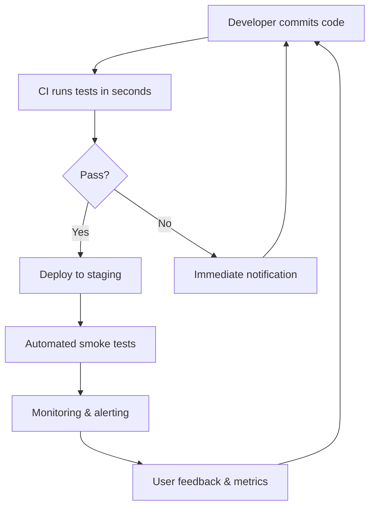
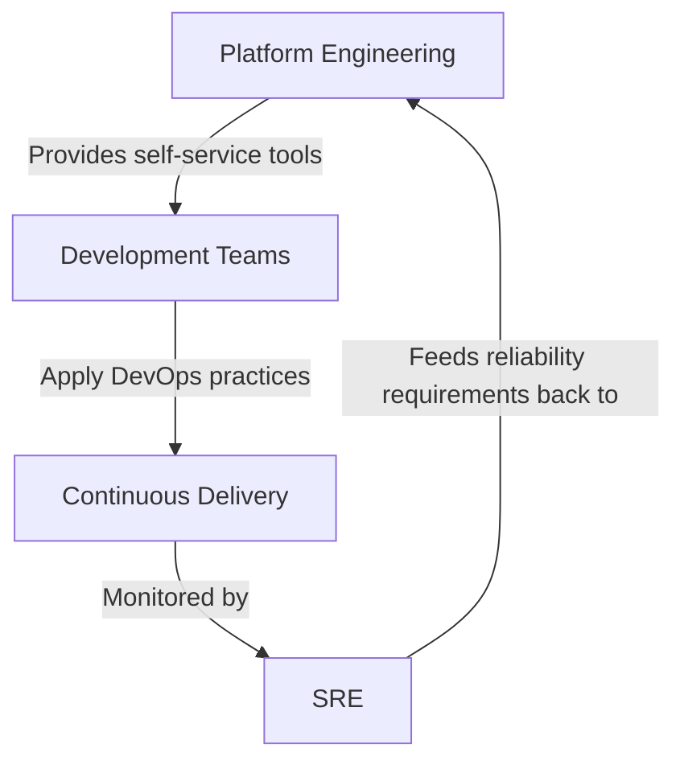

# DevOps Principles

DevOps is not a tool, a job title, or a team — it is a set of practices and cultural philosophies that unify software development (Dev) and IT operations (Ops). The goal is to shorten the systems development life cycle while delivering features, fixes, and updates frequently and reliably.

---

## The Three Ways of DevOps

The foundational principles come from *The Phoenix Project* and *The DevOps Handbook*:

| Way | Principle | Practice |
|-----|-----------|----------|
| **First Way** | Systems thinking (flow) | Optimise left-to-right flow from Dev to Ops to customer. Reduce batch sizes, limit WIP, eliminate waste. |
| **Second Way** | Amplify feedback loops | Fast feedback from right to left. Telemetry, monitoring, peer review, testing in production. |
| **Third Way** | Continual experimentation and learning | Foster a culture of experimentation, risk-taking, and learning from failure. Blameless postmortems. |

---

## DevOps Culture — CALMS

The CALMS framework describes the cultural pillars of DevOps:

| Pillar | Description |
|--------|-------------|
| **C**ulture | Shared responsibility. No "throw it over the wall." |
| **A**utomation | Automate repetitive tasks — builds, tests, deployments, infrastructure. |
| **L**ean | Reduce waste. Small batches. Continuous improvement (kaizen). |
| **M**easurement | Measure everything — lead time, deployment frequency, failure rate, recovery time. |
| **S**haring | Break silos. Share knowledge, tools, and on-call responsibilities. |

---

## DORA Metrics

The DevOps Research and Assessment (DORA) team identified four key metrics that predict software delivery performance:

| Metric | Definition | Elite | High | Medium | Low |
|--------|-----------|-------|------|--------|-----|
| **Deployment Frequency** | How often code deploys to production | On-demand (multiple/day) | Weekly–monthly | Monthly–biannually | Fewer than once per 6 months |
| **Lead Time for Changes** | Commit to production | Less than 1 hour | 1 day–1 week | 1 week–1 month | More than 6 months |
| **Change Failure Rate** | % of deployments causing failure | 0–15% | 16–30% | 16–30% | >30% (varies) |
| **Mean Time to Recovery** | Time to restore service after failure | Less than 1 hour | Less than 1 day | 1 day–1 week | More than 6 months |

### Why DORA Matters

- These metrics are **outcome-based**, not activity-based
- They correlate with organisational performance (profitability, market share)
- They apply regardless of tech stack, team size, or industry
- They expose bottlenecks and guide improvement efforts

### The Fifth Metric: Reliability

In 2021, DORA added **reliability** (meeting or exceeding reliability targets) as a fifth metric, recognising that speed without stability is counterproductive.

---

## Shift-Left

"Shift-left" means moving activities earlier in the development lifecycle:

| What Shifts Left | Traditional | Shifted Left |
|-----------------|-------------|--------------|
| Testing | After development complete | During development (TDD, unit tests in CI) |
| Security | Penetration testing before release | SAST/DAST in CI pipeline, threat modelling in design |
| Quality | QA team at the end | Linting, formatting, code review from first commit |
| Operations | Ops handles deployment | Developers define infrastructure, deployment config |
| Feedback | Customer complaints post-release | Feature flags, canary deployments, observability |

### Benefits of Shift-Left

- Bugs found earlier are cheaper to fix (10x–100x cost multiplier)
- Security vulnerabilities caught before they reach production
- Faster feedback loops for developers
- Reduced rework and context switching

---

## Feedback Loops

Fast feedback is the engine of continuous improvement. Every stage of delivery should produce signals:

| Feedback Source | Latency Target | Purpose |
|----------------|---------------|---------|
| Pre-commit hooks | < 5 seconds | Catch formatting, lint errors instantly |
| CI pipeline | < 10 minutes | Verify build, tests, security |
| Code review | < 4 hours | Catch design issues, share knowledge |
| Staging deployment | < 1 hour | Integration testing, performance |
| Production monitoring | Real-time | Detect regressions, user impact |
| Customer feedback | Hours–days | Validate business assumptions |

---

## Collaboration Patterns

### Breaking Down Silos

| Anti-pattern | DevOps Pattern |
|-------------|---------------|
| Dev writes code, Ops deploys it | "You build it, you run it" — teams own their services end-to-end |
| Change Advisory Board gates deployments | Automated pipelines with guardrails (tests, approvals, rollback) |
| Knowledge hoarded in individuals | Runbooks, documentation-as-code, pair programming, blameless postmortems |
| Siloed ticketing systems | Shared backlog, common tooling, unified observability |

### Blameless Postmortems

When incidents occur, the focus is on **systems** not **people**:

1. **Timeline** — What happened, when?
2. **Contributing factors** — What conditions allowed this?
3. **Impact** — Who was affected and how?
4. **Mitigation** — What stopped the bleeding?
5. **Action items** — What systemic changes prevent recurrence?
6. **Learnings** — What did we discover?

---

## DevOps vs SRE vs Platform Engineering

These disciplines overlap but have distinct focuses:

| Aspect | DevOps | SRE | Platform Engineering |
|--------|--------|-----|---------------------|
| **Origin** | Industry movement (2008–2009) | Google (2003) | Evolution of internal tooling teams |
| **Focus** | Culture + practices for fast, reliable delivery | Reliability of production systems | Internal developer platform (IDP) |
| **Key concern** | Flow and feedback | Error budgets and SLOs | Developer experience and self-service |
| **Motto** | "Break down silos" | "Hope is not a strategy" | "Paved roads, not gates" |
| **Measures success by** | DORA metrics | SLO attainment, toil reduction | Developer productivity, adoption |
| **Team structure** | Embedded in product teams or cross-functional | Dedicated SRE team or embedded | Platform team serving internal customers |
| **Relationship to Ops** | Ops becomes everyone's responsibility | Ops with software engineering rigour | Abstract away Ops complexity for developers |

### How They Complement Each Other

- **DevOps** provides the cultural foundation
- **SRE** implements reliability practices with engineering rigour
- **Platform Engineering** builds the tooling that makes DevOps practices accessible at scale

---

## The Infinite Loop

DevOps is often visualised as an infinity loop (∞) representing the continuous nature of the process:

| Phase | Activities |
|-------|-----------|
| **Plan** | Backlog grooming, sprint planning, requirements |
| **Code** | Development, code review, version control |
| **Build** | Compilation, containerisation, artifact creation |
| **Test** | Unit, integration, security, performance testing |
| **Release** | Approval gates, release orchestration |
| **Deploy** | Infrastructure provisioning, deployment execution |
| **Operate** | Monitoring, incident response, scaling |
| **Monitor** | Metrics, logs, traces, user analytics |

---

## Anti-Patterns

| Anti-Pattern | Why It Fails | Better Approach |
|-------------|-------------|-----------------|
| "DevOps team" as a new silo | Creates another handoff point | Embed practices across all teams |
| Automating a broken process | Garbage in, garbage out faster | Fix the process first, then automate |
| Measuring only velocity | Teams game metrics, quality suffers | Balance speed metrics with stability metrics |
| Big-bang transformation | Too much change, no time to adapt | Incremental adoption, start with one value stream |
| Tool-first approach | Tools without culture change | Start with collaboration and measurement |

---

## Key Takeaways

- DevOps is a **cultural movement** that prioritises flow, feedback, and learning
- The **DORA metrics** (deployment frequency, lead time, change failure rate, MTTR) are the gold standard for measuring delivery performance
- **Shift-left** moves quality, security, and testing earlier — where fixes are cheapest
- **Fast feedback loops** at every stage are what make continuous improvement possible
- DevOps, SRE, and Platform Engineering are **complementary disciplines**, not competitors
- Start with culture and measurement; tools follow naturally
