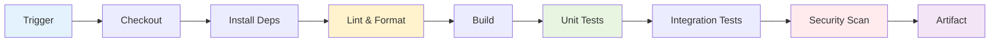
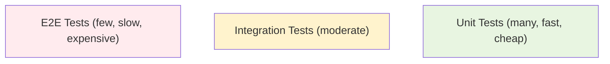
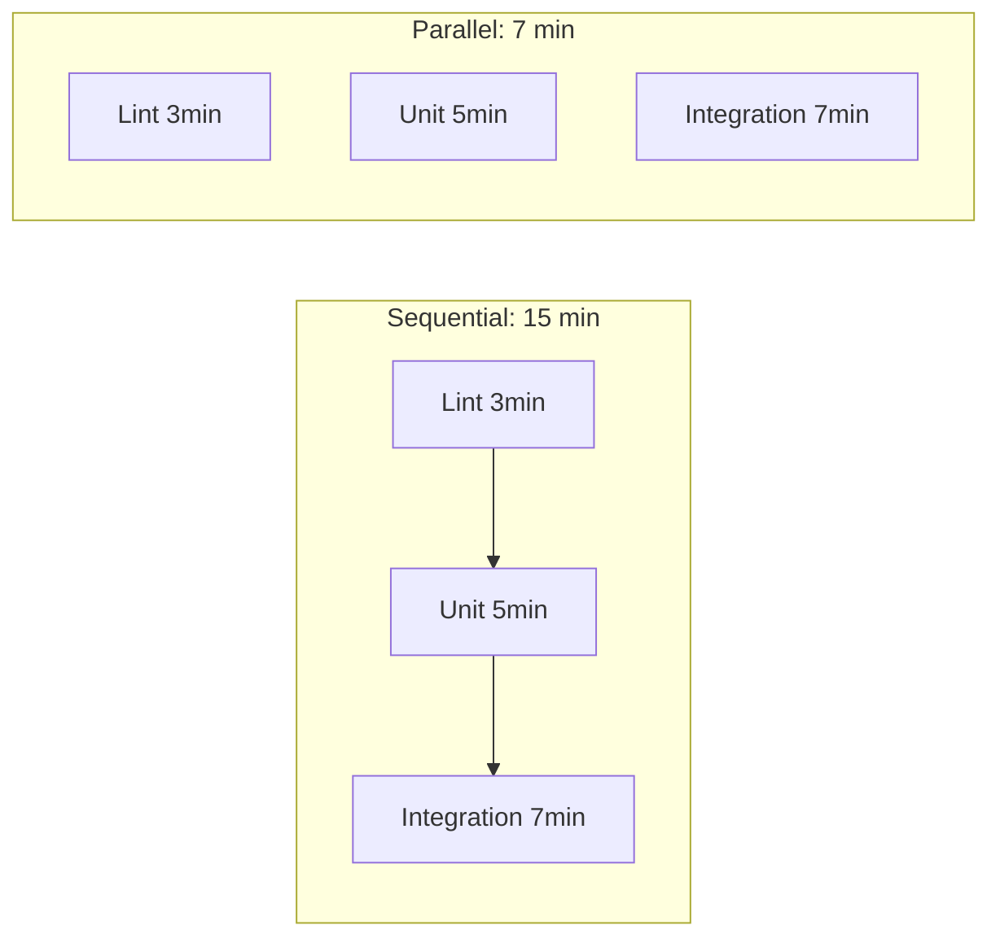
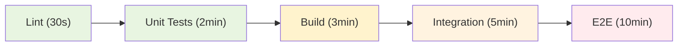

# CI Fundamentals

Continuous Integration (CI) is the practice of merging all developer working copies to a shared mainline frequently — ideally multiple times per day — and verifying each integration with an automated build and test suite.

---

## What CI Solves

Without CI, teams encounter these problems:

| Problem | Symptom | How CI Solves It |
|---------|---------|------------------|
| Integration hell | Merging weeks of work causes conflicts and breakage | Small, frequent merges reduce conflict surface |
| "Works on my machine" | Code passes locally but fails elsewhere | Consistent build environment for every commit |
| Late bug discovery | Bugs found in QA weeks after introduction | Automated tests catch regressions immediately |
| Slow feedback | Developers wait days for test results | Pipeline runs in minutes on every push |
| Quality drift | Standards erode without enforcement | Linting and formatting enforced automatically |
| Release anxiety | Nobody knows if the codebase is deployable | The build is always green (or immediately fixed) |

### The CI Contract

Every team practising CI agrees to:

1. **Commit frequently** — at least once per day to the mainline (or feature branch)
2. **Don't break the build** — if CI fails, fixing it is the top priority
3. **Keep the build fast** — under 10 minutes is the target
4. **Test in a clone of production** — CI environment should mirror prod

---

## Pipeline Anatomy

A CI pipeline is a series of automated stages that code passes through from commit to verified artifact:



### Stages Breakdown

| Stage | Purpose | Typical Duration | Failure Action |
|-------|---------|-----------------|----------------|
| **Checkout** | Clone repository at the triggering commit | 5–30s | Retry (infra issue) |
| **Install** | Restore dependencies (npm, pip, maven) | 10–60s | Check lock files |
| **Lint** | Static analysis, formatting checks | 10–30s | Developer fixes style |
| **Build** | Compile code, generate artifacts | 30s–5min | Developer fixes errors |
| **Unit Test** | Fast, isolated tests | 1–5min | Developer fixes logic |
| **Integration Test** | Tests with real dependencies (DB, APIs) | 2–10min | Developer fixes integration |
| **Security Scan** | SAST, dependency vulnerability check | 1–3min | Assess severity, fix or accept |
| **Artifact** | Package and store build output | 10–30s | Retry (infra issue) |

---

## Triggers

Triggers determine when a pipeline runs:

| Trigger | When It Fires | Use Case |
|---------|--------------|----------|
| **Push** | Every commit pushed to remote | Default — verify all changes |
| **Pull/Merge Request** | PR/MR created or updated | Gate before merge to main |
| **Schedule (cron)** | Fixed schedule (nightly, hourly) | Long-running tests, dependency checks |
| **Tag** | Git tag created | Release builds, production deploys |
| **Manual** | Human clicks "Run" | Ad-hoc debugging, production deploys |
| **API/Webhook** | External system calls pipeline | Cross-repo triggers, external events |
| **Merge to main** | Code lands on trunk | Deploy to staging/production |

### Trigger Strategy

```yaml
# Example: Run different stages based on trigger
stages:
  - lint        # Always
  - test        # Always
  - build       # On main or tags
  - deploy-test # On main
  - deploy-prod # On tags only
```

---

## Build Stage

The build stage compiles source code and produces deployable artifacts:

### Common Build Outputs

| Language/Stack | Build Tool | Output |
|---------------|-----------|--------|
| Java | Maven / Gradle | `.jar` or `.war` |
| Go | `go build` | Static binary |
| Node.js | npm / webpack | Bundled JS + assets |
| Python | setuptools / poetry | `.whl` or Docker image |
| Docker | `docker build` | Container image |
| Terraform | `terraform plan` | Plan file |

### Build Best Practices

- **Reproducible builds** — Same commit always produces same output
- **No side effects** — Build doesn't modify external state
- **Minimal image** — Multi-stage Docker builds to reduce image size
- **Version stamping** — Embed git SHA or tag in the artifact

```dockerfile
# Multi-stage build example
FROM node:20-alpine AS builder
WORKDIR /app
COPY package*.json ./
RUN npm ci
COPY . .
RUN npm run build

FROM node:20-alpine
WORKDIR /app
COPY --from=builder /app/dist ./dist
COPY --from=builder /app/node_modules ./node_modules
CMD ["node", "dist/server.js"]
```

---

## Test Stage

### Test Pyramid



| Level | Speed | Scope | In CI? | Example |
|-------|-------|-------|--------|---------|
| **Unit** | Milliseconds | Single function/class | Always | `test_calculate_tax()` |
| **Integration** | Seconds | Multiple components | Usually | Test API with real database |
| **E2E** | Minutes | Full user journey | Selectively | Browser test of checkout flow |
| **Performance** | Minutes–hours | Load/stress | Nightly or on-demand | 1000 concurrent users |

### Test Configuration Example

```yaml
# pytest configuration for CI
[tool.pytest.ini_options]
testpaths = ["tests"]
markers = [
    "unit: Unit tests (fast, no external deps)",
    "integration: Integration tests (require services)",
    "slow: Long-running tests (nightly only)",
]
addopts = "--cov=src --cov-report=xml --cov-fail-under=80"
```

---

## Lint Stage

Linting catches issues without executing code:

| Tool | Language | Catches |
|------|----------|---------|
| ESLint | JavaScript/TypeScript | Code quality, potential bugs |
| Flake8 / Ruff | Python | Style violations, complexity |
| golangci-lint | Go | Multiple linters in one |
| Checkstyle | Java | Code style compliance |
| hadolint | Dockerfile | Dockerfile best practices |
| tflint | Terraform | HCL issues, provider errors |
| shellcheck | Bash/Shell | Shell script issues |

### Formatting vs Linting

| Concern | Tool | Fixable? | CI Behaviour |
|---------|------|----------|-------------|
| **Formatting** | Black, Prettier, gofmt | Always auto-fixable | `--check` mode — fail if unformatted |
| **Linting** | ESLint, Flake8 | Sometimes | Report errors, block merge |
| **Type checking** | mypy, tsc | Manual fix needed | Report type errors, block merge |

---

## Parallelism

Running stages and jobs in parallel dramatically reduces pipeline duration:



### Parallelism Strategies

| Strategy | How | Benefit |
|----------|-----|---------|
| **Parallel stages** | Run lint, test, and security scan simultaneously | Faster overall pipeline |
| **Test splitting** | Divide test suite across N workers | Linear speedup for large suites |
| **Matrix builds** | Test across multiple OS/language versions | Broader coverage |
| **Fan-out/fan-in** | Parallel jobs that converge at a gate | Complex pipelines stay fast |

### Test Splitting Example

```yaml
# Split tests across 4 parallel workers
test:
  parallel: 4
  script:
    - split-tests --total $CI_NODE_TOTAL --index $CI_NODE_INDEX | xargs pytest
```

---

## Caching

Caching avoids re-downloading or re-computing unchanged artifacts:

| What to Cache | Key Strategy | Invalidation |
|--------------|-------------|--------------|
| **npm packages** | Hash of `package-lock.json` | Lock file changes |
| **pip packages** | Hash of `requirements.txt` | Requirements change |
| **Maven/Gradle** | Hash of `pom.xml` / `build.gradle` | Dependency file changes |
| **Docker layers** | Layer content hash | Dockerfile or source changes |
| **Build output** | Commit SHA or source hash | Source code changes |

### Cache Configuration Example

```yaml
# GitLab CI cache example
cache:
  key:
    files:
      - package-lock.json
  paths:
    - node_modules/
  policy: pull-push  # pull on start, push on success
```

### Cache vs Artifacts

| Feature | Cache | Artifact |
|---------|-------|----------|
| Purpose | Speed up repeated jobs | Pass data between stages |
| Persistence | Best-effort (may be evicted) | Guaranteed for pipeline duration |
| Scope | Across pipelines (same branch) | Within a pipeline |
| Example | `node_modules/` | `dist/`, test reports, built images |

---

## Fail-Fast Principle

The fail-fast principle means detecting failures as early and cheaply as possible:

### Ordering for Speed



| Principle | Implementation |
|-----------|---------------|
| Cheapest checks first | Lint and format before compile |
| Fast tests before slow | Unit before integration before E2E |
| Fail immediately | Stop pipeline on first failure (don't waste compute) |
| Provide context | Error messages should tell the developer exactly what to fix |
| Local verification | Developers should be able to run the same checks locally |

### Pre-commit Hooks

Catch issues before they even reach CI:

```yaml
# .pre-commit-config.yaml
repos:
  - repo: https://github.com/pre-commit/pre-commit-hooks
    rev: v4.5.0
    hooks:
      - id: trailing-whitespace
      - id: end-of-file-fixer
      - id: check-yaml
  - repo: https://github.com/psf/black
    rev: 24.3.0
    hooks:
      - id: black
  - repo: https://github.com/PyCQA/flake8
    rev: 7.0.0
    hooks:
      - id: flake8
```

---

## CI Pipeline Design Patterns

| Pattern | Description | When to Use |
|---------|-------------|-------------|
| **Linear** | Stages run sequentially | Simple projects |
| **Fan-out / Fan-in** | Parallel jobs converge at gate | Multiple independent test suites |
| **Diamond** | Branch after build, merge before deploy | Platform matrix testing |
| **Conditional** | Skip stages based on file changes | Monorepos with multiple services |
| **Multi-project** | Trigger pipelines in other repos | Microservice dependency chains |

### Conditional Pipeline Example

```yaml
# Only run frontend tests if frontend files changed
frontend-tests:
  rules:
    - changes:
        - "frontend/**/*"
        - "package.json"
  script:
    - cd frontend && npm test

# Only run backend tests if backend files changed
backend-tests:
  rules:
    - changes:
        - "backend/**/*"
        - "requirements.txt"
  script:
    - cd backend && pytest
```

---

## Metrics for a Healthy CI

| Metric | Target | Red Flag |
|--------|--------|----------|
| Pipeline duration | < 10 minutes | > 30 minutes |
| Build success rate | > 95% | < 80% |
| Flaky test rate | < 1% | > 5% |
| Time to fix broken build | < 15 minutes | > 1 hour |
| Queue wait time | < 2 minutes | > 10 minutes |

---

## Key Takeaways

- CI is a **practice** (frequent integration) enabled by **automation** (pipelines)
- A pipeline should give feedback in **under 10 minutes** — optimise relentlessly
- **Fail fast**: cheapest checks first, provide clear error messages
- **Caching** and **parallelism** are your primary tools for pipeline speed
- The **test pyramid** guides what to test in CI vs other environments
- Every pipeline should be **reproducible** — same commit, same result
- **Flaky tests** undermine trust in CI — track and fix them aggressively
