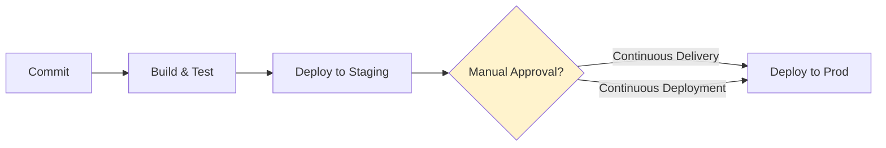
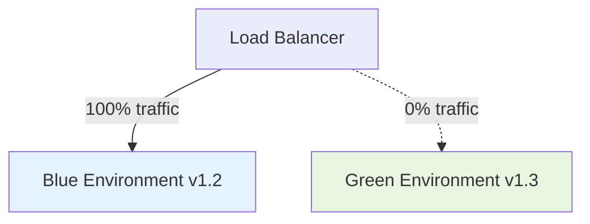
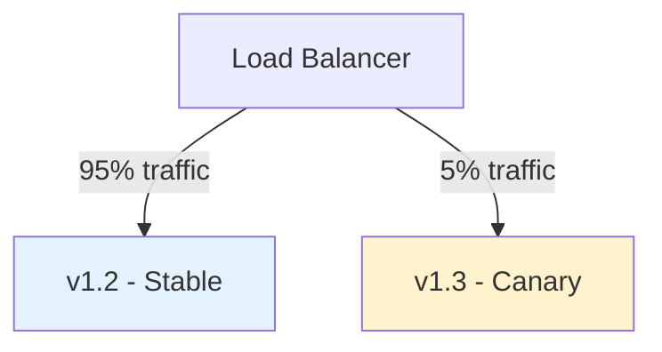
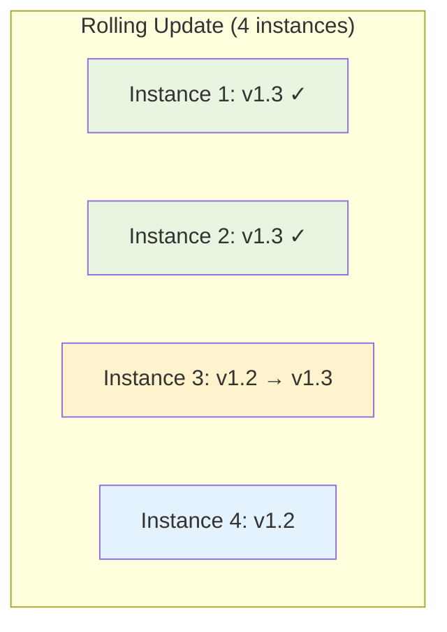
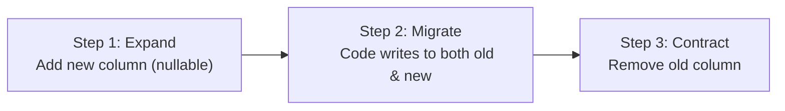

# CD & Deployment Strategies

Continuous Delivery (CD) ensures that code is always in a deployable state. Continuous Deployment takes this further by automatically releasing every change that passes the pipeline. The deployment strategy you choose determines how risk is managed during releases.

---

## Continuous Delivery vs Continuous Deployment

| Aspect | Continuous Delivery | Continuous Deployment |
|--------|--------------------|-----------------------|
| **Definition** | Every commit *can* be deployed to production | Every commit *is* deployed to production |
| **Human gate** | Manual approval before prod deploy | No manual gate — fully automated |
| **Prerequisite** | Comprehensive automated testing | Extreme confidence in test suite + monitoring |
| **Rollback** | Manual or semi-automated | Automated rollback on failure |
| **Adoption** | Widespread | Mostly tech-forward companies |



---

## Deployment Strategies

### Blue-Green Deployment

Maintain two identical production environments. Route traffic entirely to one (blue) while deploying to the other (green). Switch when ready.



| Aspect | Detail |
|--------|--------|
| **How it works** | Deploy v1.3 to Green. Test. Switch LB to Green. Blue becomes standby. |
| **Rollback** | Instant — switch LB back to Blue |
| **Risk** | Very low — full testing before any user sees new version |
| **Cost** | High — double infrastructure during deployment |
| **Database** | Must handle schema compatibility between versions |
| **Best for** | Mission-critical systems where downtime is unacceptable |

### Canary Deployment

Route a small percentage of traffic to the new version. Gradually increase if metrics are healthy.



| Phase | Traffic Split | Duration | Gate |
|-------|-------------|----------|------|
| 1 | 5% canary | 15 min | Error rate < 0.1% |
| 2 | 25% canary | 30 min | Latency P99 < 200ms |
| 3 | 50% canary | 1 hour | Business metrics stable |
| 4 | 100% canary | — | Full rollout |

| Aspect | Detail |
|--------|--------|
| **Rollback** | Fast — route 100% back to stable |
| **Risk** | Low — limited blast radius during ramp-up |
| **Observability** | Critical — need per-version metrics |
| **Best for** | High-traffic services where you can detect issues with small samples |

### Rolling Deployment

Replace instances of the old version with the new version one at a time (or in batches).



| Aspect | Detail |
|--------|--------|
| **How it works** | Drain traffic from one instance, update it, health check, move to next |
| **Rollback** | Moderate — roll forward to previous version or stop mid-roll |
| **Risk** | Medium — both versions serve traffic simultaneously during rollout |
| **Cost** | Low — no extra infrastructure needed |
| **Best for** | Stateless services with good health checks |

### Recreate (Big Bang)

Stop all old instances, deploy new ones. Simple but causes downtime.

| Aspect | Detail |
|--------|--------|
| **Rollback** | Re-deploy previous version (downtime again) |
| **Risk** | High — all users affected during transition |
| **Cost** | Lowest — no overlap |
| **Best for** | Dev/test environments, batch jobs, systems that can't run two versions |

---

## Strategy Comparison

| Strategy | Zero Downtime | Rollback Speed | Cost | Complexity | Traffic Control |
|----------|:---:|:---:|:---:|:---:|:---:|
| **Blue-Green** | ✅ | Instant | High | Medium | Binary switch |
| **Canary** | ✅ | Fast | Medium | High | Granular % |
| **Rolling** | ✅ | Moderate | Low | Low | Per-instance |
| **Recreate** | ❌ | Slow | Lowest | Lowest | None |
| **Feature Flags** | ✅ | Instant | Low | Medium | Per-user/segment |

---

## Feature Flags

Feature flags decouple **deployment** from **release**. Code is deployed but features are enabled/disabled via configuration:

```python
# Feature flag example
from feature_flags import is_enabled

def get_search_results(query: str, user: User) -> Results:
    if is_enabled("new-search-algorithm", user=user):
        return new_search(query)
    else:
        return legacy_search(query)
```

### Feature Flag Types

| Type | Purpose | Lifetime | Example |
|------|---------|----------|---------|
| **Release** | Dark launch new feature | Days–weeks | New checkout flow |
| **Experiment** | A/B test variants | Weeks–months | Button colour test |
| **Ops** | Kill switch for features | Permanent | Disable non-critical feature under load |
| **Permission** | Gate features by user segment | Permanent | Enterprise-only feature |

### Feature Flag Best Practices

- **Clean up** — Remove flags after full rollout (technical debt otherwise)
- **Default safe** — Flag off = old behaviour (safe fallback)
- **Monitor** — Track metrics per flag state
- **Limit scope** — Don't nest flags or create combinatorial explosion

---

## A/B Testing in Deployments

A/B testing uses deployment infrastructure to measure business impact:

| Aspect | A/B Testing | Canary |
|--------|-------------|--------|
| **Goal** | Measure business metrics (conversion, revenue) | Validate technical health (errors, latency) |
| **Duration** | Days–weeks (statistical significance) | Minutes–hours |
| **Split criteria** | User segments, random assignment | Traffic percentage |
| **Decision** | Data-driven (which variant wins) | Pass/fail (is it broken?) |
| **Rollback** | Keep losing variant code (for now) | Immediate on failure |

---

## Rollback Strategies

When a deployment goes wrong, you need a fast path back to stability:

| Strategy | Speed | Mechanism | Limitation |
|----------|-------|-----------|-----------|
| **Revert commit** | Minutes | Push revert, re-run pipeline | Database migrations may not be reversible |
| **Re-deploy previous** | Minutes | Deploy last known good artifact | Need artifact storage with history |
| **Traffic switch** | Seconds | Route back to blue/previous version | Requires blue-green or similar setup |
| **Feature flag off** | Seconds | Toggle flag in config | Only works if feature is flag-gated |
| **Auto-rollback** | Seconds | Automated based on metrics | Requires well-defined health signals |

### Automated Rollback Conditions

```yaml
# Example: Auto-rollback criteria
rollback:
  triggers:
    - metric: error_rate_5xx
      threshold: "> 1%"
      window: 5m
    - metric: latency_p99
      threshold: "> 2000ms"
      window: 5m
    - metric: health_check
      condition: "3 consecutive failures"
  action: route_traffic_to_previous_version
```

---

## Database Migrations in CD

Database changes are the hardest part of continuous deployment because they're often **irreversible**:

### Expand-Contract Pattern



| Principle | Why |
|-----------|-----|
| **Backward compatible** | New schema works with old and new code |
| **Forward-only** | Never roll back migrations — always migrate forward |
| **Small batches** | One schema change per deployment |
| **Separate from code deploy** | Run migration, verify, then deploy code that uses it |

---

## Deployment Automation

### Environment Promotion


### Deployment Pipeline Configuration

```yaml
# Environment promotion example
deploy-staging:
  stage: deploy
  environment: staging
  script:
    - deploy --env staging --version $CI_COMMIT_SHA
    - run-smoke-tests --env staging
  rules:
    - if: $CI_COMMIT_BRANCH == "main"

deploy-production:
  stage: deploy
  environment: production
  script:
    - deploy --env production --version $CI_COMMIT_SHA
    - run-post-deploy-checks --env production
  rules:
    - if: $CI_COMMIT_BRANCH == "main"
      when: manual  # Human approval gate
  needs: [deploy-staging]
```

---

## Progressive Delivery

Progressive delivery combines deployment strategies with observability:

| Stage | Action | Decision |
|-------|--------|----------|
| 1 | Deploy to canary (1%) | Automated health check |
| 2 | Expand to 10% | Automated metrics check |
| 3 | Expand to 50% | Automated + manual review |
| 4 | Full rollout (100%) | Confidence threshold met |

Tools that enable progressive delivery:
- **Argo Rollouts** — Kubernetes-native progressive delivery
- **Flagger** — Automated canary analysis for Kubernetes
- **AWS CodeDeploy** — Canary/linear deployment for ECS and Lambda
- **LaunchDarkly / Unleash** — Feature flag management

---

## Key Takeaways

- **Blue-green** gives instant rollback at the cost of double infrastructure
- **Canary** provides gradual risk reduction with granular traffic control
- **Rolling** is the simplest zero-downtime strategy for stateless services
- **Feature flags** decouple deployment from release — deploy anytime, release when ready
- **Automated rollback** based on health metrics is the safety net every CD pipeline needs
- **Database migrations** require the expand-contract pattern for safe continuous deployment
- Choose your strategy based on: risk tolerance, infrastructure cost, and observability maturity
