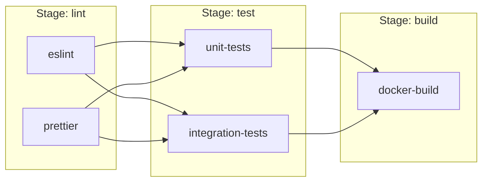
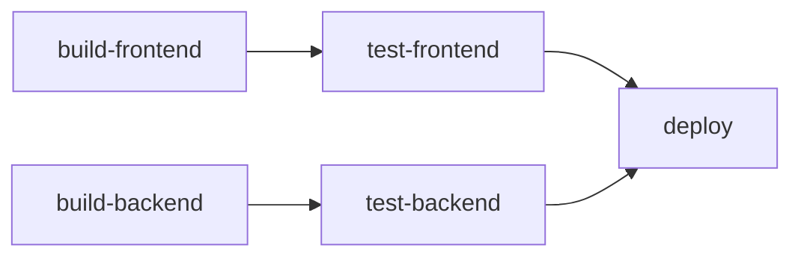

# GitLab CI

GitLab CI/CD is GitLab's built-in continuous integration and delivery system. Configuration lives in a `.gitlab-ci.yml` file at the repository root, defining pipelines as code that execute on every push, merge request, or schedule.

---

## .gitlab-ci.yml Structure

A minimal pipeline:

```yaml
stages:
  - build
  - test
  - deploy

build-app:
  stage: build
  image: node:20-alpine
  script:
    - npm ci
    - npm run build
  artifacts:
    paths:
      - dist/

test-app:
  stage: test
  image: node:20-alpine
  script:
    - npm ci
    - npm test
  coverage: '/Lines\s*:\s*(\d+\.?\d*)%/'

deploy-staging:
  stage: deploy
  script:
    - deploy-to-staging.sh
  environment:
    name: staging
    url: https://staging.example.com
  rules:
    - if: $CI_COMMIT_BRANCH == "main"
```

### Top-Level Keywords

| Keyword | Purpose | Example |
|---------|---------|---------|
| `stages` | Define pipeline stages and their order | `[lint, test, build, deploy]` |
| `variables` | Global environment variables | `NODE_ENV: production` |
| `default` | Default values for all jobs | `image`, `before_script`, `tags` |
| `include` | Import external CI configuration | Templates, shared pipelines |
| `workflow` | Control when entire pipeline runs | Filter by branch, variable |

---

## Stages, Jobs, and Artifacts

### Stages

Stages run sequentially. All jobs within a stage run in parallel by default:



### Jobs

Jobs are the fundamental unit of execution:

```yaml
job-name:
  stage: test                    # Which stage this belongs to
  image: python:3.12-slim       # Docker image to run in
  tags: [docker]                # Runner selection
  before_script:                # Setup commands
    - pip install -r requirements.txt
  script:                       # Main commands (required)
    - pytest tests/
  after_script:                 # Cleanup (runs even on failure)
    - echo "Tests complete"
  allow_failure: false          # Whether failure blocks pipeline
  timeout: 10m                  # Maximum execution time
  retry: 2                      # Retry on failure
```

### Artifacts

Artifacts pass files between stages or make them available for download:

```yaml
build:
  stage: build
  script:
    - npm run build
  artifacts:
    paths:
      - dist/
      - coverage/
    reports:
      junit: test-results.xml
      coverage_report:
        coverage_format: cobertura
        path: coverage/cobertura-coverage.xml
    expire_in: 1 week
    when: always  # Upload even if job fails
```

| Artifact Type | Purpose |
|--------------|---------|
| `paths` | Files passed between stages |
| `reports:junit` | Test results shown in MR UI |
| `reports:coverage_report` | Coverage visualisation in MR diff |
| `reports:sast` | Security scan results |
| `reports:dependency_scanning` | Vulnerable dependency report |

---

## Variables

### Variable Hierarchy (precedence, highest first)

| Level | Set Where | Example |
|-------|-----------|---------|
| Job variables | In job definition | `variables: { DEBUG: "true" }` |
| Pipeline trigger variables | API or trigger | `-F variables[KEY]=value` |
| Project CI/CD settings | GitLab UI → Settings → CI/CD | Secrets, tokens |
| Group CI/CD settings | Group → Settings → CI/CD | Shared across projects |
| Instance-level variables | Admin → CI/CD | Organization-wide |
| `.gitlab-ci.yml` global | Top of YAML file | `variables: { NODE_ENV: "prod" }` |

### Predefined Variables

| Variable | Value |
|----------|-------|
| `CI_COMMIT_SHA` | Full commit hash |
| `CI_COMMIT_SHORT_SHA` | First 8 characters of hash |
| `CI_COMMIT_BRANCH` | Branch name (empty for tags) |
| `CI_COMMIT_TAG` | Tag name (empty for branches) |
| `CI_PIPELINE_ID` | Unique pipeline identifier |
| `CI_JOB_NAME` | Current job name |
| `CI_MERGE_REQUEST_IID` | MR number (only in MR pipelines) |
| `CI_PROJECT_DIR` | Repository checkout directory |
| `CI_REGISTRY_IMAGE` | Project's container registry path |

### Variable Types

```yaml
variables:
  # Plain text
  APP_VERSION: "1.2.3"
  
  # Expanded from another variable
  IMAGE_TAG: "$CI_REGISTRY_IMAGE:$CI_COMMIT_SHORT_SHA"
  
  # Protected (only available on protected branches/tags)
  # Set in UI with "Protected" checkbox
  
  # Masked (hidden in job logs)
  # Set in UI with "Masked" checkbox
```

---

## Rules, Only/Except

### Rules (Recommended)

`rules` is the modern, flexible way to control when jobs run:

```yaml
deploy-production:
  stage: deploy
  script: ./deploy.sh
  rules:
    # Run on main branch, manual trigger
    - if: $CI_COMMIT_BRANCH == "main"
      when: manual
      allow_failure: false
    
    # Run on tags automatically
    - if: $CI_COMMIT_TAG
      when: on_success
    
    # Run on MR if deploy label exists
    - if: $CI_MERGE_REQUEST_LABELS =~ /deploy/
      when: manual
    
    # Never run otherwise
    - when: never

# Only run if specific files changed
test-frontend:
  rules:
    - changes:
        - "frontend/**/*"
        - "package.json"
```

### Only/Except (Legacy)

```yaml
# Legacy syntax — prefer rules: instead
deploy:
  only:
    - main
    - tags
  except:
    - schedules
```

| `rules` keyword | Meaning |
|----------------|---------|
| `if` | Evaluate CI/CD variable expression |
| `changes` | Run if specified files changed |
| `exists` | Run if file exists in repo |
| `when` | `on_success`, `manual`, `always`, `never`, `delayed` |
| `allow_failure` | Whether failure blocks the pipeline |

---

## Includes and Templates

### Include Types

```yaml
include:
  # File from same repository
  - local: '/templates/.lint.yml'
  
  # File from another project
  - project: 'devops/ci-templates'
    ref: 'v2.0.0'
    file: '/templates/docker-build.yml'
  
  # Remote URL
  - remote: 'https://example.com/ci-template.yml'
  
  # GitLab-provided template
  - template: 'Security/SAST.gitlab-ci.yml'
```

### Reusable Job Templates

```yaml
# Define a template (prefixed with dot = hidden job)
.deploy-template:
  image: alpine:3.19
  before_script:
    - apk add --no-cache curl
  script:
    - curl -X POST "$DEPLOY_URL" -d "version=$CI_COMMIT_SHA"

# Extend the template
deploy-staging:
  extends: .deploy-template
  variables:
    DEPLOY_URL: "https://staging.example.com/deploy"
  environment: staging

deploy-production:
  extends: .deploy-template
  variables:
    DEPLOY_URL: "https://prod.example.com/deploy"
  environment: production
  rules:
    - if: $CI_COMMIT_TAG
```

---

## Services

Services are Docker containers that run alongside the job (databases, caches, etc.):

```yaml
test-with-database:
  stage: test
  image: python:3.12-slim
  services:
    - name: postgres:16-alpine
      alias: db
      variables:
        POSTGRES_DB: test_db
        POSTGRES_USER: test
        POSTGRES_PASSWORD: test
    - name: redis:7-alpine
      alias: cache
  variables:
    DATABASE_URL: "postgresql://test:test@db:5432/test_db"
    REDIS_URL: "redis://cache:6379"
  script:
    - pip install -r requirements.txt
    - pytest tests/integration/
```

| Service Feature | Description |
|----------------|-------------|
| `name` | Docker image to run |
| `alias` | Hostname for the service (network alias) |
| `variables` | Environment variables for the service container |
| `command` | Override the default container command |
| `entrypoint` | Override the container entrypoint |

---

## Runners

Runners are agents that execute CI/CD jobs:

| Type | Where It Runs | Best For |
|------|--------------|----------|
| **Shared runners** | GitLab-managed infrastructure | General-purpose, no setup needed |
| **Group runners** | Self-hosted, available to group | Team-specific needs, custom hardware |
| **Project runners** | Self-hosted, single project | Security-sensitive, special requirements |

### Runner Tags

```yaml
# Job will only run on runners with these tags
build-docker:
  tags:
    - docker
    - linux
    - amd64

build-ios:
  tags:
    - macos
    - xcode15
```

### Runner Executors

| Executor | Isolation | Speed | Use Case |
|----------|-----------|-------|----------|
| Docker | Container | Fast | Standard CI jobs |
| Kubernetes | Pod | Medium | Cloud-native, auto-scaling |
| Shell | None (bare metal) | Fastest | Special hardware, GPU |
| Virtual Machine | Full VM | Slowest | Maximum isolation |

---

## Caching

```yaml
# Global cache configuration
cache:
  key:
    files:
      - Gemfile.lock
    prefix: $CI_COMMIT_REF_SLUG  # Per-branch cache
  paths:
    - vendor/ruby/
  policy: pull-push

# Job-specific cache override
test:
  cache:
    key: test-cache-$CI_COMMIT_REF_SLUG
    paths:
      - .pytest_cache/
    policy: pull  # Never update the cache
```

### Cache Policies

| Policy | Behaviour |
|--------|-----------|
| `pull-push` | Download at start, upload at end (default) |
| `pull` | Download only — never update cache |
| `push` | Upload only — useful for cache-warming jobs |

---

## DAG Pipelines

Directed Acyclic Graph (DAG) pipelines allow jobs to depend on specific jobs rather than entire stages:

```yaml
stages:
  - build
  - test
  - deploy

build-frontend:
  stage: build
  script: npm run build
  artifacts:
    paths: [dist/]

build-backend:
  stage: build
  script: go build -o app

test-frontend:
  stage: test
  needs: [build-frontend]  # Only waits for frontend build
  script: npm test

test-backend:
  stage: test
  needs: [build-backend]   # Only waits for backend build
  script: go test ./...

deploy:
  stage: deploy
  needs: [test-frontend, test-backend]
  script: ./deploy.sh
```



### `needs` vs Stage Dependencies

| Feature | Stage-based | DAG (`needs`) |
|---------|-------------|---------------|
| Dependency | All jobs in previous stage | Specific named jobs |
| Parallelism | Within a stage only | Across stages |
| Speed | Waits for slowest job in stage | Starts ASAP |
| Artifact access | All previous stage artifacts | Only from `needs` jobs |

---

## Key Takeaways

- `.gitlab-ci.yml` defines your entire pipeline as code — version it, review it, test it
- **Stages** provide order; **jobs** provide parallelism within stages; **DAG** (`needs`) unlocks cross-stage parallelism
- Use **`rules`** (not `only/except`) for conditional job execution
- **`include`** and **`extends`** enable DRY pipeline code across projects
- **Services** provide ephemeral dependencies (databases, caches) for integration testing
- **Caching** speeds up repeated jobs; **artifacts** pass data between stages
- Choose runner type and executor based on security, speed, and isolation requirements
