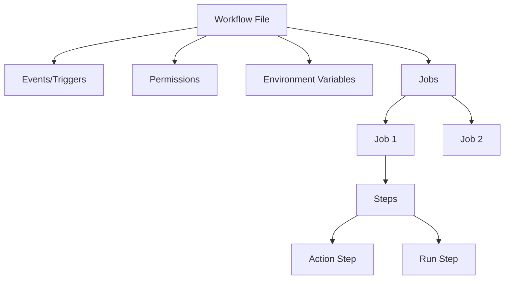
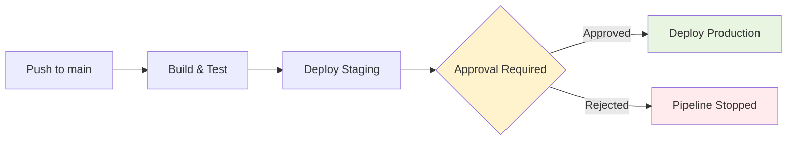

# GitHub Actions

GitHub Actions is GitHub's native CI/CD platform. Workflows are defined in YAML files under `.github/workflows/` and triggered by repository events (push, pull request, schedule, and more). Its marketplace of reusable actions and tight GitHub integration make it one of the most popular CI/CD systems.

---

## Workflow Files

Every workflow lives in `.github/workflows/`:

```yaml
# .github/workflows/ci.yml
name: CI Pipeline

on:
  push:
    branches: [main]
  pull_request:
    branches: [main]

permissions:
  contents: read
  checks: write

jobs:
  lint:
    runs-on: ubuntu-latest
    steps:
      - uses: actions/checkout@v4
      - uses: actions/setup-node@v4
        with:
          node-version: 20
          cache: 'npm'
      - run: npm ci
      - run: npm run lint

  test:
    runs-on: ubuntu-latest
    needs: lint
    steps:
      - uses: actions/checkout@v4
      - uses: actions/setup-node@v4
        with:
          node-version: 20
          cache: 'npm'
      - run: npm ci
      - run: npm test -- --coverage
      - uses: actions/upload-artifact@v4
        with:
          name: coverage
          path: coverage/
```

### Workflow Structure



---

## Events and Triggers

| Event | Triggers On | Common Use |
|-------|------------|------------|
| `push` | Commit pushed to branch/tag | CI on every commit |
| `pull_request` | PR opened, updated, reopened | Gate before merge |
| `schedule` | Cron expression | Nightly builds, dependency checks |
| `workflow_dispatch` | Manual trigger (UI or API) | Ad-hoc runs, prod deploys |
| `release` | Release published | Build release artifacts |
| `repository_dispatch` | External webhook | Cross-repo triggers |
| `workflow_call` | Called by another workflow | Reusable workflows |
| `merge_group` | Merge queue | Validate before auto-merge |

### Event Filters

```yaml
on:
  push:
    branches:
      - main
      - 'release/**'
    tags:
      - 'v*'
    paths:
      - 'src/**'
      - 'package.json'
    paths-ignore:
      - 'docs/**'
      - '**.md'

  pull_request:
    types: [opened, synchronize, reopened]
    branches: [main]

  schedule:
    - cron: '0 2 * * 1-5'  # Weekdays at 2 AM UTC

  workflow_dispatch:
    inputs:
      environment:
        description: 'Deploy target'
        required: true
        type: choice
        options: [staging, production]
      dry_run:
        description: 'Dry run only'
        type: boolean
        default: true
```

---

## Jobs and Steps

### Job Configuration

```yaml
jobs:
  build:
    name: "Build Application"
    runs-on: ubuntu-latest          # Runner environment
    timeout-minutes: 15             # Maximum duration
    continue-on-error: false        # Fail workflow on job failure
    concurrency:                    # Prevent parallel runs
      group: build-${{ github.ref }}
      cancel-in-progress: true
    
    env:                            # Job-level env vars
      NODE_ENV: production
    
    services:                       # Sidecar containers
      postgres:
        image: postgres:16
        env:
          POSTGRES_PASSWORD: test
        ports:
          - 5432:5432
        options: >-
          --health-cmd pg_isready
          --health-interval 10s
          --health-timeout 5s
          --health-retries 5
    
    steps:
      - uses: actions/checkout@v4
      - run: echo "Building..."
```

### Step Types

| Type | Syntax | Purpose |
|------|--------|---------|
| **Action** | `uses: owner/repo@ref` | Run a reusable action |
| **Run** | `run: command` | Execute shell commands |
| **Composite** | Action with multiple steps | Bundle common step patterns |

### Step Features

```yaml
steps:
  - name: "Conditional step"
    if: github.event_name == 'push'
    run: echo "This is a push event"

  - name: "Step with outputs"
    id: version
    run: echo "tag=v1.2.3" >> $GITHUB_OUTPUT

  - name: "Use output from previous step"
    run: echo "Version is ${{ steps.version.outputs.tag }}"

  - name: "Continue on failure"
    continue-on-error: true
    run: npm run optional-check

  - name: "Set environment variable"
    run: echo "BUILD_DATE=$(date -u +%Y%m%d)" >> $GITHUB_ENV

  - name: "Multi-line script"
    run: |
      echo "Line 1"
      echo "Line 2"
      if [ "${{ github.ref }}" = "refs/heads/main" ]; then
        echo "On main branch"
      fi
    shell: bash
```

---

## Actions Marketplace

The GitHub Marketplace provides thousands of reusable actions:

### Essential Actions

| Action | Purpose | Example |
|--------|---------|---------|
| `actions/checkout@v4` | Clone repository | Every workflow |
| `actions/setup-node@v4` | Install Node.js | JS/TS projects |
| `actions/setup-python@v5` | Install Python | Python projects |
| `actions/cache@v4` | Cache dependencies | Speed up builds |
| `actions/upload-artifact@v4` | Store build outputs | Share between jobs |
| `actions/download-artifact@v4` | Retrieve artifacts | Cross-job data |
| `docker/build-push-action@v5` | Build & push Docker images | Container workflows |
| `aws-actions/configure-aws-credentials@v4` | AWS authentication | AWS deployments |
| `github/codeql-action@v3` | Security scanning | SAST analysis |

### Using Actions Securely

```yaml
# Pin to full SHA (most secure)
- uses: actions/checkout@a5ac7e51b41094c92402da3b24376905380afc29  # v4.1.6

# Pin to major version (convenient, still safe for trusted publishers)
- uses: actions/checkout@v4

# Never use without version pinning
# BAD: uses: some-action/untrusted@main
```

---

## Secrets

### Secret Types

| Type | Scope | Set In |
|------|-------|--------|
| **Repository secrets** | Single repo | Settings → Secrets → Actions |
| **Environment secrets** | Specific environment | Settings → Environments → Secrets |
| **Organisation secrets** | Multiple repos | Org → Settings → Secrets |

### Using Secrets

```yaml
jobs:
  deploy:
    runs-on: ubuntu-latest
    steps:
      - name: Deploy
        env:
          AWS_ACCESS_KEY_ID: ${{ secrets.AWS_ACCESS_KEY_ID }}
          AWS_SECRET_ACCESS_KEY: ${{ secrets.AWS_SECRET_ACCESS_KEY }}
        run: aws s3 sync dist/ s3://my-bucket/

      - name: Docker login
        uses: docker/login-action@v3
        with:
          registry: ghcr.io
          username: ${{ github.actor }}
          password: ${{ secrets.GITHUB_TOKEN }}
```

### Secret Rules

- Secrets are **masked** in logs (replaced with `***`)
- Secrets are **not** available in forked PR workflows (security)
- `GITHUB_TOKEN` is auto-generated with scoped permissions — prefer it over PATs
- Rotate secrets regularly; use OIDC for cloud providers when possible

---

## Matrix Builds

Test across multiple configurations in parallel:

```yaml
jobs:
  test:
    strategy:
      matrix:
        os: [ubuntu-latest, macos-latest, windows-latest]
        node-version: [18, 20, 22]
        exclude:
          - os: windows-latest
            node-version: 18
        include:
          - os: ubuntu-latest
            node-version: 20
            experimental: true
      fail-fast: false  # Don't cancel other matrix jobs on failure
      max-parallel: 6
    
    runs-on: ${{ matrix.os }}
    continue-on-error: ${{ matrix.experimental || false }}
    
    steps:
      - uses: actions/checkout@v4
      - uses: actions/setup-node@v4
        with:
          node-version: ${{ matrix.node-version }}
      - run: npm ci
      - run: npm test
```

### Matrix generates `(3 × 3) - 1 + 1 = 9` jobs:

| OS | Node 18 | Node 20 | Node 22 |
|----|---------|---------|---------|
| Ubuntu | ✅ | ✅ (+ experimental) | ✅ |
| macOS | ✅ | ✅ | ✅ |
| Windows | ❌ (excluded) | ✅ | ✅ |

---

## Reusable Workflows

### Defining a Reusable Workflow

```yaml
# .github/workflows/reusable-deploy.yml
name: Reusable Deploy

on:
  workflow_call:
    inputs:
      environment:
        required: true
        type: string
      version:
        required: true
        type: string
    secrets:
      DEPLOY_TOKEN:
        required: true
    outputs:
      deploy_url:
        value: ${{ jobs.deploy.outputs.url }}

jobs:
  deploy:
    runs-on: ubuntu-latest
    environment: ${{ inputs.environment }}
    outputs:
      url: ${{ steps.deploy.outputs.url }}
    steps:
      - uses: actions/checkout@v4
      - id: deploy
        run: |
          ./deploy.sh ${{ inputs.environment }} ${{ inputs.version }}
          echo "url=https://${{ inputs.environment }}.example.com" >> $GITHUB_OUTPUT
        env:
          TOKEN: ${{ secrets.DEPLOY_TOKEN }}
```

### Calling a Reusable Workflow

```yaml
# .github/workflows/release.yml
jobs:
  deploy-staging:
    uses: ./.github/workflows/reusable-deploy.yml
    with:
      environment: staging
      version: ${{ github.sha }}
    secrets:
      DEPLOY_TOKEN: ${{ secrets.STAGING_TOKEN }}

  deploy-production:
    needs: deploy-staging
    uses: ./.github/workflows/reusable-deploy.yml
    with:
      environment: production
      version: ${{ github.sha }}
    secrets:
      DEPLOY_TOKEN: ${{ secrets.PROD_TOKEN }}
```

---

## Environments and Approvals

### Environment Configuration

```yaml
jobs:
  deploy-prod:
    runs-on: ubuntu-latest
    environment:
      name: production
      url: https://www.example.com
    steps:
      - run: ./deploy.sh production
```

### Environment Protection Rules (configured in GitHub UI)

| Rule | Purpose |
|------|---------|
| **Required reviewers** | Named users must approve before job runs |
| **Wait timer** | Delay (minutes) before job starts |
| **Branch restrictions** | Only specific branches can deploy |
| **Custom rules** | External API approval via deployment protection rules |



---

## Caching

```yaml
- uses: actions/cache@v4
  with:
    path: |
      ~/.npm
      node_modules
    key: ${{ runner.os }}-node-${{ hashFiles('**/package-lock.json') }}
    restore-keys: |
      ${{ runner.os }}-node-

# Or use built-in cache in setup actions
- uses: actions/setup-node@v4
  with:
    node-version: 20
    cache: 'npm'  # Automatic caching
```

---

## Key Takeaways

- Workflows live in `.github/workflows/` and trigger on **events** (push, PR, schedule, manual)
- **Jobs** run in parallel by default; use `needs` for dependencies between jobs
- The **Actions Marketplace** provides reusable building blocks — always pin versions
- **Matrix builds** test across multiple OS, language, and dependency versions efficiently
- **Reusable workflows** (`workflow_call`) are the primary mechanism for DRY CI/CD
- **Environments** with protection rules provide approval gates for sensitive deployments
- **Secrets** are scoped (repo, environment, org) and automatically masked in logs
- Use `GITHUB_TOKEN` and OIDC over long-lived credentials whenever possible
