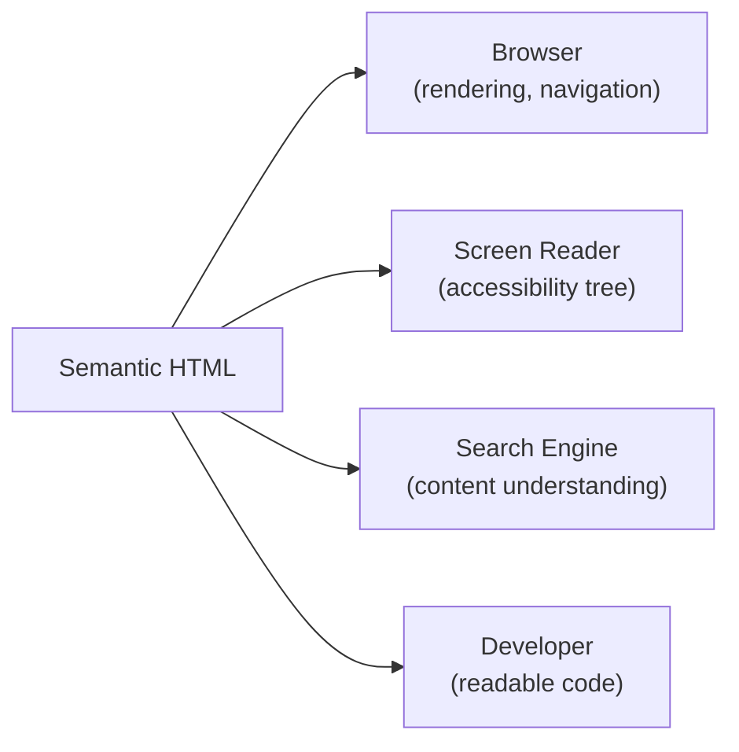
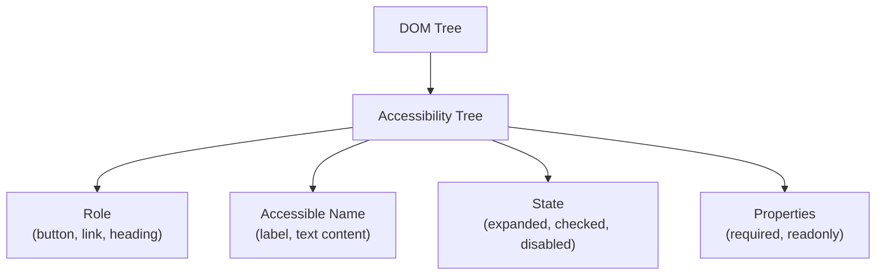

## Why Semantics Matter

HTML is not just about visual structure — it's a communication layer between your content and machines (browsers, screen readers, search engines, AI). Semantic HTML provides meaning that `<div>` and `<span>` cannot.



---

## Document Structure

### The Semantic Skeleton

```html
<!DOCTYPE html>
<html lang="en">
<head>
    <meta charset="UTF-8">
    <meta name="viewport" content="width=device-width, initial-scale=1.0">
    <title>Page Title — Site Name</title>
    <meta name="description" content="Page description for SEO">
</head>
<body>
    <header>
        <nav aria-label="Main navigation">
            <ul>
                <li><a href="/" aria-current="page">Home</a></li>
                <li><a href="/products">Products</a></li>
                <li><a href="/about">About</a></li>
            </ul>
        </nav>
    </header>
    
    <main>
        <article>
            <h1>Article Title</h1>
            <p>Content...</p>
            
            <section aria-labelledby="features-heading">
                <h2 id="features-heading">Features</h2>
                <p>Section content...</p>
            </section>
        </article>
        
        <aside aria-label="Related articles">
            <h2>Related</h2>
            <ul>...</ul>
        </aside>
    </main>
    
    <footer>
        <nav aria-label="Footer navigation">...</nav>
        <p>&copy; 2024 Company Name</p>
    </footer>
</body>
</html>
```

### Heading Hierarchy

Headings create an outline. Screen readers use them for navigation.

```html
<!-- CORRECT: logical hierarchy -->
<h1>Page Title</h1>
    <h2>Section A</h2>
        <h3>Subsection A.1</h3>
        <h3>Subsection A.2</h3>
    <h2>Section B</h2>

<!-- WRONG: skipping levels -->
<h1>Title</h1>
<h3>Subsection</h3>  <!-- skipped h2! -->
<h5>Detail</h5>       <!-- skipped h3, h4! -->
```

**Rule:** One `<h1>` per page. Never skip heading levels. Use CSS for visual sizing, not heading tags.

---

## Semantic Elements Reference

| Element | Purpose | When to Use |
|---------|---------|-------------|
| `<header>` | Introductory content | Page header, article header |
| `<nav>` | Navigation links | Main nav, breadcrumbs, pagination |
| `<main>` | Primary content | One per page, excludes repeated content |
| `<article>` | Self-contained content | Blog post, product card, comment |
| `<section>` | Thematic grouping | Chapter, tab panel, grouped content |
| `<aside>` | Tangential content | Sidebar, pull quotes, ads |
| `<footer>` | Closing content | Copyright, related links |
| `<figure>` / `<figcaption>` | Illustration with caption | Images, diagrams, code snippets |
| `<details>` / `<summary>` | Expandable content | FAQ, collapsible sections |
| `<time>` | Date/time | `<time datetime="2024-01-15">Jan 15</time>` |
| `<address>` | Contact information | Author/organization contact |
| `<mark>` | Highlighted text | Search results highlighting |

---

## Accessibility (a11y)

### The Accessibility Tree

Browsers build an accessibility tree from the DOM. Assistive technologies (screen readers) consume this tree, not the visual rendering.



### ARIA (Accessible Rich Internet Applications)

ARIA attributes supplement HTML semantics when native elements aren't sufficient:

```html
<!-- Rule 1: Don't use ARIA if native HTML works -->
<!-- BAD -->
<div role="button" tabindex="0" onclick="submit()">Submit</div>
<!-- GOOD -->
<button type="submit">Submit</button>

<!-- Rule 2: Use ARIA for custom widgets -->
<div role="tablist">
    <button role="tab" aria-selected="true" aria-controls="panel-1">Tab 1</button>
    <button role="tab" aria-selected="false" aria-controls="panel-2">Tab 2</button>
</div>
<div role="tabpanel" id="panel-1">Content 1</div>
<div role="tabpanel" id="panel-2" hidden>Content 2</div>

<!-- Rule 3: Label everything interactive -->
<button aria-label="Close dialog">×</button>
<input type="search" aria-label="Search products">
<nav aria-label="Breadcrumb">...</nav>
```

### Key ARIA Attributes

| Attribute | Purpose | Example |
|-----------|---------|---------|
| `aria-label` | Accessible name (no visible label) | `<button aria-label="Close">×</button>` |
| `aria-labelledby` | Name from another element | `<section aria-labelledby="title-id">` |
| `aria-describedby` | Additional description | `<input aria-describedby="help-text">` |
| `aria-expanded` | Expandable state | `<button aria-expanded="false">Menu</button>` |
| `aria-hidden` | Hide from accessibility tree | `<span aria-hidden="true">🎨</span>` |
| `aria-live` | Dynamic content announcements | `<div aria-live="polite">Updated!</div>` |
| `aria-current` | Current item in a set | `<a aria-current="page">Home</a>` |
| `role` | Override element's role | `<div role="alert">Error occurred</div>` |

### Live Regions

For dynamic content that updates without page reload:

```html
<!-- Polite: announced when user is idle -->
<div aria-live="polite" aria-atomic="true">
    3 items in cart
</div>

<!-- Assertive: interrupts current speech -->
<div aria-live="assertive" role="alert">
    Error: Payment failed. Please try again.
</div>

<!-- Status: polite + role="status" -->
<div role="status">
    Showing 1-10 of 42 results
</div>
```

---

## Forms and Accessibility

```html
<form>
    <!-- Always associate labels with inputs -->
    <div>
        <label for="email">Email address</label>
        <input type="email" id="email" name="email" 
               required aria-describedby="email-help email-error">
        <p id="email-help">We'll never share your email.</p>
        <p id="email-error" role="alert" hidden>Please enter a valid email.</p>
    </div>
    
    <!-- Fieldset for grouped inputs -->
    <fieldset>
        <legend>Shipping method</legend>
        <label>
            <input type="radio" name="shipping" value="standard"> Standard (5-7 days)
        </label>
        <label>
            <input type="radio" name="shipping" value="express"> Express (1-2 days)
        </label>
    </fieldset>
    
    <!-- Accessible error summary -->
    <div role="alert" aria-labelledby="error-heading" hidden>
        <h2 id="error-heading">Please fix the following errors:</h2>
        <ul>
            <li><a href="#email">Email is required</a></li>
        </ul>
    </div>
    
    <button type="submit">Place Order</button>
</form>
```

---

## Keyboard Navigation

All interactive elements must be keyboard-accessible:

| Key | Expected Behavior |
|-----|-------------------|
| `Tab` | Move to next focusable element |
| `Shift+Tab` | Move to previous focusable element |
| `Enter` / `Space` | Activate buttons, links |
| `Escape` | Close modals, dropdowns |
| `Arrow keys` | Navigate within widgets (tabs, menus) |

```html
<!-- Focus management for modals -->
<dialog id="modal" aria-labelledby="modal-title">
    <h2 id="modal-title">Confirm Action</h2>
    <p>Are you sure?</p>
    <button autofocus>Confirm</button>  <!-- auto-focus first action -->
    <button>Cancel</button>
</dialog>

<!-- Skip navigation link (first focusable element) -->
<a href="#main-content" class="skip-link">Skip to main content</a>
```

```css
/* Visible focus indicators (NEVER remove without replacement) */
:focus-visible {
    outline: 3px solid #4A90D9;
    outline-offset: 2px;
}

/* Skip link — hidden until focused */
.skip-link {
    position: absolute;
    top: -40px;
    left: 0;
    z-index: 100;
}
.skip-link:focus {
    top: 0;
}
```

---

## Images and Media

```html
<!-- Informative image — describe the content -->


<!-- Decorative image — empty alt -->


<!-- Complex image — longer description -->
<figure>
    
    <figcaption id="arch-desc">
        Three microservices communicate via message queue...
    </figcaption>
</figure>

<!-- Video with captions -->
<video controls>
    <source src="demo.mp4" type="video/mp4">
    <track kind="captions" src="captions.vtt" srclang="en" label="English" default>
</video>
```

---

## Testing Accessibility

| Tool | Type | What It Catches |
|------|------|-----------------|
| axe DevTools | Automated | Missing labels, contrast, ARIA misuse |
| Lighthouse | Automated | Scoring + recommendations |
| Screen reader (VoiceOver/NVDA) | Manual | Real user experience |
| Keyboard-only navigation | Manual | Focus traps, unreachable elements |
| WAVE | Automated | Visual overlay of issues |

### WCAG Levels

| Level | Requirement |
|-------|-------------|
| **A** | Minimum (must fix) — text alternatives, keyboard access |
| **AA** | Standard target — contrast 4.5:1, resize to 200%, focus visible |
| **AAA** | Enhanced — contrast 7:1, sign language, extended audio description |

---

## Key Takeaways

1. **Use native HTML elements first** — `<button>`, `<a>`, `<input>` have built-in accessibility
2. **One `<h1>` per page, never skip levels** — headings are navigation landmarks for screen readers
3. **Label everything interactive** — `<label>`, `aria-label`, or `aria-labelledby`
4. **Never remove focus outlines** — replace with visible `:focus-visible` styles
5. **Test with keyboard only** — if you can't Tab to it and activate it, it's broken
6. **ARIA is a last resort** — "No ARIA is better than bad ARIA"
7. **Alt text describes function, not appearance** — "Submit form" not "green button"
