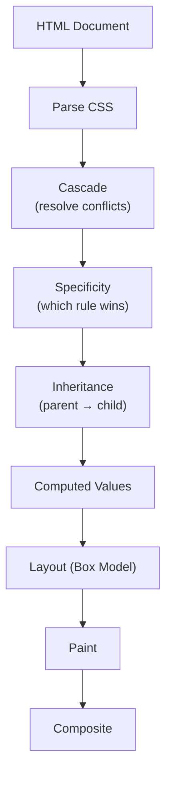
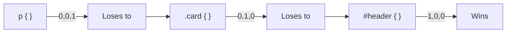

## How CSS Works

CSS (Cascading Style Sheets) controls the visual presentation of HTML. Understanding the cascade, specificity, and box model is essential — without them, you're guessing why styles apply or don't.



---

## The Cascade

When multiple rules target the same element, the cascade determines which wins:

### Priority Order (highest to lowest)

1. `!important` declarations (avoid these)
2. Inline styles (`style="..."`)
3. ID selectors (`#header`)
4. Class selectors (`.card`), attribute selectors (`[type="text"]`), pseudo-classes (`:hover`)
5. Element selectors (`div`, `p`), pseudo-elements (`::before`)
6. Universal selector (`*`)

### Specificity Calculation

Specificity is a tuple: `(ID, Class, Element)`

```css
/* (0, 0, 1) — one element */
p { color: black; }

/* (0, 1, 0) — one class */
.highlight { color: blue; }

/* (0, 1, 1) — one class + one element */
p.highlight { color: green; }

/* (1, 0, 0) — one ID */
#title { color: red; }

/* (1, 1, 1) — one ID + one class + one element */
div#title.main { color: purple; }
```



### The `!important` Escape Hatch

```css
/* Overrides everything (except another !important with higher specificity) */
.button { color: red !important; }

/* NEVER use !important except:
   1. Utility classes in a design system
   2. Overriding third-party CSS you can't modify
*/
```

---

## The Box Model

Every element is a rectangular box with four layers:

```text
┌─────────────────────────────────────┐
│              margin                  │
│  ┌───────────────────────────────┐  │
│  │           border              │  │
│  │  ┌───────────────────────┐   │  │
│  │  │       padding         │   │  │
│  │  │  ┌───────────────┐   │   │  │
│  │  │  │   content      │   │   │  │
│  │  │  │  (width×height)│   │   │  │
│  │  │  └───────────────┘   │   │  │
│  │  └───────────────────────┘   │  │
│  └───────────────────────────────┘  │
└─────────────────────────────────────┘
```

### `box-sizing`

```css
/* content-box (default) — width/height = content only */
.box-content {
    box-sizing: content-box;
    width: 200px;
    padding: 20px;
    border: 2px solid;
    /* Total width: 200 + 20*2 + 2*2 = 244px */
}

/* border-box — width/height includes padding + border */
.box-border {
    box-sizing: border-box;
    width: 200px;
    padding: 20px;
    border: 2px solid;
    /* Total width: 200px (content shrinks to 156px) */
}

/* ALWAYS use border-box globally */
*, *::before, *::after {
    box-sizing: border-box;
}
```

### Margin Collapse

Vertical margins between adjacent block elements collapse (the larger one wins):

```css
.paragraph-1 { margin-bottom: 20px; }
.paragraph-2 { margin-top: 30px; }
/* Gap between them: 30px (not 50px!) */

/* Margins DON'T collapse when:
   - Elements are flex/grid children
   - Elements have overflow: hidden/auto
   - Elements are floated or absolutely positioned
   - There's a border or padding between them
*/
```

---

## Selectors

### Basic Selectors

```css
/* Element */
p { }

/* Class */
.card { }

/* ID */
#header { }

/* Universal */
* { }

/* Attribute */
[type="email"] { }
[href^="https"] { }    /* starts with */
[href$=".pdf"] { }     /* ends with */
[data-theme*="dark"] { } /* contains */
```

### Combinators

```css
/* Descendant (any depth) */
.card p { }

/* Child (direct only) */
.card > p { }

/* Adjacent sibling (immediately after) */
h2 + p { }

/* General sibling (any after) */
h2 ~ p { }
```

### Pseudo-classes

```css
/* State */
:hover { }
:focus { }
:focus-visible { }  /* keyboard focus only */
:active { }
:disabled { }
:checked { }

/* Structural */
:first-child { }
:last-child { }
:nth-child(2n) { }     /* even */
:nth-child(3n+1) { }   /* 1st, 4th, 7th... */
:not(.excluded) { }
:is(.card, .panel) { } /* matches any in list */
:where(.card) { }      /* like :is but zero specificity */
:has(.icon) { }        /* parent selector! (modern) */
```

### Pseudo-elements

```css
/* Generated content */
.quote::before { content: """; }
.quote::after { content: """; }

/* First line/letter */
p::first-line { font-weight: bold; }
p::first-letter { font-size: 2em; }

/* Selection highlight */
::selection { background: #b3d4fc; }

/* Placeholder text */
::placeholder { color: #999; }
```

---

## Units

| Unit | Type | Relative To | Use Case |
|------|------|-------------|----------|
| `px` | Absolute | — | Borders, shadows, fine details |
| `rem` | Relative | Root font-size (16px default) | Font sizes, spacing, layout |
| `em` | Relative | Parent font-size | Component-internal spacing |
| `%` | Relative | Parent dimension | Fluid widths |
| `vw` / `vh` | Relative | Viewport width/height | Full-screen layouts |
| `dvh` | Relative | Dynamic viewport height | Mobile (accounts for toolbar) |
| `ch` | Relative | Width of "0" character | Max line width |
| `fr` | Fraction | Available space in grid | Grid columns |

```css
/* Best practices */
html { font-size: 16px; }  /* base — don't change */

body {
    font-size: 1rem;        /* 16px */
    line-height: 1.5;       /* unitless — multiplier */
}

h1 { font-size: 2.5rem; }  /* 40px — scales with user preferences */

.container {
    max-width: 70ch;        /* ~70 characters wide — optimal reading */
    padding: 1.5rem;
}

.hero {
    min-height: 100dvh;     /* full viewport on mobile */
}
```

---

## Custom Properties (CSS Variables)

```css
:root {
    /* Design tokens */
    --color-primary: #2563eb;
    --color-primary-hover: #1d4ed8;
    --color-text: #1f2937;
    --color-bg: #ffffff;
    
    --spacing-xs: 0.25rem;
    --spacing-sm: 0.5rem;
    --spacing-md: 1rem;
    --spacing-lg: 2rem;
    
    --radius-sm: 4px;
    --radius-md: 8px;
    --radius-lg: 16px;
    
    --shadow-sm: 0 1px 2px rgba(0, 0, 0, 0.05);
    --shadow-md: 0 4px 6px rgba(0, 0, 0, 0.1);
    
    --font-sans: system-ui, -apple-system, sans-serif;
    --font-mono: 'JetBrains Mono', monospace;
}

/* Dark mode override */
@media (prefers-color-scheme: dark) {
    :root {
        --color-text: #f9fafb;
        --color-bg: #111827;
    }
}

/* Component-scoped variables */
.button {
    --btn-padding: var(--spacing-sm) var(--spacing-md);
    --btn-radius: var(--radius-sm);
    
    padding: var(--btn-padding);
    border-radius: var(--btn-radius);
    background: var(--color-primary);
    color: white;
}

.button:hover {
    background: var(--color-primary-hover);
}

/* Fallback values */
.card {
    color: var(--card-color, var(--color-text));
}
```

---

## Inheritance

Some properties inherit from parent to child by default:

| Inherits | Doesn't Inherit |
|----------|-----------------|
| `color` | `background` |
| `font-*` | `border` |
| `line-height` | `margin` |
| `text-align` | `padding` |
| `visibility` | `width` / `height` |
| `cursor` | `display` |
| `list-style` | `position` |

```css
/* Force inheritance */
.child { border: inherit; }

/* Reset to initial value */
.reset { color: initial; }

/* Use parent's computed value */
.use-parent { all: inherit; }

/* Reset everything to initial */
.clean-slate { all: unset; }
```

---

## Key Takeaways

1. **`box-sizing: border-box` globally** — makes width/height intuitive
2. **Specificity determines which rule wins** — ID > class > element; avoid `!important`
3. **Use `rem` for sizing** — respects user font-size preferences; `px` only for borders/shadows
4. **CSS custom properties for design tokens** — centralize colors, spacing, typography
5. **Vertical margins collapse** — use padding or flex/grid gap instead of margin for spacing
6. **`:focus-visible` over `:focus`** — shows focus ring only for keyboard users
7. **`:has()` is the parent selector** — `.card:has(.error)` styles the card when it contains an error
