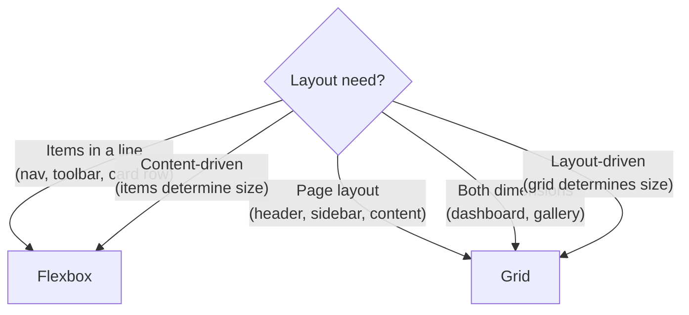

## The Layout Problem

Before Flexbox and Grid, layout relied on floats, tables, and positioning hacks. Modern CSS provides two purpose-built layout systems:

- **Flexbox** — one-dimensional (row OR column)
- **Grid** — two-dimensional (rows AND columns simultaneously)



---

## Flexbox

### Core Concept

A flex container distributes space among its children along a **main axis**:

```css
.container {
    display: flex;
    /* Main axis: left → right (default) */
    /* Cross axis: top → bottom */
}
```

```text
Main Axis (flex-direction: row) →
┌──────────────────────────────────────────┐
│  ┌──────┐  ┌──────┐  ┌──────┐           │  ↕ Cross Axis
│  │ Item │  │ Item │  │ Item │           │
│  └──────┘  └──────┘  └──────┘           │
└──────────────────────────────────────────┘
```

### Container Properties

```css
.flex-container {
    display: flex;
    
    /* Direction */
    flex-direction: row;           /* → (default) */
    flex-direction: row-reverse;   /* ← */
    flex-direction: column;        /* ↓ */
    flex-direction: column-reverse; /* ↑ */
    
    /* Wrapping */
    flex-wrap: nowrap;   /* single line (default) */
    flex-wrap: wrap;     /* multiple lines */
    
    /* Main axis alignment */
    justify-content: flex-start;    /* pack to start */
    justify-content: flex-end;      /* pack to end */
    justify-content: center;        /* center */
    justify-content: space-between; /* equal space between items */
    justify-content: space-around;  /* equal space around items */
    justify-content: space-evenly;  /* equal space everywhere */
    
    /* Cross axis alignment */
    align-items: stretch;     /* fill container height (default) */
    align-items: flex-start;  /* align to top */
    align-items: flex-end;    /* align to bottom */
    align-items: center;      /* center vertically */
    align-items: baseline;    /* align text baselines */
    
    /* Gap between items */
    gap: 1rem;          /* row and column gap */
    row-gap: 1rem;
    column-gap: 2rem;
}
```

### Item Properties

```css
.flex-item {
    /* Growth — how much extra space to absorb */
    flex-grow: 0;   /* don't grow (default) */
    flex-grow: 1;   /* absorb equal share of extra space */
    flex-grow: 2;   /* absorb twice as much as flex-grow: 1 */
    
    /* Shrink — how much to shrink when space is tight */
    flex-shrink: 1; /* shrink equally (default) */
    flex-shrink: 0; /* never shrink */
    
    /* Basis — initial size before growing/shrinking */
    flex-basis: auto;  /* use content size (default) */
    flex-basis: 200px; /* start at 200px */
    flex-basis: 0;     /* ignore content, distribute all space via grow */
    
    /* Shorthand (grow, shrink, basis) */
    flex: 1;           /* flex: 1 1 0 — grow equally, ignore content size */
    flex: 0 0 200px;   /* fixed 200px, no grow, no shrink */
    flex: 1 0 auto;    /* grow from content size, never shrink */
    
    /* Self-alignment (override container's align-items) */
    align-self: center;
    
    /* Order (visual reordering) */
    order: -1;  /* move before default (0) items */
}
```

### Common Flexbox Patterns

```css
/* Center anything */
.center {
    display: flex;
    justify-content: center;
    align-items: center;
}

/* Navigation bar */
.navbar {
    display: flex;
    justify-content: space-between;
    align-items: center;
    padding: 1rem;
}

/* Push last item to the right */
.nav-item:last-child {
    margin-left: auto; /* auto margin absorbs remaining space */
}

/* Equal-width columns */
.columns {
    display: flex;
    gap: 1rem;
}
.columns > * {
    flex: 1; /* each child takes equal space */
}

/* Card row that wraps */
.card-grid {
    display: flex;
    flex-wrap: wrap;
    gap: 1rem;
}
.card {
    flex: 1 1 300px; /* grow, shrink, min 300px before wrapping */
}
```

---

## CSS Grid

### Core Concept

Grid defines a two-dimensional layout with explicit rows and columns:

```css
.grid {
    display: grid;
    grid-template-columns: 200px 1fr 200px;
    grid-template-rows: auto 1fr auto;
    gap: 1rem;
}
```

```text
┌──────────┬────────────────────┬──────────┐
│  200px   │        1fr         │  200px   │  auto
├──────────┼────────────────────┼──────────┤
│          │                    │          │
│          │        1fr         │          │  1fr
│          │                    │          │
├──────────┼────────────────────┼──────────┤
│  200px   │        1fr         │  200px   │  auto
└──────────┴────────────────────┴──────────┘
```

### Defining the Grid

```css
.grid {
    display: grid;
    
    /* Explicit columns */
    grid-template-columns: 200px 1fr 2fr;           /* fixed + fractional */
    grid-template-columns: repeat(3, 1fr);          /* 3 equal columns */
    grid-template-columns: repeat(auto-fill, minmax(250px, 1fr)); /* responsive! */
    grid-template-columns: fit-content(200px) 1fr;  /* shrink-to-fit, max 200px */
    
    /* Explicit rows */
    grid-template-rows: 60px 1fr 40px;
    
    /* Implicit rows (for overflow content) */
    grid-auto-rows: minmax(100px, auto);
    
    /* Gap */
    gap: 1rem;
    row-gap: 2rem;
    column-gap: 1rem;
}
```

### Placing Items

```css
/* By line numbers */
.header {
    grid-column: 1 / -1;  /* span all columns (1 to last) */
    grid-row: 1;
}

.sidebar {
    grid-column: 1;
    grid-row: 2 / 4;      /* span rows 2-3 */
}

.content {
    grid-column: 2 / -1;
    grid-row: 2;
}

/* By span */
.wide-item {
    grid-column: span 2;  /* take 2 columns */
}

/* Named areas (most readable) */
.layout {
    display: grid;
    grid-template-columns: 250px 1fr;
    grid-template-rows: auto 1fr auto;
    grid-template-areas:
        "header  header"
        "sidebar content"
        "footer  footer";
    min-height: 100dvh;
}

.header  { grid-area: header; }
.sidebar { grid-area: sidebar; }
.content { grid-area: content; }
.footer  { grid-area: footer; }
```

### Alignment in Grid

```css
.grid {
    /* Align all items within their cells */
    justify-items: start | end | center | stretch;  /* horizontal */
    align-items: start | end | center | stretch;    /* vertical */
    place-items: center;  /* shorthand: both */
    
    /* Align the grid within the container */
    justify-content: start | end | center | space-between;
    align-content: start | end | center | space-between;
}

/* Individual item alignment */
.item {
    justify-self: end;
    align-self: center;
    place-self: center end;
}
```

### Responsive Grid (No Media Queries!)

```css
/* Auto-fill: create as many columns as fit */
.auto-grid {
    display: grid;
    grid-template-columns: repeat(auto-fill, minmax(250px, 1fr));
    gap: 1rem;
}

/* auto-fill vs auto-fit:
   auto-fill: keeps empty tracks (columns exist even without items)
   auto-fit: collapses empty tracks (items stretch to fill)
*/
```

---

## Flexbox vs Grid: Decision Guide

| Scenario | Use |
|----------|-----|
| Navigation bar | Flexbox |
| Card grid (responsive) | Grid (`auto-fill`) |
| Centering one element | Flexbox or Grid |
| Page layout (header/sidebar/content) | Grid (named areas) |
| Toolbar with variable items | Flexbox |
| Dashboard with fixed cells | Grid |
| Items of unknown/varying size | Flexbox |
| Precise 2D placement | Grid |

### They Compose

```css
/* Grid for page layout, Flexbox for component internals */
.page {
    display: grid;
    grid-template-columns: 250px 1fr;
    grid-template-areas: "nav main";
}

.nav {
    grid-area: nav;
    display: flex;
    flex-direction: column;
    gap: 0.5rem;
}
```

---

## Subgrid

Subgrid lets child grids align to the parent grid's tracks:

```css
.parent {
    display: grid;
    grid-template-columns: 1fr 2fr 1fr;
    gap: 1rem;
}

.child {
    grid-column: 1 / -1;
    display: grid;
    grid-template-columns: subgrid; /* inherits parent's column tracks */
}
```

---

## Key Takeaways

1. **Flexbox for 1D, Grid for 2D** — use both together; they're complementary
2. **`gap` replaces margin hacks** — works in both Flexbox and Grid
3. **`repeat(auto-fill, minmax(250px, 1fr))`** — responsive grid without media queries
4. **Named grid areas** — most readable layout definition for page structure
5. **`flex: 1`** — equal distribution; `flex: 0 0 auto` — fixed size
6. **`margin: auto` in Flexbox** — absorbs remaining space (push items apart)
7. **Grid is layout-first, Flexbox is content-first** — Grid defines the structure; Flexbox lets content determine sizing
