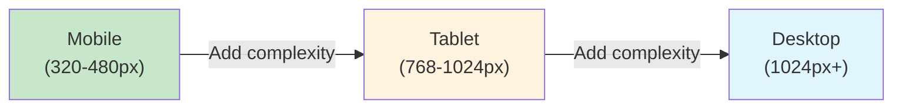
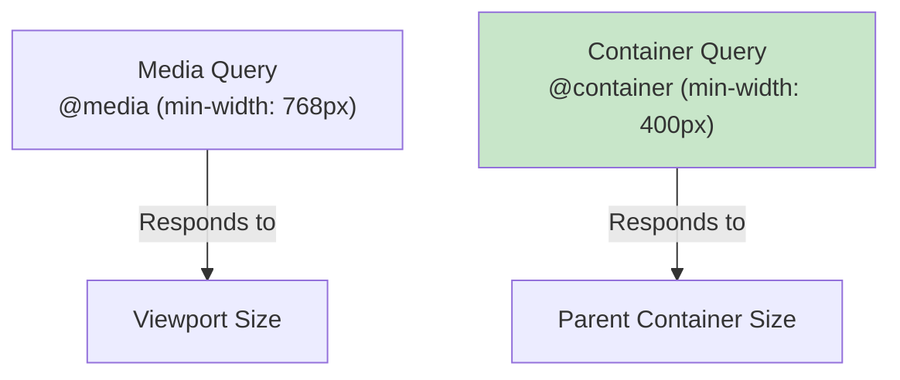

## The Responsive Mindset

Responsive design means building interfaces that adapt to any screen size, orientation, and input method. The modern approach is **mobile-first** — start with the smallest screen and progressively enhance.



---

## The Viewport Meta Tag

Without this, mobile browsers render pages at desktop width and zoom out:

```html
<meta name="viewport" content="width=device-width, initial-scale=1.0">
```

| Property | Effect |
|----------|--------|
| `width=device-width` | Match viewport to device width |
| `initial-scale=1.0` | No zoom on load |
| `user-scalable=no` | **NEVER use** — breaks accessibility |

---

## Media Queries

### Mobile-First Breakpoints

```css
/* Base styles — mobile (no media query needed) */
.container {
    padding: 1rem;
}

/* Tablet and up */
@media (min-width: 768px) {
    .container {
        padding: 2rem;
        max-width: 720px;
        margin: 0 auto;
    }
}

/* Desktop and up */
@media (min-width: 1024px) {
    .container {
        max-width: 960px;
    }
}

/* Large desktop */
@media (min-width: 1280px) {
    .container {
        max-width: 1200px;
    }
}
```

### Common Breakpoints

| Name | Width | Targets |
|------|-------|---------|
| `sm` | 640px | Large phones (landscape) |
| `md` | 768px | Tablets |
| `lg` | 1024px | Small laptops |
| `xl` | 1280px | Desktops |
| `2xl` | 1536px | Large screens |

**Important:** These are guidelines, not rules. Set breakpoints where your design breaks, not at device widths.

### Feature Queries

```css
/* Preference-based */
@media (prefers-color-scheme: dark) {
    :root { --bg: #111; --text: #eee; }
}

@media (prefers-reduced-motion: reduce) {
    * { animation-duration: 0.01ms !important; transition-duration: 0.01ms !important; }
}

@media (prefers-contrast: more) {
    :root { --border-color: #000; }
}

/* Capability-based */
@media (hover: hover) {
    /* Device has hover capability (mouse/trackpad) */
    .card:hover { transform: translateY(-2px); }
}

@media (pointer: coarse) {
    /* Touch device — larger tap targets */
    .button { min-height: 44px; min-width: 44px; }
}

/* Orientation */
@media (orientation: landscape) {
    .hero { height: 100dvh; }
}
```

---

## Fluid Typography

Instead of jumping between fixed sizes at breakpoints, scale smoothly:

```css
/* clamp(minimum, preferred, maximum) */
h1 {
    font-size: clamp(2rem, 5vw + 1rem, 4rem);
    /* At 320px viewport: ~2rem
       At 768px viewport: ~3.4rem
       At 1200px+: caps at 4rem */
}

body {
    font-size: clamp(1rem, 0.9rem + 0.5vw, 1.25rem);
}

/* Fluid spacing */
.section {
    padding: clamp(2rem, 5vw, 6rem);
}
```

### The `clamp()` Formula

```text
clamp(min, preferred, max)

preferred = base + (vw-coefficient × viewport-width)

For font scaling from 16px (320px viewport) to 24px (1200px viewport):
slope = (24 - 16) / (1200 - 320) = 0.009
intercept = 16 - (0.009 × 320) = 13.09

font-size: clamp(1rem, 0.818rem + 0.909vw, 1.5rem);
```

---

## Responsive Images

### `srcset` and `sizes`

```html
<!-- Resolution switching (same image, different sizes) -->


<!-- Art direction (different crops for different screens) -->
<picture>
    <source media="(min-width: 1024px)" srcset="hero-wide.jpg">
    <source media="(min-width: 768px)" srcset="hero-medium.jpg">
    
</picture>

<!-- Modern formats with fallback -->
<picture>
    <source type="image/avif" srcset="photo.avif">
    <source type="image/webp" srcset="photo.webp">
    
</picture>
```

### CSS Responsive Images

```css
/* Fluid images (never overflow container) */
img {
    max-width: 100%;
    height: auto;
}

/* Object-fit for fixed-size containers */
.avatar {
    width: 80px;
    height: 80px;
    object-fit: cover;      /* crop to fill */
    object-position: center;
    border-radius: 50%;
}

/* Aspect ratio */
.video-wrapper {
    aspect-ratio: 16 / 9;
    width: 100%;
}
```

---

## Container Queries

Media queries respond to the **viewport**. Container queries respond to the **parent container's size** — enabling truly reusable components.

```css
/* Define a containment context */
.card-container {
    container-type: inline-size;
    container-name: card;
}

/* Style based on container width */
@container card (min-width: 400px) {
    .card {
        display: grid;
        grid-template-columns: 150px 1fr;
        gap: 1rem;
    }
}

@container card (min-width: 600px) {
    .card {
        grid-template-columns: 200px 1fr auto;
    }
    .card__actions {
        flex-direction: column;
    }
}

/* Container query units */
.card__title {
    font-size: clamp(1rem, 3cqi, 1.5rem); /* cqi = container query inline */
}
```



---

## Responsive Patterns

### The Sidebar Layout

```css
/* Sidebar that collapses on small screens */
.layout {
    display: grid;
    grid-template-columns: 1fr;
    gap: 1rem;
}

@media (min-width: 768px) {
    .layout {
        grid-template-columns: 250px 1fr;
    }
}
```

### The Holy Grail (No Media Queries)

```css
.holy-grail {
    display: grid;
    grid-template-columns: 
        fit-content(200px) 
        minmax(min(50vw, 30ch), 1fr) 
        fit-content(200px);
    gap: 1rem;
}
```

### Responsive Navigation

```css
/* Mobile: hamburger menu */
.nav-links {
    display: none;
    flex-direction: column;
    position: absolute;
    top: 100%;
    width: 100%;
    background: white;
}

.nav-links.open {
    display: flex;
}

/* Desktop: horizontal links */
@media (min-width: 768px) {
    .nav-links {
        display: flex;
        flex-direction: row;
        position: static;
        width: auto;
    }
    
    .hamburger {
        display: none;
    }
}
```

---

## Touch and Interaction

```css
/* Minimum touch target size (WCAG 2.5.8) */
.button, .link, [role="button"] {
    min-height: 44px;
    min-width: 44px;
}

/* Hover only on devices that support it */
@media (hover: hover) and (pointer: fine) {
    .card:hover {
        box-shadow: var(--shadow-md);
        transform: translateY(-2px);
    }
}

/* Prevent text selection on interactive elements */
.button {
    -webkit-user-select: none;
    user-select: none;
    -webkit-tap-highlight-color: transparent;
}
```

---

## Key Takeaways

1. **Mobile-first** — write base styles for mobile, add complexity with `min-width` queries
2. **`clamp()` for fluid sizing** — smooth scaling without breakpoint jumps
3. **Container queries for components** — components respond to their container, not the viewport
4. **`srcset` + `sizes` for images** — let the browser choose the optimal image size
5. **Set breakpoints where design breaks** — not at arbitrary device widths
6. **44px minimum touch targets** — WCAG requirement for accessible interaction
7. **`prefers-reduced-motion`** — respect user preferences; disable animations for those who need it
