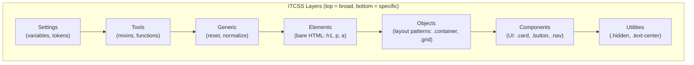

## The Scaling Problem

CSS is global by default. Every selector can affect any element on the page. As projects grow, this leads to specificity wars, unintended side effects, and fear of changing styles. CSS architecture methodologies solve this by providing naming conventions and organizational patterns.

---

## BEM (Block Element Modifier)

The most widely adopted naming convention. It makes relationships between components explicit in class names.

### Naming Pattern

```text
.block {}
.block__element {}
.block--modifier {}
```

| Part | Meaning | Example |
|------|---------|---------|
| **Block** | Standalone component | `.card`, `.nav`, `.form` |
| **Element** | Part of a block (can't exist alone) | `.card__title`, `.card__image` |
| **Modifier** | Variation of block or element | `.card--featured`, `.card__title--large` |

### Example

```html
<article class="card card--featured">
    
    <div class="card__body">
        <h2 class="card__title">Title</h2>
        <p class="card__description">Description text</p>
        <a class="card__link card__link--primary" href="#">Read more</a>
    </div>
</article>
```

```css
/* Block */
.card {
    border-radius: 8px;
    overflow: hidden;
    box-shadow: 0 2px 4px rgba(0, 0, 0, 0.1);
}

/* Modifier on block */
.card--featured {
    border: 2px solid var(--color-primary);
}

/* Elements */
.card__image {
    width: 100%;
    aspect-ratio: 16 / 9;
    object-fit: cover;
}

.card__title {
    font-size: 1.25rem;
    margin-bottom: 0.5rem;
}

.card__link {
    text-decoration: none;
    color: var(--color-primary);
}

/* Modifier on element */
.card__link--primary {
    font-weight: bold;
}
```

### BEM Rules

1. **Never nest selectors** — `.card .card__title` is wrong; just `.card__title`
2. **No element of element** — `.card__body__title` is wrong; flatten to `.card__title`
3. **Modifiers don't exist alone** — always pair: `class="card card--featured"`
4. **Blocks are independent** — a block should work anywhere on the page

---

## ITCSS (Inverted Triangle CSS)

ITCSS organizes CSS by specificity, from generic to specific:



```scss
// main.scss — import order matters
@use 'settings/variables';
@use 'settings/breakpoints';

@use 'tools/mixins';

@use 'generic/reset';
@use 'generic/box-sizing';

@use 'elements/headings';
@use 'elements/links';

@use 'objects/container';
@use 'objects/grid';

@use 'components/card';
@use 'components/button';
@use 'components/nav';

@use 'utilities/visibility';
@use 'utilities/spacing';
```

---

## CSS Modules

CSS Modules scope styles to a component by generating unique class names at build time:

```css
/* Button.module.css */
.button {
    padding: 0.5rem 1rem;
    border-radius: 4px;
}

.primary {
    background: blue;
    color: white;
}
```

```javascript
// Button.jsx
import styles from './Button.module.css';

function Button({ variant, children }) {
    return (
        <button className={`${styles.button} ${styles[variant]}`}>
            {children}
        </button>
    );
}
// Rendered: <button class="Button_button_x7d2s Button_primary_k3f9a">
```

**Benefits:** No global conflicts, dead code elimination, explicit dependencies.

---

## Utility-First (Tailwind CSS)

Instead of writing custom CSS, compose utility classes directly in HTML:

```html
<article class="rounded-lg overflow-hidden shadow-md border-2 border-blue-500">
    
    <div class="p-4">
        <h2 class="text-xl font-bold mb-2">Title</h2>
        <p class="text-gray-600 mb-4">Description</p>
        <a class="text-blue-600 font-bold hover:underline" href="#">Read more</a>
    </div>
</article>
```

### Pros and Cons

| Pros | Cons |
|------|------|
| No naming decisions | Verbose HTML |
| No dead CSS | Learning curve (utility names) |
| Consistent design tokens | Harder to read at first |
| Fast prototyping | Repetition without components |
| Small production CSS (purged) | Tight coupling of style to markup |

### When to Use What

| Approach | Best For |
|----------|----------|
| BEM | Teams, large codebases, design systems |
| CSS Modules | Component frameworks (React, Vue) |
| Utility-first | Rapid prototyping, small teams, Tailwind ecosystem |
| ITCSS | Organizing any of the above at scale |

---

## Design Tokens

Design tokens are the atomic values of a design system — colors, spacing, typography, shadows — stored as variables:

```css
:root {
    /* Colors */
    --color-primary-50: #eff6ff;
    --color-primary-100: #dbeafe;
    --color-primary-500: #3b82f6;
    --color-primary-700: #1d4ed8;
    --color-primary-900: #1e3a8a;
    
    /* Spacing scale */
    --space-1: 0.25rem;  /* 4px */
    --space-2: 0.5rem;   /* 8px */
    --space-3: 0.75rem;  /* 12px */
    --space-4: 1rem;     /* 16px */
    --space-6: 1.5rem;   /* 24px */
    --space-8: 2rem;     /* 32px */
    
    /* Typography */
    --font-size-sm: 0.875rem;
    --font-size-base: 1rem;
    --font-size-lg: 1.125rem;
    --font-size-xl: 1.25rem;
    --font-size-2xl: 1.5rem;
    
    --font-weight-normal: 400;
    --font-weight-medium: 500;
    --font-weight-bold: 700;
    
    --line-height-tight: 1.25;
    --line-height-normal: 1.5;
    --line-height-relaxed: 1.75;
    
    /* Shadows */
    --shadow-sm: 0 1px 2px 0 rgb(0 0 0 / 0.05);
    --shadow-md: 0 4px 6px -1px rgb(0 0 0 / 0.1);
    --shadow-lg: 0 10px 15px -3px rgb(0 0 0 / 0.1);
    
    /* Borders */
    --radius-sm: 0.25rem;
    --radius-md: 0.5rem;
    --radius-lg: 1rem;
    --radius-full: 9999px;
    
    /* Transitions */
    --duration-fast: 150ms;
    --duration-normal: 300ms;
    --easing-default: cubic-bezier(0.4, 0, 0.2, 1);
}
```

---

## File Organization

```text
styles/
├── settings/
│   ├── _tokens.scss          # Design tokens (variables)
│   └── _breakpoints.scss     # Breakpoint values
├── tools/
│   ├── _mixins.scss          # Reusable mixins
│   └── _functions.scss       # SCSS functions
├── generic/
│   ├── _reset.scss           # CSS reset
│   └── _box-sizing.scss      # Global box-sizing
├── elements/
│   ├── _typography.scss      # Base h1-h6, p, a styles
│   └── _forms.scss           # Base form element styles
├── objects/
│   ├── _container.scss       # Layout container
│   └── _grid.scss            # Grid system
├── components/
│   ├── _button.scss          # .button component
│   ├── _card.scss            # .card component
│   └── _nav.scss             # .nav component
├── utilities/
│   ├── _visibility.scss      # .hidden, .sr-only
│   └── _spacing.scss         # .mt-1, .mb-2, etc.
└── main.scss                 # Import all in order
```

---

## Specificity Management

```css
/* LOW specificity — easy to override */
.button { }                    /* (0, 1, 0) */

/* Modifier — same specificity as base */
.button--primary { }           /* (0, 1, 0) */

/* State — slightly higher (acceptable) */
.button:hover { }              /* (0, 2, 0) */
.button:disabled { }           /* (0, 2, 0) */

/* AVOID: high specificity chains */
.header .nav .nav-list .nav-item a { }  /* (0, 4, 1) — nightmare to override */

/* Use :where() for zero-specificity defaults */
:where(.card) {
    border-radius: 8px;        /* (0, 0, 0) — easily overridable */
}

/* Use @layer for cascade control */
@layer base, components, utilities;

@layer base {
    a { color: blue; }
}

@layer components {
    .nav a { color: inherit; }  /* wins over base regardless of specificity */
}

@layer utilities {
    .text-red { color: red !important; }  /* always wins */
}
```

---

## Key Takeaways

1. **BEM for naming** — explicit relationships, flat specificity, no nesting
2. **ITCSS for organization** — layer CSS from generic to specific
3. **Design tokens** — single source of truth for visual values
4. **CSS Modules for component scoping** — automatic unique class names, no conflicts
5. **Never nest more than one level** — `.block__element` is fine; `.block .block__element` is redundant
6. **`@layer` for cascade control** — define layer order explicitly; later layers win
7. **Consistency over cleverness** — pick one methodology and follow it everywhere
