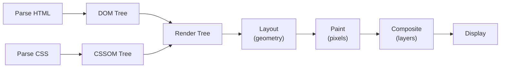
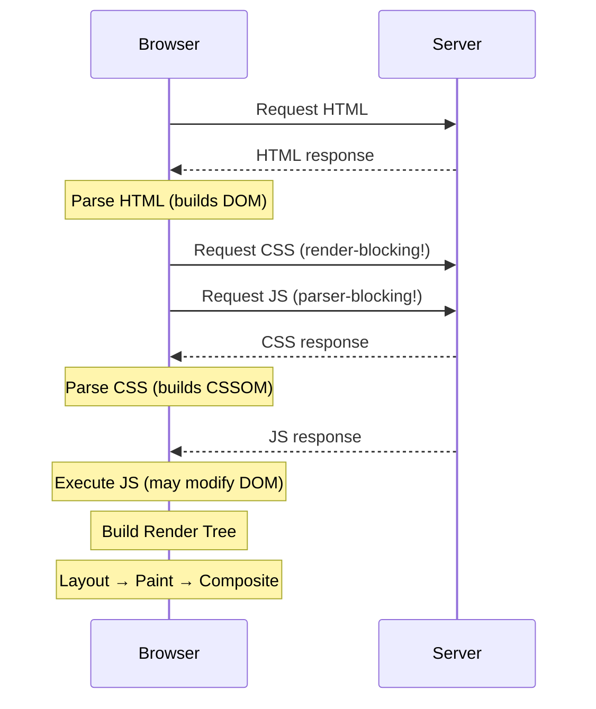
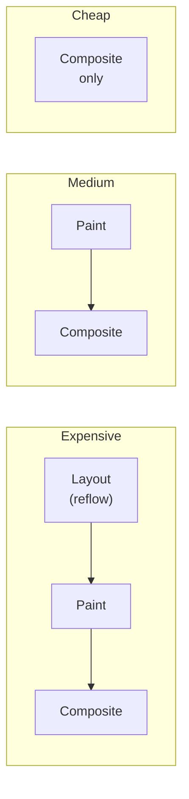

## From URL to Pixels

When you navigate to a page, the browser performs a complex pipeline to turn HTML, CSS, and JavaScript into pixels on screen. Understanding this pipeline is essential for performance optimization.



---

## Step 1: Parsing

### HTML → DOM

The browser parses HTML into a tree of nodes (the DOM):

```html
<html>
  <body>
    <h1>Hello</h1>
    <p class="intro">World</p>
  </body>
</html>
```

```text
Document
└── html
    └── body
        ├── h1
        │   └── "Hello"
        └── p.intro
            └── "World"
```

### CSS → CSSOM

CSS is parsed into the CSS Object Model — a tree of style rules:

```css
body { font-size: 16px; }
h1 { color: blue; font-size: 2em; }
.intro { margin-top: 1rem; }
```

```text
CSSOM
├── body: { font-size: 16px }
├── h1: { color: blue, font-size: 32px }
└── .intro: { margin-top: 16px }
```

### Render-Blocking Resources



| Resource | Blocking Behavior | Mitigation |
|----------|-------------------|------------|
| CSS `<link>` | Render-blocking (delays first paint) | Inline critical CSS, `media` attribute |
| JS `<script>` | Parser-blocking (stops DOM construction) | `defer`, `async`, or place before `</body>` |
| JS `<script defer>` | Downloads in parallel, executes after DOM | Best for most scripts |
| JS `<script async>` | Downloads in parallel, executes immediately | Analytics, ads (order doesn't matter) |

---

## Step 2: Render Tree

The render tree combines DOM + CSSOM, excluding invisible elements:

```text
Render Tree (only visible elements)
├── body: { font-size: 16px }
│   ├── h1: { color: blue, font-size: 32px, display: block }
│   └── p.intro: { margin-top: 16px, display: block }
│       └── "World"

NOT included:
- <head>, <meta>, <script>
- Elements with display: none
- Elements with visibility: hidden ARE included (they take space)
```

---

## Step 3: Layout (Reflow)

Layout calculates the exact position and size of every element in the render tree. It starts from the root and flows down.

```text
┌─ viewport (1920 × 1080) ─────────────────────────┐
│                                                    │
│  ┌─ body (1920 × auto) ────────────────────────┐  │
│  │                                              │  │
│  │  ┌─ h1 (1920 × 38px, at y:0) ────────────┐  │  │
│  │  │  "Hello"                                │  │  │
│  │  └────────────────────────────────────────┘  │  │
│  │                                              │  │
│  │  ┌─ p (1920 × 24px, at y:54px) ──────────┐  │  │
│  │  │  "World"                                │  │  │
│  │  └────────────────────────────────────────┘  │  │
│  └──────────────────────────────────────────────┘  │
└────────────────────────────────────────────────────┘
```

### What Triggers Layout (Reflow)

Any change to geometry forces the browser to recalculate layout:

| Triggers Layout | Doesn't Trigger Layout |
|----------------|----------------------|
| Changing `width`, `height` | Changing `color` |
| Changing `margin`, `padding` | Changing `background` |
| Changing `display`, `position` | Changing `opacity` |
| Changing `font-size` | Changing `transform` |
| Reading `offsetWidth`, `clientHeight` | Changing `visibility` |
| Adding/removing DOM elements | Changing `box-shadow` |

---

## Step 4: Paint

Paint fills in pixels — colors, text, images, borders, shadows. The browser paints in layers.

### Paint Order

1. Background color
2. Background image
3. Border
4. Children
5. Outline

### What Triggers Repaint (Without Layout)

Changing visual properties that don't affect geometry:

- `color`, `background-color`
- `box-shadow`, `border-color`
- `visibility`
- `outline`

---

## Step 5: Compositing

The browser separates the page into layers and composites them on the GPU. Some properties can be animated entirely on the compositor thread — no layout or paint needed.

### Compositor-Only Properties (Cheapest to Animate)

```css
/* These ONLY trigger compositing — no layout, no paint */
.animated {
    transform: translateX(100px);  /* position */
    transform: scale(1.2);         /* size (visual only) */
    transform: rotate(45deg);      /* rotation */
    opacity: 0.5;                  /* transparency */
}
```

### Layer Promotion

```css
/* Force element onto its own compositor layer */
.layer {
    will-change: transform;  /* hint to browser */
    /* or */
    transform: translateZ(0); /* hack (older browsers) */
}
```

**Warning:** Don't promote everything — each layer uses GPU memory. Only promote elements that will actually animate.

---

## The Rendering Pipeline Costs



| Change Type | Pipeline Steps | Example |
|-------------|---------------|---------|
| Geometry change | Layout → Paint → Composite | `width`, `height`, `margin` |
| Visual change | Paint → Composite | `color`, `background`, `shadow` |
| Transform/opacity | Composite only | `transform`, `opacity` |

---

## Critical Rendering Path Optimization

### Inline Critical CSS

```html
<head>
    <!-- Critical CSS inlined — no render-blocking request -->
    <style>
        body { margin: 0; font-family: system-ui; }
        .header { background: #1a1a2e; color: white; padding: 1rem; }
        .hero { min-height: 50vh; display: flex; align-items: center; }
    </style>
    
    <!-- Non-critical CSS loaded asynchronously -->
    <link rel="preload" href="/styles/main.css" as="style" onload="this.onload=null;this.rel='stylesheet'">
    <noscript><link rel="stylesheet" href="/styles/main.css"></noscript>
</head>
```

### Resource Hints

```html
<head>
    <!-- DNS prefetch — resolve domain early -->
    <link rel="dns-prefetch" href="//api.example.com">
    
    <!-- Preconnect — DNS + TCP + TLS handshake -->
    <link rel="preconnect" href="https://fonts.googleapis.com" crossorigin>
    
    <!-- Preload — fetch critical resource early -->
    <link rel="preload" href="/fonts/inter.woff2" as="font" type="font/woff2" crossorigin>
    
    <!-- Prefetch — fetch resource for next navigation -->
    <link rel="prefetch" href="/next-page.html">
    
    <!-- Fetchpriority — signal importance -->
    
    
</head>
```

---

## Layout Thrashing

Reading layout properties forces the browser to synchronously calculate layout. Interleaving reads and writes causes **layout thrashing**:

```javascript
// BAD — layout thrashing (forces layout on every iteration)
elements.forEach(el => {
    const height = el.offsetHeight;     // READ → forces layout
    el.style.height = height * 2 + 'px'; // WRITE → invalidates layout
});

// GOOD — batch reads, then batch writes
const heights = elements.map(el => el.offsetHeight); // all reads first
elements.forEach((el, i) => {
    el.style.height = heights[i] * 2 + 'px';         // all writes after
});

// BEST — use requestAnimationFrame
function updateLayout() {
    // Reads
    const height = element.offsetHeight;
    
    // Writes (batched in next frame)
    requestAnimationFrame(() => {
        element.style.height = height * 2 + 'px';
    });
}
```

---

## Key Takeaways

1. **CSS is render-blocking** — the browser won't paint until CSSOM is built; inline critical CSS
2. **Use `defer` for scripts** — downloads in parallel, executes after DOM is ready
3. **Animate only `transform` and `opacity`** — they skip layout and paint (compositor-only)
4. **Avoid layout thrashing** — batch DOM reads before writes; use `requestAnimationFrame`
5. **`will-change` promotes layers** — use sparingly for elements that will animate
6. **Reading geometry forces synchronous layout** — `offsetWidth`, `clientHeight`, `getBoundingClientRect()`
7. **Fewer DOM elements = faster layout** — simplify your DOM tree where possible
