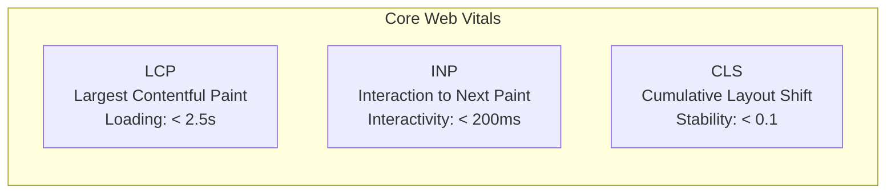
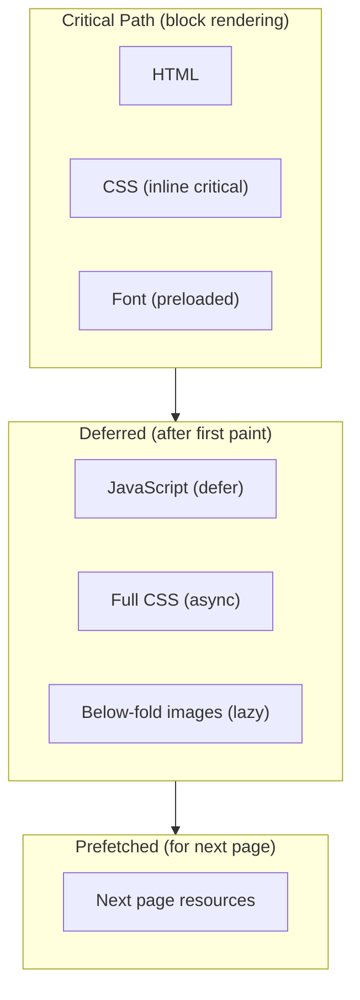

## Why Performance Matters

Every 100ms of latency costs 1% in sales (Amazon). A 1-second delay reduces conversions by 7%. Performance is not a feature — it's a requirement.



---

## Core Web Vitals

| Metric | Measures | Good | Needs Work | Poor |
|--------|----------|------|------------|------|
| **LCP** | Loading speed (largest element visible) | ≤ 2.5s | ≤ 4.0s | > 4.0s |
| **INP** | Responsiveness (input → visual update) | ≤ 200ms | ≤ 500ms | > 500ms |
| **CLS** | Visual stability (unexpected shifts) | ≤ 0.1 | ≤ 0.25 | > 0.25 |

### LCP (Largest Contentful Paint)

What counts as LCP element:

- `` elements
- `<video>` poster images
- Elements with `background-image`
- Block-level text elements

```html
<!-- Optimize LCP image -->


<!-- Preload LCP image -->
<link rel="preload" as="image" href="hero.jpg" fetchpriority="high">
```

### INP (Interaction to Next Paint)

```javascript
// BAD — long task blocks the main thread
button.addEventListener('click', () => {
    // 500ms of synchronous work
    const result = heavyComputation(data);
    updateUI(result);
});

// GOOD — yield to the browser between chunks
button.addEventListener('click', async () => {
    showSpinner();
    
    // Break work into chunks
    await scheduler.yield(); // or setTimeout(0)
    const result = heavyComputation(data);
    
    await scheduler.yield();
    updateUI(result);
    hideSpinner();
});
```

### CLS (Cumulative Layout Shift)

```css
/* ALWAYS set dimensions on images/video */
img, video {
    width: 100%;
    height: auto;
    aspect-ratio: 16 / 9; /* prevents shift before load */
}

/* Reserve space for dynamic content */
.ad-slot {
    min-height: 250px; /* known ad height */
}

/* Avoid inserting content above existing content */
.notification {
    position: fixed; /* doesn't shift page content */
    top: 0;
}
```

---

## Loading Performance

### Resource Loading Strategy



### Lazy Loading

```html
<!-- Native lazy loading for images -->


<!-- Intersection Observer for custom lazy loading -->
<div class="lazy-section" data-src="heavy-widget.js">
    <p>Loading...</p>
</div>
```

```javascript
// Lazy load components when visible
const observer = new IntersectionObserver((entries) => {
    entries.forEach(entry => {
        if (entry.isIntersecting) {
            loadComponent(entry.target);
            observer.unobserve(entry.target);
        }
    });
}, { rootMargin: '200px' }); // start loading 200px before visible

document.querySelectorAll('.lazy-section').forEach(el => observer.observe(el));
```

### Code Splitting

```javascript
// Dynamic import — load only when needed
const module = await import('./heavy-feature.js');

// Route-based splitting (framework example)
const routes = [
    { path: '/', component: () => import('./pages/Home.vue') },
    { path: '/dashboard', component: () => import('./pages/Dashboard.vue') },
];
```

---

## Rendering Performance

### Avoid Long Tasks

The main thread must respond to user input within 50ms. Any task longer than 50ms is a "long task" that blocks interactivity.

```javascript
// Break up long tasks
async function processLargeList(items) {
    const CHUNK_SIZE = 100;
    
    for (let i = 0; i < items.length; i += CHUNK_SIZE) {
        const chunk = items.slice(i, i + CHUNK_SIZE);
        processChunk(chunk);
        
        // Yield to browser between chunks
        await new Promise(resolve => setTimeout(resolve, 0));
    }
}

// Use requestIdleCallback for non-urgent work
requestIdleCallback((deadline) => {
    while (deadline.timeRemaining() > 0 && tasks.length > 0) {
        performTask(tasks.shift());
    }
});
```

### Efficient DOM Updates

```javascript
// BAD — multiple reflows
items.forEach(item => {
    const el = document.createElement('div');
    el.textContent = item.name;
    container.appendChild(el); // reflow on each append!
});

// GOOD — batch with DocumentFragment
const fragment = document.createDocumentFragment();
items.forEach(item => {
    const el = document.createElement('div');
    el.textContent = item.name;
    fragment.appendChild(el);
});
container.appendChild(fragment); // single reflow

// BEST — innerHTML for large lists (fastest)
container.innerHTML = items.map(item => `<div>${item.name}</div>`).join('');
```

### CSS Containment

```css
/* Tell browser this element's internals don't affect outside */
.widget {
    contain: layout style paint;
    /* layout: geometry changes don't affect siblings
       style: counters/properties don't leak
       paint: children don't paint outside bounds */
}

/* content-visibility: skip rendering off-screen content */
.below-fold-section {
    content-visibility: auto;
    contain-intrinsic-size: 0 500px; /* estimated height */
}
```

---

## Network Performance

### Compression

| Format | Compression | Browser Support |
|--------|-------------|-----------------|
| gzip | Good (70-80% reduction) | Universal |
| Brotli | Better (15-20% smaller than gzip) | Modern browsers |

### Caching Strategy

```text
Cache-Control: public, max-age=31536000, immutable
```

| Resource | Strategy |
|----------|----------|
| HTML | `no-cache` (always revalidate) |
| CSS/JS (hashed filenames) | `max-age=31536000, immutable` |
| Images | `max-age=86400` (1 day) |
| Fonts | `max-age=31536000, immutable` |
| API responses | `no-store` or short `max-age` |

### Image Optimization

| Format | Best For | Compression |
|--------|----------|-------------|
| AVIF | Photos, complex images | Best (50% smaller than JPEG) |
| WebP | Photos, illustrations | Good (25-35% smaller than JPEG) |
| JPEG | Photos (fallback) | Acceptable |
| PNG | Transparency, screenshots | Lossless |
| SVG | Icons, logos, illustrations | Vector (scales infinitely) |

```html
<picture>
    <source type="image/avif" srcset="photo.avif">
    <source type="image/webp" srcset="photo.webp">
    
</picture>
```

---

## Measuring Performance

### Tools

| Tool | Type | Use Case |
|------|------|----------|
| Lighthouse | Lab | Audit scores, recommendations |
| Chrome DevTools Performance | Lab | Flame charts, long tasks |
| WebPageTest | Lab | Waterfall, filmstrip, comparison |
| Chrome UX Report (CrUX) | Field | Real user data (Core Web Vitals) |
| web-vitals library | Field | Measure CWV in production |

### Performance Budget

```json
{
    "budgets": [
        {
            "resourceType": "script",
            "budget": 300
        },
        {
            "resourceType": "stylesheet",
            "budget": 100
        },
        {
            "resourceType": "image",
            "budget": 500
        },
        {
            "metric": "lcp",
            "budget": 2500
        },
        {
            "metric": "cls",
            "budget": 0.1
        }
    ]
}
```

---

## Performance Checklist

### Loading

- [ ] Critical CSS inlined
- [ ] JavaScript deferred (`defer` attribute)
- [ ] Images lazy-loaded (`loading="lazy"`)
- [ ] LCP image preloaded with `fetchpriority="high"`
- [ ] Fonts preloaded, `font-display: swap`
- [ ] Code split by route
- [ ] Resources compressed (Brotli)
- [ ] Static assets cached with hashed filenames

### Rendering

- [ ] Animations use `transform`/`opacity` only
- [ ] No layout thrashing (batch reads/writes)
- [ ] Long tasks broken into chunks (< 50ms)
- [ ] `content-visibility: auto` for off-screen content
- [ ] Images have explicit `width`/`height` (prevent CLS)

### Network

- [ ] HTTP/2 or HTTP/3 enabled
- [ ] Images in modern formats (AVIF/WebP)
- [ ] Appropriate cache headers per resource type
- [ ] Third-party scripts audited and minimized

---

## Key Takeaways

1. **Core Web Vitals are the standard** — LCP < 2.5s, INP < 200ms, CLS < 0.1
2. **Inline critical CSS, defer everything else** — first paint should not wait for full CSS/JS
3. **Lazy load below-the-fold content** — images, components, and heavy scripts
4. **Animate only `transform` and `opacity`** — everything else triggers expensive layout/paint
5. **Break long tasks** — yield to the browser every 50ms to keep the page responsive
6. **Set explicit dimensions on media** — prevents layout shifts (CLS)
7. **Measure in the field** — lab tools show potential; real user metrics show reality
