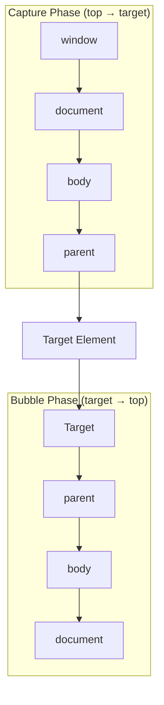

## The Browser as a Platform

Modern browsers expose hundreds of APIs beyond the DOM. These APIs enable features that previously required native apps — offline storage, push notifications, geolocation, hardware access, and more.

---

## DOM Manipulation

### Querying Elements

```javascript
// Modern selectors (CSS syntax)
const el = document.querySelector('.card');           // first match
const all = document.querySelectorAll('.card');       // NodeList (not live)
const closest = el.closest('.container');             // nearest ancestor

// By ID (fastest)
const header = document.getElementById('header');

// Traversal
el.parentElement;
el.children;              // HTMLCollection (live)
el.nextElementSibling;
el.previousElementSibling;
```

### Creating and Modifying

```javascript
// Create
const div = document.createElement('div');
div.className = 'card';
div.textContent = 'Hello';
div.dataset.id = '123';  // data-id="123"

// Insert
container.appendChild(div);
container.prepend(div);                    // first child
container.insertBefore(div, referenceEl);
referenceEl.after(newEl);                  // after sibling
referenceEl.before(newEl);                 // before sibling

// Remove
el.remove();

// Clone
const clone = el.cloneNode(true); // deep clone

// Attributes
el.setAttribute('aria-expanded', 'true');
el.getAttribute('data-id');
el.removeAttribute('hidden');
el.toggleAttribute('disabled');

// Classes
el.classList.add('active', 'visible');
el.classList.remove('hidden');
el.classList.toggle('open');
el.classList.contains('active');  // boolean
el.classList.replace('old', 'new');
```

---

## Events

### Event Flow



```javascript
// Bubbling (default) — event travels UP from target
parent.addEventListener('click', (e) => {
    console.log('Parent clicked');
    console.log('Actual target:', e.target);       // element clicked
    console.log('Handler on:', e.currentTarget);   // element with listener
});

// Capture — event travels DOWN to target
parent.addEventListener('click', handler, { capture: true });

// Stop propagation
child.addEventListener('click', (e) => {
    e.stopPropagation(); // prevents bubbling to parent
});

// Prevent default behavior
link.addEventListener('click', (e) => {
    e.preventDefault(); // don't navigate
});
```

### Event Delegation

Instead of attaching listeners to every child, attach one to the parent:

```javascript
// BAD — 1000 listeners for 1000 items
items.forEach(item => {
    item.addEventListener('click', handleClick);
});

// GOOD — 1 listener using delegation
list.addEventListener('click', (e) => {
    const item = e.target.closest('.list-item');
    if (!item) return;
    handleClick(item);
});
```

### Custom Events

```javascript
// Dispatch custom event
const event = new CustomEvent('user:login', {
    detail: { userId: '123', name: 'Alice' },
    bubbles: true,
    composed: true  // crosses shadow DOM boundaries
});
element.dispatchEvent(event);

// Listen
document.addEventListener('user:login', (e) => {
    console.log(e.detail.name); // "Alice"
});
```

---

## Fetch API

```javascript
// GET request
const response = await fetch('/api/users');
if (!response.ok) throw new Error(`HTTP ${response.status}`);
const users = await response.json();

// POST with JSON body
const response = await fetch('/api/users', {
    method: 'POST',
    headers: { 'Content-Type': 'application/json' },
    body: JSON.stringify({ name: 'Alice', email: 'alice@example.com' }),
});

// With AbortController (cancellation)
const controller = new AbortController();
setTimeout(() => controller.abort(), 5000); // 5s timeout

try {
    const response = await fetch('/api/slow', { signal: controller.signal });
} catch (err) {
    if (err.name === 'AbortError') console.log('Request cancelled');
}

// Streaming response
const response = await fetch('/api/large-file');
const reader = response.body.getReader();
const decoder = new TextDecoder();

while (true) {
    const { done, value } = await reader.read();
    if (done) break;
    console.log(decoder.decode(value, { stream: true }));
}
```

---

## Storage APIs

| API | Capacity | Persistence | Sync/Async | Use Case |
|-----|----------|-------------|------------|----------|
| `localStorage` | ~5-10 MB | Permanent | Sync | User preferences, tokens |
| `sessionStorage` | ~5-10 MB | Tab lifetime | Sync | Form state, temp data |
| `IndexedDB` | Hundreds of MB | Permanent | Async | Large datasets, offline |
| `Cache API` | Hundreds of MB | Permanent | Async | HTTP response caching |
| Cookies | ~4 KB | Configurable | Sync | Auth tokens (httpOnly) |

```javascript
// localStorage
localStorage.setItem('theme', 'dark');
const theme = localStorage.getItem('theme');
localStorage.removeItem('theme');

// IndexedDB (simplified with idb library)
import { openDB } from 'idb';

const db = await openDB('myApp', 1, {
    upgrade(db) {
        const store = db.createObjectStore('users', { keyPath: 'id' });
        store.createIndex('email', 'email', { unique: true });
    }
});

await db.put('users', { id: '1', name: 'Alice', email: 'alice@test.com' });
const user = await db.get('users', '1');
const allUsers = await db.getAll('users');
```

---

## Intersection Observer

Efficiently detect when elements enter/exit the viewport:

```javascript
const observer = new IntersectionObserver((entries) => {
    entries.forEach(entry => {
        if (entry.isIntersecting) {
            entry.target.classList.add('visible');
            // Lazy load, animate, track impression
        }
    });
}, {
    root: null,          // viewport
    rootMargin: '0px',   // expand/shrink observation area
    threshold: [0, 0.5, 1.0]  // trigger at 0%, 50%, 100% visible
});

document.querySelectorAll('.animate-on-scroll').forEach(el => {
    observer.observe(el);
});
```

### Use Cases

- Lazy loading images/components
- Infinite scroll
- Scroll-triggered animations
- Analytics (impression tracking)
- Sticky header detection

---

## Resize Observer

Detect when an element's size changes (not just the viewport):

```javascript
const observer = new ResizeObserver((entries) => {
    for (const entry of entries) {
        const { width, height } = entry.contentRect;
        if (width < 400) {
            entry.target.classList.add('compact');
        } else {
            entry.target.classList.remove('compact');
        }
    }
});

observer.observe(document.querySelector('.widget'));
```

---

## Web Workers

Run JavaScript in a background thread (no DOM access):

```javascript
// main.js
const worker = new Worker('./worker.js');

worker.postMessage({ data: largeDataset, operation: 'sort' });

worker.onmessage = (e) => {
    console.log('Sorted:', e.data.result);
};

// worker.js
self.onmessage = (e) => {
    const { data, operation } = e.data;
    
    if (operation === 'sort') {
        const result = data.sort((a, b) => a - b); // CPU-intensive
        self.postMessage({ result });
    }
};
```

---

## History API and Routing

```javascript
// Push new state (changes URL without page reload)
history.pushState({ page: 'products' }, '', '/products');

// Replace current state
history.replaceState({ page: 'home' }, '', '/');

// Listen for back/forward navigation
window.addEventListener('popstate', (e) => {
    console.log('Navigated to:', location.pathname);
    console.log('State:', e.state);
    renderPage(e.state);
});
```

---

## Clipboard API

```javascript
// Write to clipboard
await navigator.clipboard.writeText('Copied text');

// Read from clipboard
const text = await navigator.clipboard.readText();

// Copy rich content
const blob = new Blob(['<b>Bold text</b>'], { type: 'text/html' });
await navigator.clipboard.write([
    new ClipboardItem({ 'text/html': blob })
]);
```

---

## Geolocation

```javascript
// One-time position
navigator.geolocation.getCurrentPosition(
    (pos) => {
        console.log(pos.coords.latitude, pos.coords.longitude);
        console.log(pos.coords.accuracy); // meters
    },
    (err) => console.error(err.message),
    { enableHighAccuracy: true, timeout: 5000 }
);

// Watch position (continuous)
const watchId = navigator.geolocation.watchPosition(callback);
navigator.geolocation.clearWatch(watchId);
```

---

## Key Takeaways

1. **Event delegation** — one listener on a parent beats N listeners on children
2. **Intersection Observer for visibility** — replaces scroll event listeners (much more efficient)
3. **IndexedDB for large client-side data** — localStorage is limited to ~5MB and is synchronous
4. **Web Workers for CPU work** — keep the main thread free for user interaction
5. **Fetch with AbortController** — always implement timeouts and cancellation
6. **`closest()` for event delegation** — find the relevant ancestor from the event target
7. **Custom Events for decoupling** — components communicate without direct references
