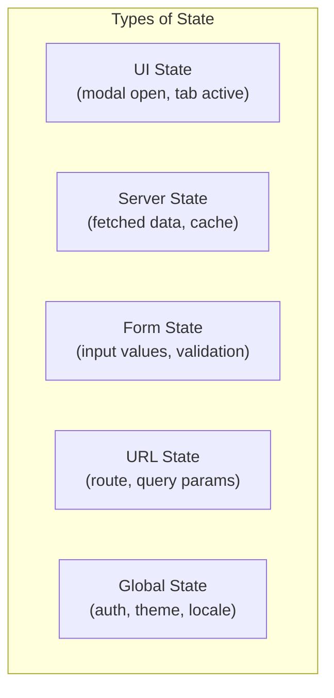
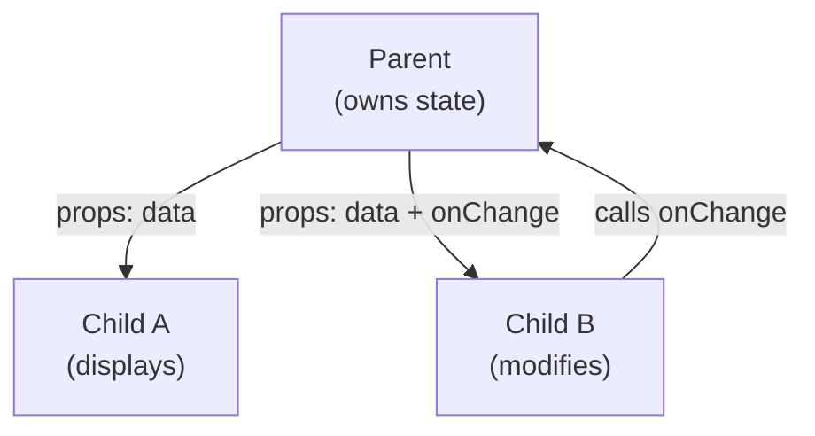
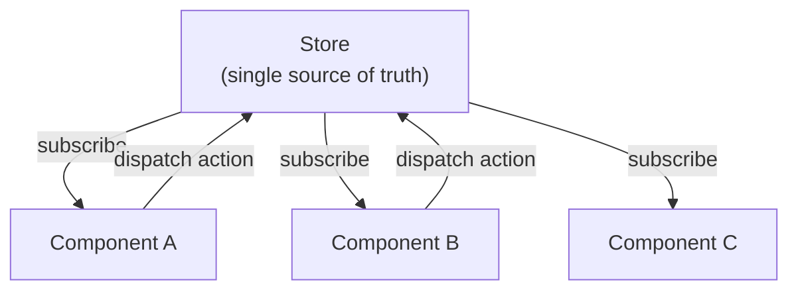
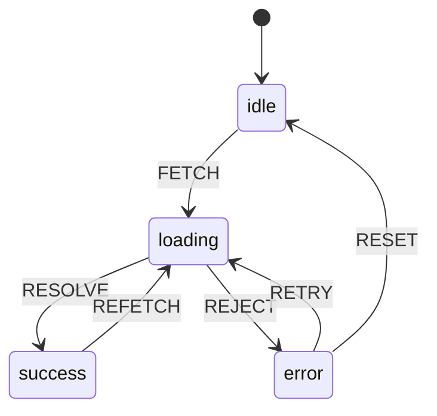

## What Is State?

State is any data that changes over time and affects what the user sees. Managing state well is the central challenge of frontend development — most bugs are state bugs.



---

## Local Component State

The simplest form — state lives inside a single component:

```javascript
// Vanilla JS
class Counter {
    #count = 0;
    #element;
    
    constructor(element) {
        this.#element = element;
        this.render();
        element.querySelector('button').addEventListener('click', () => {
            this.#count++;
            this.render();
        });
    }
    
    render() {
        this.#element.querySelector('.count').textContent = this.#count;
    }
}

// Vue 3 (Composition API)
const count = ref(0);
const increment = () => count.value++;

// React
const [count, setCount] = useState(0);
const increment = () => setCount(c => c + 1);
```

### When Local State Is Enough

- Toggle visibility (modal, dropdown)
- Form input values
- Animation state
- Component-specific UI (selected tab, expanded section)

---

## Lifting State Up

When siblings need to share state, lift it to their common parent:



```javascript
// Parent owns the state
function ProductPage() {
    const [selectedSize, setSelectedSize] = useState(null);
    
    return (
        <>
            <SizeSelector 
                selected={selectedSize} 
                onChange={setSelectedSize} 
            />
            <AddToCart 
                size={selectedSize} 
                disabled={!selectedSize} 
            />
        </>
    );
}
```

**Problem:** When state needs to be shared across many levels, "prop drilling" makes code verbose and fragile.

---

## Global State (Store Pattern)

A centralized store holds shared state accessible from anywhere:



### Pinia (Vue)

```javascript
// stores/cart.store.ts
import { defineStore } from 'pinia';

export const useCartStore = defineStore('cart', () => {
    const items = ref([]);
    
    const total = computed(() => 
        items.value.reduce((sum, item) => sum + item.price * item.quantity, 0)
    );
    
    const itemCount = computed(() => 
        items.value.reduce((sum, item) => sum + item.quantity, 0)
    );
    
    function addItem(product, quantity = 1) {
        const existing = items.value.find(i => i.id === product.id);
        if (existing) {
            existing.quantity += quantity;
        } else {
            items.value.push({ ...product, quantity });
        }
    }
    
    function removeItem(productId) {
        items.value = items.value.filter(i => i.id !== productId);
    }
    
    function clear() {
        items.value = [];
    }
    
    return { items, total, itemCount, addItem, removeItem, clear };
});

// Usage in component
const cart = useCartStore();
cart.addItem({ id: '1', name: 'Shirt', price: 29.99 });
console.log(cart.total); // 29.99
```

### Redux Pattern (React)

```javascript
// Reducer — pure function: (state, action) → newState
function cartReducer(state = { items: [] }, action) {
    switch (action.type) {
        case 'cart/addItem':
            return { ...state, items: [...state.items, action.payload] };
        case 'cart/removeItem':
            return { ...state, items: state.items.filter(i => i.id !== action.payload) };
        case 'cart/clear':
            return { ...state, items: [] };
        default:
            return state;
    }
}

// Dispatch actions
store.dispatch({ type: 'cart/addItem', payload: { id: '1', name: 'Shirt' } });
```

---

## Server State

Server state is fundamentally different from client state — it's asynchronous, shared, and can become stale.

### Challenges

| Challenge | Solution |
|-----------|----------|
| Loading states | Show skeleton/spinner |
| Error states | Retry, fallback UI |
| Caching | Store responses, invalidate on mutation |
| Stale data | Background refetch, polling |
| Deduplication | Don't fetch same data twice |
| Optimistic updates | Update UI before server confirms |

### Data Fetching Libraries

```javascript
// TanStack Query (React) / Vue Query
const { data, isLoading, error, refetch } = useQuery({
    queryKey: ['users', userId],
    queryFn: () => fetchUser(userId),
    staleTime: 5 * 60 * 1000,  // consider fresh for 5 min
    gcTime: 30 * 60 * 1000,    // keep in cache for 30 min
    retry: 3,
});

// Mutations with optimistic update
const mutation = useMutation({
    mutationFn: updateUser,
    onMutate: async (newData) => {
        // Cancel outgoing refetches
        await queryClient.cancelQueries({ queryKey: ['users', userId] });
        
        // Snapshot previous value
        const previous = queryClient.getQueryData(['users', userId]);
        
        // Optimistically update
        queryClient.setQueryData(['users', userId], newData);
        
        return { previous };
    },
    onError: (err, newData, context) => {
        // Rollback on error
        queryClient.setQueryData(['users', userId], context.previous);
    },
    onSettled: () => {
        // Refetch to ensure consistency
        queryClient.invalidateQueries({ queryKey: ['users', userId] });
    },
});
```

---

## URL State

The URL is state that the user can bookmark, share, and navigate with browser buttons:

```javascript
// Read URL state
const url = new URL(window.location.href);
const page = url.searchParams.get('page') || '1';
const filter = url.searchParams.get('filter') || 'all';

// Update URL state (without page reload)
function updateFilters(newFilter) {
    const url = new URL(window.location.href);
    url.searchParams.set('filter', newFilter);
    history.pushState({}, '', url);
    applyFilter(newFilter);
}

// Sync URL → component state on load and popstate
window.addEventListener('popstate', () => {
    const params = new URLSearchParams(location.search);
    applyFilter(params.get('filter'));
});
```

### What Belongs in the URL

| In URL | Not in URL |
|--------|-----------|
| Current page/route | Modal open/closed |
| Search query | Form input (before submit) |
| Active filters | Hover state |
| Sort order | Loading state |
| Selected tab (if shareable) | Authentication token |
| Pagination | Temporary UI state |

---

## State Machines

For complex UI flows with well-defined states and transitions:



```javascript
// Simple state machine
function createMachine(config) {
    let current = config.initial;
    
    return {
        get state() { return current; },
        
        send(event) {
            const transition = config.states[current]?.on?.[event];
            if (transition) {
                current = transition;
                config.states[current]?.entry?.();
            }
        }
    };
}

const fetchMachine = createMachine({
    initial: 'idle',
    states: {
        idle: { on: { FETCH: 'loading' } },
        loading: { 
            on: { RESOLVE: 'success', REJECT: 'error' },
            entry: () => console.log('Loading started')
        },
        success: { on: { REFETCH: 'loading' } },
        error: { on: { RETRY: 'loading', RESET: 'idle' } },
    }
});

fetchMachine.send('FETCH');   // → loading
fetchMachine.send('RESOLVE'); // → success
```

---

## Derived State (Computed/Selectors)

Never store what you can compute:

```javascript
// BAD — storing derived state (gets out of sync)
const state = {
    items: [{ price: 10, qty: 2 }, { price: 5, qty: 3 }],
    total: 35,      // redundant! must update manually
    itemCount: 5,   // redundant!
};

// GOOD — compute on demand
const state = {
    items: [{ price: 10, qty: 2 }, { price: 5, qty: 3 }],
};

const total = computed(() => 
    state.items.reduce((sum, i) => sum + i.price * i.qty, 0)
);

const itemCount = computed(() => 
    state.items.reduce((sum, i) => sum + i.qty, 0)
);
```

---

## Choosing the Right Approach

| State Type | Solution |
|-----------|----------|
| Component-local UI | `ref()` / `useState()` |
| Shared between siblings | Lift state to parent |
| App-wide (auth, theme) | Global store (Pinia, Redux) |
| Server data | Data fetching library (TanStack Query) |
| URL-driven (filters, pagination) | URL search params |
| Complex flows (checkout, wizard) | State machine |
| Form state | Form library (VeeValidate, React Hook Form) |

---

## Key Takeaways

1. **Keep state as local as possible** — only lift/globalize when truly needed
2. **Server state ≠ client state** — use dedicated libraries (TanStack Query) for caching, refetching, deduplication
3. **URL is state** — anything the user should be able to bookmark or share belongs in the URL
4. **Never store derived state** — compute it from source state (computed/selectors)
5. **State machines for complex flows** — explicit states and transitions prevent impossible states
6. **Optimistic updates for perceived speed** — update UI immediately, rollback on error
7. **Single source of truth** — every piece of state should have exactly one owner
