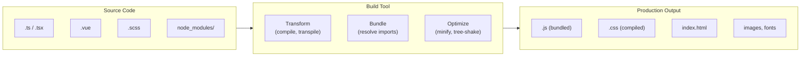
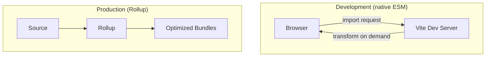
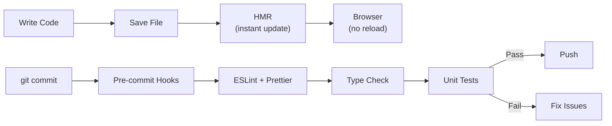

## Why Build Tools Exist

Browsers understand HTML, CSS, and JavaScript. But modern frontend development uses TypeScript, SCSS, JSX, Vue SFCs, and npm packages that browsers can't run directly. Build tools bridge this gap.



---

## What Build Tools Do

| Task | What | Why |
|------|------|-----|
| **Transpile** | TypeScript → JavaScript, JSX → JS | Browser compatibility |
| **Bundle** | Combine modules into fewer files | Reduce HTTP requests |
| **Tree-shake** | Remove unused code | Smaller bundles |
| **Minify** | Remove whitespace, shorten names | Smaller file size |
| **Code-split** | Split into chunks loaded on demand | Faster initial load |
| **Compile CSS** | SCSS → CSS, PostCSS transforms | Developer ergonomics |
| **Optimize assets** | Compress images, inline small files | Performance |
| **Dev server** | Hot Module Replacement (HMR) | Fast feedback loop |

---

## Vite

The modern standard for frontend development. Uses esbuild for dev (fast) and Rollup for production (optimized).

### How Vite Works



**Dev mode:** No bundling! Vite serves files as native ES modules. The browser requests each import, and Vite transforms it on-the-fly. This makes startup instant regardless of app size.

**Production:** Rollup bundles everything with tree-shaking, code-splitting, and minification.

### Configuration

```typescript
// vite.config.ts
import { defineConfig } from 'vite';
import vue from '@vitejs/plugin-vue';
import { resolve } from 'path';

export default defineConfig({
    plugins: [vue()],
    
    resolve: {
        alias: {
            '@': resolve(__dirname, 'src'),
        }
    },
    
    css: {
        preprocessorOptions: {
            scss: {
                additionalData: `@use "@/styles/variables" as *;`
            }
        }
    },
    
    build: {
        target: 'es2022',
        rollupOptions: {
            output: {
                manualChunks: {
                    vendor: ['vue', 'pinia', 'vue-router'],
                }
            }
        }
    },
    
    server: {
        port: 3000,
        proxy: {
            '/api': {
                target: 'http://localhost:8080',
                changeOrigin: true,
            }
        }
    }
});
```

---

## Linting and Formatting

### ESLint (Code Quality)

```javascript
// eslint.config.js (flat config — ESLint 9+)
import js from '@eslint/js';
import tseslint from 'typescript-eslint';
import vue from 'eslint-plugin-vue';

export default [
    js.configs.recommended,
    ...tseslint.configs.recommended,
    ...vue.configs['flat/recommended'],
    {
        rules: {
            'no-console': 'warn',
            '@typescript-eslint/no-unused-vars': 'error',
            'vue/multi-word-component-names': 'off',
        }
    }
];
```

### Prettier (Formatting)

```json
// .prettierrc
{
    "semi": true,
    "singleQuote": true,
    "tabWidth": 4,
    "trailingComma": "all",
    "printWidth": 100
}
```

### Stylelint (CSS Quality)

```json
// .stylelintrc.json
{
    "extends": [
        "stylelint-config-standard-scss",
        "stylelint-config-recommended-vue/scss"
    ],
    "rules": {
        "selector-class-pattern": "^[a-z][a-z0-9]*(-[a-z0-9]+)*(__[a-z0-9]+(-[a-z0-9]+)*)?(--[a-z0-9]+(-[a-z0-9]+)*)?$"
    }
}
```

---

## Git Hooks (Pre-commit Quality Gates)

```json
// package.json
{
    "scripts": {
        "prepare": "husky"
    },
    "lint-staged": {
        "*.{ts,tsx,vue}": ["eslint --fix", "prettier --write"],
        "*.{scss,css}": ["stylelint --fix", "prettier --write"],
        "*.{json,md}": ["prettier --write"]
    }
}
```

```bash
# .husky/pre-commit
npx lint-staged

# .husky/commit-msg
npx commitlint --edit $1
```

---

## PostCSS

PostCSS transforms CSS with plugins — it's the "Babel for CSS":

```javascript
// postcss.config.js
export default {
    plugins: {
        'postcss-preset-env': {
            stage: 2,
            features: {
                'nesting-rules': true,
                'custom-media-queries': true,
            }
        },
        'autoprefixer': {},
        'cssnano': { preset: 'default' }  // minification (production only)
    }
};
```

### CSS Nesting (Native, via PostCSS for older browsers)

```css
.card {
    padding: 1rem;
    
    & .title {
        font-size: 1.5rem;
    }
    
    &:hover {
        box-shadow: var(--shadow-md);
    }
    
    @media (min-width: 768px) {
        padding: 2rem;
    }
}
```

---

## Environment Variables

```bash
# .env
VITE_API_URL=http://localhost:8080
VITE_APP_TITLE=My App

# .env.production
VITE_API_URL=https://api.example.com
```

```typescript
// Access in code (only VITE_ prefixed vars are exposed)
const apiUrl = import.meta.env.VITE_API_URL;
const isDev = import.meta.env.DEV;
const isProd = import.meta.env.PROD;
const mode = import.meta.env.MODE; // 'development' | 'production'
```

---

## Monorepo Tooling

### npm Workspaces

```json
{
    "workspaces": ["packages/*", "apps/*"]
}
```

### Turborepo (Task Runner)

```json
// turbo.json
{
    "tasks": {
        "build": {
            "dependsOn": ["^build"],
            "outputs": ["dist/**"]
        },
        "test": {
            "dependsOn": ["build"]
        },
        "lint": {}
    }
}
```

```bash
# Run build in all packages (respects dependency order)
npx turbo build

# Run tests only in changed packages
npx turbo test --filter=...[HEAD~1]
```

---

## Development Workflow



### Hot Module Replacement (HMR)

HMR updates modules in the browser without a full page reload, preserving application state:

```javascript
// Vite handles HMR automatically for:
// - Vue SFCs (.vue files)
// - CSS/SCSS imports
// - TypeScript files

// Custom HMR (rare — for library authors)
if (import.meta.hot) {
    import.meta.hot.accept('./module.js', (newModule) => {
        // Handle the updated module
    });
}
```

---

## Production Build Checklist

- [ ] Tree-shaking enabled (dead code removed)
- [ ] Code-split by route (dynamic imports)
- [ ] CSS extracted and minified
- [ ] JavaScript minified (terser/esbuild)
- [ ] Source maps generated (for error tracking)
- [ ] Assets hashed (cache busting)
- [ ] Images optimized (WebP/AVIF)
- [ ] Gzip/Brotli compression configured on server
- [ ] Bundle size analyzed (`npx vite-bundle-visualizer`)

---

## Key Takeaways

1. **Vite for new projects** — instant dev server, optimized production builds
2. **ESLint for bugs, Prettier for formatting** — don't mix their responsibilities
3. **Pre-commit hooks enforce quality** — lint-staged runs only on changed files (fast)
4. **Environment variables with `VITE_` prefix** — only prefixed vars are exposed to client code
5. **Code-split at route boundaries** — `() => import('./Page.vue')` loads pages on demand
6. **HMR preserves state** — no more losing form data on every save
7. **Analyze your bundle** — know what's in it; large dependencies should be lazy-loaded or replaced
