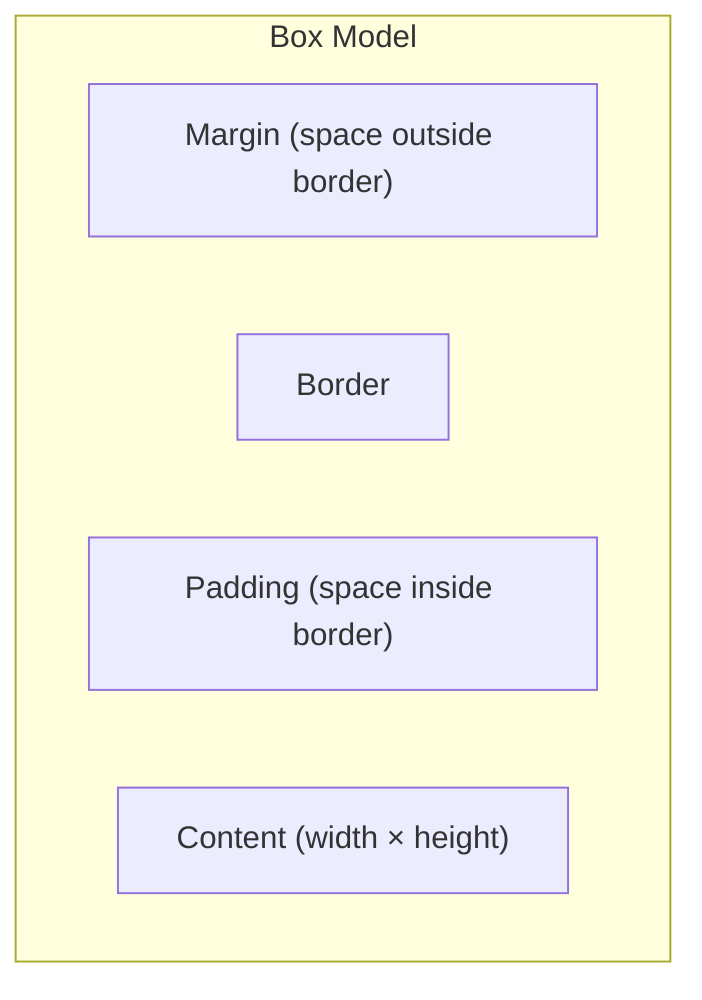
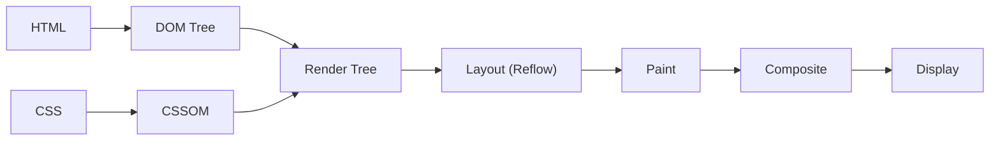
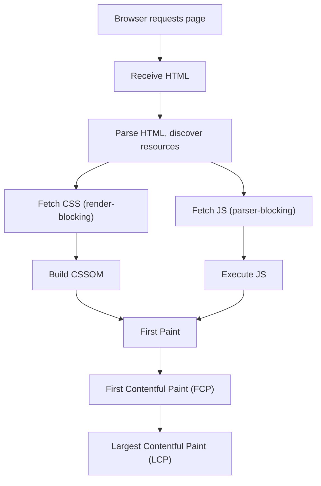
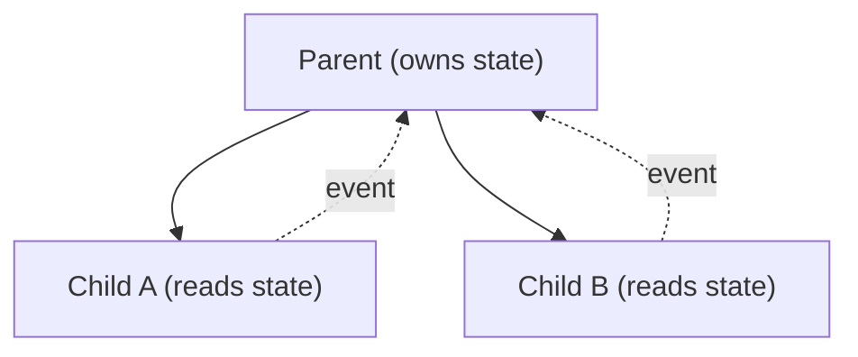
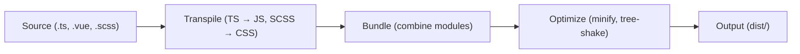

Frontend development is about building user interfaces that run in the browser. It combines HTML (structure), CSS (presentation), and JavaScript (behavior) to create interactive experiences. This path focuses on CSS, browser APIs, and the rendering pipeline — the JS language itself is covered in the JavaScript/TypeScript path.

## Prerequisites

- HTML basics (tags, attributes, document structure)
- JavaScript fundamentals (DOM manipulation, events)
- Programming Logic

---

## 1. HTML Semantics and Accessibility

### Semantic HTML

Semantic elements convey meaning to browsers, screen readers, and search engines:

```html
<!-- Bad — divs everywhere ("div soup") -->
<div class="header">
    <div class="nav">...</div>
</div>
<div class="main">
    <div class="article">...</div>
    <div class="sidebar">...</div>
</div>

<!-- Good — semantic elements -->
<header>
    <nav aria-label="Main navigation">...</nav>
</header>
<main>
    <article>...</article>
    <aside>...</aside>
</main>
<footer>...</footer>
```

### Key Semantic Elements

| Element | Purpose |
|---------|---------|
| `<header>` | Introductory content, navigation |
| `<nav>` | Navigation links |
| `<main>` | Primary content (one per page) |
| `<article>` | Self-contained content |
| `<section>` | Thematic grouping |
| `<aside>` | Tangentially related content |
| `<footer>` | Footer information |
| `<figure>` / `<figcaption>` | Illustrations with captions |
| `<time>` | Machine-readable dates |
| `<mark>` | Highlighted text |

### ARIA (Accessible Rich Internet Applications)

ARIA attributes add accessibility information when HTML semantics aren't sufficient:

```html
<!-- Role — what the element is -->
<div role="alert">Error: invalid email</div>

<!-- States — current condition -->
<button aria-expanded="false" aria-controls="menu">Menu</button>

<!-- Properties — relationships -->
<input aria-labelledby="name-label" aria-describedby="name-hint" />
<label id="name-label">Full Name</label>
<span id="name-hint">As it appears on your passport</span>

<!-- Live regions — announce dynamic changes -->
<div aria-live="polite" aria-atomic="true">
    3 items in cart
</div>
```

**First rule of ARIA:** Don't use ARIA if a native HTML element does the job. `<button>` is better than `<div role="button">`.

### Key Takeaway

Semantic HTML is the foundation of accessibility. Screen readers, search engines, and browser features all depend on correct semantics. ARIA fills gaps — it doesn't replace proper HTML.

---

## 2. CSS Fundamentals

### The Box Model

Every element is a rectangular box:



```css
.box {
    /* Content dimensions */
    width: 200px;
    height: 100px;
    
    /* Padding — inside the border */
    padding: 20px;
    
    /* Border */
    border: 2px solid #333;
    
    /* Margin — outside the border */
    margin: 16px;
    
    /* box-sizing changes how width/height are calculated */
    box-sizing: border-box; /* width includes padding + border */
    /* vs content-box (default): width is content only */
}
```

**Always use `box-sizing: border-box`** — it makes sizing predictable:

```css
*, *::before, *::after {
    box-sizing: border-box;
}
```

### Specificity

When multiple rules target the same element, specificity determines which wins:

| Selector | Specificity | Example |
|----------|-------------|---------|
| Inline style | 1,0,0,0 | `style="color: red"` |
| ID | 0,1,0,0 | `#header` |
| Class, attribute, pseudo-class | 0,0,1,0 | `.nav`, `[type="text"]`, `:hover` |
| Element, pseudo-element | 0,0,0,1 | `div`, `::before` |
| Universal | 0,0,0,0 | `*` |

```css
/* Specificity: 0,0,1,1 */
p.intro { color: blue; }

/* Specificity: 0,1,0,0 — wins */
#content { color: red; }

/* Specificity: 0,0,2,0 */
.nav .link { color: green; }
```

### The Cascade

When specificity is equal, the cascade determines the winner:

1. **Origin & importance** — `!important` > author > user > browser defaults
2. **Specificity** — higher wins
3. **Source order** — later declaration wins

### Key Takeaway

Understand the box model and specificity to debug layout issues. Use `border-box`, keep specificity low (prefer classes over IDs), and avoid `!important`.

---

## 3. Layout: Flexbox and Grid

### Flexbox — One-Dimensional Layout

Flexbox arranges items along a single axis (row or column):

```css
.container {
    display: flex;
    flex-direction: row;       /* main axis: horizontal */
    justify-content: space-between; /* distribute along main axis */
    align-items: center;       /* align along cross axis */
    gap: 16px;                 /* space between items */
    flex-wrap: wrap;           /* allow wrapping */
}

.item {
    flex: 1;                   /* grow to fill space equally */
    /* flex: grow shrink basis */
    flex: 0 0 200px;           /* don't grow, don't shrink, 200px wide */
}
```

**Flexbox alignment:**

```text
justify-content (main axis):
┌──────────────────────────────────────┐
│ [A]     [B]     [C]                  │  flex-start
│     [A]     [B]     [C]             │  center
│          [A]     [B]     [C]        │  flex-end
│ [A]         [B]         [C]         │  space-between
│   [A]      [B]      [C]            │  space-around
│   [A]     [B]     [C]              │  space-evenly
└──────────────────────────────────────┘
```

### CSS Grid — Two-Dimensional Layout

Grid handles rows AND columns simultaneously:

```css
.grid {
    display: grid;
    grid-template-columns: repeat(3, 1fr); /* 3 equal columns */
    grid-template-rows: auto 1fr auto;     /* header, content, footer */
    gap: 16px;
}

/* Named areas */
.layout {
    display: grid;
    grid-template-areas:
        "header header header"
        "sidebar main main"
        "footer footer footer";
    grid-template-columns: 250px 1fr 1fr;
    grid-template-rows: auto 1fr auto;
}

.header  { grid-area: header; }
.sidebar { grid-area: sidebar; }
.main    { grid-area: main; }
.footer  { grid-area: footer; }
```

### When to Use Which

| Scenario | Use |
|----------|-----|
| Navigation bar | Flexbox |
| Card grid | Grid |
| Centering one item | Flexbox |
| Full page layout | Grid |
| Items of unknown size in a row | Flexbox |
| Precise 2D placement | Grid |

### Positioning

```css
/* Static (default) — normal flow */
position: static;

/* Relative — offset from normal position, still in flow */
position: relative;
top: 10px; left: 20px;

/* Absolute — removed from flow, relative to nearest positioned ancestor */
position: absolute;
top: 0; right: 0;

/* Fixed — relative to viewport, stays on scroll */
position: fixed;
bottom: 20px; right: 20px;

/* Sticky — relative until scroll threshold, then fixed */
position: sticky;
top: 0; /* sticks when scrolled to top */
```

### Key Takeaway

Use Flexbox for one-dimensional layouts (rows or columns). Use Grid for two-dimensional layouts (rows and columns together). Avoid floats and absolute positioning for layout — they're for specific use cases, not general layout.

---

## 4. Responsive Design

### Media Queries

```css
/* Mobile-first approach: base styles are mobile */
.container {
    padding: 16px;
}

/* Tablet */
@media (min-width: 768px) {
    .container {
        padding: 24px;
        max-width: 720px;
        margin: 0 auto;
    }
}

/* Desktop */
@media (min-width: 1024px) {
    .container {
        max-width: 960px;
    }
}

/* Large desktop */
@media (min-width: 1280px) {
    .container {
        max-width: 1200px;
    }
}
```

### Fluid Typography

```css
/* clamp(min, preferred, max) */
h1 {
    font-size: clamp(1.5rem, 4vw, 3rem);
    /* Never smaller than 1.5rem, never larger than 3rem */
    /* Scales with viewport width in between */
}

body {
    font-size: clamp(1rem, 0.9rem + 0.5vw, 1.25rem);
}
```

### Container Queries

Style based on the container's size, not the viewport:

```css
.card-container {
    container-type: inline-size;
    container-name: card;
}

@container card (min-width: 400px) {
    .card {
        display: grid;
        grid-template-columns: 150px 1fr;
    }
}

@container card (max-width: 399px) {
    .card {
        display: flex;
        flex-direction: column;
    }
}
```

### Responsive Images

```html
<!-- srcset for resolution switching -->


<!-- picture for art direction -->
<picture>
    <source media="(min-width: 1024px)" srcset="hero-wide.jpg" />
    <source media="(min-width: 768px)" srcset="hero-medium.jpg" />
    
</picture>
```

### Key Takeaway

Design mobile-first, enhance for larger screens. Use `clamp()` for fluid sizing, container queries for component-level responsiveness, and `srcset` for image optimization.

---

## 5. CSS Architecture

### BEM (Block Element Modifier)

```css
/* Block — standalone component */
.card { }

/* Element — part of a block (double underscore) */
.card__title { }
.card__image { }
.card__body { }

/* Modifier — variation (double hyphen) */
.card--featured { }
.card__title--large { }
```

```html
<article class="card card--featured">
    
    <h2 class="card__title card__title--large">Title</h2>
    <p class="card__body">Content</p>
</article>
```

### CSS Modules

Scoped CSS — class names are locally scoped by default:

```css
/* Button.module.css */
.button {
    padding: 8px 16px;
    border-radius: 4px;
}
.primary {
    background: blue;
    color: white;
}
```

```javascript
import styles from './Button.module.css';
// styles.button → "Button_button_x7ks2" (unique hash)
```

### Utility-First (Tailwind approach)

```html
<button class="px-4 py-2 bg-blue-500 text-white rounded hover:bg-blue-600">
    Click me
</button>
```

### When to Use What

| Approach | Best For |
|----------|----------|
| BEM | Large teams, design systems, long-lived projects |
| CSS Modules | Component-based frameworks (React, Vue) |
| Utility-first | Rapid prototyping, small teams, consistent design |

### Key Takeaway

Pick one methodology and be consistent. BEM scales well for large teams. CSS Modules eliminate specificity wars. Utility-first trades readability for speed.

---

## 6. Browser Rendering Pipeline



### Stages

| Stage | What Happens | Expensive? |
|-------|-------------|------------|
| **Parse** | HTML → DOM, CSS → CSSOM | Moderate |
| **Style** | Match CSS rules to DOM nodes | Moderate |
| **Layout** | Calculate position and size of every element | Yes |
| **Paint** | Fill pixels (colors, borders, shadows, text) | Yes |
| **Composite** | Combine layers, apply transforms | Cheap (GPU) |

### What Triggers What

| Property Change | Triggers |
|----------------|----------|
| `width`, `height`, `margin`, `padding` | Layout → Paint → Composite |
| `color`, `background`, `box-shadow` | Paint → Composite |
| `transform`, `opacity` | Composite only (cheapest!) |

### Optimization Rules

```css
/* Promote to own layer for cheap animations */
.animated {
    will-change: transform;
    /* or: transform: translateZ(0); */
}

/* Animate only transform and opacity for 60fps */
.card {
    transition: transform 0.3s ease, opacity 0.3s ease;
}
.card:hover {
    transform: scale(1.05);
    opacity: 0.9;
}

/* Avoid: animating width, height, top, left — triggers layout */
```

### Key Takeaway

The rendering pipeline determines performance. Animate `transform` and `opacity` (composite-only) for smooth 60fps animations. Avoid triggering layout in animations.

---

## 7. Performance

### Critical Rendering Path



### Core Web Vitals

| Metric | Measures | Good | Poor |
|--------|----------|------|------|
| **LCP** (Largest Contentful Paint) | Loading | < 2.5s | > 4.0s |
| **INP** (Interaction to Next Paint) | Interactivity | < 200ms | > 500ms |
| **CLS** (Cumulative Layout Shift) | Visual stability | < 0.1 | > 0.25 |

### Optimization Techniques

```html
<!-- Preload critical resources -->
<link rel="preload" href="/fonts/main.woff2" as="font" crossorigin />
<link rel="preload" href="/hero.jpg" as="image" />

<!-- Defer non-critical JS -->
<script src="analytics.js" defer></script>

<!-- Lazy load images -->


<!-- Inline critical CSS -->
<style>
    /* Above-the-fold styles inlined here */
</style>
<link rel="stylesheet" href="full.css" media="print" onload="this.media='all'" />
```

### Code Splitting

```javascript
// Dynamic import — load on demand
const module = await import('./heavy-feature.js');

// Route-based splitting (framework-level)
const Dashboard = lazy(() => import('./pages/Dashboard'));
```

### Key Takeaway

Performance is a feature. Optimize the critical rendering path (reduce render-blocking resources), lazy-load below-the-fold content, and measure with Core Web Vitals.

---

## 8. Web APIs

### Intersection Observer

Detect when elements enter/exit the viewport:

```javascript
const observer = new IntersectionObserver(
    (entries) => {
        entries.forEach(entry => {
            if (entry.isIntersecting) {
                entry.target.classList.add('visible');
                observer.unobserve(entry.target); // stop observing
            }
        });
    },
    { threshold: 0.1 } // trigger when 10% visible
);

document.querySelectorAll('.animate-on-scroll').forEach(el => {
    observer.observe(el);
});
```

**Use cases:** lazy loading images, infinite scroll, scroll animations, analytics (viewport tracking).

### Web Workers

Run JavaScript in a background thread (no DOM access):

```javascript
// main.js
const worker = new Worker('worker.js');
worker.postMessage({ data: largeDataset });
worker.onmessage = (event) => {
    console.log('Result:', event.data);
};

// worker.js
self.onmessage = (event) => {
    const result = heavyComputation(event.data);
    self.postMessage(result);
};
```

**Use cases:** image processing, data parsing, complex calculations — anything CPU-heavy that would block the main thread.

### Service Workers

Programmable network proxy — enables offline support and caching:

```javascript
// Register
navigator.serviceWorker.register('/sw.js');

// sw.js — cache-first strategy
self.addEventListener('fetch', (event) => {
    event.respondWith(
        caches.match(event.request).then(cached => {
            return cached || fetch(event.request).then(response => {
                const clone = response.clone();
                caches.open('v1').then(cache => cache.put(event.request, clone));
                return response;
            });
        })
    );
});
```

**Use cases:** offline support (PWAs), background sync, push notifications, caching strategies.

### Key Takeaway

Modern Web APIs eliminate the need for many third-party libraries. Intersection Observer replaces scroll listeners, Web Workers enable parallelism, and Service Workers enable offline-first apps.

---

## 9. State Management Patterns

### Component State

Local state within a single component — the simplest form:

```javascript
// React example
const [count, setCount] = useState(0);

// Vue example
const count = ref(0);
```

### Lifting State Up

When siblings need shared state, move it to their common parent:



### Global State (Stores)

For app-wide state that many components need:

```javascript
// Pinia (Vue) / Zustand (React) pattern
const useCartStore = defineStore('cart', () => {
    const items = ref([]);
    const total = computed(() => items.value.reduce((sum, i) => sum + i.price, 0));
    
    function addItem(item) { items.value.push(item); }
    function removeItem(id) { items.value = items.value.filter(i => i.id !== id); }
    
    return { items, total, addItem, removeItem };
});
```

### When to Use What

| State Type | Scope | Example |
|------------|-------|---------|
| Component state | Single component | Form input, toggle |
| Lifted state | Parent + children | Accordion, tabs |
| Global store | App-wide | Auth, cart, theme |
| URL state | Shareable | Filters, pagination, search |
| Server state | Cached remote data | API responses (use React Query / TanStack Query) |

### Key Takeaway

Keep state as local as possible. Lift only when needed. Use global stores sparingly — most state is either component-local or server-cached.

---

## 10. Build Tooling

### The Build Pipeline



### Modern Tools

| Tool | Role | Speed |
|------|------|-------|
| **Vite** | Dev server + bundler | Fast (ESM-based dev, Rollup for prod) |
| **esbuild** | Transpiler + bundler | Extremely fast (Go-based) |
| **Rollup** | Bundler (libraries) | Good tree-shaking |
| **webpack** | Bundler (legacy) | Slower, highly configurable |
| **SWC** | Transpiler (Rust-based) | Replaces Babel |
| **PostCSS** | CSS transforms | Autoprefixer, nesting |

### Tree Shaking

Dead code elimination — removes unused exports:

```javascript
// math.js
export function add(a, b) { return a + b; }
export function multiply(a, b) { return a * b; } // unused

// app.js
import { add } from './math.js';
// multiply is tree-shaken out of the bundle
```

Requirements for tree shaking:

- ES Modules (`import`/`export`) — not CommonJS
- No side effects in modules (or mark in `package.json`)
- Static imports (not dynamic `require()`)

### Key Takeaway

Modern build tools (Vite, esbuild) are orders of magnitude faster than webpack. Use ESM for tree shaking. The build pipeline transforms developer-friendly source into browser-optimized output.

---

## Summary

| Topic | Core Concept |
|-------|-------------|
| Semantics & A11y | Correct HTML = accessible by default |
| Box Model | `border-box` + understand margin collapse |
| Layout | Flexbox (1D) + Grid (2D) |
| Responsive | Mobile-first, `clamp()`, container queries |
| CSS Architecture | BEM / Modules / Utility — pick one, be consistent |
| Rendering Pipeline | Layout → Paint → Composite (animate only composite) |
| Performance | Critical path, lazy loading, Core Web Vitals |
| Web APIs | IntersectionObserver, Workers, Service Workers |
| State | Local first, lift when needed, global sparingly |
| Build Tools | Vite/esbuild for speed, ESM for tree shaking |

Frontend development is where design meets engineering. The best frontend code is invisible to users — fast, accessible, and responsive across every device.
