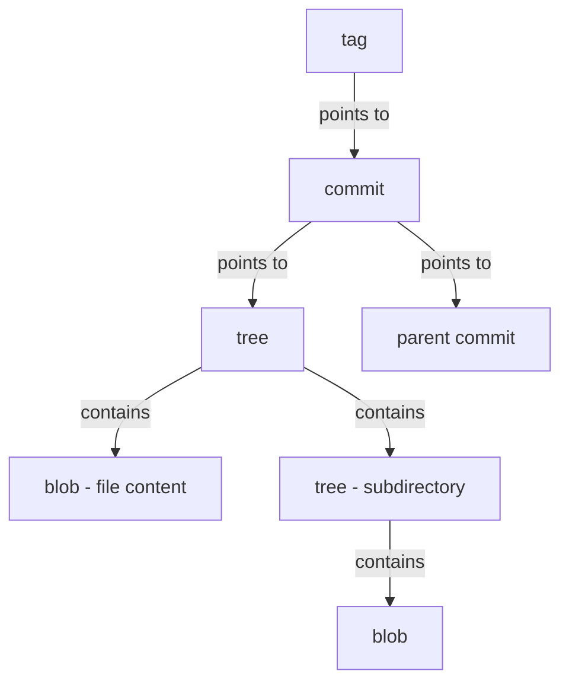
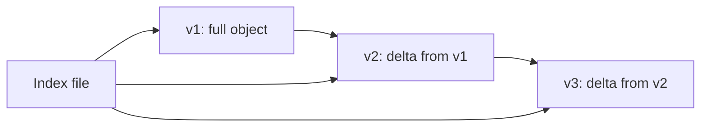

# Git Internals

Understanding how Git stores and manages data transforms you from someone who memorises commands into someone who truly understands the tool. Git is fundamentally a **content-addressable filesystem** with a version control interface built on top.

---

## The .git Directory Anatomy

When you run `git init`, Git creates the `.git` directory — the entire repository lives here:

```
.git/
├── HEAD            # Points to the current branch ref
├── config          # Repository-specific configuration
├── description     # Used by GitWeb (rarely relevant)
├── hooks/          # Client-side and server-side hook scripts
├── info/           # Global exclude patterns
├── objects/        # All content (blobs, trees, commits, tags)
│   ├── info/
│   └── pack/       # Packed objects for efficiency
├── refs/           # Pointers to commit objects
│   ├── heads/      # Branch tips
│   ├── tags/       # Tag references
│   └── remotes/    # Remote-tracking branches
├── index           # Staging area (binary file)
└── logs/           # Reflog history
```

| Component | Purpose | Human-readable? |
|-----------|---------|-----------------|
| `HEAD` | Current branch pointer | Yes — contains `ref: refs/heads/main` |
| `objects/` | Content store (all versions of all files) | No — compressed binary |
| `refs/` | Named pointers to commits | Yes — contains SHA-1 hashes |
| `index` | Staging area snapshot | No — binary format |
| `logs/` | History of ref changes | Yes — one entry per line |

---

## The Four Object Types

Git stores everything as one of four object types, each identified by a 40-character SHA-1 hash:



### Blob (Binary Large Object)

A blob stores the **contents** of a file — nothing else. No filename, no permissions, no metadata.

```bash
# See what's inside a blob
echo "Hello, Git" | git hash-object --stdin
# Output: b7e23ec29af22b0b4e41da31e868d57226121c84

# Store it in the object database
echo "Hello, Git" | git hash-object -w --stdin

# Read it back
git cat-file -p b7e23ec29af22b0b4e41da31e868d57226121c84
# Output: Hello, Git

# Check the type
git cat-file -t b7e23ec29af22b0b4e41da31e868d57226121c84
# Output: blob
```

**Key insight:** Two files with identical content share the same blob, regardless of filename or location.

### Tree

A tree maps **names and permissions** to blobs and other trees — it represents a directory:

```bash
# View a tree object
git cat-file -p main^{tree}
# Output:
# 100644 blob a1b2c3d4...   README.md
# 100644 blob e5f6a7b8...   main.py
# 040000 tree c9d0e1f2...   src
```

| Mode | Meaning |
|------|---------|
| `100644` | Regular file |
| `100755` | Executable file |
| `120000` | Symbolic link |
| `040000` | Subdirectory (tree) |

### Commit

A commit wraps a tree with metadata:

```bash
git cat-file -p HEAD
# Output:
# tree 4b825dc642cb6eb9a060e54bf899d69f...
# parent 8a3f2b1c9d7e6f5a4b3c2d1e0f...
# author Alice <alice@example.com> 1690000000 +0200
# committer Alice <alice@example.com> 1690000000 +0200
#
# Add user authentication module
```

A commit contains:
- Exactly **one tree** (snapshot of the project)
- Zero or more **parents** (zero for initial commit, two+ for merges)
- **Author** and **committer** (with timestamps)
- **Commit message**

### Tag (Annotated)

An annotated tag is a full object pointing to a commit with additional metadata:

```bash
git cat-file -p v1.0.0
# Output:
# object 3c4d5e6f7a8b9c0d1e2f3a4b5c6d7e8f...
# type commit
# tag v1.0.0
# tagger Bob <bob@example.com> 1690000000 +0200
#
# Release version 1.0.0
```

> **Note:** Lightweight tags are simply refs pointing to a commit — they have no object of their own.

---

## SHA-1 Hashing and Content-Addressable Storage

Git computes the SHA-1 hash of every object using:

```
SHA-1("{type} {size}\0{content}")
```

```bash
# Manual verification
echo -n "blob 11\0Hello, Git\n" | shasum
# Matches git hash-object output
```

This creates a **content-addressable** store:
- The address (hash) is derived from the content itself
- Identical content always produces the same hash
- Any modification produces a completely different hash (avalanche effect)
- Integrity verification is automatic — corruption changes the hash

| Property | Implication |
|----------|-------------|
| Deterministic | Same content → same hash, anywhere |
| Collision-resistant | Different content → different hash (practically) |
| Immutable | You cannot change an object — only create new ones |
| Deduplication | Identical files stored once regardless of copies |

> **SHA-256 transition:** Git is migrating to SHA-256 (`git init --object-format=sha256`). The concepts remain identical — only the hash length changes (64 hex chars).

---

## Pack Files

Loose objects are inefficient for large repositories. Git periodically **packs** objects:

```bash
# Trigger packing manually
git gc

# Inspect pack files
ls .git/objects/pack/
# pack-abc123.idx   (index — offsets for quick lookup)
# pack-abc123.pack  (compressed objects + deltas)

# List objects in a pack
git verify-pack -v .git/objects/pack/pack-abc123.idx
```

Pack files use **delta compression** — storing only the differences between similar objects. This is dramatically more efficient for files with many revisions.



---

## Plumbing vs Porcelain Commands

Git separates its interface into two layers:

| Layer | Purpose | Examples |
|-------|---------|---------|
| **Porcelain** | User-friendly commands | `git add`, `git commit`, `git log`, `git push` |
| **Plumbing** | Low-level building blocks | `git hash-object`, `git cat-file`, `git update-index` |

### Essential Plumbing Commands

```bash
# Create a blob
echo "content" | git hash-object -w --stdin

# Read any object
git cat-file -p <sha>     # pretty-print content
git cat-file -t <sha>     # show type
git cat-file -s <sha>     # show size

# Write a tree from the index
git write-tree

# Create a commit object
git commit-tree <tree-sha> -p <parent-sha> -m "message"

# Update a ref
git update-ref refs/heads/main <sha>

# Read the index
git ls-files --stage

# Update the index manually
git update-index --add --cacheinfo 100644,<sha>,filename.txt
```

### Building a Commit from Scratch

```bash
# 1. Create a blob
BLOB=$(echo "Hello from plumbing" | git hash-object -w --stdin)

# 2. Stage it in the index
git update-index --add --cacheinfo 100644,$BLOB,hello.txt

# 3. Write the index as a tree
TREE=$(git write-tree)

# 4. Create a commit pointing to that tree
COMMIT=$(git commit-tree $TREE -m "Manual commit via plumbing")

# 5. Update the branch ref
git update-ref refs/heads/main $COMMIT
```

---

## Inspecting Your Repository

```bash
# Count objects by type
git count-objects -v

# Show object database statistics
git cat-file --batch-all-objects --batch-check | \
  awk '{print $2}' | sort | uniq -c

# Find the largest objects
git rev-list --objects --all | \
  git cat-file --batch-check='%(objecttype) %(objectname) %(objectsize) %(rest)' | \
  sort -k3 -n -r | head -20

# Visualise the commit graph
git log --oneline --graph --all
```

---

## Key Takeaways

1. **Git is a content-addressable filesystem** — every object is stored and retrieved by its SHA-1 hash
2. **Four object types** — blobs (file content), trees (directories), commits (snapshots + metadata), and tags (named pointers)
3. **Immutability is fundamental** — objects are never modified, only new ones are created
4. **The .git directory is the entire repository** — the working directory is just a checkout of one snapshot
5. **Plumbing commands** give you direct access to Git's internals — powerful for scripting and understanding
6. **Pack files** use delta compression to keep repositories compact despite storing every version of every file
7. **Understanding the object model** makes every other Git operation (rebase, cherry-pick, reflog) intuitive rather than magical
