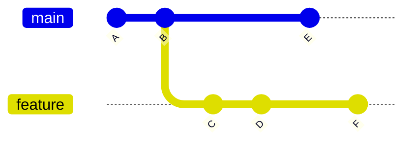
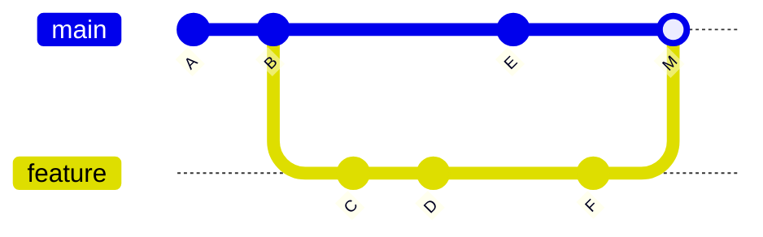
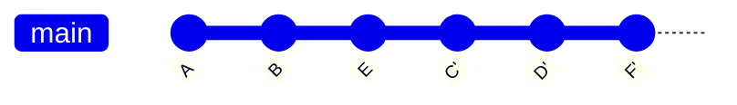
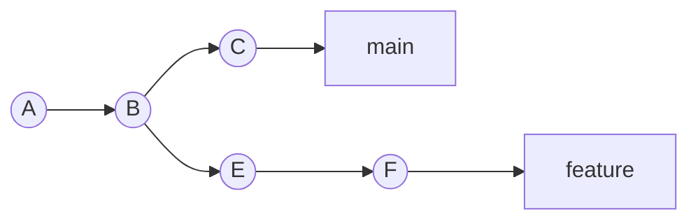
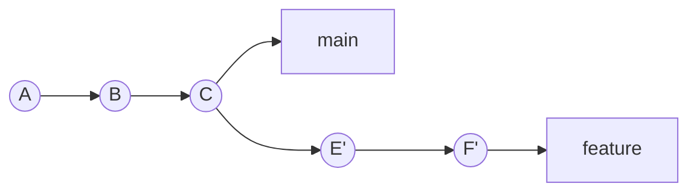

# Rebase Workflows

Rebase is Git's most powerful history-editing tool. It replays commits onto a new base, creating a linear history that's easier to read and bisect. But with great power comes great responsibility — rewriting shared history can cause serious collaboration problems.

---

## Rebase vs Merge

Both integrate changes from one branch into another, but they produce different histories:



### After Merge (`git merge feature`)



### After Rebase (`git checkout feature && git rebase main`)



| Aspect | Merge | Rebase |
|--------|-------|--------|
| History shape | Non-linear (preserves branches) | Linear (straight line) |
| Original commits | Preserved exactly | Replaced with new commits (new SHAs) |
| Merge commits | Creates one | None |
| Conflict resolution | Once (in merge commit) | Per-commit (during replay) |
| Traceability | Full branch history visible | Branch topology lost |
| Safety for shared branches | Safe | **Dangerous** — rewrites history |

---

## The Golden Rule of Rebase

> **Never rebase commits that have been pushed to a shared branch.**

Once commits are shared, other developers may have based work on them. Rebase creates *new* commits with *new* SHAs — the originals become unreachable, causing force-push conflicts and lost work.

**Safe to rebase:**
- Your local feature branch before pushing
- Your feature branch after pushing, **only if** you are the sole contributor

**Never rebase:**
- `main`, `master`, or any shared integration branch
- A branch others are actively working on

---

## Interactive Rebase

Interactive rebase (`-i`) gives you fine-grained control over commit history:

```bash
# Rebase the last 4 commits interactively
git rebase -i HEAD~4

# Rebase onto a branch
git rebase -i main
```

This opens your editor with a **todo list**:

```
pick a1b2c3d Add user model
pick d4e5f6a Add validation
pick 7b8c9d0 Fix typo in model
pick e1f2a3b Add user controller
```

### Available Commands

| Command | Short | Effect |
|---------|-------|--------|
| `pick` | `p` | Keep the commit as-is |
| `reword` | `r` | Keep changes, edit the commit message |
| `edit` | `e` | Pause at this commit for amending |
| `squash` | `s` | Merge into previous commit, combine messages |
| `fixup` | `f` | Merge into previous commit, discard this message |
| `drop` | `d` | Remove the commit entirely |
| `exec` | `x` | Run a shell command between commits |
| `break` | `b` | Pause here (continue with `git rebase --continue`) |

### Squash: Combine Commits

Combine a typo fix with the commit it fixes:

```
pick a1b2c3d Add user model
squash 7b8c9d0 Fix typo in model
pick d4e5f6a Add validation
pick e1f2a3b Add user controller
```

Git will open your editor to combine both commit messages. Edit as needed.

### Fixup: Combine Silently

Same as squash, but automatically discards the fixup commit's message:

```
pick a1b2c3d Add user model
fixup 7b8c9d0 Fix typo in model
pick d4e5f6a Add validation
pick e1f2a3b Add user controller
```

### Reword: Edit Messages

```
reword a1b2c3d Add user model
pick d4e5f6a Add validation
pick e1f2a3b Add user controller
```

Git pauses after each `reword` to let you edit the message.

### Edit: Amend Mid-History

```
pick a1b2c3d Add user model
edit d4e5f6a Add validation
pick e1f2a3b Add user controller
```

Git pauses at the `edit` commit. You can then:

```bash
# Make changes to files
git add .
git commit --amend

# Or split the commit
git reset HEAD~1
git add src/validate.py
git commit -m "Add input validation"
git add tests/test_validate.py
git commit -m "Add validation tests"

# Continue the rebase
git rebase --continue
```

### Drop: Remove a Commit

```
pick a1b2c3d Add user model
drop d4e5f6a Add validation
pick e1f2a3b Add user controller
```

### Reorder Commits

Simply rearrange the lines:

```
pick e1f2a3b Add user controller
pick a1b2c3d Add user model
pick d4e5f6a Add validation
```

---

## Autosquash Workflow

The `--fixup` and `--squash` commit flags create specially-named commits that interactive rebase automatically reorders:

```bash
# Create a fixup commit targeting a1b2c3d
git commit --fixup=a1b2c3d

# Creates a commit with message: "fixup! Add user model"

# Later, rebase with autosquash
git rebase -i --autosquash main
```

The todo list will automatically place fixup commits after their targets:

```
pick a1b2c3d Add user model
fixup abc1234 fixup! Add user model
pick d4e5f6a Add validation
```

**Pro tip:** Enable autosquash globally:

```bash
git config --global rebase.autoSquash true
```

Then `git rebase -i` always auto-arranges fixup/squash commits.

---

## Rebase Onto

`--onto` gives precise control over which commits get replayed and where:

```bash
git rebase --onto <newbase> <oldbase> <branch>
```

### Use Case: Move Branch to a Different Base



Move `feature` so it branches from `C` instead of `B`:

```bash
git rebase --onto C B feature
```

Result:


### Use Case: Remove a Range of Commits

Remove commits E and F from the branch:

```bash
git rebase --onto D F feature
# Replays only commits after F onto D
```

---

## Handling Rebase Conflicts

During rebase, Git replays each commit individually. Conflicts can occur at any step:

```bash
# When a conflict occurs:
# 1. Fix the conflicting files
# 2. Stage the resolution
git add <resolved-files>

# 3. Continue the rebase
git rebase --continue

# Or abort and return to pre-rebase state
git rebase --abort

# Or skip this commit entirely
git rebase --skip
```

**Tip:** Use `rerere` (reuse recorded resolution) to automatically resolve repeated conflicts:

```bash
git config --global rerere.enabled true
```

---

## When to Rebase vs When Not To

### ✅ Do Rebase

| Scenario | Benefit |
|----------|---------|
| Cleaning up local commits before push | Coherent, atomic commit history |
| Updating feature branch from main | Linear history, easier review |
| Combining WIP commits | Meaningful history for reviewers |
| Reordering commits for logical grouping | Tells a clear story |

### ❌ Don't Rebase

| Scenario | Risk |
|----------|------|
| Shared branch with multiple contributors | Breaks others' history |
| After creating a merge commit you want to preserve | Loses merge topology |
| When you need to preserve exact commit timestamps | Rebase updates committer date |
| Public/release branches | Causes downstream chaos |

---

## Practical Workflows

### Pre-Push Cleanup

```bash
# Before pushing your feature branch
git rebase -i main

# Squash WIP commits, reword messages, reorder logically
# Then push (or force-push if already pushed to your own branch)
git push --force-with-lease origin feature/TAI-42
```

### Keep Feature Branch Updated

```bash
# Fetch latest main
git fetch origin

# Rebase your feature onto updated main
git rebase origin/main

# Resolve any conflicts, then force-push
git push --force-with-lease
```

### `--force-with-lease` vs `--force`

Always prefer `--force-with-lease`:

```bash
# Safe force push — fails if remote has commits you haven't seen
git push --force-with-lease

# Dangerous — overwrites remote unconditionally
git push --force  # AVOID
```

`--force-with-lease` checks that the remote ref matches what you last fetched. If someone else pushed in the meantime, it fails safely.

---

## Key Takeaways

1. **Rebase replays commits** onto a new base, creating new commit objects with new SHA-1 hashes
2. **The golden rule** — never rebase commits that others may have based work on
3. **Interactive rebase** (`-i`) lets you squash, fixup, reword, edit, drop, and reorder commits
4. **Autosquash** with `--fixup` commits streamlines the cleanup workflow
5. **`--onto`** provides precise control for moving commit ranges to a different base
6. **`--force-with-lease`** is the safe way to push after rebase — it protects against overwriting others' work
7. **`rerere`** records conflict resolutions and replays them automatically on repeated conflicts
8. **Use rebase for local cleanup** and merge for integrating shared branches — combine both for a clean, traceable history
