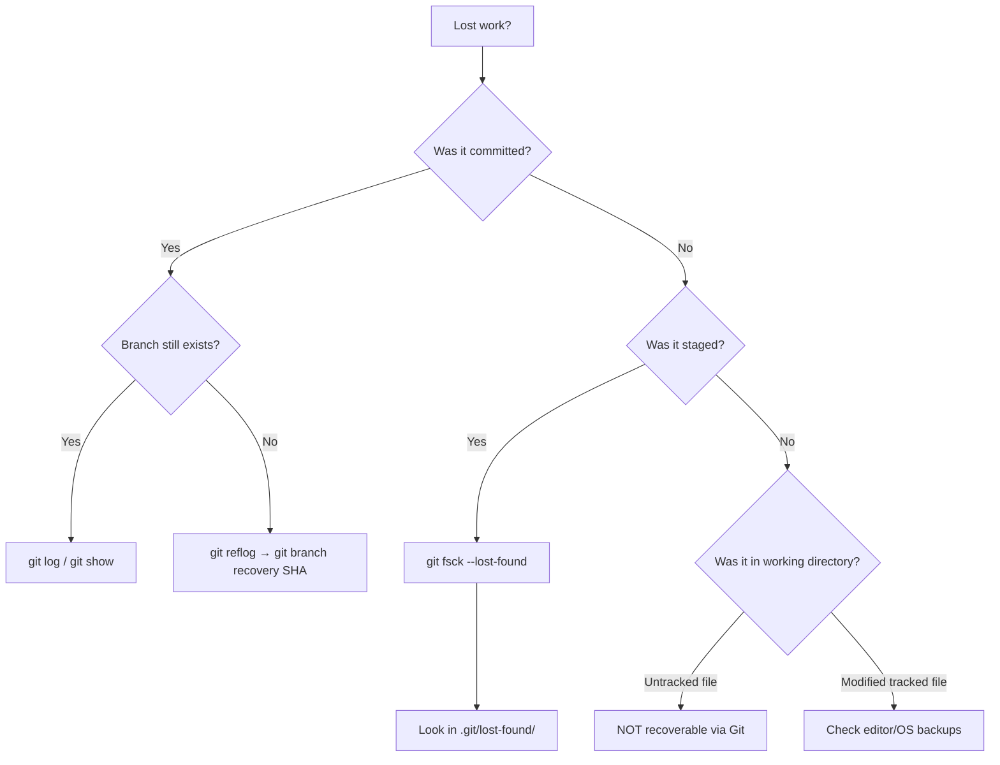

# Reflog & Recovery

The reflog is Git's safety net — a local log of every position your `HEAD` and branch refs have pointed to. Even after a destructive operation, the reflog usually holds the key to recovery.

---

## What the Reflog Tracks

The reflog records every time a ref (HEAD, branch, etc.) changes value. Each entry contains:

- The **old and new SHA** of the ref
- A **timestamp**
- The **action** that caused the change
- A **message** describing what happened

```bash
# View HEAD reflog
git reflog
# or equivalently:
git reflog show HEAD

# View a specific branch's reflog
git reflog show main

# View with timestamps
git reflog --date=iso
```

Example output:

```
a1b2c3d HEAD@{0}: commit: Add authentication module
f4e5d6c HEAD@{1}: rebase (finish): returning to refs/heads/feature
8b9c0d1 HEAD@{2}: rebase (pick): Add user model
e2f3a4b HEAD@{3}: rebase (start): checkout main
7c8d9e0 HEAD@{4}: checkout: moving from main to feature
b5c6d7e HEAD@{5}: commit: Update README
```

### Actions the Reflog Records

| Action | Example Entry |
|--------|--------------|
| `commit` | New commit created |
| `commit (amend)` | Commit amended |
| `checkout` | Branch or commit switched |
| `rebase (start/pick/finish)` | Each step of a rebase |
| `merge` | Merge performed |
| `reset` | Branch pointer moved |
| `pull` | Fetch + merge/rebase |
| `clone` | Initial clone |
| `cherry-pick` | Cherry-pick applied |

---

## Reflog Syntax

You can reference reflog entries in any Git command:

```bash
# By position (most recent first)
HEAD@{0}      # Current HEAD
HEAD@{1}      # Previous HEAD position
main@{3}      # main's position 3 moves ago

# By time
HEAD@{yesterday}
HEAD@{2.hours.ago}
HEAD@{2024-01-15}
main@{1.week.ago}
```

```bash
# What was on main a week ago?
git show main@{1.week.ago}

# Diff between current and yesterday's HEAD
git diff HEAD@{yesterday} HEAD

# Log of main from the last 2 hours
git log main@{2.hours.ago}..main
```

---

## Recovering Deleted Branches

When you delete a branch, the ref is removed but the commits still exist in the object store (until garbage collection):

```bash
# Oops — deleted the branch
git branch -D feature/important-work

# Find where it was pointing
git reflog | grep "feature/important-work"
# or search for the checkout event:
git reflog | grep "moving from feature/important-work"

# Recreate the branch at that commit
git branch feature/important-work a1b2c3d
```

### If You Don't Know the Branch Name

```bash
# Search reflog for keywords in commit messages
git reflog | grep "important"

# Or browse all recent reflog entries
git reflog --all | head -50
```

---

## Recovering from a Bad Rebase

Interactive rebase went wrong? The reflog recorded where your branch was before:

```bash
# See what happened
git reflog

# Find the entry BEFORE the rebase started
# Look for "rebase (start)" and go one entry before it
# e.g., HEAD@{5}: checkout: moving from feature to main  ← before rebase
#        HEAD@{4}: rebase (start): checkout main

# Reset your branch to its pre-rebase state
git reset --hard HEAD@{5}
```

**Shortcut:** Git stores a special ref `ORIG_HEAD` before destructive operations:

```bash
# Immediately after a bad rebase/merge/reset
git reset --hard ORIG_HEAD
```

> **Note:** `ORIG_HEAD` is overwritten by the next destructive operation, so use it quickly or rely on the reflog for older recovery.

---

## Recovering Lost Commits

Commits that are no longer reachable from any branch still exist until garbage collection runs:

```bash
# Find unreachable commits (dangling)
git fsck --no-reflogs --unreachable | grep commit

# Or use reflog to find commits you previously visited
git reflog --all

# Inspect a dangling commit
git show <sha>

# Recover it by creating a branch
git branch recovered-work <sha>
```

### After a Hard Reset

```bash
# You accidentally ran:
git reset --hard HEAD~3   # Lost 3 commits!

# Recovery:
git reflog
# HEAD@{0}: reset: moving to HEAD~3
# HEAD@{1}: commit: The commit I want back!  ← here!
# HEAD@{2}: commit: Another lost commit
# HEAD@{3}: commit: First lost commit

# Get them all back
git reset --hard HEAD@{3}

# Or cherry-pick specific ones
git cherry-pick HEAD@{1}
```

---

## Recovering from `git clean`

`git clean -fd` removes untracked files permanently — these are **NOT** recoverable via Git because they were never committed or staged.

Prevention strategies:

```bash
# Always dry-run first
git clean -n    # Shows what WOULD be deleted

# Use interactive mode
git clean -i    # Prompts before each deletion
```

---

## Reflog Expiry and Garbage Collection

The reflog doesn't keep entries forever:

| Setting | Default | Meaning |
|---------|---------|---------|
| `gc.reflogExpire` | 90 days | Reachable reflog entries expire after this |
| `gc.reflogExpireUnreachable` | 30 days | Unreachable entries expire after this |
| `gc.pruneExpire` | 2 weeks | Unreachable objects are deleted after this |

```bash
# Check your settings
git config --get gc.reflogExpire

# Extend expiry for safety
git config --global gc.reflogExpire 180.days
git config --global gc.reflogExpireUnreachable 90.days

# Manually expire old reflog entries (careful!)
git reflog expire --expire=now --all

# Trigger garbage collection (removes expired objects)
git gc --prune=now
```

**Important:** `git gc` runs automatically during normal operations (after ~7000 loose objects accumulate). Until it runs, "deleted" commits remain recoverable.

---

## Using Reflog with Reset and Checkout

### Reset Patterns

```bash
# Undo the last reset
git reset --hard HEAD@{1}

# Move branch back to where it was at a specific time
git reset --hard main@{yesterday}

# Soft reset to recover changes as staged
git reset --soft HEAD@{2}
```

### Checkout Patterns

```bash
# View a file as it was at a previous reflog position
git checkout HEAD@{3} -- path/to/file.txt

# Create a branch from a reflog entry
git checkout -b recovery HEAD@{5}
```

---

## Recovery Decision Tree



### Recovering Staged but Uncommitted Work

```bash
# Find dangling blobs (staged content that was overwritten)
git fsck --lost-found

# Check lost-found directory
ls .git/lost-found/other/

# Inspect each blob
git cat-file -p <sha>
```

---

## Practical Recovery Scenarios

### Scenario: Accidentally Amended the Wrong Commit

```bash
# You ran git commit --amend but didn't mean to
# The original commit still exists in reflog

git reflog
# HEAD@{0}: commit (amend): Updated message   ← the amend
# HEAD@{1}: commit: Original message           ← what you want

# Reset to the original
git reset --soft HEAD@{1}
# Your amended changes are now staged — commit them separately
```

### Scenario: Force-Pushed and Lost Remote Commits

```bash
# Check if you have the original commits locally
git reflog | grep "the lost commit message"

# If found, recreate the branch and push
git branch fix-force-push <sha>
git push origin fix-force-push
```

### Scenario: Recovering After `git checkout .`

```bash
# git checkout . discards unstaged changes to tracked files
# If changes were NEVER staged → not recoverable via Git
# If they were staged before: 
git fsck --lost-found
# Blobs in .git/lost-found/other/ may contain your work
```

---

## Key Takeaways

1. **The reflog is your undo history** — it records every ref movement locally for 90 days (reachable) or 30 days (unreachable)
2. **Deleted branches are recoverable** until garbage collection removes the underlying commits
3. **`ORIG_HEAD`** is a quick escape hatch immediately after a bad rebase, merge, or reset
4. **Unreachable commits exist until `git gc`** — the reflog and `git fsck` can find them
5. **Untracked/unstaged work is NOT recoverable** via Git — always stage early and commit often
6. **`git reflog` + `git reset --hard`** is the universal recovery pattern for most Git disasters
7. **Time-based reflog references** (`HEAD@{yesterday}`) are invaluable for "it was working yesterday" situations
8. **Extend reflog expiry** on important repos if you want a longer safety net
