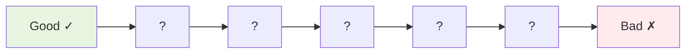
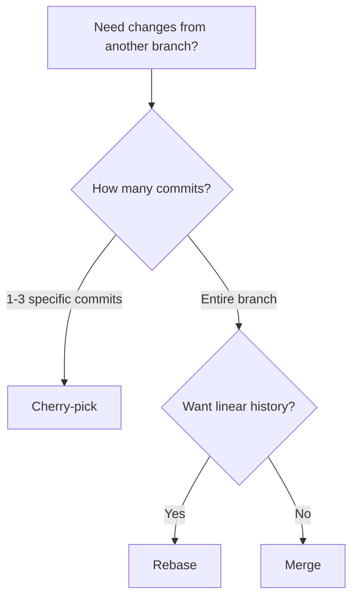

# Advanced Branching

Beyond basic branching, Git offers powerful tools for parallel development, automated debugging, selective commit application, and efficient handling of large repositories.

---

## Worktrees — Parallel Development

A worktree is an additional working directory linked to the same repository. Instead of stashing or committing WIP to switch context, you open another worktree:

```bash
# Create a new worktree for a branch
git worktree add ../project-hotfix hotfix/urgent-fix

# Create a worktree with a new branch
git worktree add -b feature/new-thing ../project-feature main

# List all worktrees
git worktree list
# /home/user/project           abc1234 [main]
# /home/user/project-hotfix    def5678 [hotfix/urgent-fix]
# /home/user/project-feature   9ab0123 [feature/new-thing]

# Remove a worktree (after you're done)
git worktree remove ../project-hotfix

# Prune stale worktree references
git worktree prune
```

### Worktree Rules

| Rule | Reason |
|------|--------|
| Each worktree must be on a different branch | Git can't have two worktrees on the same ref |
| All worktrees share the same `.git` objects | Storage efficient — no duplicate history |
| Commits in one worktree are immediately visible in others | Single object store |
| Don't `git checkout` into a branch used by another worktree | Fails with an error |

### When to Use Worktrees

- Reviewing a PR while your current branch has uncommitted work
- Running a long build on one branch while developing on another
- Comparing behaviour between two branches simultaneously
- Hotfixes that can't wait for your current work to finish

---

## Bisect — Binary Search for Bugs

`git bisect` performs a binary search through history to find which commit introduced a bug:



Git narrows down the offending commit in O(log n) steps.

### Manual Bisect

```bash
# Start bisecting
git bisect start

# Mark the current state as bad
git bisect bad

# Mark a known-good commit
git bisect good v1.2.0

# Git checks out a midpoint — test it, then:
git bisect good    # if this commit works
# or
git bisect bad     # if this commit has the bug

# Repeat until Git identifies the first bad commit
# ...
# abc1234 is the first bad commit

# Return to your original branch
git bisect reset
```

### Automated Bisect

Provide a test script that exits 0 for "good" and non-zero for "bad":

```bash
# Fully automated — runs tests at each step
git bisect start HEAD v1.2.0
git bisect run ./test-script.sh

# Example test script:
#!/bin/bash
make test 2>/dev/null
# or: python -c "import mymodule; assert mymodule.feature_works()"
```

| Exit Code | Meaning |
|-----------|---------|
| 0 | Good (bug not present) |
| 1-124, 126-127 | Bad (bug present) |
| 125 | Skip (can't test this commit — e.g., won't compile) |

### Bisect with Skip

```bash
# If a commit can't be tested (broken build, etc.)
git bisect skip

# Skip a range of untestable commits
git bisect skip v1.2.0..v1.2.5
```

---

## Cherry-Pick Strategies

Cherry-pick copies a specific commit's changes onto your current branch:

```bash
# Apply a single commit
git cherry-pick abc1234

# Apply multiple commits
git cherry-pick abc1234 def5678 ghi9012

# Apply a range (exclusive start, inclusive end)
git cherry-pick abc1234..ghi9012

# Cherry-pick without committing (stage changes only)
git cherry-pick --no-commit abc1234

# Cherry-pick a merge commit (specify parent)
git cherry-pick -m 1 <merge-commit-sha>
```

### Cherry-Pick Options

| Option | Effect |
|--------|--------|
| `--no-commit` (`-n`) | Apply changes without creating a commit |
| `--edit` (`-e`) | Edit the commit message before committing |
| `-x` | Append "(cherry picked from commit ...)" to the message |
| `--signoff` (`-s`) | Add a Signed-off-by trailer |
| `-m <parent>` | For merge commits — specify which parent to diff against |

### When to Cherry-Pick

- Backporting a fix from `main` to a release branch
- Pulling a specific feature commit into another branch
- Recovering a useful commit from an abandoned branch

### Cherry-Pick vs Merge/Rebase



---

## Patch Workflows

Patches are portable diffs that can be shared via email, tickets, or file transfer — useful when direct Git access isn't available.

### Creating Patches with format-patch

```bash
# Create patches for the last 3 commits
git format-patch -3
# Creates: 0001-First-commit.patch, 0002-Second-commit.patch, 0003-Third-commit.patch

# Patches for a range
git format-patch main..feature

# Single patch for all changes (combined)
git format-patch main..feature --stdout > feature.patch

# Include cover letter
git format-patch -3 --cover-letter
```

### Applying Patches with am

```bash
# Apply a patch series
git am *.patch

# Apply with 3-way merge (better conflict handling)
git am --3way 0001-Add-feature.patch

# If conflicts occur:
git am --abort          # Cancel and restore
git am --skip           # Skip this patch
# or resolve conflicts, then:
git add .
git am --continue
```

### Quick Patches with diff/apply

```bash
# Create a simple diff (no commit metadata)
git diff > changes.patch
git diff --staged > staged.patch

# Apply a simple diff
git apply changes.patch

# Check if a patch applies cleanly (dry run)
git apply --check changes.patch
```

| Tool | Preserves Author? | Preserves Message? | Creates Commits? |
|------|-------------------|--------------------|-----------------|
| `format-patch` + `am` | Yes | Yes | Yes |
| `diff` + `apply` | No | No | No |

---

## Sparse Checkout

Sparse checkout lets you work with only a subset of files in a large repository:

```bash
# Enable sparse checkout
git sparse-checkout init

# Use cone mode (recommended — faster, directory-based)
git sparse-checkout init --cone

# Specify which directories to include
git sparse-checkout set src/my-service tests/my-service docs/

# Add more paths
git sparse-checkout add config/

# List currently included paths
git sparse-checkout list

# Disable sparse checkout (get everything back)
git sparse-checkout disable
```

### Cone Mode vs Non-Cone Mode

| Mode | Pattern Type | Performance |
|------|-------------|-------------|
| **Cone** (recommended) | Directory-based only | Fast — optimised path matching |
| **Non-cone** | `.gitignore`-style patterns | Slower — full pattern evaluation |

```bash
# Non-cone mode for complex patterns (legacy)
git sparse-checkout init --no-cone
git sparse-checkout set '/*' '!unwanted-dir/' '!*.generated'
```

---

## Partial Clone

Partial clone downloads only the objects you need, fetching others on demand:

```bash
# Clone without blobs (file contents fetched on checkout)
git clone --filter=blob:none <url>

# Clone without trees (only commit graph initially)
git clone --filter=tree:0 <url>

# Clone without large blobs (>1MB)
git clone --filter=blob:limit=1m <url>

# Combine with sparse checkout for maximum efficiency
git clone --filter=blob:none --sparse <url>
cd repo
git sparse-checkout set src/my-service
```

### Comparison

| Strategy | Initial Clone | Disk Usage | Network on Checkout |
|----------|--------------|------------|---------------------|
| Full clone | All objects | Full repo size | None |
| Shallow clone (`--depth=1`) | Latest snapshot only | Minimal | Needed for history |
| Blobless (`--filter=blob:none`) | Commits + trees | Small | Blobs fetched on demand |
| Treeless (`--filter=tree:0`) | Commits only | Minimal | Trees + blobs on demand |

---

## Key Takeaways

1. **Worktrees** let you work on multiple branches simultaneously without stashing — they share the same object store
2. **Bisect** finds bug-introducing commits in O(log n) steps — automate it with `bisect run` and a test script
3. **Cherry-pick** applies specific commits to other branches — use `-x` to record provenance
4. **format-patch/am** create portable, email-friendly patches that preserve authorship and commit messages
5. **Sparse checkout** (cone mode) dramatically reduces working directory size in large repos
6. **Partial clone** reduces initial download by fetching objects on demand — combine with sparse checkout for monorepo efficiency
7. **These tools compose** — use worktrees + sparse checkout for monorepos, bisect + automated tests for debugging, cherry-pick + patches for backporting
