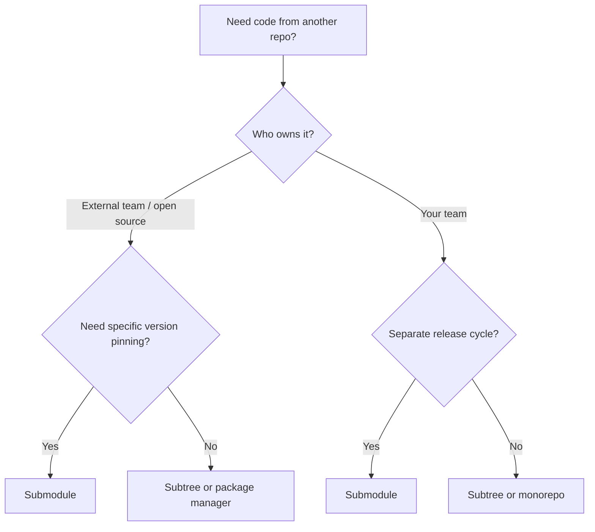

# Submodules & Subtrees

When a project depends on code from another repository, Git offers two main strategies: **submodules** (linked pointer to an external repo) and **subtrees** (merged copy of an external repo). Each has distinct trade-offs for dependency management, monorepo architecture, and team workflows.

---

## Submodules

A submodule is a reference to a specific commit in another repository. The parent repo stores only the URL and commit SHA — not the actual files.

### Adding a Submodule

```bash
# Add a submodule
git submodule add https://github.com/org/shared-lib.git libs/shared-lib

# This creates:
# - .gitmodules file (URL + path mapping)
# - libs/shared-lib/ directory (checked out at a specific commit)
# - A special entry in the index (gitlink)
```

The `.gitmodules` file:

```ini
[submodule "libs/shared-lib"]
    path = libs/shared-lib
    url = https://github.com/org/shared-lib.git
    branch = main
```

### Cloning a Repo with Submodules

```bash
# Option 1: Clone, then initialise submodules
git clone https://github.com/org/my-project.git
cd my-project
git submodule init
git submodule update

# Option 2: Clone with submodules in one step
git clone --recurse-submodules https://github.com/org/my-project.git

# Option 3: After cloning, if you forgot
git submodule update --init --recursive
```

### Updating Submodules

```bash
# Update to the latest commit on the tracked branch
git submodule update --remote

# Update a specific submodule
git submodule update --remote libs/shared-lib

# After updating, commit the new pointer in the parent
git add libs/shared-lib
git commit -m "chore: update shared-lib to latest"
```

### Working Inside a Submodule

```bash
cd libs/shared-lib

# You're now in a detached HEAD state by default
git checkout main
# Make changes, commit, push

cd ../..
# Parent repo sees the submodule at a new commit
git add libs/shared-lib
git commit -m "chore: bump shared-lib"
```

### Common Submodule Commands

| Command | Purpose |
|---------|---------|
| `git submodule status` | Show current commit for each submodule |
| `git submodule foreach <cmd>` | Run a command in each submodule |
| `git submodule sync` | Sync URL changes from `.gitmodules` to `.git/config` |
| `git submodule deinit <path>` | Unregister a submodule (keeps files) |
| `git rm <path>` | Remove a submodule entirely |

### Submodule Pitfalls

| Problem | Cause | Solution |
|---------|-------|----------|
| Detached HEAD in submodule | Submodules check out a commit, not a branch | `cd submodule && git checkout main` |
| Contributors forget `--recurse-submodules` | Not obvious that submodules exist | Add to README, use `.gitconfig` alias |
| Stale submodule pointer | Someone updated without bumping parent | `git submodule update --remote` |
| CI builds fail | Pipeline doesn't init submodules | Add `git submodule update --init --recursive` to CI |
| Merge conflicts in submodule pointer | Two people bumped independently | Manual resolution — pick the right SHA |

---

## Subtrees

A subtree merges another repository's content directly into your repo. No special metadata files, no detached HEADs — just regular files and commits.

### Adding a Subtree

```bash
# Add a remote for the external repo
git remote add shared-lib https://github.com/org/shared-lib.git

# Pull it into a subdirectory (squash to single commit)
git subtree add --prefix=libs/shared-lib shared-lib main --squash
```

### Updating a Subtree

```bash
# Pull latest changes from the external repo
git subtree pull --prefix=libs/shared-lib shared-lib main --squash
```

### Contributing Back (Pushing Changes Upstream)

```bash
# Push changes made in the subtree directory back to the source repo
git subtree push --prefix=libs/shared-lib shared-lib main
```

### Splitting a Subtree

Extract a directory's history into its own branch (useful for extracting a library):

```bash
# Create a branch with only the subtree's history
git subtree split --prefix=libs/shared-lib -b shared-lib-split

# Push to a new repo
git push https://github.com/org/new-shared-lib.git shared-lib-split:main
```

### Subtree Options

| Option | Effect |
|--------|--------|
| `--squash` | Collapse external history into a single merge commit |
| `--prefix=<dir>` | Target directory for the subtree |
| `--annotate="(lib) "` | Prefix commit messages when splitting |
| `--rejoin` | Record split point for faster future splits |

---

## Submodules vs Subtrees

| Aspect | Submodules | Subtrees |
|--------|-----------|----------|
| **Storage** | Pointer (gitlink) only | Full copy of files |
| **Clone experience** | Requires `--recurse-submodules` | Normal clone — files included |
| **History** | Separate (in submodule repo) | Merged into parent (or squashed) |
| **Updates** | Explicit `submodule update` | `subtree pull` |
| **Contributing back** | Work directly in submodule | `subtree push` or `subtree split` |
| **Complexity** | Higher (detached HEAD, `.gitmodules`) | Lower (just files and commits) |
| **CI integration** | Needs special clone flags | Works out of the box |
| **Permissions** | Can restrict access per-submodule | All code in one repo (same access) |
| **Best for** | Large external deps, separate release cycles | Vendoring, shared libraries owned by your team |

### When to Use Which



---

## Monorepo Tooling

For large repositories containing multiple projects, Git provides tools to maintain performance and ownership clarity.

### Sparse Checkout for Monorepos

```bash
# Clone only what you need
git clone --filter=blob:none --sparse https://github.com/org/monorepo.git
cd monorepo
git sparse-checkout set services/my-service shared/common
```

### CODEOWNERS

The `CODEOWNERS` file (root, `docs/`, or `.github/`) defines who reviews which paths:

```
# CODEOWNERS
# Default owner for everything
*                           @org/platform-team

# Service-specific ownership
/services/auth/             @org/auth-team
/services/payments/         @org/payments-team
/services/notifications/    @org/notifications-team

# Shared libraries — require platform review
/shared/                    @org/platform-team

# Infrastructure — require DevOps review
/terraform/                 @org/devops
/.github/                   @org/devops

# Documentation — anyone can review
/docs/                      @org/tech-writers
```

| Pattern | Matches |
|---------|---------|
| `*` | Everything (default) |
| `/services/auth/` | Only the auth service directory |
| `*.tf` | All Terraform files anywhere |
| `/docs/**/*.md` | All markdown in docs/ recursively |

### Monorepo Strategies

| Strategy | Tools | Best For |
|----------|-------|----------|
| Sparse checkout + CODEOWNERS | Git native | Moderate size, clear ownership |
| Build system aware of changes | Bazel, Nx, Turborepo | Only build/test affected packages |
| Git LFS for large assets | git-lfs | Repos with binaries, images, datasets |
| Virtual filesystem | GVFS/Scalar (Microsoft) | Extremely large repos (100K+ files) |

---

## Removing a Submodule Completely

The process is manual and multi-step:

```bash
# 1. Deinitialise the submodule
git submodule deinit -f libs/shared-lib

# 2. Remove from .gitmodules
git rm -f libs/shared-lib

# 3. Remove from .git/modules (cached data)
rm -rf .git/modules/libs/shared-lib

# 4. Commit the removal
git commit -m "chore: remove shared-lib submodule"
```

---

## Practical Example: Migrating Submodule to Subtree

```bash
# 1. Record the submodule's current URL and commit
SUBMOD_URL=$(git config --file .gitmodules submodule.libs/shared-lib.url)
SUBMOD_COMMIT=$(git submodule status libs/shared-lib | awk '{print $1}')

# 2. Remove the submodule
git submodule deinit -f libs/shared-lib
git rm -f libs/shared-lib
rm -rf .git/modules/libs/shared-lib
git commit -m "chore: remove shared-lib submodule"

# 3. Add as subtree instead
git remote add shared-lib $SUBMOD_URL
git subtree add --prefix=libs/shared-lib shared-lib main --squash
```

---

## Key Takeaways

1. **Submodules** are pointers to external repos — explicit version pinning but higher complexity
2. **Subtrees** merge external code directly — simpler workflow but larger repo size
3. **Use submodules** for large external dependencies with independent release cycles and different access controls
4. **Use subtrees** for shared code your team owns or when you want zero friction for contributors
5. **CODEOWNERS** enforces review requirements per path — essential for monorepos
6. **Sparse checkout** reduces working directory size — combine with partial clone for monorepo efficiency
7. **Neither replaces a package manager** — if the dependency is versioned and released, use npm/pip/maven instead
8. **Document your choice** — whichever strategy you pick, make it obvious in the README so contributors don't struggle
