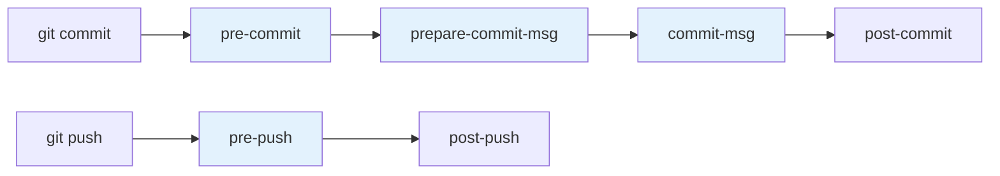

# Hooks & Automation

Git hooks are scripts that run automatically at specific points in the Git workflow. They enable quality gates, enforced conventions, and automated workflows — all without requiring developers to remember manual steps.

---

## How Hooks Work

Hooks live in `.git/hooks/` and execute at predefined trigger points. They are:

- **Executable scripts** (any language — bash, Python, Node.js, etc.)
- **Named after their trigger** (e.g., `pre-commit`, `commit-msg`)
- **Local by default** — not committed to the repo (solved by frameworks like Husky)
- **Blocking** — a non-zero exit code aborts the operation (for pre-* hooks)

```bash
# List available hook samples
ls .git/hooks/
# applypatch-msg.sample  pre-commit.sample  prepare-commit-msg.sample ...

# Enable a hook by removing .sample and making executable
cp .git/hooks/pre-commit.sample .git/hooks/pre-commit
chmod +x .git/hooks/pre-commit
```

---

## Client-Side Hooks

### Hook Execution Timeline



### pre-commit

Runs before the commit is created. Use for linting, formatting, and fast checks.

```bash
#!/bin/bash
# .git/hooks/pre-commit — Run linters on staged files

# Run black on staged Python files
STAGED_PY=$(git diff --cached --name-only --diff-filter=ACM | grep '\.py$')
if [ -n "$STAGED_PY" ]; then
    black --check $STAGED_PY
    if [ $? -ne 0 ]; then
        echo "❌ Black formatting check failed. Run 'black .' to fix."
        exit 1
    fi
fi

# Run ESLint on staged JS/TS files
STAGED_JS=$(git diff --cached --name-only --diff-filter=ACM | grep -E '\.(js|ts|tsx)$')
if [ -n "$STAGED_JS" ]; then
    npx eslint $STAGED_JS
    if [ $? -ne 0 ]; then
        echo "❌ ESLint failed. Fix errors before committing."
        exit 1
    fi
fi
```

| Exit Code | Effect |
|-----------|--------|
| 0 | Commit proceeds |
| Non-zero | Commit aborted |
| N/A (hook missing) | Commit proceeds (no hook = no check) |

**Bypass:** `git commit --no-verify` (or `-n`) skips pre-commit and commit-msg hooks.

### prepare-commit-msg

Runs after the default message is created but before the editor opens. Use for message templates:

```bash
#!/bin/bash
# .git/hooks/prepare-commit-msg — Prepend branch ticket ID

COMMIT_MSG_FILE=$1
COMMIT_SOURCE=$2

# Only modify for regular commits (not merges, amends, etc.)
if [ -z "$COMMIT_SOURCE" ]; then
    BRANCH=$(git symbolic-ref --short HEAD)
    TICKET=$(echo "$BRANCH" | grep -oE '[A-Z]+-[0-9]+')
    
    if [ -n "$TICKET" ]; then
        sed -i.bak "1s/^/$TICKET: /" "$COMMIT_MSG_FILE"
    fi
fi
```

### commit-msg

Runs after the user writes the message. Use for validation:

```bash
#!/bin/bash
# .git/hooks/commit-msg — Validate conventional commit format

COMMIT_MSG=$(cat "$1")
PATTERN='^(feat|fix|docs|style|refactor|perf|test|chore|ci|build)(\(.+\))?: .{1,72}'

if ! echo "$COMMIT_MSG" | grep -qE "$PATTERN"; then
    echo "❌ Commit message must follow Conventional Commits format:"
    echo "   type(scope): description"
    echo ""
    echo "   Types: feat, fix, docs, style, refactor, perf, test, chore, ci, build"
    echo "   Your message: $COMMIT_MSG"
    exit 1
fi
```

### pre-push

Runs before data is transmitted to the remote. Use for running tests:

```bash
#!/bin/bash
# .git/hooks/pre-push — Run tests before pushing

echo "🧪 Running tests before push..."
pytest tests/ --quiet
if [ $? -ne 0 ]; then
    echo "❌ Tests failed. Push aborted."
    exit 1
fi

echo "✅ All tests passed. Pushing..."
```

---

## Server-Side Hooks

Server-side hooks run on the remote (GitLab, GitHub, Bitbucket, etc.) and enforce policies that cannot be bypassed with `--no-verify`:

| Hook | Trigger | Use Case |
|------|---------|----------|
| `pre-receive` | Before any refs are updated | Reject force pushes, enforce branch protection |
| `update` | Per-ref (once per branch being pushed) | Branch-specific policies |
| `post-receive` | After refs are updated | Trigger CI/CD, send notifications |

```bash
#!/bin/bash
# pre-receive — Reject pushes to main without PR
while read oldrev newrev refname; do
    if [ "$refname" = "refs/heads/main" ]; then
        echo "❌ Direct pushes to main are not allowed. Use a merge request."
        exit 1
    fi
done
```

> **Note:** Most teams use platform features (GitLab protected branches, GitHub branch rules) instead of raw server-side hooks.

---

## Husky — Hooks for Teams

[Husky](https://typicode.github.io/husky/) manages Git hooks via `package.json`, making them version-controlled and shared:

```bash
# Install husky
npm install --save-dev husky

# Initialise
npx husky init

# Creates .husky/ directory with a pre-commit hook
```

```bash
# .husky/pre-commit
npm run lint
npm run test:unit
```

```json
// package.json
{
  "scripts": {
    "prepare": "husky",
    "lint": "eslint src/",
    "test:unit": "vitest run"
  }
}
```

---

## Lefthook — Language-Agnostic Alternative

[Lefthook](https://github.com/evilmartians/lefthook) works with any project (not just Node.js):

```yaml
# lefthook.yml
pre-commit:
  parallel: true
  commands:
    lint-python:
      glob: "*.py"
      run: black --check {staged_files}
    lint-terraform:
      glob: "*.tf"
      run: terraform fmt -check {staged_files}
    type-check:
      glob: "*.py"
      run: mypy {staged_files}

commit-msg:
  commands:
    validate:
      run: npx commitlint --edit {1}

pre-push:
  commands:
    test:
      run: pytest tests/ -q
```

| Feature | Husky | Lefthook |
|---------|-------|----------|
| Language | Node.js projects | Any (Go binary) |
| Config format | Scripts in `.husky/` | YAML (`lefthook.yml`) |
| Parallel execution | Manual | Built-in |
| Staged files | Via lint-staged | Built-in `{staged_files}` |
| Install | `npm install` | Binary or package manager |

---

## lint-staged — Run Linters on Staged Files Only

[lint-staged](https://github.com/okonet/lint-staged) runs tools only on files that are staged for commit — fast feedback:

```json
// package.json
{
  "lint-staged": {
    "*.{js,ts,tsx}": ["eslint --fix", "prettier --write"],
    "*.py": ["black", "flake8"],
    "*.tf": ["terraform fmt"],
    "*.md": ["prettier --write"]
  }
}
```

```bash
# .husky/pre-commit
npx lint-staged
```

This pattern is dramatically faster than running linters on the entire codebase.

---

## Commit Message Validation with Commitlint

[Commitlint](https://commitlint.js.org/) enforces conventional commit format:

```bash
npm install --save-dev @commitlint/cli @commitlint/config-conventional
```

```javascript
// commitlint.config.js
module.exports = {
  extends: ['@commitlint/config-conventional'],
  rules: {
    'type-enum': [2, 'always', [
      'feat', 'fix', 'docs', 'style', 'refactor',
      'perf', 'test', 'chore', 'ci', 'build'
    ]],
    'subject-max-length': [2, 'always', 72],
    'body-max-line-length': [2, 'always', 100],
  }
};
```

```bash
# .husky/commit-msg
npx commitlint --edit $1
```

---

## Custom Automation Examples

### Auto-Update Changelog

```bash
#!/bin/bash
# .git/hooks/post-commit — Append to CHANGELOG after tagged commits

TAG=$(git tag --points-at HEAD)
if [ -n "$TAG" ]; then
    echo "## $TAG ($(date +%Y-%m-%d))" >> CHANGELOG.md
    git log --oneline $(git describe --tags --abbrev=0 HEAD~1)..HEAD >> CHANGELOG.md
fi
```

### Prevent Large File Commits

```bash
#!/bin/bash
# .git/hooks/pre-commit — Block files over 5MB

MAX_SIZE=5242880  # 5MB in bytes

LARGE_FILES=$(git diff --cached --name-only --diff-filter=ACM | while read file; do
    SIZE=$(wc -c < "$file" 2>/dev/null)
    if [ "$SIZE" -gt "$MAX_SIZE" ]; then
        echo "$file ($(numfmt --to=iec $SIZE))"
    fi
done)

if [ -n "$LARGE_FILES" ]; then
    echo "❌ Files exceed 5MB limit:"
    echo "$LARGE_FILES"
    echo ""
    echo "Consider using Git LFS for large files."
    exit 1
fi
```

### Branch Name Validation

```bash
#!/bin/bash
# .git/hooks/pre-push — Validate branch naming convention

BRANCH=$(git symbolic-ref --short HEAD)
PATTERN='^(feature|hotfix|inspect)/[A-Z]+-[0-9]+'

if [ "$BRANCH" = "main" ] || [ "$BRANCH" = "master" ]; then
    exit 0  # Allow pushes to main
fi

if ! echo "$BRANCH" | grep -qE "$PATTERN"; then
    echo "❌ Branch name '$BRANCH' doesn't follow convention:"
    echo "   {type}/{TICKET-ID}-description"
    echo "   Example: feature/TAI-123-add-auth"
    exit 1
fi
```

---

## Key Takeaways

1. **Hooks automate quality gates** — pre-commit for formatting, commit-msg for conventions, pre-push for tests
2. **Non-zero exit codes abort the operation** — this is the enforcement mechanism
3. **`--no-verify` bypasses client hooks** — don't rely on them as your only protection; use CI too
4. **Husky** (Node.js) and **Lefthook** (any language) make hooks version-controlled and shared across the team
5. **lint-staged** runs tools only on staged files — fast feedback without full-repo scans
6. **Commitlint** enforces conventional commit format automatically
7. **Server-side hooks** (or platform branch protections) provide the non-bypassable layer
8. **Layer your defences** — local hooks for fast feedback, CI for enforcement, server-side for final protection
