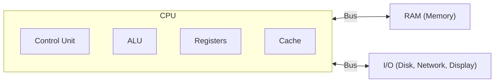
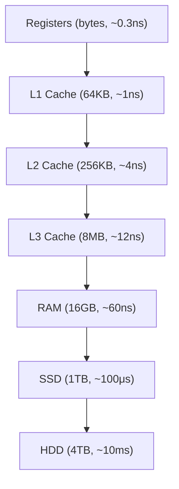

## The Von Neumann Model

All modern computers follow this architecture: a processor fetches instructions from memory, decodes them, executes them, and stores results.



---

## CPU (Central Processing Unit)

| Component | Role | Speed |
|-----------|------|-------|
| Registers | Tiny storage inside CPU | 1 cycle |
| L1 Cache | Per-core cache (32-64KB) | ~4 cycles |
| L2 Cache | Per-core (256KB-1MB) | ~12 cycles |
| L3 Cache | Shared across cores (8-64MB) | ~40 cycles |
| RAM | Main memory (8-128GB) | ~200 cycles |
| SSD | Persistent storage | ~100,000 cycles |
| HDD | Spinning disk | ~10,000,000 cycles |

### The Instruction Cycle


1. **Fetch** — read next instruction from memory (pointed to by Program Counter)
2. **Decode** — interpret what the instruction means
3. **Execute** — perform the operation (ALU for math, load/store for memory)
4. **Store** — write result to register or memory

Modern CPUs execute billions of cycles per second (GHz = billion cycles/sec).

### Pipelining

CPUs overlap instruction stages — while one instruction executes, the next is being decoded, and another is being fetched:

```text
Time →   1    2    3    4    5    6
Inst 1: [F]  [D]  [E]  [S]
Inst 2:      [F]  [D]  [E]  [S]
Inst 3:           [F]  [D]  [E]  [S]
```

This is why "instructions per clock" (IPC) matters more than raw clock speed.

---

## Memory Hierarchy



**Key insight:** Each level is larger but slower. Programs that access data with good **locality** (nearby memory addresses, recently used data) run faster because they hit cache more often.

### Cache Concepts

| Concept | Meaning |
|---------|---------|
| Cache hit | Data found in cache (fast) |
| Cache miss | Data not in cache, must fetch from slower level |
| Spatial locality | Accessing nearby memory addresses |
| Temporal locality | Accessing recently used data again |

---

## Number Systems

### Binary (Base 2)

Computers operate in binary — everything is 0s and 1s:

| Decimal | Binary | Hex |
|---------|--------|-----|
| 0 | 0000 | 0x0 |
| 5 | 0101 | 0x5 |
| 10 | 1010 | 0xA |
| 15 | 1111 | 0xF |
| 255 | 11111111 | 0xFF |

### Data Sizes

| Unit | Size | Context |
|------|------|---------|
| Bit | 1 or 0 | Single binary digit |
| Byte | 8 bits | One ASCII character |
| Kilobyte (KB) | 1,024 bytes | A short text file |
| Megabyte (MB) | 1,024 KB | A photo |
| Gigabyte (GB) | 1,024 MB | A movie |
| Terabyte (TB) | 1,024 GB | A hard drive |

---

## CPU Architecture Types

| Architecture | Description | Examples |
|-------------|-------------|---------|
| x86_64 (AMD64) | Complex instruction set (CISC) | Intel, AMD — desktops, servers |
| ARM (AArch64) | Reduced instruction set (RISC) | Apple M-series, AWS Graviton, phones |

ARM is more power-efficient; x86 has broader software compatibility. Cloud providers increasingly offer ARM instances (AWS Graviton) for better price/performance.

---

## Parallelism

| Type | Description | Example |
|------|-------------|---------|
| Multi-core | Multiple CPU cores in one chip | 8-core laptop |
| Hyper-threading | Two threads per physical core | Appears as 16 logical CPUs |
| SIMD | One instruction, multiple data | Image processing, ML |
| GPU | Thousands of simple cores | Graphics, ML training |

---

## Key Takeaways

1. **Von Neumann bottleneck** — CPU is fast, memory access is slow → caches bridge the gap
2. **Memory hierarchy** — registers → cache → RAM → disk (faster = smaller = more expensive)
3. **Locality matters** — programs that access nearby/recent data run faster
4. **Clock speed isn't everything** — IPC, cache size, and core count matter too
5. **ARM vs x86** — ARM is gaining ground in servers (Graviton) due to efficiency
6. **Everything is binary** — understand bits, bytes, and powers of 2
