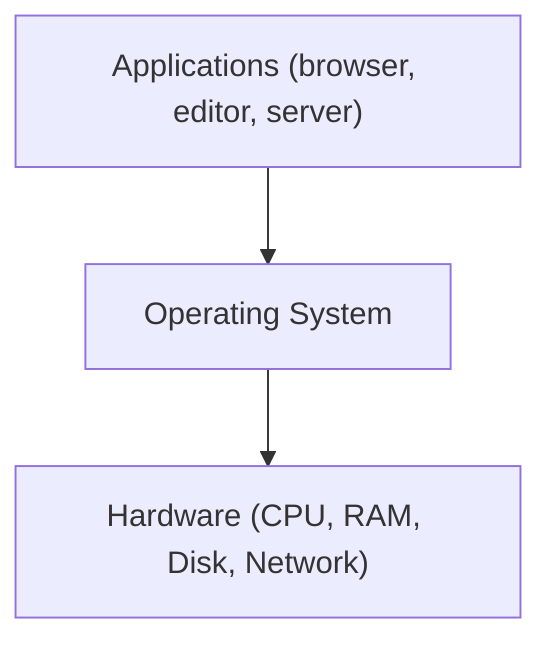
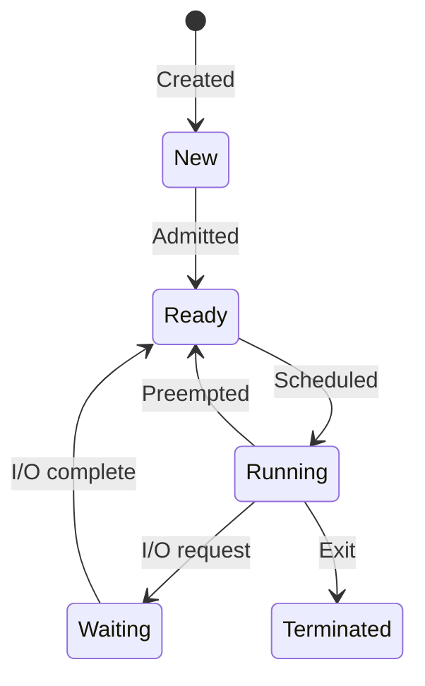
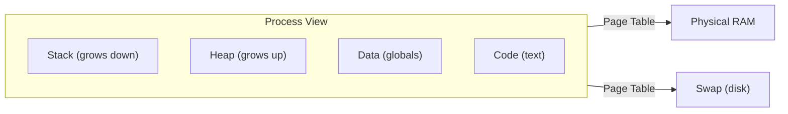
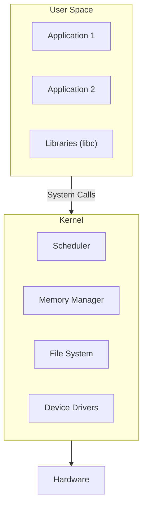

## What is an Operating System?

An OS is the software layer between hardware and applications. It manages resources (CPU, memory, disk, I/O) and provides abstractions so programs don't need to interact with hardware directly.

---

## Core Responsibilities

| Function | What It Does |
|----------|-------------|
| Process management | Create, schedule, and terminate processes |
| Memory management | Allocate RAM, virtual memory, paging |
| File system | Organize and access persistent data |
| I/O management | Interface with devices (disk, network, display) |
| Security | User permissions, process isolation |

---

## Process Management

### What is a Process?

A process is a running program — it has its own memory space, file descriptors, and execution state.

### Process vs Thread

| Aspect | Process | Thread |
|--------|---------|--------|
| Memory | Own address space | Shared with other threads |
| Creation cost | High (fork) | Low |
| Communication | IPC (pipes, sockets) | Shared memory |
| Isolation | Full | None (crash affects all threads) |
| Example | Each Chrome tab | Multiple workers in a web server |

### Scheduling

The OS decides which process gets CPU time:

| Algorithm | Description | Use Case |
|-----------|-------------|----------|
| Round Robin | Fixed time slice per process | General purpose |
| Priority | Higher priority runs first | Real-time systems |
| CFS (Completely Fair) | Proportional CPU time | Linux default |
| FIFO | First come, first served | Batch processing |

### Context Switch

When the OS switches from one process to another:

1. Save current process state (registers, program counter)
2. Load next process state
3. Resume execution

Context switches are expensive (~1-10μs) — too many = poor performance.

---

## Memory Management

### Virtual Memory

Each process sees its own private address space — the OS maps virtual addresses to physical RAM:

### Key Concepts

| Concept | Description |
|---------|-------------|
| Virtual address | Address the process uses (not physical) |
| Page | Fixed-size block (typically 4KB) |
| Page table | Maps virtual pages → physical frames |
| Page fault | Accessing a page not in RAM → load from disk |
| Swap | Disk space used as overflow when RAM is full |
| OOM Killer | Linux kills processes when memory is exhausted |

### Why Virtual Memory?

- **Isolation** — processes can't access each other's memory
- **Simplicity** — every process thinks it has all memory to itself
- **Overcommit** — total virtual memory can exceed physical RAM

---

## Kernel vs User Space

| Space | Access | Contains |
|-------|--------|----------|
| User space | Restricted | Applications, libraries |
| Kernel space | Full hardware access | OS core, drivers |

**System calls** are the interface between user space and kernel (e.g., `open()`, `read()`, `write()`, `fork()`, `exec()`).

---

## Types of Operating Systems

| Type | Examples | Use Case |
|------|---------|----------|
| Desktop | Windows, macOS, Ubuntu | Personal computing |
| Server | Linux (Ubuntu, RHEL, Amazon Linux) | Cloud, web servers |
| Mobile | Android, iOS | Phones, tablets |
| Embedded | FreeRTOS, Zephyr | IoT, appliances |
| Real-time (RTOS) | VxWorks, QNX | Industrial, automotive |

### Linux Dominance in Servers

~96% of cloud servers run Linux because:

- Free and open source
- Stable and secure
- Lightweight (no GUI needed)
- Excellent tooling and automation
- Container-native (cgroups, namespaces)

---

## Key Takeaways

1. **The OS manages resources** — CPU (scheduling), memory (virtual memory), I/O (drivers)
2. **Processes are isolated** — each has its own memory space
3. **Threads share memory** — faster but less safe than processes
4. **Virtual memory** provides isolation and allows overcommit
5. **System calls** are how programs request OS services
6. **Linux dominates servers** — understanding it is essential for backend/cloud work
