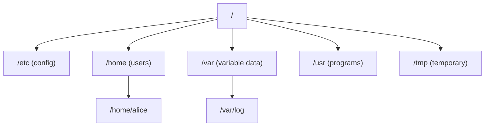

## What is a File System?

A file system organizes data on storage devices into a hierarchy of files and directories. It manages how data is stored, retrieved, and updated on disk.



---

## Linux Directory Structure

| Path | Purpose |
|------|---------|
| `/` | Root — everything starts here |
| `/bin` | Essential binaries (ls, cp, cat) |
| `/etc` | System configuration files |
| `/home` | User home directories |
| `/var` | Variable data (logs, databases, mail) |
| `/tmp` | Temporary files (cleared on reboot) |
| `/usr` | User programs and libraries |
| `/opt` | Optional/third-party software |
| `/proc` | Virtual filesystem — process info |
| `/dev` | Device files (disks, terminals) |
| `/mnt`, `/media` | Mount points for external storage |

---

## File System Types

| FS | OS | Features | Use Case |
|----|-----|----------|----------|
| ext4 | Linux | Journaling, mature, reliable | Default Linux FS |
| XFS | Linux | High performance, large files | Enterprise, databases |
| Btrfs | Linux | Snapshots, compression, RAID | Advanced Linux |
| NTFS | Windows | ACLs, encryption, journaling | Windows default |
| APFS | macOS | Snapshots, encryption, SSD-optimized | macOS/iOS |
| FAT32 | Cross-platform | Simple, universal | USB drives, boot partitions |
| ZFS | Linux/BSD | Checksums, snapshots, RAID-Z | Storage servers |

---

## Key Concepts

### Inodes

Every file has an inode — metadata about the file (NOT the filename):

| Inode Contains | NOT in Inode |
|---------------|-------------|
| File size | Filename |
| Permissions | File content |
| Owner/group | — |
| Timestamps (created, modified, accessed) | — |
| Pointers to data blocks | — |

The directory is just a table mapping filenames → inode numbers.

### Hard Links vs Symbolic Links

| Type | What It Is | Crosses FS? | Target Deleted? |
|------|-----------|:-:|---|
| Hard link | Another name for same inode | No | File still accessible |
| Symlink | Pointer to a path (like shortcut) | Yes | Broken link (dangling) |

```bash
ln file.txt hardlink.txt       # hard link
ln -s file.txt symlink.txt     # symbolic link
```

### Journaling

A journal records changes before applying them — if the system crashes mid-write, the journal enables recovery:

```text
1. Write intent to journal
2. Apply changes to file system
3. Mark journal entry complete
```

Without journaling: crash during write → corrupted file system.

---

## Mounting

In Linux, storage devices are "mounted" into the directory tree:

```bash
# Mount a device
mount /dev/sdb1 /mnt/usb

# View mounted filesystems
df -h                    # disk usage
mount | column -t        # all mounts
lsblk                   # block devices

# Unmount
umount /mnt/usb
```

### /etc/fstab — Persistent Mounts

```text
# device          mount-point    type    options         dump  pass
/dev/sda1         /              ext4    defaults        0     1
/dev/sda2         /home          ext4    defaults        0     2
UUID=abc-123      /data          xfs     defaults,noatime 0    2
```

---

## Disk Usage and Management

```bash
# Check disk space
df -h                    # filesystem usage
du -sh /var/log          # directory size
du -sh * | sort -rh      # largest items in current dir

# Find large files
find / -type f -size +100M -exec ls -lh {} \;

# Check inode usage (can run out of inodes before disk space!)
df -i
```

---

## Key Takeaways

1. **Everything in Linux is a file** — devices, processes, sockets
2. **Inodes store metadata**, directories map names to inodes
3. **Journaling** prevents corruption on crash (ext4, XFS)
4. **`df -h`** for disk space, **`du -sh`** for directory sizes
5. **Mount points** attach storage into the directory tree
6. **You can run out of inodes** before running out of disk space
