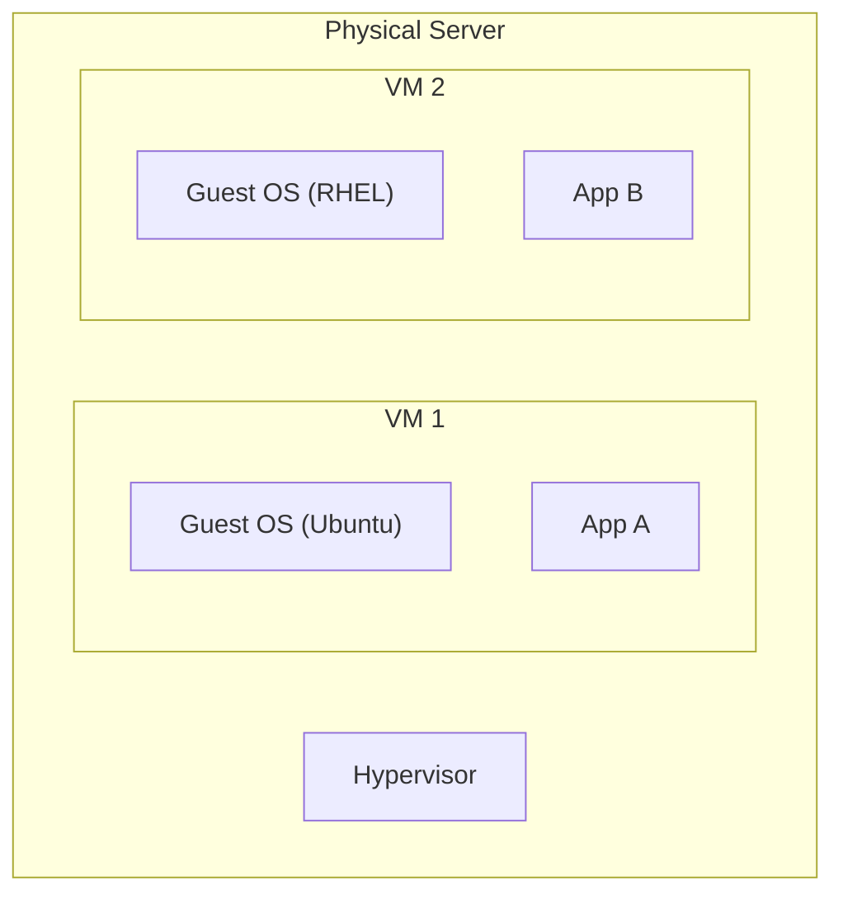
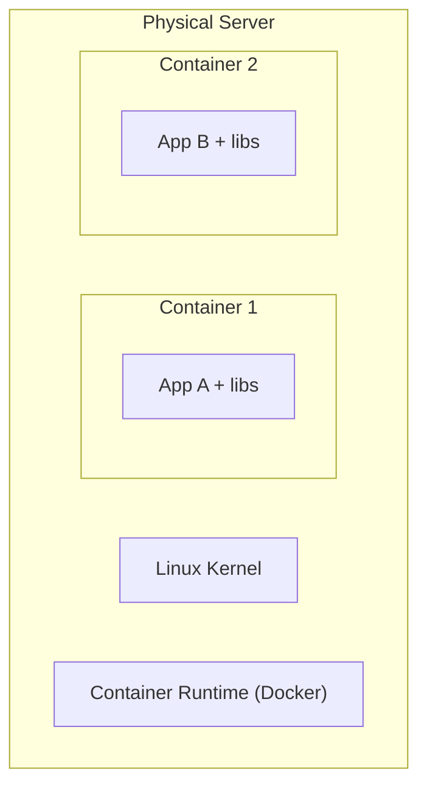

## The Problem: "Works on My Machine"

Applications depend on specific OS versions, libraries, and configurations. Virtualization and containers solve this by packaging the environment with the application.

---

## Virtualization (Virtual Machines)

A hypervisor creates virtual hardware — each VM runs its own complete OS:



### Hypervisor Types

| Type | Description | Examples |
|------|-------------|---------|
| Type 1 (bare-metal) | Runs directly on hardware | VMware ESXi, KVM, Xen, Hyper-V |
| Type 2 (hosted) | Runs on top of a host OS | VirtualBox, VMware Workstation |

### VM Characteristics

| Aspect | Value |
|--------|-------|
| Isolation | Full (separate kernel) |
| Boot time | Minutes |
| Size | Gigabytes (full OS) |
| Overhead | High (duplicate OS per VM) |
| Use case | Different OS requirements, strong isolation |

---

## Containers

Containers share the host kernel but isolate the application's filesystem, processes, and network:



### VMs vs Containers

| Aspect | Virtual Machine | Container |
|--------|----------------|-----------|
| Isolation | Full (own kernel) | Process-level (shared kernel) |
| Boot time | Minutes | Seconds |
| Size | Gigabytes | Megabytes |
| Overhead | High | Minimal |
| Density | 10s per host | 100s per host |
| Portability | Less (hypervisor-specific) | High (OCI standard) |
| Security | Stronger isolation | Weaker (shared kernel) |

### Linux Kernel Features Enabling Containers

| Feature | Purpose |
|---------|---------|
| **Namespaces** | Isolate what a process can see (PID, network, filesystem, users) |
| **cgroups** | Limit resources (CPU, memory, I/O) |
| **Union filesystems** | Layer filesystem images efficiently |

---

## Docker

The most popular container platform:

### Dockerfile

```dockerfile
FROM python:3.12-slim
WORKDIR /app
COPY requirements.txt .
RUN pip install -r requirements.txt
COPY . .
EXPOSE 8000
CMD ["python", "app.py"]
```

### Key Commands

```bash
# Build image
docker build -t myapp:1.0 .

# Run container
docker run -d -p 8080:8000 --name myapp myapp:1.0

# List running containers
docker ps

# View logs
docker logs myapp

# Stop and remove
docker stop myapp
docker rm myapp

# List images
docker images
```

### Image Layers

Each Dockerfile instruction creates a layer — layers are cached and shared:

```text
Layer 4: COPY . .              (your code — changes often)
Layer 3: RUN pip install ...   (dependencies — changes sometimes)
Layer 2: COPY requirements.txt (triggers rebuild if deps change)
Layer 1: FROM python:3.12-slim (base — rarely changes)
```

**Best practice:** Put frequently-changing instructions last to maximize cache hits.

---

## Container Orchestration

Running containers in production requires orchestration:

| Tool | Description | Scale |
|------|-------------|-------|
| Docker Compose | Multi-container on single host | Development |
| ECS (AWS) | Managed container service | Production |
| Kubernetes (K8s) | Industry-standard orchestrator | Large-scale production |

### What Orchestrators Do

- **Scheduling** — place containers on available hosts
- **Scaling** — add/remove containers based on load
- **Health checks** — restart failed containers
- **Networking** — service discovery, load balancing
- **Rolling updates** — deploy without downtime

---

## Container Best Practices

| Practice | Why |
|----------|-----|
| Use minimal base images (Alpine, slim) | Smaller = faster + fewer vulnerabilities |
| Don't run as root | Security — limit blast radius |
| One process per container | Simplicity, better orchestration |
| Use multi-stage builds | Smaller final image (no build tools) |
| Pin image versions | Reproducibility (`python:3.12.1`, not `python:latest`) |
| Don't store data in containers | Containers are ephemeral — use volumes |

---

## Key Takeaways

1. **VMs** = full OS isolation (strong security, heavy). **Containers** = process isolation (lightweight, fast)
2. **Containers share the host kernel** — that's why they're fast but less isolated
3. **Docker** packages apps with their dependencies into portable images
4. **Layer caching** makes builds fast — order Dockerfile instructions wisely
5. **Orchestrators** (ECS, K8s) manage containers in production
6. **Containers are ephemeral** — don't store state inside them
