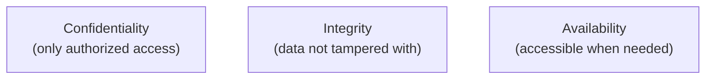
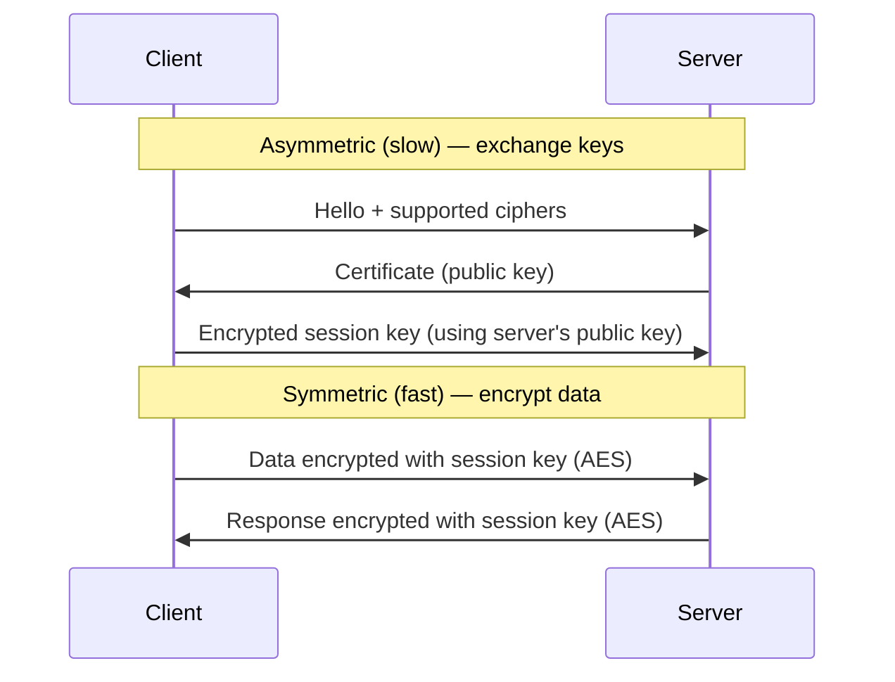

## The CIA Triad

All security aims to protect three properties:

| Property | Threat | Protection |
|----------|--------|-----------|
| Confidentiality | Data breach, eavesdropping | Encryption, access control |
| Integrity | Tampering, corruption | Hashing, digital signatures |
| Availability | DDoS, hardware failure | Redundancy, backups |

---

## Encryption

### Symmetric Encryption

Same key encrypts and decrypts — fast, used for bulk data:

| Algorithm | Key Size | Use Case |
|-----------|----------|----------|
| AES-256 | 256 bits | Data at rest, TLS data transfer |
| ChaCha20 | 256 bits | Mobile, TLS alternative |

### Asymmetric Encryption

Key pair (public + private) — slower, used for key exchange and signatures:

| Algorithm | Use Case |
|-----------|----------|
| RSA | Legacy key exchange, signatures |
| ECDSA | Modern signatures (SSH, TLS) |
| Ed25519 | SSH keys, modern signatures |

### How TLS Uses Both

### Hashing

One-way function — can't reverse the output back to input:

| Algorithm | Output | Use Case |
|-----------|--------|----------|
| SHA-256 | 256 bits | File integrity, blockchain |
| bcrypt | Variable | Password storage |
| Argon2 | Variable | Password storage (modern) |

**Never store passwords in plain text.** Always hash with a salt (bcrypt/Argon2).

---

## Common Vulnerabilities

| Vulnerability | Description | Prevention |
|--------------|-------------|-----------|
| SQL Injection | Malicious SQL in user input | Parameterized queries |
| XSS | Inject scripts into web pages | Output encoding, CSP |
| CSRF | Trick user into unwanted actions | CSRF tokens |
| Path Traversal | Access files outside intended directory | Input validation |
| Insecure Deserialization | Execute code via crafted objects | Validate input types |
| Secrets in Code | API keys committed to git | Environment variables, secrets manager |

---

## Defense in Depth

Multiple layers of security — if one fails, others still protect:

| Layer | Controls |
|-------|----------|
| Network | Firewalls, VPN, segmentation |
| Host | OS hardening, patching, antivirus |
| Application | Input validation, auth, encryption |
| Data | Encryption at rest, access control, backups |
| People | Training, least privilege, MFA |

---

## Principle of Least Privilege

Every user, process, and system should have only the minimum permissions needed:

| Bad | Good |
|-----|------|
| App runs as root | App runs as dedicated user |
| Admin access for everyone | Role-based access (RBAC) |
| Wildcard IAM policies (`*`) | Specific resource + action |
| Shared credentials | Individual accounts + MFA |

---

## Secrets Management

| Method | Security | Use Case |
|--------|----------|----------|
| Hardcoded in source | ❌ Terrible | Never |
| Environment variables | ⚠️ Acceptable | Local dev, CI/CD |
| Secrets manager (AWS SM, Vault) | ✅ Best | Production |
| Encrypted config files | ⚠️ Acceptable | When secrets manager unavailable |

---

## Key Takeaways

1. **CIA triad** — every security decision protects confidentiality, integrity, or availability
2. **Encrypt everything** — at rest (AES) and in transit (TLS)
3. **Never store plain-text passwords** — use bcrypt or Argon2
4. **Least privilege** — minimum permissions needed, nothing more
5. **Defense in depth** — multiple layers, not a single control
6. **Secrets in a secrets manager** — never in code or git
7. **Patch regularly** — most breaches exploit known vulnerabilities
