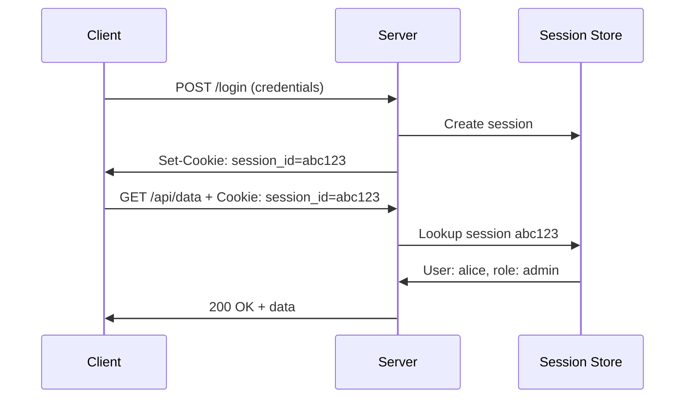
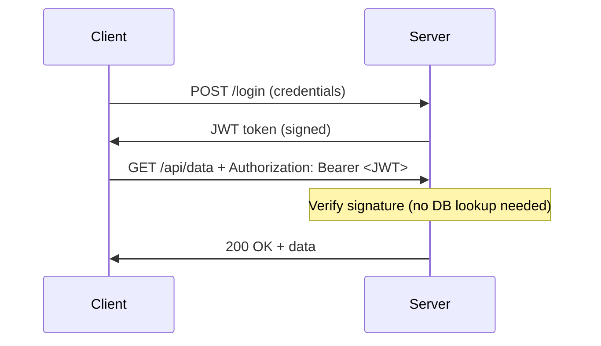
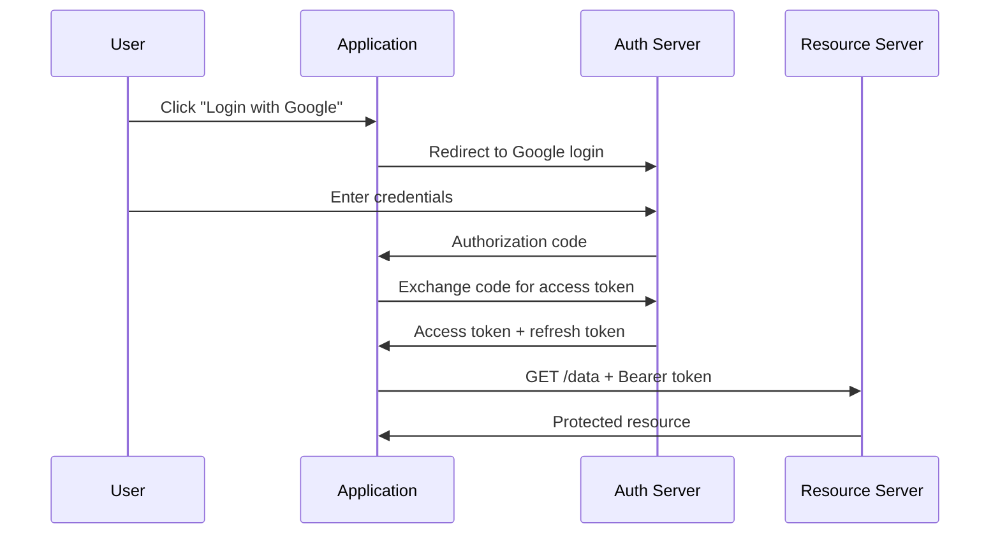

## AuthN vs AuthZ

| Concept | Question | Example |
|---------|----------|---------|
| **Authentication (AuthN)** | Who are you? | Login with username/password |
| **Authorization (AuthZ)** | What can you do? | Can this user delete records? |

Authentication always comes first — you must know WHO before deciding WHAT they can access.

---

## Authentication Methods

| Method | How It Works | Security | Use Case |
|--------|-------------|----------|----------|
| Password | User provides secret string | Low (phishing, reuse) | Legacy, with MFA |
| MFA | Password + second factor | High | All production systems |
| API Key | Static token in header | Medium | Service-to-service (simple) |
| OAuth 2.0 + OIDC | Token-based delegation | High | Web apps, SSO |
| mTLS | Both sides present certificates | Very high | Service mesh, zero-trust |
| SSH Keys | Public/private key pair | High | Server access |

### Multi-Factor Authentication (MFA)

Combines two or more factors:

| Factor | Type | Example |
|--------|------|---------|
| Something you know | Knowledge | Password, PIN |
| Something you have | Possession | Phone (TOTP), hardware key (YubiKey) |
| Something you are | Biometric | Fingerprint, face |

---

## Token-Based Authentication

### Session Tokens (Traditional)



### JWT (JSON Web Token)

Stateless — the token itself contains the user info:

```text
eyJhbGciOiJIUzI1NiJ9.eyJzdWIiOiJhbGljZSIsInJvbGUiOiJhZG1pbiJ9.signature
│─── Header ───│──────── Payload ────────│── Signature ──│
```



| Aspect | Session | JWT |
|--------|---------|-----|
| Storage | Server-side (DB/Redis) | Client-side |
| Scalability | Needs shared session store | Stateless (any server can verify) |
| Revocation | Easy (delete session) | Hard (must wait for expiry or use blocklist) |
| Size | Small cookie | Larger (contains claims) |

---

## OAuth 2.0 and OpenID Connect

### OAuth 2.0 — Authorization

"Allow App X to access my data on Service Y without giving App X my password."



### OpenID Connect (OIDC) — Authentication on top of OAuth

Adds an **ID token** (JWT) that contains user identity claims (name, email, etc.).

---

## Authorization Models

### RBAC (Role-Based Access Control)

Assign permissions to roles, assign roles to users:

```text
Roles:
  admin  → [create, read, update, delete]
  editor → [create, read, update]
  viewer → [read]

Users:
  alice → admin
  bob   → editor
  carol → viewer
```

### ABAC (Attribute-Based Access Control)

Decisions based on attributes of user, resource, and environment:

```text
IF user.department == "engineering"
AND resource.classification == "internal"
AND time.hour BETWEEN 9 AND 17
THEN allow
```

### Policy Example (AWS IAM)

```json
{
  "Effect": "Allow",
  "Action": ["s3:GetObject"],
  "Resource": "arn:aws:s3:::my-bucket/*",
  "Condition": {
    "IpAddress": {"aws:SourceIp": "10.0.0.0/16"}
  }
}
```

---

## Key Takeaways

1. **AuthN = who you are**, **AuthZ = what you can do** — always in that order
2. **MFA is mandatory** for production systems — passwords alone are insufficient
3. **JWTs are stateless** — great for microservices, but hard to revoke
4. **OAuth 2.0** delegates authorization; **OIDC** adds authentication
5. **RBAC** for most applications; **ABAC** when you need fine-grained, context-aware rules
6. **Least privilege** — start with no access, grant only what's needed
