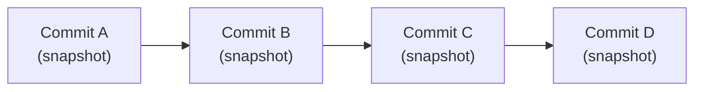
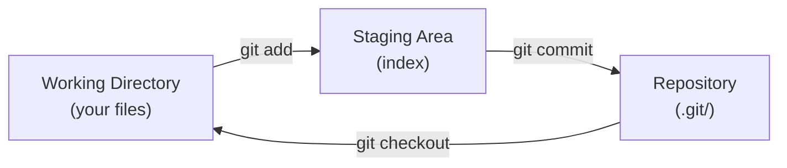
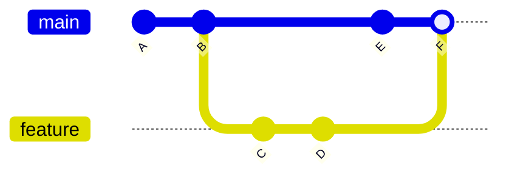
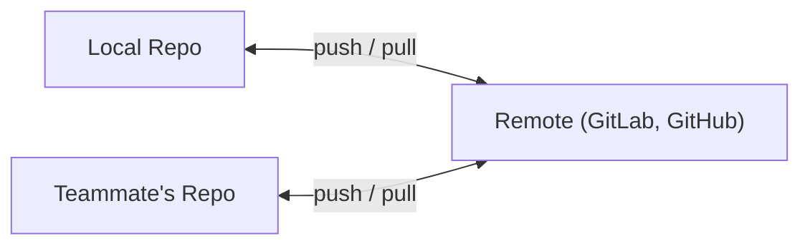

## What is Version Control?

Version control tracks changes to files over time, enabling collaboration, history, and rollback. Git is the industry standard — used by virtually every software team.

---

## Git's Data Model

Git stores snapshots, not diffs. Each commit is a complete snapshot of all tracked files:



### Key Objects

| Object | Contains |
|--------|----------|
| Blob | File content (any version) |
| Tree | Directory listing (blobs + subtrees) |
| Commit | Tree pointer + parent + author + message |
| Tag | Named pointer to a commit |

---

## The Three Areas



| Area | Purpose |
|------|---------|
| Working Directory | Files you see and edit |
| Staging Area (Index) | Changes selected for next commit |
| Repository (.git/) | Complete history of all commits |

---

## Branching

Branches are lightweight pointers to commits — creating a branch is instant:



### Common Branch Operations

```bash
git branch                    # list branches
git branch feature-x          # create branch
git checkout feature-x        # switch to branch
git checkout -b feature-x     # create + switch (shortcut)
git branch -d feature-x       # delete (if merged)
```

---

## Merging

### Fast-Forward Merge

When the target branch hasn't diverged — just moves the pointer:

```text
Before: main → A → B    feature → C → D
After:  main → A → B → C → D
```

### Three-Way Merge

When both branches have new commits — creates a merge commit:

```text
Before: main → A → B → E    feature → C → D
After:  main → A → B → E → F (merge commit combining E and D)
```

### Merge Conflicts

When both branches modify the same lines:

```text
<<<<<<< HEAD
current branch content
=======
incoming branch content
>>>>>>> feature-x
```

Resolution: edit the file to the desired state, then `git add` and `git commit`.

---

## Rebase vs Merge

| Aspect | Merge | Rebase |
|--------|-------|--------|
| History | Preserves (merge commit) | Rewrites (linear) |
| Conflicts | Resolve once | Resolve per commit |
| Safety | Non-destructive | Rewrites history (dangerous if shared) |
| Use case | Shared branches | Local cleanup before push |

**Golden rule:** Never rebase commits that have been pushed to a shared branch.

---

## Remote Repositories



```bash
git remote -v                 # list remotes
git fetch origin              # download changes (don't merge)
git pull origin main          # fetch + merge
git push origin feature-x    # upload branch
```

### Fetch vs Pull

| Command | Does |
|---------|------|
| `git fetch` | Downloads new commits from remote (safe, no changes to working dir) |
| `git pull` | Fetch + merge into current branch (may cause conflicts) |

---

## Essential Workflow

```bash
# 1. Start from latest main
git checkout main
git pull origin main

# 2. Create feature branch
git checkout -b feature/TICKET-123-description

# 3. Make changes, commit
git add file1.py file2.py
git commit -m "feat(auth): add OAuth login flow"

# 4. Push and create merge request
git push -u origin feature/TICKET-123-description
# → Create MR in GitLab/GitHub

# 5. After review, merge to main
# (usually done via UI)
```

---

## Undoing Things

| Situation | Command |
|-----------|---------|
| Unstage a file | `git reset HEAD file.txt` |
| Discard local changes | `git checkout -- file.txt` |
| Amend last commit (unpushed) | `git commit --amend` |
| Revert a pushed commit | `git revert <commit-hash>` |
| View what changed | `git diff`, `git log --oneline` |

---

## Key Takeaways

1. **Git stores snapshots**, not diffs — each commit is a complete state
2. **Three areas:** working directory → staging → repository
3. **Branches are cheap** — use them for every feature/fix
4. **Never rebase shared branches** — it rewrites history others depend on
5. **Commit messages matter** — use conventional commits (`feat:`, `fix:`, `chore:`)
6. **`git fetch` is safe**, `git pull` may cause conflicts
7. **Small, frequent commits** are better than large, infrequent ones
