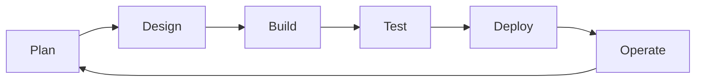
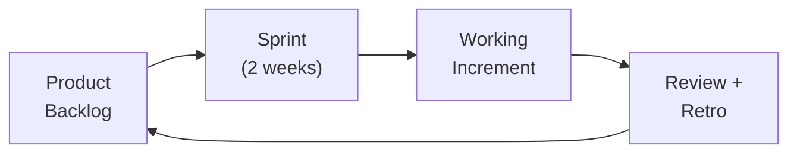
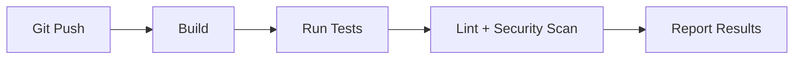
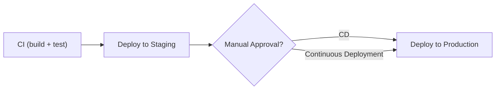
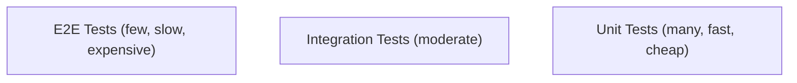

## What is the SDLC?

The Software Development Lifecycle is the process of planning, creating, testing, deploying, and maintaining software. Different methodologies organize these phases differently, but the activities are universal.

---

## SDLC Phases



| Phase | Activities | Outputs |
|-------|-----------|---------|
| Plan | Requirements, prioritization, estimation | User stories, backlog |
| Design | Architecture, API contracts, data models | Design docs, ADRs |
| Build | Write code, unit tests, code review | Working software |
| Test | Integration tests, QA, UAT | Test reports, bug fixes |
| Deploy | Release to production | Running service |
| Operate | Monitor, maintain, support | Metrics, incident responses |

---

## Methodologies

### Waterfall

Sequential phases — each completes before the next begins:

```text
Requirements → Design → Implementation → Testing → Deployment → Maintenance
```

| Pros | Cons |
|------|------|
| Clear milestones | Late feedback |
| Predictable timeline | Expensive to change |
| Good for fixed requirements | Risk concentrated at end |

### Agile (Scrum)

Iterative — deliver working software in short cycles (sprints):



| Ceremony | Purpose | Duration |
|----------|---------|----------|
| Sprint Planning | Select work for sprint | 2-4 hours |
| Daily Standup | Sync, unblock | 15 minutes |
| Sprint Review | Demo to stakeholders | 1 hour |
| Retrospective | Improve process | 1 hour |

### Kanban

Continuous flow — no fixed sprints, limit work in progress:

```text
TO DO → IN PROGRESS (WIP limit: 3) → REVIEW → DONE
```

| Aspect | Scrum | Kanban |
|--------|-------|--------|
| Cadence | Fixed sprints | Continuous flow |
| Roles | Scrum Master, PO, Team | No prescribed roles |
| Planning | Sprint planning | Just-in-time |
| Best for | Feature development | Support, ops, maintenance |

---

## CI/CD (Continuous Integration / Continuous Delivery)

### Continuous Integration

Every code change is automatically built and tested:



### Continuous Delivery / Deployment

| Term | Meaning |
|------|---------|
| Continuous Delivery | Every change CAN be deployed (manual trigger) |
| Continuous Deployment | Every change IS deployed automatically |



### Pipeline Stages

```text
Commit → Build → Unit Tests → Integration Tests → Security Scan → Deploy (test) → Deploy (prod)
```

---

## Testing Pyramid



| Level | Tests | Speed | Scope |
|-------|-------|-------|-------|
| Unit | Individual functions/classes | Milliseconds | Single component |
| Integration | Components working together | Seconds | Multiple components |
| E2E | Full user workflows | Minutes | Entire system |

**Rule:** Many unit tests, fewer integration tests, minimal E2E tests.

---

## Environments

| Environment | Purpose | Who Uses It |
|-------------|---------|-------------|
| Local (dev) | Developer's machine | Individual developer |
| Test | Automated testing | CI/CD pipeline |
| Staging (pre) | Production-like validation | QA, stakeholders |
| Production | Real users | Everyone |

**Principle:** Environments should be as similar as possible. Differences between staging and production cause "works in staging, breaks in prod" bugs.

---

## Deployment Strategies

| Strategy | How It Works | Risk | Rollback |
|----------|-------------|------|----------|
| Big Bang | Replace everything at once | High | Redeploy old version |
| Rolling | Replace instances gradually | Medium | Stop rollout |
| Blue/Green | Two identical environments, switch traffic | Low | Switch back |
| Canary | Route small % of traffic to new version | Low | Route back to old |

---

## Key Takeaways

1. **SDLC is cyclical** — plan, build, test, deploy, operate, repeat
2. **Agile delivers value incrementally** — small batches, fast feedback
3. **CI/CD automates the path to production** — build, test, deploy on every commit
4. **Testing pyramid** — many unit tests, fewer integration, minimal E2E
5. **Environments should match production** — minimize "works on my machine"
6. **Blue/green and canary** reduce deployment risk
7. **The methodology matters less than the principles** — fast feedback, small batches, automation
