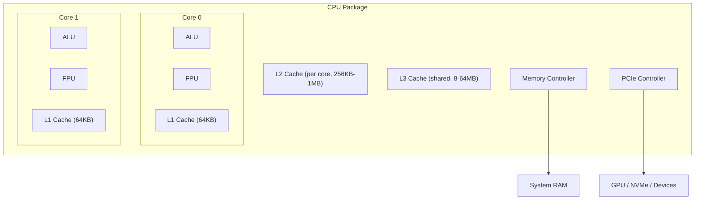
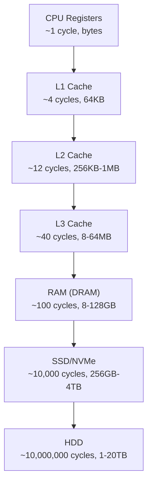
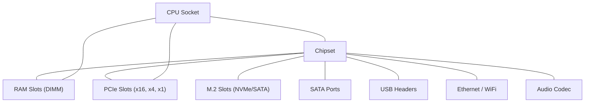

## Overview

Understanding computer hardware is the foundation of IT literacy. Every piece of software ultimately runs on physical components — processors, memory, storage, and interconnects. Knowing how these parts work, interact, and fail gives you a mental model for performance tuning, troubleshooting, and system design.

---

## The Central Processing Unit (CPU)

The CPU executes instructions. It's the brain of the computer, but a very specific kind of brain — one that does billions of simple operations per second.

### Architecture



### Key Concepts

| Concept | Description |
|---------|-------------|
| **Clock speed** | Cycles per second (GHz). Higher = more operations per second, but not the full picture |
| **IPC** | Instructions Per Clock — how much work each cycle does. Architecture-dependent |
| **Cores** | Independent processing units. More cores = better parallelism |
| **Threads (SMT/HT)** | Simultaneous Multithreading — one core handles two threads by utilizing idle execution units |
| **TDP** | Thermal Design Power (watts) — heat output under sustained load |
| **Process node** | Manufacturing size (nm). Smaller = more transistors, less power, more heat density |

### The Instruction Pipeline

Modern CPUs don't execute one instruction at a time. They use **pipelining** — breaking execution into stages so multiple instructions are in-flight simultaneously:

```
Fetch → Decode → Execute → Memory Access → Write Back
```

| Technique | Purpose |
|-----------|---------|
| **Branch prediction** | Guess which path a conditional will take to avoid pipeline stalls |
| **Out-of-order execution** | Execute instructions in a different order than written, when dependencies allow |
| **Speculative execution** | Execute ahead of known results, discard if prediction was wrong |
| **Register renaming** | Avoid false dependencies by mapping logical registers to physical ones |

### CPU Families

| Vendor | Family | Use Case |
|--------|--------|----------|
| Intel | Core (i3/i5/i7/i9) | Consumer desktops/laptops |
| Intel | Xeon | Servers, workstations (ECC RAM, more cores) |
| AMD | Ryzen | Consumer desktops/laptops |
| AMD | EPYC | Servers (high core counts, PCIe lanes) |
| Apple | M-series (M1–M4) | Mac — unified memory architecture, ARM-based |
| ARM | Cortex-A / Neoverse | Mobile, embedded, cloud (AWS Graviton) |

### x86 vs ARM

| Aspect | x86 (Intel/AMD) | ARM (Apple/Qualcomm/AWS) |
|--------|-----------------|--------------------------|
| Instruction set | CISC (Complex) | RISC (Reduced) |
| Power efficiency | Higher power draw | Excellent perf/watt |
| Software ecosystem | Dominant in desktop/server | Dominant in mobile, growing in server |
| Decode complexity | Complex, variable-length instructions | Simpler, fixed-length instructions |

---

## Memory (RAM)

RAM is volatile, fast storage that the CPU accesses directly. When the system loses power, RAM contents are lost.

### Memory Hierarchy

Speed and capacity are inversely related:



### DDR Generations

| Generation | Speed (MT/s) | Voltage | Typical Capacity |
|-----------|-------------|---------|------------------|
| DDR3 | 800–2133 | 1.5V | 2–8 GB/stick |
| DDR4 | 2133–5600 | 1.2V | 8–32 GB/stick |
| DDR5 | 4800–8400+ | 1.1V | 16–64 GB/stick |

### Key RAM Concepts

- **Channels** — Dual-channel doubles bandwidth by using two sticks in parallel. Always install RAM in pairs for matched channels.
- **ECC (Error-Correcting Code)** — Detects and corrects single-bit errors. Required for servers (Xeon/EPYC), not supported on consumer platforms.
- **CAS Latency (CL)** — The delay between requesting data and receiving it, measured in clock cycles. Lower is better, but raw speed often matters more.
- **DIMM vs SO-DIMM** — Desktop modules vs laptop modules (smaller form factor).

### How Much RAM Do You Need?

| Use Case | Minimum | Recommended |
|----------|---------|-------------|
| Web browsing, office | 8 GB | 16 GB |
| Software development | 16 GB | 32 GB |
| Virtual machines, containers | 32 GB | 64 GB |
| Video editing, 3D rendering | 32 GB | 64–128 GB |
| Machine learning training | 64 GB | 128+ GB |

---

## Storage

Storage retains data without power. The two main technologies are fundamentally different:

### HDD (Hard Disk Drive)

Mechanical: spinning magnetic platters with a read/write head on an actuator arm.

| Characteristic | Value |
|---------------|-------|
| Sequential read | 100–250 MB/s |
| Random read (4K) | 0.5–2 MB/s |
| Latency | 5–15 ms (seek time) |
| Endurance | Near-unlimited writes |
| Best for | Bulk storage, backups, archives |
| Failure mode | Mechanical — vibration, wear |

### SSD (Solid State Drive)

Electronic: NAND flash memory with no moving parts.

| Interface | Sequential Read | Random Read (4K) | Latency |
|-----------|----------------|-----------------|---------|
| SATA SSD | ~550 MB/s | ~50 MB/s | ~0.1 ms |
| NVMe (PCIe 3.0) | ~3,500 MB/s | ~500 MB/s | ~0.02 ms |
| NVMe (PCIe 4.0) | ~7,000 MB/s | ~700 MB/s | ~0.02 ms |
| NVMe (PCIe 5.0) | ~12,000 MB/s | ~1,000 MB/s | ~0.02 ms |

### NAND Flash Types

| Type | Bits/Cell | Speed | Endurance | Cost |
|------|-----------|-------|-----------|------|
| SLC | 1 | Fastest | Highest | Most expensive |
| MLC | 2 | Fast | Good | Moderate |
| TLC | 3 | Moderate | Moderate | Affordable |
| QLC | 4 | Slowest | Lowest | Cheapest |

### Form Factors

| Form Factor | Interface | Where Used |
|-------------|-----------|-----------|
| 3.5" | SATA | Desktop HDDs |
| 2.5" | SATA | Laptop HDDs/SSDs |
| M.2 2280 | SATA or NVMe | Modern desktops/laptops |
| U.2 | NVMe | Enterprise servers |
| PCIe Add-in Card | NVMe | Workstations, servers |

---

## Graphics Processing Unit (GPU)

GPUs are massively parallel processors. Originally for rendering graphics, now critical for machine learning, scientific computing, and video processing.

### CPU vs GPU Architecture

| Aspect | CPU | GPU |
|--------|-----|-----|
| Cores | 4–128 complex cores | 1,000–16,000+ simple cores |
| Optimized for | Low-latency, serial tasks | High-throughput, parallel tasks |
| Memory | System RAM (shared) | Dedicated VRAM (fast, private) |
| Good at | Decision-making, branching | Matrix math, identical operations on many data points |

### GPU Memory (VRAM)

| Type | Bandwidth | Used In |
|------|-----------|---------|
| GDDR6 | ~500 GB/s | Consumer GPUs (RTX 4070, RX 7800) |
| GDDR6X | ~1,000 GB/s | High-end consumer (RTX 4090) |
| HBM2e/HBM3 | 2,000–5,000 GB/s | Data center AI (A100, H100, MI300X) |

### Use Cases by Domain

| Domain | GPU Need | Why |
|--------|----------|-----|
| Gaming | Mid-to-high | Real-time rendering, shaders |
| 3D rendering | High | Ray tracing, path tracing |
| Video editing | Moderate | Encoding/decoding acceleration |
| Machine learning (inference) | Moderate | Matrix multiplication |
| Machine learning (training) | Extreme | Massive parallel tensor operations |
| Cryptocurrency mining | Extreme | Parallel hash computation |

---

## The Motherboard

The motherboard is the central PCB connecting all components.

### Key Components



### Socket Types

| Socket | Platform | CPU Support |
|--------|----------|-------------|
| LGA 1700 | Intel 12th–14th Gen | Core i3–i9, some Xeon |
| LGA 1851 | Intel Core Ultra (Arrow Lake) | Core Ultra 200 series |
| AM5 | AMD Ryzen 7000+ | Ryzen 5–9, Threadripper |
| AM4 | AMD Ryzen 1000–5000 | Mature, affordable |
| sTR5 | AMD Threadripper | High-end workstation |
| SP5 | AMD EPYC | Server |

### Chipset Role

The chipset manages communication between the CPU and lower-speed peripherals (SATA, USB, audio, extra PCIe lanes). Higher-tier chipsets provide more:
- PCIe lanes
- USB ports
- Overclocking support
- Multi-GPU support

### Form Factors

| Form Factor | Size (mm) | Expansion Slots | Use Case |
|-------------|-----------|-----------------|----------|
| ATX | 305 × 244 | 7 | Standard desktops |
| Micro-ATX | 244 × 244 | 4 | Compact desktops |
| Mini-ITX | 170 × 170 | 1 | Small form factor builds |
| E-ATX | 305 × 330 | 7+ | Workstations, servers |

---

## Power Supply Unit (PSU)

The PSU converts AC mains power to the DC voltages components need (+12V, +5V, +3.3V).

### Key Specifications

| Spec | Meaning |
|------|---------|
| Wattage | Total power output capacity |
| Efficiency rating | 80 Plus Bronze/Gold/Platinum/Titanium — less waste heat |
| Modularity | Fixed / Semi / Fully modular cable management |
| Rail design | Single +12V rail (simpler) vs multi-rail (protection per connector) |

### How Much Wattage?

| System Type | Recommended PSU |
|-------------|----------------|
| Office / basic | 350–450W |
| Mid-range gaming | 550–650W |
| High-end gaming (RTX 4080+) | 750–850W |
| Workstation (multi-GPU) | 1000–1600W |

**Rule of thumb:** Add up CPU TDP + GPU TDP + 100W for the rest, then add 20–30% headroom.

### ATX Power Connectors

| Connector | Purpose |
|-----------|---------|
| 24-pin ATX | Main motherboard power |
| 8-pin (4+4) EPS | CPU power |
| 8-pin (6+2) PCIe | GPU power |
| 12VHPWR / 12V-2x6 | New GPU power (RTX 40/50 series) |
| SATA power | Drives, fans |
| Molex | Legacy devices |

---

## Buses and Interconnects

Buses are communication pathways between components.

### PCIe (Peripheral Component Interconnect Express)

The primary high-speed bus for GPUs, NVMe SSDs, network cards, and more.

| Generation | Bandwidth per Lane | x16 Total |
|------------|-------------------|-----------|
| PCIe 3.0 | ~1 GB/s | ~16 GB/s |
| PCIe 4.0 | ~2 GB/s | ~32 GB/s |
| PCIe 5.0 | ~4 GB/s | ~64 GB/s |
| PCIe 6.0 | ~8 GB/s | ~128 GB/s |

Lane widths: x1, x4, x8, x16. A device can use fewer lanes than the slot provides.

### Other Interconnects

| Bus | Speed | Use |
|-----|-------|-----|
| SATA III | 600 MB/s | Legacy SSDs, HDDs, optical drives |
| USB 3.2 Gen 2 | 10 Gbps | Peripherals, external storage |
| USB4 / Thunderbolt 4 | 40 Gbps | Docks, eGPUs, high-speed peripherals |
| Thunderbolt 5 | 80 Gbps (120 Gbps asymmetric) | Next-gen docking, displays |
| DisplayPort 2.1 | 80 Gbps | High-res, high-refresh monitors |
| HDMI 2.1 | 48 Gbps | TVs, monitors |

---

## Cooling

Every watt of power consumed becomes heat. Without cooling, components throttle or fail.

### Cooling Methods

| Method | Use Case | Noise | Effectiveness |
|--------|----------|-------|---------------|
| Air (heatsink + fan) | Most systems | Moderate | Good for <150W TDP |
| AIO liquid cooler | High-performance desktops | Low–moderate | Excellent for 150–300W |
| Custom loop | Enthusiast/workstation | Very low | Best, but complex and expensive |
| Passive (fanless) | Embedded, silent PCs | Silent | Limited to <35W TDP |

### Thermal Interface Material (TIM)

Thermal paste fills microscopic gaps between the CPU die and heatsink. Quality matters — a good paste can mean 5–10°C difference under load.

### Airflow Principles

- **Positive pressure** (more intake than exhaust) — keeps dust out, preferred for most builds
- **Negative pressure** (more exhaust than intake) — slightly better cooling, pulls in dust from cracks
- **Front/bottom intake, top/rear exhaust** — follows natural convection (hot air rises)

---

## Peripherals and I/O

### Input Devices
- Keyboard (mechanical, membrane, capacitive)
- Mouse (optical, laser)
- Touchscreen (capacitive, resistive)
- Stylus/digitizer (Wacom, Apple Pencil)
- Microphone, webcam, scanner

### Output Devices
- Monitor (IPS, VA, OLED — resolution, refresh rate, response time)
- Speakers / headphones
- Printer (inkjet, laser)

### Expansion Cards
- Dedicated GPU
- Network card (10GbE, WiFi 6E/7)
- Sound card
- Capture card
- RAID controller

---

## Server vs Desktop vs Laptop Hardware

| Aspect | Desktop | Laptop | Server |
|--------|---------|--------|--------|
| CPU | Consumer (Core/Ryzen) | Mobile (lower TDP) | Xeon/EPYC (many cores, ECC) |
| RAM | DDR5 DIMM, no ECC | DDR5 SO-DIMM | Registered ECC RDIMM |
| Storage | Consumer NVMe/SATA | M.2 (soldered or slotted) | Enterprise NVMe, SAS |
| GPU | Consumer discrete | Integrated or mobile discrete | Compute GPUs (A100, H100) |
| Redundancy | None | None | Dual PSU, hot-swap drives, IPMI |
| Form factor | ATX tower | Slim, portable | Rackmount (1U, 2U, 4U) |
| Management | Local | Local | Remote (IPMI/iLO/iDRAC) |

---

## Key Takeaways

1. **CPU performance** is determined by cores × IPC × clock speed — not just GHz
2. **Memory hierarchy** matters — cache misses are expensive (100x slower to reach RAM vs L1)
3. **Storage interfaces** matter as much as the drive — NVMe over PCIe is ~10x faster than SATA
4. **GPUs** are not just for gaming — they're the backbone of modern AI and parallel computing
5. **Power and cooling** are engineering constraints — a 450W GPU needs appropriate PSU and airflow
6. **Form factor choices** cascade — pick the motherboard size first, then the case, then cooling constraints follow
7. **Server hardware** prioritizes reliability and remote management over raw consumer performance
