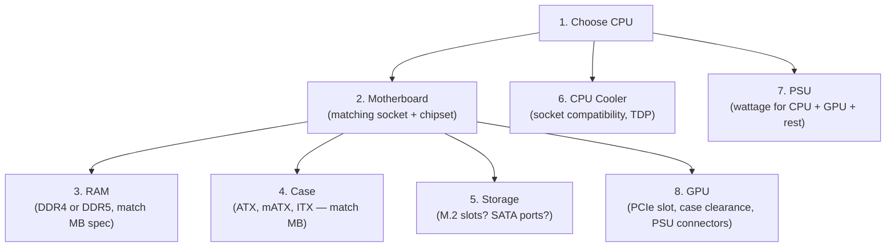
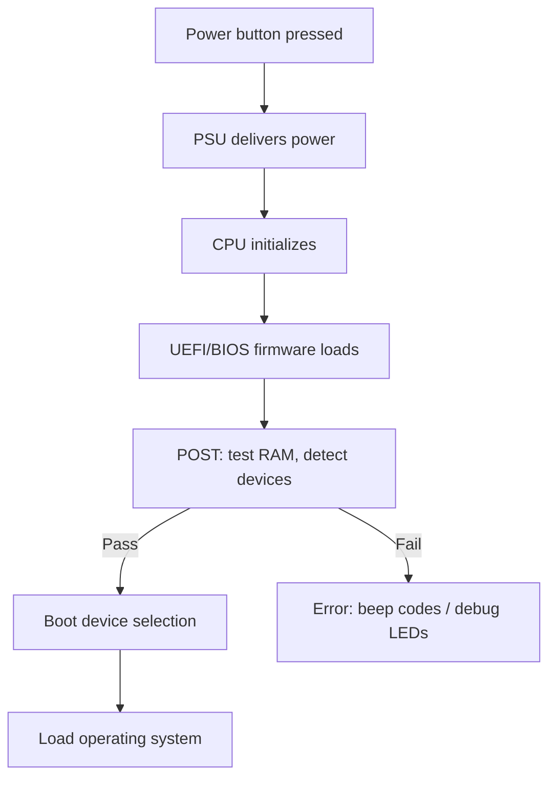

## Overview

Building a computer from components is one of the most practical IT skills. It demystifies the hardware, teaches you how everything connects, and gives you the ability to diagnose failures at the physical level. This section covers the full process from planning to first boot and troubleshooting.

---

## Planning the Build

### Compatibility Checklist

Before purchasing components, verify compatibility:



### Key Compatibility Points

| Component | Must Match |
|-----------|-----------|
| CPU ↔ Motherboard | Socket type (LGA 1700, AM5, etc.) |
| RAM ↔ Motherboard | DDR generation, speed support, number of slots |
| Motherboard ↔ Case | Form factor (ATX, Micro-ATX, Mini-ITX) |
| GPU ↔ Case | Physical length clearance |
| GPU ↔ PSU | Power connectors (8-pin, 12VHPWR) and wattage |
| CPU Cooler ↔ Case | Height clearance (tower coolers) or radiator mount points (AIO) |
| CPU Cooler ↔ CPU | Socket mounting bracket included |

### Tools Required

| Tool | Purpose |
|------|---------|
| Phillips #2 screwdriver | 90% of all PC screws |
| Phillips #1 screwdriver | M.2 screws, small standoffs |
| Anti-static wrist strap | Prevent ESD damage (or touch case metal frequently) |
| Cable ties / velcro straps | Cable management |
| Flashlight / headlamp | See inside the case |
| Thermal paste | Usually pre-applied on cooler; have backup |
| Magnetic screw tray | Don't lose screws |

---

## Step-by-Step Assembly

### Step 1: Prepare the Workspace

- Work on a large, clean, non-carpeted surface (table, desk)
- Ground yourself: wear an anti-static strap clipped to the case, or touch bare metal frequently
- Keep components in anti-static bags until ready to install
- Read the motherboard manual — it's the most important document

### Step 2: Install the CPU

**Intel (LGA — Land Grid Array):**
1. Lift the retention arm and bracket
2. Align the triangle/notch on the CPU with the socket indicator
3. Place the CPU — do NOT press down, gravity is sufficient
4. Close the bracket and lower the retention arm (requires firm force — the protective cover pops off)

**AMD (AM5 — also LGA):**
1. Lift the retention arm
2. Align the golden triangle on the CPU with the socket triangle
3. Place gently — no force needed
4. Lower the retention arm

> ⚠️ **Never touch the pins (PGA) or pads (LGA) with fingers.** Oils cause contact issues. Hold CPUs by the edges.

### Step 3: Install RAM

1. Open the retention clips on the RAM slots
2. Align the notch on the RAM stick with the slot key
3. For dual-channel: use slots A2 and B2 (typically slots 2 and 4 — check motherboard manual)
4. Press down firmly and evenly until both clips click into place

```
Slot layout (typical):
  [A1] [A2] [B1] [B2]
         ↑         ↑
   Install here for dual-channel (2 sticks)
```

> If the system doesn't boot with RAM in certain slots, try A2+B2 first, then A1+B1.

### Step 4: Install M.2 SSD

1. Locate the M.2 slot on the motherboard (usually between CPU and first PCIe x16 slot)
2. Remove the heatsink cover if present
3. Insert the M.2 drive at a 30° angle into the connector
4. Press down and secure with the M.2 screw (tiny Phillips #1)
5. Replace the heatsink (thermal pad should contact the drive's NAND chips)

### Step 5: Install the CPU Cooler

**Air cooler (tower):**
1. Apply thermal paste — a small pea-sized dot in the center of the CPU (if not pre-applied)
2. Mount the backplate (behind the motherboard)
3. Attach mounting brackets for your socket type
4. Place the heatsink, secure with screws (tighten in X-pattern, alternating corners)
5. Connect the fan cable to `CPU_FAN` header

**AIO liquid cooler:**
1. Apply thermal paste to CPU (if not pre-applied on pump block)
2. Mount the pump/block onto the CPU with appropriate bracket
3. Mount the radiator to the case (front or top — front intake is usually best for CPU temps)
4. Connect pump to `CPU_FAN` or `AIO_PUMP` header
5. Connect radiator fans to `CHA_FAN` or `CPU_OPT` headers

### Step 6: Install the Motherboard into the Case

1. Install the I/O shield in the case (if separate — many modern boards have it pre-attached)
2. Install standoffs in the case that match your motherboard's mounting holes
3. Lower the motherboard onto the standoffs, aligning the I/O ports with the shield
4. Secure with screws — don't overtighten (snug is enough)

> ⚠️ **Standoffs are critical.** Missing standoffs = flex and potential shorts. Extra standoffs where no hole exists = shorts against the PCB.

### Step 7: Install the Power Supply

1. Orient the PSU with the fan facing the ventilation grille (usually down if the case has a bottom vent)
2. Slide into the PSU bay and secure with 4 screws from the back
3. Route cables through the back of the case for cable management

### Step 8: Connect Power Cables

| Cable | Connects To | Notes |
|-------|-------------|-------|
| 24-pin ATX | Motherboard (right edge) | The big one — clip faces out |
| 8-pin EPS (4+4) | CPU power (top-left of motherboard) | Route behind the board, through top cutout |
| PCIe power (6+2 or 12VHPWR) | GPU | One cable per connector — don't daisy-chain for high-end GPUs |
| SATA power | Drives, fan hubs | Chain connector |

### Step 9: Install the GPU

1. Remove the appropriate PCIe slot covers from the case (usually 2–3 slots for modern GPUs)
2. Open the PCIe slot retention clip
3. Align the GPU with the top PCIe x16 slot
4. Press down firmly until the clip clicks
5. Secure with screws to the case bracket
6. Connect PCIe power cable(s)
7. For heavy GPUs, use a support bracket or anti-sag mount

### Step 10: Connect Front Panel Headers

The most fiddly step. Consult the motherboard manual for the exact pin layout:

| Header | Function |
|--------|----------|
| Power SW | Power button (2 pins, no polarity) |
| Reset SW | Reset button (2 pins, no polarity) |
| Power LED | Power indicator light (2 pins, polarity matters: + and −) |
| HDD LED | Storage activity light (2 pins, polarity matters) |
| USB 3.0 | Front USB ports (large 19-pin header) |
| USB-C | Front USB-C (20-pin header) |
| HD Audio | Front headphone/mic jack (9-pin header) |

### Step 11: Install Additional Storage (SATA)

1. Mount 2.5"/3.5" drives in drive bays or trays
2. Connect SATA data cable from drive to motherboard
3. Connect SATA power cable from PSU to drive

### Step 12: Cable Management

1. Route cables behind the motherboard tray
2. Use cable ties at anchor points
3. Ensure no cables obstruct fans or airflow paths
4. Tuck excess cable length into the PSU basement

---

## First Boot and BIOS/UEFI Setup

### The POST Process

When you press power, the system runs **POST** (Power-On Self-Test):



### First Boot Checklist

1. Connect monitor to GPU (not motherboard — unless using integrated graphics)
2. Connect keyboard
3. Press power button
4. Enter BIOS/UEFI (usually Delete, F2, or F12 during POST)

### BIOS/UEFI Configuration

| Setting | Recommended Action |
|---------|-------------------|
| Boot order | Set your OS drive (NVMe/SSD) as first boot device |
| XMP/EXPO profile | Enable to run RAM at advertised speed (otherwise defaults to base JEDEC) |
| Secure Boot | Enable for Windows 11 (can disable for Linux dual-boot) |
| TPM 2.0 | Enable (required for Windows 11) |
| Fan curves | Set CPU and case fan profiles (silent vs performance) |
| Resizable BAR / SAM | Enable for GPU performance (must be supported by GPU) |
| CSM (Legacy boot) | Disable — use UEFI-only boot for modern OS |

### Installing an Operating System

1. Create a bootable USB drive (Rufus for Windows, Balena Etcher for Linux ISOs)
2. Insert USB, reboot, select USB from boot menu (F12)
3. Follow the installer
4. After installation: install drivers (GPU, chipset, network)

---

## Troubleshooting Common Build Issues

### System Won't Power On (no lights, no fans)

| Check | Fix |
|-------|-----|
| PSU switch in ON position (I)? | Flip it |
| 24-pin ATX fully seated? | Reseat, listen for click |
| 8-pin CPU power connected? | Often forgotten — top-left of board |
| Front panel power switch connected correctly? | Try shorting the power pins with a screwdriver |
| PSU working? | Test with paper clip test or known-good PSU |

### Fans Spin But No Display

| Check | Fix |
|-------|-----|
| Monitor connected to GPU (not motherboard)? | Move cable to GPU output |
| GPU fully seated in PCIe slot? | Reseat, check retention clip |
| GPU power cables connected? | Every connector must be populated |
| RAM fully seated? | Reseat — try one stick at a time |
| Debug LEDs on motherboard? | Check which LED is lit (CPU/DRAM/VGA/BOOT) |

### Debug LED Guide (most modern motherboards)

| LED | Meaning | Action |
|-----|---------|--------|
| CPU | CPU not detected or failed | Reseat CPU, check for bent pins/pads |
| DRAM | Memory issue | Reseat RAM, try one stick, try different slots |
| VGA | GPU not detected | Reseat GPU, check power, try different slot |
| BOOT | No bootable device found | Check storage connections, enter BIOS to verify drive is detected |

### System Boots But Unstable (crashes, BSODs)

| Symptom | Likely Cause | Action |
|---------|-------------|--------|
| Random crashes under load | RAM not at stable speed | Disable XMP, test with MemTest86 |
| Crashes during gaming | GPU overheating or power | Check GPU temps, ensure adequate PSU |
| Crashes during CPU stress test | CPU cooler mounted improperly | Check thermal paste application, cooler pressure |
| Boot loops | BIOS settings incompatible | Clear CMOS (jumper or battery removal) |

---

## BIOS Updates

**When to update:**
- CPU not recognized (new CPU on older board)
- Stability issues with specific hardware
- Security patches (e.g., Spectre/Meltdown mitigations)

**How:**
1. Download BIOS file from motherboard manufacturer (exact model!)
2. Copy to FAT32-formatted USB drive
3. Enter BIOS → Find "Q-Flash", "EZ Flash", or "M-Flash" utility
4. Select the file from USB
5. Wait for flashing to complete — **never power off during this process**

> ⚠️ A failed BIOS update can brick the motherboard. Some boards have "BIOS Flashback" — a button that allows flashing without a working CPU/RAM.

---

## Maintenance and Upgrades

### Regular Maintenance

| Task | Frequency |
|------|-----------|
| Dust removal (compressed air) | Every 3–6 months |
| Check fan operation | Every 6 months |
| Monitor temperatures under load | Monthly (software: HWMonitor, HWiNFO) |
| Re-apply thermal paste | Every 3–5 years (or if temps rise 10°C+) |
| Check for firmware/BIOS updates | Quarterly |

### Common Upgrades (by impact)

| Upgrade | Impact | Difficulty |
|---------|--------|-----------|
| HDD → SSD | Massive — best single upgrade for responsiveness | Easy |
| Add RAM | Large — reduces swapping, enables multitasking | Easy |
| GPU upgrade | Large for gaming/AI workloads | Easy (swap and connect power) |
| CPU upgrade (same socket) | Moderate — may need BIOS update first | Moderate |
| CPU + Motherboard + RAM | Complete platform refresh — effectively a new build | Hard |

---

## Key Takeaways

1. **Compatibility first** — CPU socket, motherboard chipset, RAM generation, and case form factor must all align
2. **Read the motherboard manual** — it tells you exactly where every connector goes
3. **ESD precautions are real** — static can silently damage components. Ground yourself.
4. **POST debug LEDs** are your best friend — they tell you exactly which component is failing
5. **Don't daisy-chain GPU power** — high-end GPUs need separate cables from the PSU for stable power delivery
6. **XMP/EXPO must be enabled manually** — your RAM runs at base speed until you turn this on in BIOS
7. **Cable management isn't cosmetic** — it affects airflow, which affects temperatures and longevity
8. **Most build failures** are seating issues — RAM not clicked in, GPU not fully inserted, power cables not connected. Reseat everything before panicking.
