IT Fundamentals covers the foundational knowledge that underpins all software engineering: how computers work, how operating systems manage resources, how data is stored and secured, and how software gets built and deployed. This is the bedrock everything else builds on.

## Prerequisites

- None — this is the starting point

---

## 1. Computer Architecture

### The Von Neumann Model

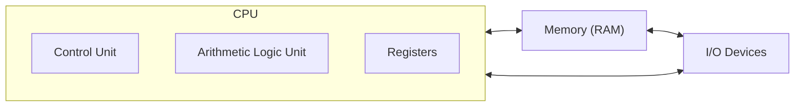

All modern computers follow this model: a processor fetches instructions from memory, decodes them, executes them, and stores results.

### CPU (Central Processing Unit)

| Component | Role |
|-----------|------|
| **Control Unit** | Fetches and decodes instructions |
| **ALU** | Performs arithmetic and logic operations |
| **Registers** | Tiny, ultra-fast storage inside the CPU |
| **Cache** | Small, fast memory between CPU and RAM |
| **Clock** | Synchronizes operations (measured in GHz) |

### Instruction Cycle

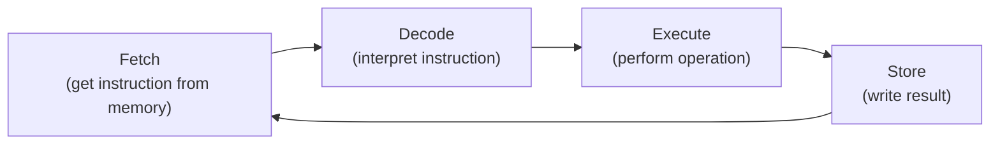

Modern CPUs execute billions of these cycles per second and use **pipelining** (overlapping stages) to process multiple instructions simultaneously.

### Memory Hierarchy

```text
┌─────────────────────────────────────────────┐
│ Registers    │ ~1 ns    │ Bytes      │ $$$$$ │
├──────────────┼──────────┼────────────┼───────┤
│ L1 Cache     │ ~2 ns    │ 64 KB      │ $$$$  │
├──────────────┼──────────┼────────────┼───────┤
│ L2 Cache     │ ~7 ns    │ 256 KB-1MB │ $$$   │
├──────────────┼──────────┼────────────┼───────┤
│ L3 Cache     │ ~20 ns   │ 4-64 MB    │ $$    │
├──────────────┼──────────┼────────────┼───────┤
│ RAM          │ ~100 ns  │ 8-128 GB   │ $     │
├──────────────┼──────────┼────────────┼───────┤
│ SSD          │ ~100 μs  │ 256 GB-4TB │ ¢     │
├──────────────┼──────────┼────────────┼───────┤
│ HDD          │ ~10 ms   │ 1-20 TB    │ ¢¢    │
└─────────────────────────────────────────────┘
         Faster/Smaller ↑    ↓ Slower/Larger
```

### Key Takeaway

The memory hierarchy is why caching matters at every level of software — from CPU caches to Redis to CDNs. Accessing RAM is 100x slower than L1 cache; disk is 100,000x slower. Design your software to exploit locality.

---

## 2. Operating Systems

### What an OS Does

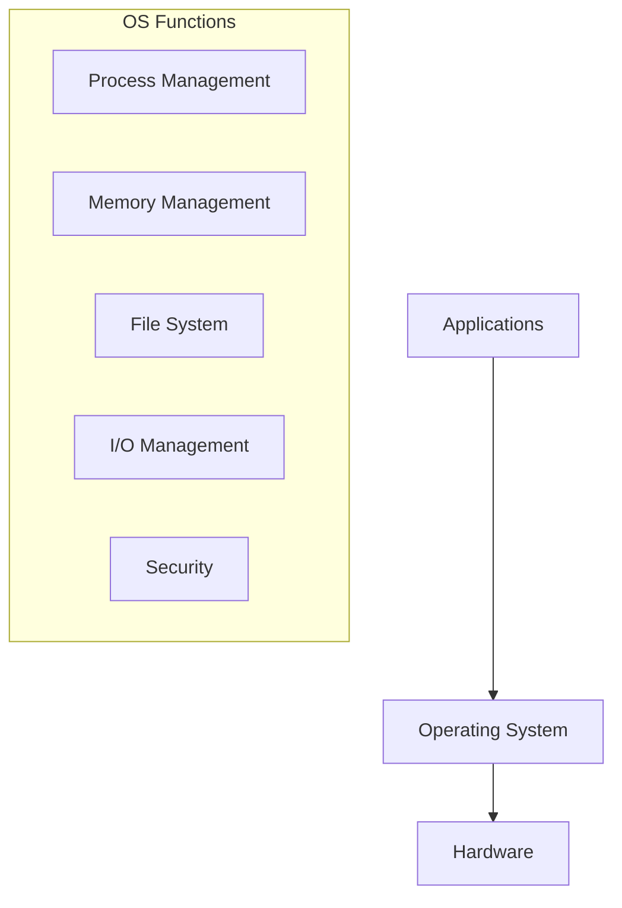

The OS is an abstraction layer — it hides hardware complexity and provides a consistent interface for applications.

### Processes and Threads

| Concept | Definition |
|---------|-----------|
| **Process** | Running instance of a program (own memory space) |
| **Thread** | Lightweight execution unit within a process (shared memory) |
| **Context switch** | Saving/restoring state when switching between processes |

### Process States

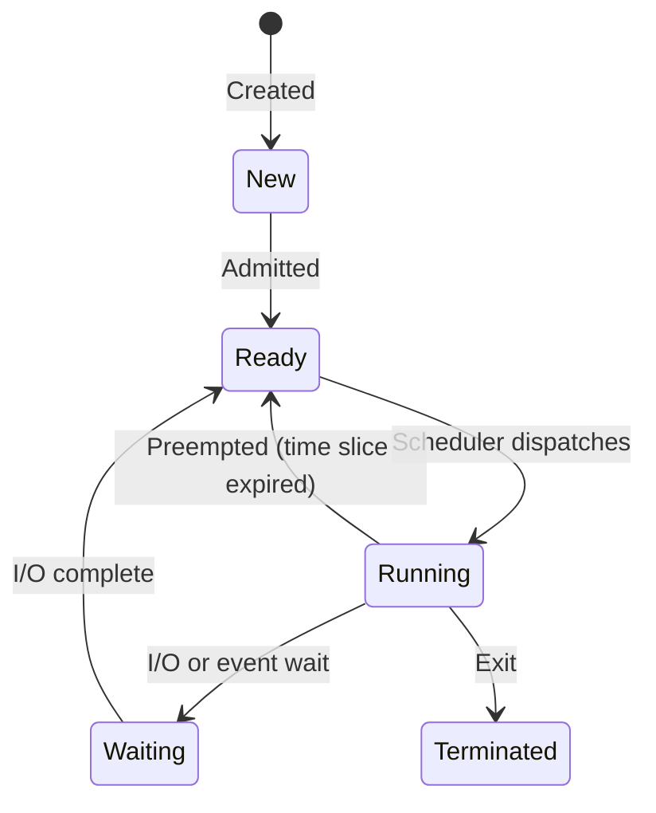

### CPU Scheduling

| Algorithm | Description | Pros | Cons |
|-----------|-------------|------|------|
| FIFO/FCFS | First come, first served | Simple | Convoy effect |
| Round Robin | Fixed time slices | Fair | Context switch overhead |
| Priority | Highest priority first | Important tasks first | Starvation |
| CFS (Linux) | Completely Fair Scheduler | Balanced | Complex |

### Memory Management

**Virtual Memory:** Each process sees a contiguous address space, but physical memory is fragmented and shared.

```text
Process A virtual memory:     Physical RAM:
┌──────────────────┐          ┌──────────────────┐
│ 0x0000: Code     │ ───────→ │ Page frame 42    │
│ 0x1000: Data     │ ───────→ │ Page frame 7     │
│ 0x2000: Heap     │ ───────→ │ Page frame 103   │
│ ...              │          │ ...              │
│ 0xFFFF: Stack    │ ───────→ │ Page frame 55    │
└──────────────────┘          └──────────────────┘
         Page Table maps virtual → physical
```

**Key concepts:**

- **Paging** — memory divided into fixed-size pages (typically 4 KB)
- **Page fault** — accessing a page not in RAM → load from disk
- **Swap** — overflow RAM to disk (slow, avoid in production)

### Key Takeaway

The OS manages resources (CPU, memory, I/O) and provides isolation between processes. Understanding processes, threads, and virtual memory helps you reason about application performance and resource usage.

---

## 3. File Systems

### What a File System Does

Organizes data on storage devices — maps file names to physical locations on disk.

### Common File Systems

| File System | OS | Features |
|-------------|-----|----------|
| ext4 | Linux | Journaling, mature, default for most Linux |
| XFS | Linux | High performance, large files |
| Btrfs | Linux | Copy-on-write, snapshots, checksums |
| NTFS | Windows | Journaling, permissions, encryption |
| APFS | macOS | Copy-on-write, encryption, snapshots |
| ZFS | FreeBSD/Linux | Enterprise, checksums, RAID, snapshots |

### Inodes (Linux/Unix)

Every file has an inode containing metadata:

```text
Inode 12345:
├── File type (regular, directory, symlink)
├── Permissions (rwxr-xr-x)
├── Owner (UID) and Group (GID)
├── Size (bytes)
├── Timestamps (created, modified, accessed)
├── Link count
└── Pointers to data blocks on disk
```

The filename is stored in the **directory** (which is itself a file mapping names → inode numbers).

### File Permissions (Unix)

```text
-rwxr-xr-- 1 alice developers 4096 Jan 1 12:00 script.sh
 │││ │││ │││
 │││ │││ └┴┴── Others: read only (4)
 │││ └┴┴────── Group: read + execute (5)
 └┴┴────────── Owner: read + write + execute (7)
 
 Numeric: 754
```

| Permission | File | Directory |
|-----------|------|-----------|
| Read (r=4) | View contents | List contents |
| Write (w=2) | Modify contents | Create/delete files |
| Execute (x=1) | Run as program | Enter directory (cd) |

### Key Takeaway

File systems abstract physical storage into a hierarchical namespace. Understand permissions (especially for servers and containers) and know that "everything is a file" in Unix — devices, pipes, and sockets are all accessed through the file system interface.

---

## 4. Linux Basics

### Essential Commands

| Category | Commands |
|----------|----------|
| Navigation | `cd`, `ls`, `pwd`, `tree` |
| Files | `cp`, `mv`, `rm`, `touch`, `mkdir` |
| Viewing | `cat`, `less`, `head`, `tail`, `wc` |
| Search | `find`, `grep`, `locate` |
| Permissions | `chmod`, `chown`, `chgrp` |
| Disk | `df`, `du`, `mount`, `lsblk` |
| Process | `ps`, `top`, `kill`, `htop` |
| Network | `ip`, `ss`, `ping`, `curl` |
| System | `uname`, `uptime`, `free`, `dmesg` |

### Package Management

| Distro Family | Package Manager | Commands |
|---------------|----------------|----------|
| Debian/Ubuntu | apt | `apt update`, `apt install`, `apt remove` |
| RHEL/CentOS/Fedora | dnf/yum | `dnf install`, `dnf update` |
| Alpine | apk | `apk add`, `apk update` |
| Arch | pacman | `pacman -S`, `pacman -Syu` |

### Systemd (Service Management)

```bash
# Service lifecycle
systemctl start nginx
systemctl stop nginx
systemctl restart nginx
systemctl status nginx

# Enable/disable at boot
systemctl enable nginx
systemctl disable nginx

# View logs
journalctl -u nginx -f          # follow logs for a service
journalctl --since "1 hour ago" # recent logs
```

### Key Takeaway

Linux is the dominant server OS. Know basic navigation, file operations, package management, and service management. You'll use these daily whether working with servers, containers, or CI/CD pipelines.

---

## 5. Virtualization and Containers

### Virtual Machines vs Containers

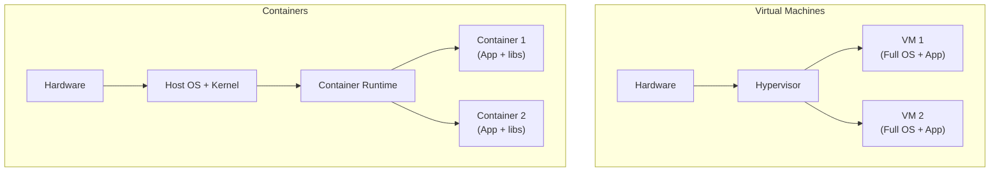

| Feature | Virtual Machine | Container |
|---------|----------------|-----------|
| Isolation | Full (separate kernel) | Process-level (shared kernel) |
| Size | GBs (full OS) | MBs (app + dependencies) |
| Startup | Minutes | Seconds |
| Overhead | High (hypervisor + guest OS) | Low (shared kernel) |
| Security | Stronger isolation | Weaker (kernel shared) |
| Use case | Different OS, strong isolation | Microservices, CI/CD |

### Hypervisors

| Type | Description | Examples |
|------|-------------|---------|
| Type 1 (bare-metal) | Runs directly on hardware | VMware ESXi, KVM, Xen |
| Type 2 (hosted) | Runs on top of an OS | VirtualBox, VMware Workstation |

### Containers (Docker)

```dockerfile
# Dockerfile
FROM node:20-alpine
WORKDIR /app
COPY package*.json ./
RUN npm ci --production
COPY src/ ./src/
EXPOSE 3000
CMD ["node", "src/index.js"]
```

```bash
docker build -t my-app .
docker run -p 3000:3000 my-app
```

**Container concepts:**

- **Image** — read-only template (layers of filesystem changes)
- **Container** — running instance of an image
- **Registry** — storage for images (Docker Hub, ECR)
- **Volume** — persistent storage outside the container lifecycle
- **Network** — virtual network connecting containers

### Key Takeaway

Containers are the standard deployment unit for modern applications. They provide consistency (same image in dev and prod), isolation (dependencies don't conflict), and efficiency (shared kernel, fast startup). VMs are for stronger isolation or different OS requirements.

---

## 6. Security Fundamentals

### Encryption

| Type | How It Works | Use Case |
|------|-------------|----------|
| **Symmetric** | Same key encrypts and decrypts (AES) | Data at rest, bulk encryption |
| **Asymmetric** | Public key encrypts, private key decrypts (RSA, ECDSA) | Key exchange, digital signatures |
| **Hashing** | One-way function, no decryption (SHA-256, bcrypt) | Password storage, integrity checks |

### Symmetric vs Asymmetric

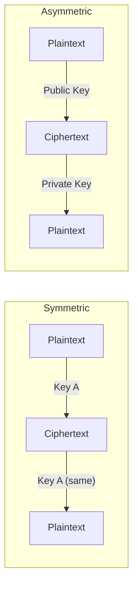

### Hashing

```text
Input: "password123"
SHA-256: ef92b778bafe771e89245b89ecbc08a44a4e166c06659911881f383d4473e94f

Input: "password124" (one character different)
SHA-256: 5e884898da28047151d0e56f8dc6292773603d0d6aabbdd62a11ef721d1542d8
         (completely different output — avalanche effect)
```

**Password hashing:** Never store plain passwords. Use bcrypt, scrypt, or Argon2 (slow by design to resist brute force).

### Certificates and PKI

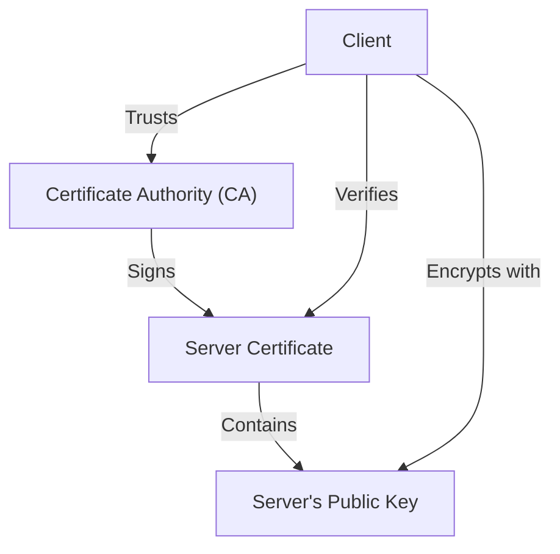

**Certificate chain:** Root CA → Intermediate CA → Server Certificate. Browsers trust root CAs; the chain proves the server's identity.

### Key Takeaway

Encryption protects data in transit (TLS) and at rest (AES). Hashing verifies integrity and stores passwords. Certificates prove identity. These three primitives underpin all of internet security.

---

## 7. Authentication and Authorization

### Authentication (Who are you?)

| Method | Security | Use Case |
|--------|----------|----------|
| Password | Low (if weak) | Legacy, combined with MFA |
| MFA (Multi-Factor) | High | Any sensitive system |
| API Key | Medium | Service-to-service |
| OAuth 2.0 / OIDC | High | Delegated access, SSO |
| Certificate (mTLS) | Very high | Service mesh, zero-trust |

### Authorization (What can you do?)

| Model | Description | Example |
|-------|-------------|---------|
| **RBAC** (Role-Based) | Permissions assigned to roles | Admin, Editor, Viewer |
| **ABAC** (Attribute-Based) | Policies based on attributes | "Allow if department=engineering AND time=business_hours" |
| **ACL** (Access Control List) | Per-resource permission list | File permissions |

### OAuth 2.0 Flow (Authorization Code)

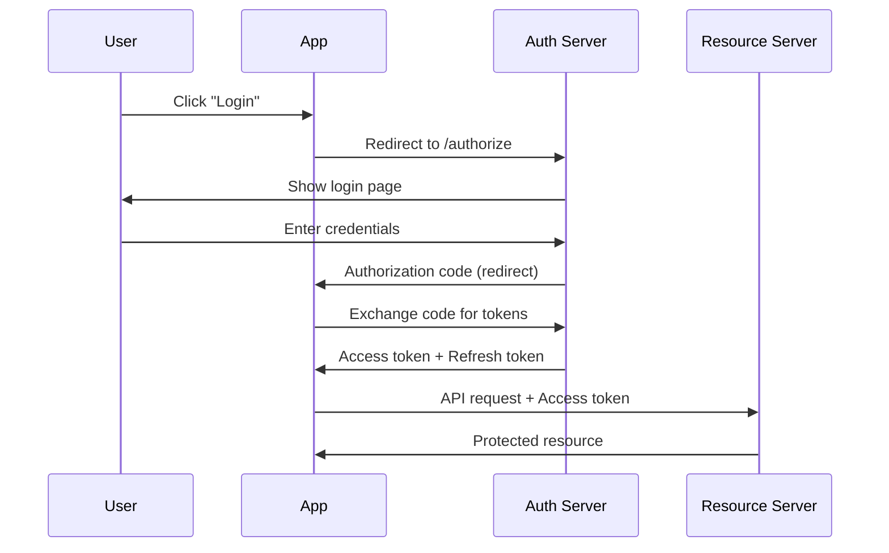

### Key Takeaway

Authentication verifies identity; authorization controls access. Use MFA for humans, tokens/certificates for services. OAuth 2.0 is the standard for delegated access. Never roll your own auth — use established libraries and services.

---

## 8. Version Control: Git Concepts

### What Git Tracks

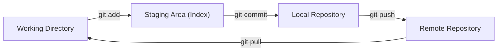

### Core Concepts

| Concept | Description |
|---------|-------------|
| **Repository** | Project history — all commits, branches, tags |
| **Commit** | Snapshot of all tracked files at a point in time |
| **Branch** | Pointer to a commit — lightweight, cheap to create |
| **Merge** | Combine two branches' histories |
| **Rebase** | Replay commits on top of another branch |
| **Tag** | Named pointer to a specific commit (releases) |
| **HEAD** | Pointer to current branch/commit |

### How Git Stores Data

Git stores **snapshots**, not diffs. Each commit points to a tree (directory structure) of blobs (file contents). Unchanged files are referenced, not duplicated.

```text
Commit → Tree → Blob (file content)
  │        ├── Blob
  │        └── Tree (subdirectory)
  │              └── Blob
  └── Parent commit(s)
```

### Branching Model

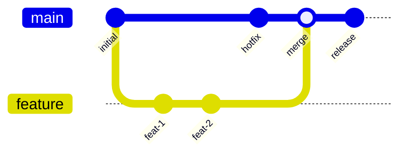

### Key Takeaway

Git is a distributed version control system — every clone has the full history. Understand commits (snapshots), branches (pointers), and merges (combining histories). The staging area gives you control over what goes into each commit.

---

## 9. Software Development Lifecycle

### Agile Principles

| Principle | Meaning |
|-----------|---------|
| Individuals over processes | People and communication first |
| Working software over documentation | Ship, then document |
| Customer collaboration over contracts | Continuous feedback |
| Responding to change over following a plan | Adapt, don't rigidly plan |

### Scrum Framework

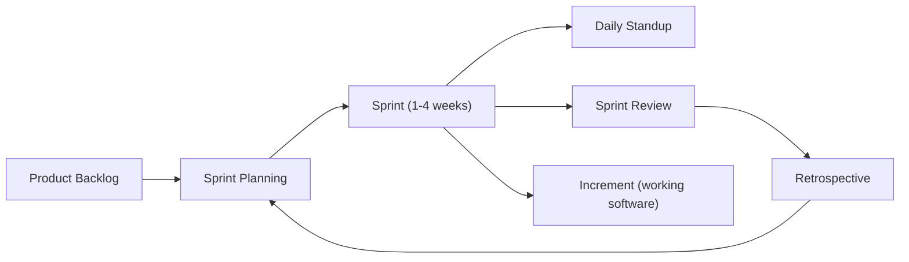

| Ceremony | Purpose | Duration |
|----------|---------|----------|
| Sprint Planning | What to build this sprint | 2-4 hours |
| Daily Standup | Sync, blockers | 15 minutes |
| Sprint Review | Demo to stakeholders | 1-2 hours |
| Retrospective | How to improve | 1-1.5 hours |

### CI/CD (Continuous Integration / Continuous Delivery)

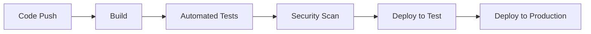

| Practice | Description |
|----------|-------------|
| **CI** | Merge frequently, run automated tests on every push |
| **CD (Delivery)** | Always ready to deploy (manual trigger) |
| **CD (Deployment)** | Automatically deploy every passing build |

### Environments

```text
Development → Test → Staging/Pre → Production
(local)       (automated tests)  (final validation)  (users)
```

### Key Takeaway

Agile is about short feedback loops and adapting to change. CI/CD automates the path from code to production. The goal: small, frequent, safe deployments rather than large, risky releases.

---

## Summary

| Topic | Core Concept |
|-------|-------------|
| Computer Architecture | CPU + Memory hierarchy = performance characteristics |
| Operating Systems | Resource management, process isolation, virtual memory |
| File Systems | Hierarchical storage, permissions, inodes |
| Linux | Essential commands, packages, services |
| Virtualization | VMs (strong isolation) vs Containers (lightweight, fast) |
| Security | Encryption (symmetric/asymmetric), hashing, certificates |
| Auth | Authentication (identity) vs Authorization (permissions) |
| Git | Snapshots, branches, distributed history |
| SDLC | Agile + CI/CD = small, frequent, safe changes |

These fundamentals don't change with trends. Frameworks come and go, but CPU caches, TCP/IP, file permissions, and encryption will still work the same way in 20 years. Invest in understanding the foundations — they pay dividends across every technology you'll ever use.
