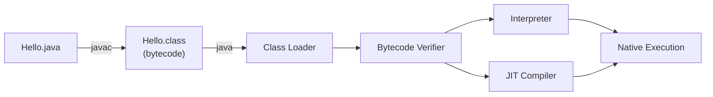
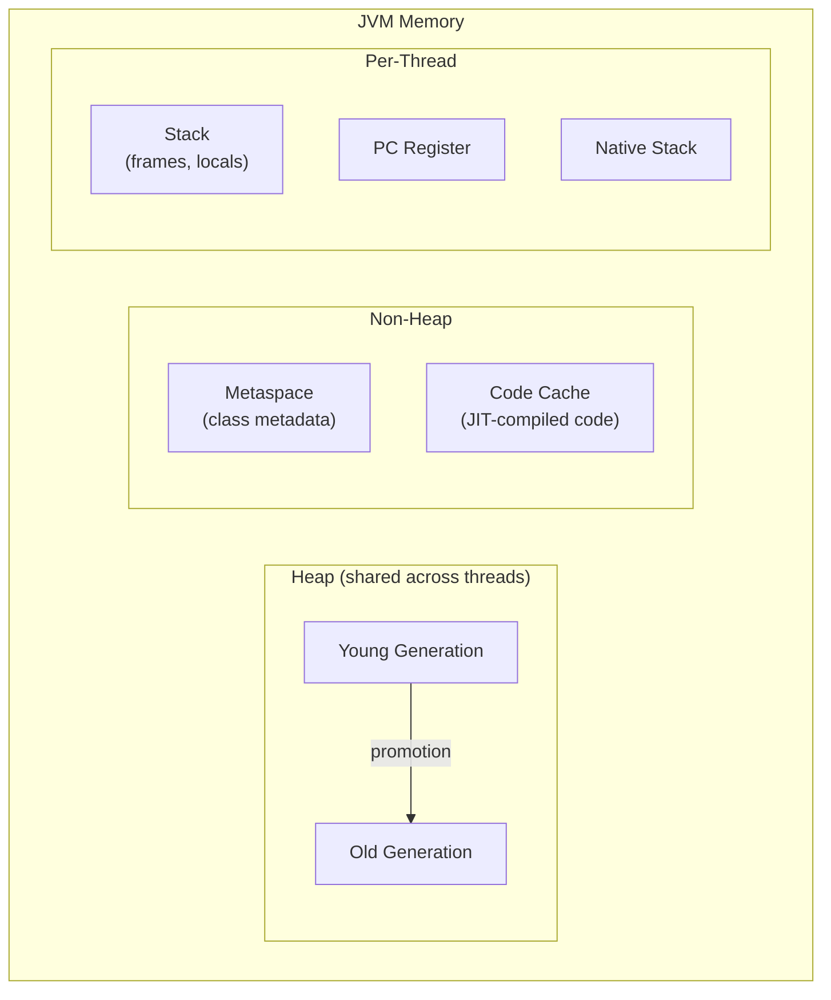
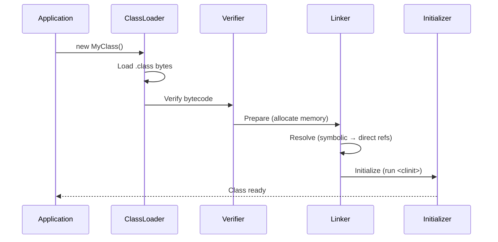

## From Source to Execution



### Compilation vs Interpretation

Java uses a **two-stage** execution model:

1. **Ahead-of-time (AOT):** `javac` compiles `.java` → `.class` (bytecode)
2. **Just-in-time (JIT):** The JVM compiles hot bytecode → native machine code at runtime

```bash
# Compile
javac Hello.java          # Produces Hello.class

# Run
java Hello                # JVM loads, verifies, interprets/JIT-compiles

# Inspect bytecode
javap -c Hello.class      # Disassemble bytecode
```

```java
// Hello.java
public class Hello {
    public static void main(String[] args) {
        System.out.println("Hello, JVM!");
    }
}
```

Disassembled bytecode:

```text
public static void main(java.lang.String[]);
  Code:
     0: getstatic     #2  // Field java/lang/System.out
     3: ldc           #3  // String "Hello, JVM!"
     5: invokevirtual #4  // Method java/io/PrintStream.println
     8: return
```

---

## JVM Memory Model



### Memory Areas

| Area | Scope | Contains | Lifetime |
|------|-------|----------|----------|
| **Heap** | Shared | Objects, arrays | GC-managed |
| **Stack** | Per-thread | Local variables, method frames | Method call duration |
| **Metaspace** | Shared | Class metadata, method info | Class lifetime |
| **Code Cache** | Shared | JIT-compiled native code | Until deoptimized |
| **PC Register** | Per-thread | Current instruction address | Instruction duration |

### Stack vs Heap

```java
public void example() {
    int x = 42;              // Stack: primitive value
    String name = "Alice";   // Stack: reference → Heap: String object
    int[] arr = new int[10]; // Stack: reference → Heap: array object
    
    // When example() returns:
    // - x is gone (stack frame popped)
    // - name reference is gone, but "Alice" may survive on heap
    // - arr reference is gone, array eligible for GC
}
```

---

## Class Loading

### The Three-Phase Process



### ClassLoader Hierarchy

```java
// Bootstrap ClassLoader → loads java.lang.*, java.util.* (native code)
//   └── Platform ClassLoader → loads java.sql.*, javax.* 
//       └── Application ClassLoader → loads your classes (classpath)
//           └── Custom ClassLoaders → plugins, hot-reload, isolation

// Check which classloader loaded a class
System.out.println(String.class.getClassLoader());     // null (bootstrap)
System.out.println(MyClass.class.getClassLoader());    // AppClassLoader
```

### Class Loading is Lazy

```java
public class Main {
    public static void main(String[] args) {
        System.out.println("Main loaded");
        // HeavyClass is NOT loaded yet — only when first referenced
        
        if (args.length > 0) {
            HeavyClass heavy = new HeavyClass(); // NOW it's loaded
        }
    }
}
```

---

## JIT Compilation

### How the JIT Works

1. **Interpreter** executes bytecode initially (fast startup)
2. **Profiler** counts method invocations and loop iterations
3. **C1 compiler** (client) compiles warm methods with basic optimizations
4. **C2 compiler** (server) compiles hot methods with aggressive optimizations

```bash
# See JIT compilation decisions
java -XX:+PrintCompilation MyApp

# Output:
#   timestamp compilation_id attributes method_name size
#   123  1       n           java.lang.Object::<init> (1 bytes)
#   456  2       !           MyApp::hotMethod (45 bytes)
```

### JIT Optimizations

| Optimization | What It Does |
|-------------|--------------|
| **Inlining** | Replaces method call with method body |
| **Escape Analysis** | Allocates objects on stack if they don't escape |
| **Loop Unrolling** | Reduces loop overhead by duplicating body |
| **Dead Code Elimination** | Removes unreachable code |
| **Devirtualization** | Converts virtual calls to direct calls |
| **Null Check Elimination** | Removes redundant null checks |

```java
// Before JIT optimization
for (int i = 0; i < list.size(); i++) {  // list.size() called every iteration
    process(list.get(i));
}

// After JIT (hoists invariant, inlines size())
int size = list.size();  // Hoisted out of loop
for (int i = 0; i < size; i++) {
    process(list.get(i));  // get() may be inlined too
}
```

---

## JVM Flags and Tuning

```bash
# Memory settings
java -Xms512m -Xmx4g MyApp    # Initial heap 512MB, max 4GB
java -XX:MetaspaceSize=256m    # Initial metaspace

# GC selection
java -XX:+UseG1GC MyApp        # G1 (default since Java 9)
java -XX:+UseZGC MyApp         # ZGC (low-latency, Java 15+)
java -XX:+UseShenandoahGC      # Shenandoah (low-pause)

# Diagnostics
java -XX:+HeapDumpOnOutOfMemoryError -XX:HeapDumpPath=/tmp/dump.hprof
java -verbose:gc               # GC logging
java -XX:+PrintFlagsFinal      # Show all JVM flags
```

---

## Hypothetical Use Case: Understanding a Production Issue

```text
Scenario: Application becomes slow after running for hours.

Investigation:
1. Check GC logs → frequent Full GC pauses (Old Gen filling up)
2. Take heap dump → large number of cached objects never evicted
3. Root cause: unbounded cache (HashMap growing forever)
4. Fix: use WeakHashMap or bounded cache (Caffeine/Guava)

JVM flags that would have helped:
  -XX:+HeapDumpOnOutOfMemoryError
  -Xlog:gc*:file=gc.log:time,uptime,level,tags
  -XX:MaxGCPauseMillis=200
```

---

## Key Takeaways

1. **Java compiles to bytecode, not native code** — the JVM handles the final compilation
2. **JIT makes Java fast** — hot code paths are compiled to optimized native code
3. **Class loading is lazy** — classes are loaded only when first referenced
4. **The heap is shared, stacks are per-thread** — this drives concurrency design
5. **JVM flags control performance** — heap size, GC algorithm, and JIT behavior are tunable
6. **The JVM is a platform** — Kotlin, Scala, Groovy all compile to the same bytecode
