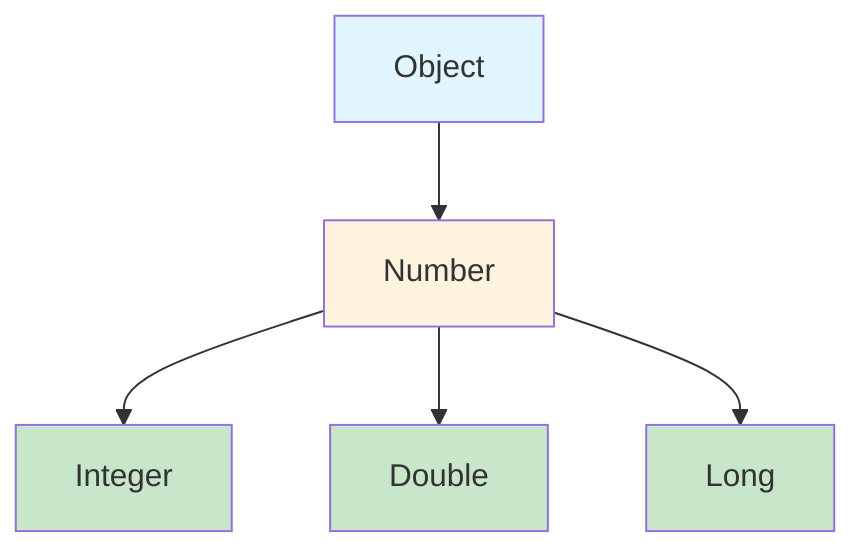

## Why Generics

```java
// Without generics — no type safety, requires casting
List rawList = new ArrayList();
rawList.add("hello");
rawList.add(42);  // No compile error!
String s = (String) rawList.get(1);  // ClassCastException at RUNTIME

// With generics — compile-time type safety
List<String> typedList = new ArrayList<>();
typedList.add("hello");
// typedList.add(42);  // Compile error!
String s = typedList.get(0);  // No cast needed
```

---

## Generic Classes

```java
public class Pair<A, B> {
    private final A first;
    private final B second;
    
    public Pair(A first, B second) {
        this.first = first;
        this.second = second;
    }
    
    public A first() { return first; }
    public B second() { return second; }
    
    public <C> Pair<C, B> mapFirst(Function<A, C> mapper) {
        return new Pair<>(mapper.apply(first), second);
    }
    
    @Override
    public String toString() {
        return "(%s, %s)".formatted(first, second);
    }
}

// Usage
Pair<String, Integer> nameAge = new Pair<>("Alice", 30);
Pair<Integer, Integer> coordinates = new Pair<>(10, 20);
```

### Generic Interface with Multiple Implementations

```java
public interface Repository<T, ID> {
    Optional<T> findById(ID id);
    List<T> findAll();
    T save(T entity);
    void deleteById(ID id);
    boolean existsById(ID id);
}

public class InMemoryUserRepository implements Repository<User, String> {
    private final Map<String, User> store = new ConcurrentHashMap<>();
    
    @Override
    public Optional<User> findById(String id) {
        return Optional.ofNullable(store.get(id));
    }
    
    @Override
    public List<User> findAll() {
        return List.copyOf(store.values());
    }
    
    @Override
    public User save(User user) {
        store.put(user.id(), user);
        return user;
    }
    
    @Override
    public void deleteById(String id) {
        store.remove(id);
    }
    
    @Override
    public boolean existsById(String id) {
        return store.containsKey(id);
    }
}
```

---

## Bounded Type Parameters

```java
// Upper bound: T must be Comparable
public static <T extends Comparable<T>> T max(T a, T b) {
    return a.compareTo(b) >= 0 ? a : b;
}

max(3, 7);          // 7
max("apple", "banana");  // "banana"

// Multiple bounds: T must implement BOTH interfaces
public static <T extends Comparable<T> & Serializable> void process(T item) {
    // Can use both Comparable and Serializable methods
}

// Bounded in class definition
public class SortedList<T extends Comparable<T>> {
    private final List<T> items = new ArrayList<>();
    
    public void add(T item) {
        int index = Collections.binarySearch(items, item);
        if (index < 0) index = -(index + 1);
        items.add(index, item);
    }
    
    public List<T> asList() {
        return Collections.unmodifiableList(items);
    }
}
```

---

## Wildcards



```java
// Unbounded wildcard: ? — read-only, any type
void printAll(List<?> list) {
    for (Object item : list) {
        System.out.println(item);
    }
    // list.add(???);  // Can't add — don't know the type!
}

// Upper bounded: ? extends Number — "producer" (read from)
double sum(List<? extends Number> numbers) {
    double total = 0;
    for (Number n : numbers) {
        total += n.doubleValue();  // Can read as Number
    }
    // numbers.add(42);  // Can't add — might be List<Double>!
    return total;
}

sum(List.of(1, 2, 3));        // Works with List<Integer>
sum(List.of(1.5, 2.5));       // Works with List<Double>

// Lower bounded: ? super Integer — "consumer" (write to)
void addNumbers(List<? super Integer> list) {
    list.add(1);    // Can add Integer (or subtype)
    list.add(2);
    // Integer x = list.get(0);  // Can't read as Integer — might be List<Object>!
    Object x = list.get(0);     // Can only read as Object
}

addNumbers(new ArrayList<Integer>());  // OK
addNumbers(new ArrayList<Number>());   // OK
addNumbers(new ArrayList<Object>());   // OK
```

### PECS: Producer Extends, Consumer Super

```java
// Copy from source (producer) to destination (consumer)
public static <T> void copy(List<? extends T> source, List<? super T> dest) {
    for (T item : source) {
        dest.add(item);
    }
}

List<Integer> ints = List.of(1, 2, 3);
List<Number> nums = new ArrayList<>();
copy(ints, nums);  // Integer extends Number, Number super Integer
```

---

## Type Erasure

### What Happens at Runtime

```java
// What you write:
List<String> strings = new ArrayList<>();
List<Integer> integers = new ArrayList<>();

// What the JVM sees (after erasure):
List strings = new ArrayList();  // Generic type info is GONE
List integers = new ArrayList();

// Consequence:
strings.getClass() == integers.getClass();  // true! Both are ArrayList

// You CANNOT do:
// if (obj instanceof List<String>) {}  // Compile error
// new T()                              // Compile error
// new T[]                              // Compile error
// T.class                              // Compile error
```

### Working Around Erasure

```java
// Problem: can't create generic arrays
// T[] array = new T[10];  // Won't compile

// Solution 1: pass Class<T> token
public class TypeSafeContainer<T> {
    private final Class<T> type;
    private final Object[] storage;
    private int size = 0;
    
    public TypeSafeContainer(Class<T> type, int capacity) {
        this.type = type;
        this.storage = new Object[capacity];
    }
    
    public void add(T item) {
        storage[size++] = item;
    }
    
    public T get(int index) {
        return type.cast(storage[index]);  // Safe cast using Class token
    }
}

// Solution 2: use @SuppressWarnings with documented reason
@SuppressWarnings("unchecked")  // Safe: array never exposed outside class
T[] createArray(int size) {
    return (T[]) new Object[size];
}
```

### Erasure and Overloading

```java
// This WON'T compile — both erase to process(List)
// void process(List<String> strings) { }
// void process(List<Integer> integers) { }

// Fix: use different method names or a single generic method
<T> void process(List<T> items, Class<T> type) { }
```

---

## Generic Methods

```java
public class Collections {
    
    // Generic method — type parameter declared before return type
    public static <T> List<T> singletonList(T item) {
        return List.of(item);
    }
    
    // Multiple type parameters
    public static <K, V> Map<K, V> mapOf(K key, V value) {
        return Map.of(key, value);
    }
    
    // Bounded generic method
    public static <T extends Comparable<T>> Optional<T> min(Collection<T> items) {
        return items.stream().min(Comparable::compareTo);
    }
    
    // Recursive type bound (self-referential)
    public static <T extends Comparable<T>> void sort(List<T> list) {
        list.sort(Comparable::compareTo);
    }
}

// Type inference — compiler figures out T
List<String> list = Collections.singletonList("hello");  // T = String
Optional<Integer> min = Collections.min(List.of(3, 1, 4));  // T = Integer
```

---

## Hypothetical Use Case: Type-Safe Builder

```java
public class QueryBuilder<T> {
    private final Class<T> entityType;
    private final List<String> conditions = new ArrayList<>();
    private String orderBy;
    private int limit = -1;
    
    private QueryBuilder(Class<T> entityType) {
        this.entityType = entityType;
    }
    
    public static <T> QueryBuilder<T> from(Class<T> entityType) {
        return new QueryBuilder<>(entityType);
    }
    
    public QueryBuilder<T> where(String condition) {
        conditions.add(condition);
        return this;
    }
    
    public QueryBuilder<T> orderBy(String field) {
        this.orderBy = field;
        return this;
    }
    
    public QueryBuilder<T> limit(int limit) {
        this.limit = limit;
        return this;
    }
    
    public Query<T> build() {
        return new Query<>(entityType, conditions, orderBy, limit);
    }
}

// Usage — fully type-safe
Query<User> query = QueryBuilder.from(User.class)
    .where("age > 18")
    .where("active = true")
    .orderBy("name")
    .limit(50)
    .build();

List<User> users = database.execute(query);  // Returns List<User>, not List<Object>
```

---

## Key Takeaways

1. **Generics provide compile-time type safety** — catch errors before runtime
2. **Type erasure** means generic info is gone at runtime — can't do `instanceof List<String>`
3. **PECS** — Producer Extends, Consumer Super (read from extends, write to super)
4. **Bounded types** (`<T extends X>`) restrict what types can be used
5. **Wildcards** (`?`) are for flexibility in method parameters
6. **Pass `Class<T>`** when you need type info at runtime (erasure workaround)
7. **Prefer generic methods** over raw types — never use raw `List`, always `List<T>`
