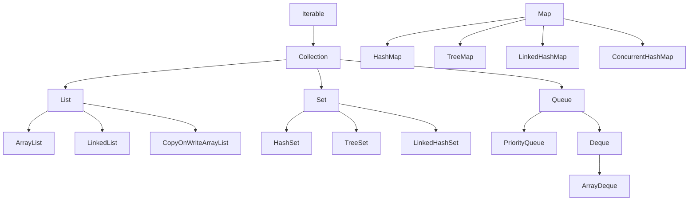

## The Collections Hierarchy



---

## List Implementations

### ArrayList — Dynamic Array

```java
// O(1) random access, O(1) amortized append, O(n) insert/remove at index
List<String> names = new ArrayList<>();
names.add("Alice");           // O(1) amortized
names.add(0, "Bob");          // O(n) — shifts elements
names.get(0);                 // O(1) — direct index access
names.remove(0);              // O(n) — shifts elements
names.contains("Alice");      // O(n) — linear scan

// Pre-size when you know the capacity
List<Integer> large = new ArrayList<>(10_000);

// Immutable list (Java 9+)
List<String> immutable = List.of("a", "b", "c");
// immutable.add("d");  // UnsupportedOperationException
```

### LinkedList — Doubly-Linked List

```java
// O(1) add/remove at head/tail, O(n) random access
LinkedList<String> queue = new LinkedList<>();
queue.addFirst("first");      // O(1)
queue.addLast("last");        // O(1)
queue.removeFirst();          // O(1)
queue.get(5);                 // O(n) — must traverse

// Use as Deque (double-ended queue)
Deque<String> deque = new LinkedList<>();
deque.offerFirst("front");
deque.offerLast("back");
deque.pollFirst();  // Remove from front
deque.pollLast();   // Remove from back
```

### When to Use Which

| Operation | ArrayList | LinkedList |
|-----------|-----------|------------|
| Random access (`get(i)`) | O(1) ✓ | O(n) ✗ |
| Append (`add(e)`) | O(1) amortized ✓ | O(1) ✓ |
| Insert at index | O(n) | O(1) if at iterator position |
| Memory overhead | Low (contiguous) | High (node objects + pointers) |
| **Default choice** | **Yes** | Rarely needed |

---

## Set Implementations

```java
// HashSet — O(1) add/remove/contains, unordered
Set<String> tags = new HashSet<>();
tags.add("java");
tags.add("java");  // Duplicate ignored
tags.contains("java");  // O(1)

// TreeSet — O(log n) operations, sorted order
Set<Integer> sorted = new TreeSet<>();
sorted.addAll(List.of(5, 2, 8, 1, 9));
// Iteration order: 1, 2, 5, 8, 9

NavigableSet<Integer> nav = new TreeSet<>(sorted);
nav.headSet(5);     // {1, 2} — elements < 5
nav.tailSet(5);     // {5, 8, 9} — elements >= 5
nav.subSet(2, 8);   // {2, 5} — elements in [2, 8)

// LinkedHashSet — O(1) operations, insertion order preserved
Set<String> ordered = new LinkedHashSet<>();
ordered.add("first");
ordered.add("second");
ordered.add("third");
// Iteration order: first, second, third (insertion order)

// Set operations
Set<Integer> a = Set.of(1, 2, 3, 4);
Set<Integer> b = Set.of(3, 4, 5, 6);

// Union
Set<Integer> union = new HashSet<>(a);
union.addAll(b);  // {1, 2, 3, 4, 5, 6}

// Intersection
Set<Integer> intersection = new HashSet<>(a);
intersection.retainAll(b);  // {3, 4}

// Difference
Set<Integer> difference = new HashSet<>(a);
difference.removeAll(b);  // {1, 2}
```

---

## Map Implementations

```java
// HashMap — O(1) average, unordered
Map<String, Integer> wordCount = new HashMap<>();
wordCount.put("hello", 1);
wordCount.get("hello");           // 1
wordCount.getOrDefault("world", 0);  // 0

// Compute patterns (Java 8+)
wordCount.merge("hello", 1, Integer::sum);  // Increment or set to 1
wordCount.computeIfAbsent("key", k -> expensiveComputation(k));
wordCount.computeIfPresent("hello", (k, v) -> v + 1);

// TreeMap — O(log n), sorted by key
Map<String, Integer> sorted = new TreeMap<>(wordCount);
// Keys in alphabetical order

NavigableMap<LocalDate, Event> timeline = new TreeMap<>();
timeline.floorEntry(today);    // Latest entry <= today
timeline.ceilingEntry(today);  // Earliest entry >= today
timeline.subMap(startDate, endDate);  // Range query

// LinkedHashMap — insertion order OR access order
// Access-order mode: LRU cache
Map<String, String> lruCache = new LinkedHashMap<>(16, 0.75f, true) {
    @Override
    protected boolean removeEldestEntry(Map.Entry<String, String> eldest) {
        return size() > 100;  // Evict when cache exceeds 100 entries
    }
};

// Map.of (immutable, Java 9+)
Map<String, Integer> config = Map.of(
    "timeout", 30,
    "retries", 3,
    "port", 8080
);
```

---

## Queue and Deque

```java
// PriorityQueue — min-heap by default
Queue<Integer> minHeap = new PriorityQueue<>();
minHeap.offer(5);
minHeap.offer(1);
minHeap.offer(3);
minHeap.poll();  // 1 (smallest)
minHeap.poll();  // 3
minHeap.poll();  // 5

// Max-heap
Queue<Integer> maxHeap = new PriorityQueue<>(Comparator.reverseOrder());

// Custom priority
record Task(String name, int priority) {}
Queue<Task> taskQueue = new PriorityQueue<>(
    Comparator.comparingInt(Task::priority).reversed()
);

// ArrayDeque — faster than LinkedList for stack/queue use
Deque<String> stack = new ArrayDeque<>();
stack.push("first");   // addFirst
stack.push("second");
stack.pop();           // "second" (LIFO)

Deque<String> queue = new ArrayDeque<>();
queue.offer("first");  // addLast
queue.offer("second");
queue.poll();          // "first" (FIFO)
```

---

## Collections Utility Class

```java
import java.util.Collections;

// Sorting
List<String> names = new ArrayList<>(List.of("Charlie", "Alice", "Bob"));
Collections.sort(names);  // Natural order
names.sort(Comparator.reverseOrder());  // Reverse
names.sort(Comparator.comparingInt(String::length));  // By length

// Multi-key sorting
List<Employee> employees = getEmployees();
employees.sort(
    Comparator.comparing(Employee::department)
              .thenComparing(Employee::salary, Comparator.reverseOrder())
              .thenComparing(Employee::name)
);

// Unmodifiable wrappers
List<String> readOnly = Collections.unmodifiableList(names);
// readOnly.add("x");  // UnsupportedOperationException

// Thread-safe wrappers (prefer ConcurrentHashMap for maps)
List<String> syncList = Collections.synchronizedList(new ArrayList<>());

// Searching (list must be sorted)
int index = Collections.binarySearch(sortedList, "target");

// Frequency and disjoint
int count = Collections.frequency(list, "hello");
boolean noCommon = Collections.disjoint(set1, set2);
```

---

## Concurrent Collections

```java
import java.util.concurrent.*;

// ConcurrentHashMap — thread-safe, high-performance map
ConcurrentMap<String, AtomicLong> counters = new ConcurrentHashMap<>();

// Atomic compute operations (no external synchronization needed)
counters.computeIfAbsent("requests", k -> new AtomicLong()).incrementAndGet();

// CopyOnWriteArrayList — thread-safe list for read-heavy workloads
List<EventListener> listeners = new CopyOnWriteArrayList<>();
// Writes copy the entire array (expensive)
// Reads never block (fast, no locking)

// BlockingQueue — producer-consumer pattern
BlockingQueue<Task> workQueue = new LinkedBlockingQueue<>(1000);

// Producer
workQueue.put(new Task("process"));  // Blocks if full

// Consumer
Task task = workQueue.take();  // Blocks if empty

// ConcurrentSkipListMap — sorted, concurrent map
ConcurrentNavigableMap<String, Integer> sortedConcurrent = new ConcurrentSkipListMap<>();
```

---

## Hypothetical Use Case: In-Memory Index

```java
public class InvertedIndex {
    // word → set of document IDs containing that word
    private final Map<String, Set<String>> index = new HashMap<>();
    
    public void indexDocument(String docId, String content) {
        String[] words = content.toLowerCase().split("\\W+");
        for (String word : words) {
            index.computeIfAbsent(word, k -> new HashSet<>()).add(docId);
        }
    }
    
    public Set<String> search(String query) {
        String[] terms = query.toLowerCase().split("\\W+");
        
        // AND search: documents must contain ALL terms
        return Arrays.stream(terms)
            .map(term -> index.getOrDefault(term, Set.of()))
            .reduce((a, b) -> {
                Set<String> intersection = new HashSet<>(a);
                intersection.retainAll(b);
                return intersection;
            })
            .orElse(Set.of());
    }
    
    public List<Map.Entry<String, Integer>> topTerms(int n) {
        return index.entrySet().stream()
            .map(e -> Map.entry(e.getKey(), e.getValue().size()))
            .sorted(Map.Entry.<String, Integer>comparingByValue().reversed())
            .limit(n)
            .toList();
    }
}
```

---

## Key Takeaways

1. **ArrayList is the default List** — use LinkedList only for frequent head/tail operations
2. **HashSet/HashMap for O(1) lookups** — TreeSet/TreeMap when you need sorted order
3. **Use `Map.computeIfAbsent`** instead of check-then-put patterns
4. **ArrayDeque > LinkedList** for stack and queue use cases
5. **Immutable collections** (`List.of`, `Map.of`) for constants and return values
6. **ConcurrentHashMap** for thread-safe maps — never `Collections.synchronizedMap`
7. **Choose the right collection** based on access patterns, not familiarity
