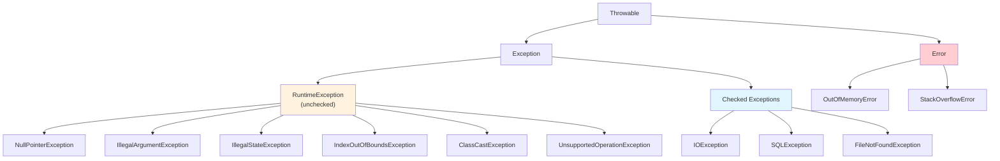

## Exception Hierarchy



### Checked vs Unchecked

| | Checked | Unchecked (Runtime) | Error |
|---|---|---|---|
| **Must handle?** | Yes (catch or declare) | No | No |
| **Represents** | Recoverable conditions | Programming bugs | JVM failures |
| **Examples** | IOException, SQLException | NullPointerException, IllegalArgumentException | OutOfMemoryError |
| **Declare with** | `throws` in signature | Nothing | Nothing |

---

## Try-With-Resources

```java
// Automatic resource management (Java 7+)
// Resources implementing AutoCloseable are closed automatically
public String readFile(Path path) throws IOException {
    try (var reader = Files.newBufferedReader(path);
         var lines = reader.lines()) {
        return lines.collect(Collectors.joining("\n"));
    }
    // reader.close() called automatically, even on exception
}

// Multiple resources — closed in reverse order
public void copyFile(Path source, Path dest) throws IOException {
    try (var in = new BufferedInputStream(Files.newInputStream(source));
         var out = new BufferedOutputStream(Files.newOutputStream(dest))) {
        in.transferTo(out);
    }
}

// Custom AutoCloseable
public class DatabaseConnection implements AutoCloseable {
    private final Connection conn;
    
    public DatabaseConnection(String url) throws SQLException {
        this.conn = DriverManager.getConnection(url);
    }
    
    @Override
    public void close() throws SQLException {
        if (conn != null && !conn.isClosed()) {
            conn.close();
        }
    }
}

// Usage
try (var db = new DatabaseConnection("jdbc:postgresql://localhost/mydb")) {
    db.query("SELECT * FROM users");
}  // Automatically closed
```

---

## Custom Exception Design

```java
// Base application exception
public class AppException extends RuntimeException {
    private final String errorCode;
    private final Map<String, Object> context;
    
    public AppException(String message, String errorCode) {
        this(message, errorCode, null, Map.of());
    }
    
    public AppException(String message, String errorCode, Throwable cause, Map<String, Object> context) {
        super(message, cause);
        this.errorCode = errorCode;
        this.context = Map.copyOf(context);
    }
    
    public String errorCode() { return errorCode; }
    public Map<String, Object> context() { return context; }
}

// Specific exceptions
public class EntityNotFoundException extends AppException {
    public EntityNotFoundException(String entityType, Object id) {
        super(
            "%s with id '%s' not found".formatted(entityType, id),
            "NOT_FOUND",
            null,
            Map.of("entityType", entityType, "id", id.toString())
        );
    }
}

public class ValidationException extends AppException {
    private final List<FieldError> fieldErrors;
    
    public ValidationException(List<FieldError> errors) {
        super("Validation failed: " + errors.size() + " error(s)", "VALIDATION_ERROR");
        this.fieldErrors = List.copyOf(errors);
    }
    
    public List<FieldError> fieldErrors() { return fieldErrors; }
    
    public record FieldError(String field, String message, Object rejectedValue) {}
}

public class ConflictException extends AppException {
    public ConflictException(String resource, String conflictReason) {
        super(
            "Conflict on %s: %s".formatted(resource, conflictReason),
            "CONFLICT",
            null,
            Map.of("resource", resource, "reason", conflictReason)
        );
    }
}
```

---

## Exception Handling Patterns

### Translate Low-Level to Domain Exceptions

```java
public class UserRepository {
    public User findById(String id) {
        try {
            return jdbcTemplate.queryForObject(
                "SELECT * FROM users WHERE id = ?",
                userRowMapper, id
            );
        } catch (EmptyResultDataAccessException e) {
            throw new EntityNotFoundException("User", id);
        } catch (DataAccessException e) {
            throw new AppException(
                "Database error while fetching user",
                "DB_ERROR", e, Map.of("userId", id)
            );
        }
    }
}
```

### Multi-Catch and Rethrow

```java
public void processFile(Path path) {
    try {
        var content = Files.readString(path);
        var data = parseJson(content);
        validate(data);
        save(data);
    } catch (IOException | JsonParseException e) {
        // Multi-catch: handle multiple exception types the same way
        throw new ProcessingException("Failed to process " + path, e);
    } catch (ValidationException e) {
        // Handle differently
        log.warn("Validation failed for {}: {}", path, e.fieldErrors());
        throw e;  // Rethrow as-is
    }
}
```

### Finally vs Try-With-Resources

```java
// OLD way (pre-Java 7) — error-prone
Connection conn = null;
try {
    conn = getConnection();
    // use connection
} finally {
    if (conn != null) {
        try {
            conn.close();  // close() can also throw!
        } catch (SQLException e) {
            log.error("Failed to close connection", e);
        }
    }
}

// MODERN way — clean and correct
try (var conn = getConnection()) {
    // use connection
}
// Suppressed exceptions from close() are attached to the primary exception
```

---

## Optional — Avoiding NullPointerException

```java
import java.util.Optional;

// Creating Optionals
Optional<String> present = Optional.of("hello");       // Must be non-null
Optional<String> empty = Optional.empty();
Optional<String> nullable = Optional.ofNullable(null); // May be null

// Using Optionals (NEVER call .get() without checking)
public Optional<User> findUser(String id) {
    User user = database.query(id);
    return Optional.ofNullable(user);
}

// Consuming
findUser("123")
    .map(User::email)
    .filter(email -> email.contains("@"))
    .ifPresentOrElse(
        email -> sendNotification(email),
        () -> log.warn("User not found or invalid email")
    );

// Chaining
String displayName = findUser("123")
    .map(User::displayName)
    .orElse("Anonymous");

// orElseThrow (preferred over .get())
User user = findUser("123")
    .orElseThrow(() -> new EntityNotFoundException("User", "123"));

// Flattening nested Optionals
Optional<String> city = findUser("123")
    .flatMap(User::address)       // address() returns Optional<Address>
    .map(Address::city);

// Stream integration (Java 9+)
List<String> emails = userIds.stream()
    .map(this::findUser)
    .flatMap(Optional::stream)  // Filters out empty Optionals
    .map(User::email)
    .toList();
```

### Optional Anti-Patterns

```java
// BAD: Optional as method parameter
void process(Optional<String> name) { }  // Don't do this

// GOOD: Use overloading or nullable parameter
void process(String name) { }
void process() { process(null); }

// BAD: Optional for fields
class User {
    Optional<String> middleName;  // Don't do this
}

// GOOD: Nullable field, Optional return
class User {
    private String middleName;  // May be null
    public Optional<String> middleName() { return Optional.ofNullable(middleName); }
}

// BAD: isPresent() + get()
if (optional.isPresent()) {
    doSomething(optional.get());
}

// GOOD: ifPresent or map
optional.ifPresent(this::doSomething);
optional.map(this::transform).orElse(defaultValue);
```

---

## Hypothetical Use Case: Resilient Service Layer

```java
public class OrderService {
    private final OrderRepository orderRepo;
    private final PaymentClient paymentClient;
    private final InventoryClient inventoryClient;
    
    public Order placeOrder(OrderRequest request) {
        // Validate
        var errors = validate(request);
        if (!errors.isEmpty()) {
            throw new ValidationException(errors);
        }
        
        // Check inventory
        try {
            inventoryClient.reserve(request.items());
        } catch (InsufficientStockException e) {
            throw new ConflictException("inventory", 
                "Items out of stock: " + e.unavailableItems());
        }
        
        // Process payment
        PaymentResult payment;
        try {
            payment = paymentClient.charge(request.paymentMethod(), request.total());
        } catch (PaymentDeclinedException e) {
            inventoryClient.release(request.items());  // Compensate
            throw new AppException("Payment declined", "PAYMENT_DECLINED", e,
                Map.of("reason", e.declineReason()));
        } catch (Exception e) {
            inventoryClient.release(request.items());  // Compensate
            throw new AppException("Payment processing failed", "PAYMENT_ERROR", e, Map.of());
        }
        
        // Create order
        var order = Order.create(request, payment.transactionId());
        return orderRepo.save(order);
    }
}
```

---

## Key Takeaways

1. **Use unchecked exceptions** for programming errors (IllegalArgumentException, IllegalStateException)
2. **Use checked exceptions** only when the caller can meaningfully recover
3. **Try-with-resources** for ALL closeable resources — never manual finally blocks
4. **Translate exceptions** at layer boundaries (SQL → domain exception)
5. **Optional** for return types that may be absent — never for fields or parameters
6. **Never catch `Exception` or `Throwable`** broadly — catch specific types
7. **Include context** in exceptions — what operation failed, with what inputs
8. **Suppressed exceptions** from try-with-resources are accessible via `getSuppressed()`
