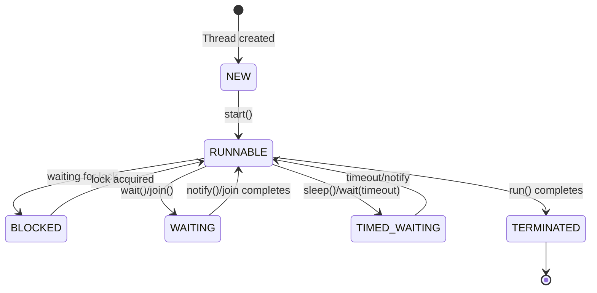

## Thread Fundamentals

```java
// Creating threads
// Option 1: Runnable (preferred — separates task from execution)
Runnable task = () -> System.out.println("Running in " + Thread.currentThread().getName());
Thread thread = new Thread(task, "worker-1");
thread.start();  // Starts new thread
thread.join();   // Wait for completion

// Option 2: Callable (returns a value, can throw checked exceptions)
Callable<Integer> computation = () -> {
    Thread.sleep(1000);
    return 42;
};
```

### Thread States



---

## ExecutorService — Thread Pool Management

```java
import java.util.concurrent.*;

// Fixed thread pool — bounded, reuses threads
ExecutorService fixedPool = Executors.newFixedThreadPool(4);

// Cached pool — unbounded, creates threads as needed
ExecutorService cachedPool = Executors.newCachedThreadPool();

// Single thread — sequential execution, guaranteed ordering
ExecutorService singleThread = Executors.newSingleThreadExecutor();

// Virtual threads (Java 21+) — lightweight, millions possible
ExecutorService virtualPool = Executors.newVirtualThreadPerTaskExecutor();

// Custom pool with full control
ThreadPoolExecutor custom = new ThreadPoolExecutor(
    4,                          // core pool size
    16,                         // max pool size
    60, TimeUnit.SECONDS,       // idle thread timeout
    new LinkedBlockingQueue<>(1000),  // work queue (bounded!)
    new ThreadPoolExecutor.CallerRunsPolicy()  // rejection policy
);
```

### Submitting Tasks

```java
ExecutorService executor = Executors.newFixedThreadPool(4);

// Submit Runnable (no return value)
executor.submit(() -> processItem(item));

// Submit Callable (returns Future)
Future<String> future = executor.submit(() -> fetchData(url));

// Get result (blocks until complete)
try {
    String result = future.get(30, TimeUnit.SECONDS);
} catch (TimeoutException e) {
    future.cancel(true);  // Interrupt the task
} catch (ExecutionException e) {
    Throwable cause = e.getCause();  // Original exception
}

// Submit multiple tasks
List<Callable<String>> tasks = urls.stream()
    .map(url -> (Callable<String>) () -> fetchData(url))
    .toList();

List<Future<String>> futures = executor.invokeAll(tasks);  // Wait for all
String fastest = executor.invokeAny(tasks);  // Return first to complete

// Shutdown
executor.shutdown();  // No new tasks, finish existing
executor.awaitTermination(60, TimeUnit.SECONDS);
```

---

## CompletableFuture — Async Composition

```java
import java.util.concurrent.CompletableFuture;

// Async computation
CompletableFuture<String> future = CompletableFuture.supplyAsync(() -> {
    return fetchUserData(userId);
});

// Chaining transformations
CompletableFuture<OrderSummary> pipeline = CompletableFuture
    .supplyAsync(() -> fetchUser(userId))
    .thenApply(user -> fetchOrders(user.id()))       // Transform result
    .thenApply(orders -> summarize(orders))           // Transform again
    .exceptionally(ex -> {                            // Handle errors
        log.error("Pipeline failed", ex);
        return OrderSummary.empty();
    });

// Combining multiple futures
CompletableFuture<String> userFuture = CompletableFuture.supplyAsync(() -> fetchUser(id));
CompletableFuture<List<Order>> ordersFuture = CompletableFuture.supplyAsync(() -> fetchOrders(id));
CompletableFuture<Double> balanceFuture = CompletableFuture.supplyAsync(() -> fetchBalance(id));

// Wait for all
CompletableFuture<Void> allDone = CompletableFuture.allOf(userFuture, ordersFuture, balanceFuture);
allDone.thenRun(() -> {
    String user = userFuture.join();
    List<Order> orders = ordersFuture.join();
    Double balance = balanceFuture.join();
    buildDashboard(user, orders, balance);
});

// Combine two futures
CompletableFuture<String> combined = userFuture.thenCombine(
    ordersFuture,
    (user, orders) -> "%s has %d orders".formatted(user, orders.size())
);

// Timeout (Java 9+)
CompletableFuture<String> withTimeout = future
    .orTimeout(5, TimeUnit.SECONDS)
    .exceptionally(ex -> "Timed out");
```

---

## Synchronization

### synchronized and Locks

```java
// synchronized — intrinsic lock
public class Counter {
    private int count = 0;
    
    public synchronized void increment() {  // Lock on 'this'
        count++;
    }
    
    public synchronized int get() {
        return count;
    }
}

// ReentrantLock — more flexible
public class BoundedBuffer<T> {
    private final Queue<T> queue = new LinkedList<>();
    private final int capacity;
    private final ReentrantLock lock = new ReentrantLock();
    private final Condition notFull = lock.newCondition();
    private final Condition notEmpty = lock.newCondition();
    
    public BoundedBuffer(int capacity) {
        this.capacity = capacity;
    }
    
    public void put(T item) throws InterruptedException {
        lock.lock();
        try {
            while (queue.size() == capacity) {
                notFull.await();  // Wait until space available
            }
            queue.add(item);
            notEmpty.signal();  // Wake up consumers
        } finally {
            lock.unlock();
        }
    }
    
    public T take() throws InterruptedException {
        lock.lock();
        try {
            while (queue.isEmpty()) {
                notEmpty.await();  // Wait until item available
            }
            T item = queue.remove();
            notFull.signal();  // Wake up producers
            return item;
        } finally {
            lock.unlock();
        }
    }
}
```

### Atomic Variables — Lock-Free

```java
import java.util.concurrent.atomic.*;

// AtomicInteger — thread-safe without locks
AtomicInteger counter = new AtomicInteger(0);
counter.incrementAndGet();  // Atomic increment
counter.compareAndSet(5, 10);  // CAS: set to 10 only if currently 5

// AtomicReference — for object references
AtomicReference<Config> configRef = new AtomicReference<>(loadConfig());
configRef.updateAndGet(current -> current.withTimeout(30));

// LongAdder — better than AtomicLong for high-contention counters
LongAdder requestCount = new LongAdder();
requestCount.increment();  // Distributed across cells
requestCount.sum();        // Aggregate when needed
```

---

## Virtual Threads (Java 21+)

```java
// Virtual threads: lightweight, managed by JVM, not OS
// Can create millions without exhausting memory

// Simple creation
Thread.startVirtualThread(() -> {
    var result = blockingHttpCall(url);
    process(result);
});

// With executor
try (var executor = Executors.newVirtualThreadPerTaskExecutor()) {
    List<Future<String>> futures = urls.stream()
        .map(url -> executor.submit(() -> fetch(url)))
        .toList();
    
    List<String> results = futures.stream()
        .map(f -> {
            try { return f.get(); }
            catch (Exception e) { return "error"; }
        })
        .toList();
}

// Structured Concurrency (Preview, Java 21+)
try (var scope = new StructuredTaskScope.ShutdownOnFailure()) {
    Subtask<String> user = scope.fork(() -> fetchUser(id));
    Subtask<List<Order>> orders = scope.fork(() -> fetchOrders(id));
    
    scope.join();           // Wait for all
    scope.throwIfFailed();  // Propagate first failure
    
    return new Dashboard(user.get(), orders.get());
}
```

### When to Use Virtual vs Platform Threads

| Use Virtual Threads | Use Platform Threads |
|---|---|
| I/O-bound tasks (HTTP, DB, file) | CPU-bound computation |
| High concurrency (thousands of tasks) | Low concurrency with shared mutable state |
| Simple blocking code style | Need thread-local storage |
| Replacing reactive/async frameworks | Pinning concerns (synchronized blocks) |

---

## Common Concurrency Patterns

### Producer-Consumer

```java
BlockingQueue<Task> queue = new LinkedBlockingQueue<>(100);

// Producers
for (int i = 0; i < 3; i++) {
    executor.submit(() -> {
        while (!Thread.interrupted()) {
            Task task = generateTask();
            queue.put(task);  // Blocks if queue is full
        }
    });
}

// Consumers
for (int i = 0; i < 5; i++) {
    executor.submit(() -> {
        while (!Thread.interrupted()) {
            Task task = queue.take();  // Blocks if queue is empty
            process(task);
        }
    });
}
```

### Read-Write Lock

```java
public class CachedData<T> {
    private T data;
    private final ReadWriteLock rwLock = new ReentrantReadWriteLock();
    
    public T read() {
        rwLock.readLock().lock();  // Multiple readers allowed
        try {
            return data;
        } finally {
            rwLock.readLock().unlock();
        }
    }
    
    public void write(T newData) {
        rwLock.writeLock().lock();  // Exclusive access
        try {
            this.data = newData;
        } finally {
            rwLock.writeLock().unlock();
        }
    }
}
```

---

## Hypothetical Use Case: Parallel API Aggregator

```java
public class DashboardService {
    private final ExecutorService executor = Executors.newVirtualThreadPerTaskExecutor();
    
    public Dashboard buildDashboard(String userId) {
        var userFuture = CompletableFuture.supplyAsync(() -> userService.getUser(userId), executor);
        var ordersFuture = CompletableFuture.supplyAsync(() -> orderService.getRecent(userId), executor);
        var metricsFuture = CompletableFuture.supplyAsync(() -> metricsService.getSummary(userId), executor);
        var notifFuture = CompletableFuture.supplyAsync(() -> notificationService.getUnread(userId), executor);
        
        CompletableFuture.allOf(userFuture, ordersFuture, metricsFuture, notifFuture)
            .orTimeout(5, TimeUnit.SECONDS)
            .join();
        
        return new Dashboard(
            userFuture.join(),
            ordersFuture.join(),
            metricsFuture.resultNow(),
            notifFuture.resultNow()
        );
    }
}
```

---

## Key Takeaways

1. **Never use raw `Thread`** — use `ExecutorService` for thread management
2. **CompletableFuture** for async composition — chain, combine, handle errors
3. **Virtual threads** (Java 21+) replace reactive frameworks for I/O-bound work
4. **Prefer `AtomicInteger`/`LongAdder`** over `synchronized` for simple counters
5. **Bounded queues** prevent memory exhaustion in producer-consumer patterns
6. **Always shut down executors** — use try-with-resources (Java 19+) or shutdown/awaitTermination
7. **Avoid `synchronized`** on public methods — use private lock objects
8. **Structured concurrency** (preview) makes concurrent code as readable as sequential
