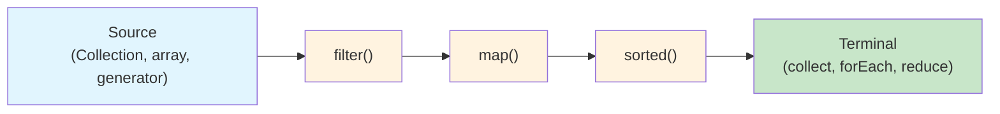

## Functional Interfaces

```java
// A functional interface has exactly ONE abstract method
@FunctionalInterface
interface Transformer<T, R> {
    R transform(T input);
}

// Built-in functional interfaces (java.util.function)
Function<String, Integer>    // T → R
Predicate<String>            // T → boolean
Consumer<String>             // T → void
Supplier<String>             // () → T
UnaryOperator<String>        // T → T (same type)
BinaryOperator<Integer>      // (T, T) → T
BiFunction<String, Integer, Boolean>  // (T, U) → R
```

### Lambda Expressions

```java
// Lambda syntax
Comparator<String> byLength = (a, b) -> Integer.compare(a.length(), b.length());
Predicate<Integer> isPositive = n -> n > 0;
Consumer<String> printer = System.out::println;  // Method reference

// Method references (4 types)
Function<String, Integer> parse = Integer::parseInt;       // Static method
Function<String, String> upper = String::toUpperCase;      // Instance method (unbound)
Supplier<List<String>> factory = ArrayList::new;           // Constructor
Consumer<String> print = System.out::println;              // Instance method (bound)

// Effectively final — lambdas capture variables that don't change
String prefix = "Hello";  // Effectively final
Function<String, String> greeter = name -> prefix + " " + name;
// prefix = "Hi";  // Would make it non-effectively-final → compile error
```

---

## Stream API

### Stream Pipeline



```java
List<String> names = List.of("Alice", "Bob", "Charlie", "Diana", "Eve");

// Basic pipeline
List<String> result = names.stream()
    .filter(name -> name.length() > 3)     // Intermediate: filter
    .map(String::toUpperCase)               // Intermediate: transform
    .sorted()                               // Intermediate: sort
    .toList();                              // Terminal: collect
// ["ALICE", "CHARLIE", "DIANA"]

// Streams are LAZY — nothing happens until terminal operation
Stream<String> lazy = names.stream()
    .filter(name -> {
        System.out.println("Filtering: " + name);  // Not printed yet!
        return name.length() > 3;
    });
// No output until: lazy.toList() or lazy.forEach(...)
```

### Common Operations

```java
List<Order> orders = getOrders();

// filter — keep elements matching predicate
List<Order> expensive = orders.stream()
    .filter(o -> o.total() > 100)
    .toList();

// map — transform each element
List<String> emails = orders.stream()
    .map(Order::customerEmail)
    .toList();

// flatMap — one-to-many transformation (flatten nested collections)
List<OrderItem> allItems = orders.stream()
    .flatMap(order -> order.items().stream())
    .toList();

// distinct, sorted, limit, skip
List<String> uniqueSorted = names.stream()
    .distinct()
    .sorted()
    .limit(5)
    .toList();

// peek — debug (don't use for side effects in production)
orders.stream()
    .peek(o -> log.debug("Processing order: {}", o.id()))
    .filter(Order::isPending)
    .forEach(this::processOrder);

// anyMatch, allMatch, noneMatch
boolean hasExpensive = orders.stream().anyMatch(o -> o.total() > 1000);
boolean allShipped = orders.stream().allMatch(o -> o.status() == SHIPPED);

// findFirst, findAny
Optional<Order> first = orders.stream()
    .filter(o -> o.customer().equals("Alice"))
    .findFirst();

// count
long pendingCount = orders.stream()
    .filter(Order::isPending)
    .count();
```

### Collectors

```java
import java.util.stream.Collectors;

// toList, toSet, toMap
Map<String, Order> orderById = orders.stream()
    .collect(Collectors.toMap(Order::id, Function.identity()));

// groupingBy
Map<OrderStatus, List<Order>> byStatus = orders.stream()
    .collect(Collectors.groupingBy(Order::status));

// groupingBy with downstream collector
Map<String, Double> totalByCustomer = orders.stream()
    .collect(Collectors.groupingBy(
        Order::customerId,
        Collectors.summingDouble(Order::total)
    ));

Map<OrderStatus, Long> countByStatus = orders.stream()
    .collect(Collectors.groupingBy(
        Order::status,
        Collectors.counting()
    ));

// partitioningBy (split into true/false groups)
Map<Boolean, List<Order>> partitioned = orders.stream()
    .collect(Collectors.partitioningBy(o -> o.total() > 100));
List<Order> expensive = partitioned.get(true);
List<Order> cheap = partitioned.get(false);

// joining
String csv = names.stream()
    .collect(Collectors.joining(", ", "[", "]"));
// "[Alice, Bob, Charlie]"

// statistics
DoubleSummaryStatistics stats = orders.stream()
    .collect(Collectors.summarizingDouble(Order::total));
stats.getAverage();  // mean
stats.getMax();      // maximum
stats.getCount();    // count
```

### Reduce

```java
// reduce — fold elements into a single value
int sum = List.of(1, 2, 3, 4, 5).stream()
    .reduce(0, Integer::sum);  // 15

Optional<Integer> max = numbers.stream()
    .reduce(Integer::max);

// Complex reduce
String concatenated = words.stream()
    .reduce("", (a, b) -> a.isEmpty() ? b : a + ", " + b);

// Parallel-safe reduce with combiner
int parallelSum = numbers.parallelStream()
    .reduce(0, Integer::sum, Integer::sum);
//         identity  accumulator  combiner
```

---

## Primitive Streams

```java
// Avoid boxing overhead for numeric operations
IntStream.range(0, 100)           // 0 to 99
    .filter(n -> n % 2 == 0)
    .sum();                        // 2450

IntStream.rangeClosed(1, 10)      // 1 to 10
    .average()                     // OptionalDouble
    .orElse(0.0);

// Convert between object and primitive streams
List<String> words = List.of("hello", "world", "java");
IntStream lengths = words.stream().mapToInt(String::length);
Stream<Integer> boxed = IntStream.range(0, 10).boxed();

// Generate streams
DoubleStream.generate(Math::random).limit(10);
IntStream.iterate(1, n -> n * 2).limit(10);  // 1, 2, 4, 8, 16...
```

---

## Parallel Streams

```java
// Parallel processing — uses ForkJoinPool
long count = hugeList.parallelStream()
    .filter(item -> expensiveCheck(item))
    .count();

// When to use parallel streams:
// ✓ Large datasets (>10,000 elements)
// ✓ CPU-bound operations (no I/O)
// ✓ Stateless, independent operations
// ✓ Source supports efficient splitting (ArrayList, arrays)

// When NOT to use:
// ✗ Small datasets (overhead > benefit)
// ✗ I/O-bound operations (use async instead)
// ✗ Order-dependent operations
// ✗ LinkedList (poor splitting)
// ✗ Shared mutable state

// Custom thread pool for parallel streams
ForkJoinPool customPool = new ForkJoinPool(8);
List<Result> results = customPool.submit(() ->
    items.parallelStream()
        .map(this::heavyComputation)
        .toList()
).get();
```

---

## Practical Patterns

### Data Transformation Pipeline

```java
public record SalesReport(
    String region,
    double totalRevenue,
    long orderCount,
    double averageOrderValue
) {}

public List<SalesReport> generateReport(List<Order> orders) {
    return orders.stream()
        .filter(o -> o.status() == OrderStatus.COMPLETED)
        .collect(Collectors.groupingBy(Order::region))
        .entrySet().stream()
        .map(entry -> {
            String region = entry.getKey();
            List<Order> regionOrders = entry.getValue();
            double total = regionOrders.stream().mapToDouble(Order::total).sum();
            long count = regionOrders.size();
            return new SalesReport(region, total, count, total / count);
        })
        .sorted(Comparator.comparingDouble(SalesReport::totalRevenue).reversed())
        .toList();
}
```

### Optional + Stream Composition

```java
public Optional<String> findBestOffer(String customerId) {
    return findCustomer(customerId)
        .map(Customer::loyaltyTier)
        .flatMap(tier -> getOffers(tier).stream()
            .filter(Offer::isActive)
            .max(Comparator.comparingDouble(Offer::discount))
            .map(Offer::code));
}
```

---

## Key Takeaways

1. **Streams are lazy** — intermediate operations do nothing until a terminal operation triggers execution
2. **Streams are single-use** — cannot be reused after a terminal operation
3. **Prefer method references** (`String::toUpperCase`) over lambdas when possible
4. **`flatMap`** for one-to-many transformations (nested collections, Optional chains)
5. **Use primitive streams** (`IntStream`, `DoubleStream`) to avoid boxing overhead
6. **Parallel streams** only for CPU-bound work on large datasets with good splittability
7. **Collectors.groupingBy** with downstream collectors replaces complex loops
8. **Never mutate external state** from within a stream — streams assume stateless operations
