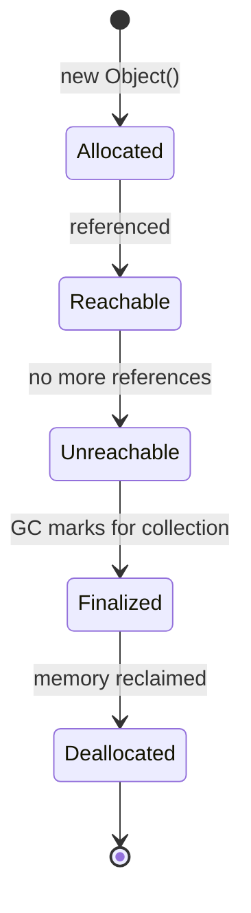
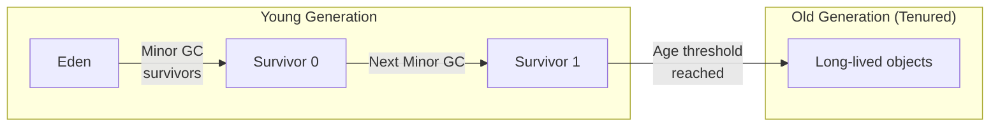

## Object Lifecycle



### What Makes an Object Eligible for GC?

```java
public void example() {
    // Object created — reachable via 'user' reference
    User user = new User("Alice");
    
    // Still reachable
    processUser(user);
    
    // Reference reassigned — original User object is now unreachable
    user = new User("Bob");
    // "Alice" User is eligible for GC (no references point to it)
    
    // Explicit null (rarely needed — scope exit does the same)
    user = null;
    // "Bob" User is now eligible for GC
}
// Both objects eligible for GC when method returns (stack frame popped)
```

### Reference Types

```java
import java.lang.ref.*;

// Strong reference (default) — object NEVER collected while referenced
Object strong = new Object();

// Weak reference — collected at next GC if no strong refs exist
WeakReference<Object> weak = new WeakReference<>(new Object());
weak.get();  // May return null if collected

// Soft reference — collected only when memory is low (good for caches)
SoftReference<byte[]> cache = new SoftReference<>(loadLargeData());
byte[] data = cache.get();  // null if memory pressure caused collection

// Phantom reference — for cleanup actions (replaces finalize())
PhantomReference<Object> phantom = new PhantomReference<>(obj, referenceQueue);

// WeakHashMap — entries removed when keys are no longer strongly referenced
Map<Key, Value> cache = new WeakHashMap<>();
```

---

## Heap Generations



### How Generational GC Works

1. **New objects** allocated in Eden
2. **Minor GC** — when Eden fills up:
   - Live objects copied to Survivor space
   - Eden cleared (very fast — most objects are dead)
3. **Objects survive** multiple Minor GCs → promoted to Old Generation
4. **Major GC (Full GC)** — when Old Gen fills up:
   - Scans entire heap (expensive, causes pauses)

### Why Generational?

**Weak Generational Hypothesis:** Most objects die young.

- ~95% of objects become garbage before the first GC
- Only ~5% survive to Old Generation
- Minor GC is fast because it only scans Young Gen

---

## GC Algorithms

| Algorithm | Flag | Pause | Throughput | Use Case |
|-----------|------|-------|------------|----------|
| **G1** | `-XX:+UseG1GC` | Low-medium | High | Default (Java 9+), general purpose |
| **ZGC** | `-XX:+UseZGC` | Ultra-low (<1ms) | Good | Low-latency services |
| **Shenandoah** | `-XX:+UseShenandoahGC` | Ultra-low | Good | Low-latency (OpenJDK) |
| **Parallel** | `-XX:+UseParallelGC` | Medium-high | Highest | Batch processing, throughput |
| **Serial** | `-XX:+UseSerialGC` | High | Low | Single-core, small heaps |

### G1 GC (Default)

```text
Heap divided into ~2048 equal-sized regions (1-32MB each)
Regions can be: Eden, Survivor, Old, Humongous, Free

G1 collects regions with most garbage first ("Garbage First")
Target: keep pauses under MaxGCPauseMillis (default 200ms)
```

```bash
# G1 tuning
java -XX:+UseG1GC \
     -XX:MaxGCPauseMillis=100 \
     -XX:G1HeapRegionSize=16m \
     -Xms4g -Xmx4g \
     MyApp
```

### ZGC (Low-Latency)

```bash
# ZGC: sub-millisecond pauses regardless of heap size
java -XX:+UseZGC \
     -XX:+ZGenerational \
     -Xms16g -Xmx16g \
     MyApp

# ZGC characteristics:
# - Concurrent (most work done while app runs)
# - Pause times < 1ms (even with TB heaps)
# - Slight throughput cost vs G1
# - Best for: real-time systems, trading, gaming
```

---

## Memory Leaks in Java

### Common Leak Patterns

```java
// 1. Static collections that grow forever
class MetricsCollector {
    // BAD: never cleared, grows until OOM
    private static final List<Metric> metrics = new ArrayList<>();
    
    public void record(Metric m) {
        metrics.add(m);  // Leak!
    }
}

// Fix: use bounded collection or periodic cleanup
private static final Deque<Metric> metrics = new ArrayDeque<>();
public void record(Metric m) {
    metrics.addLast(m);
    while (metrics.size() > 10_000) {
        metrics.removeFirst();
    }
}

// 2. Unclosed resources
class DataProcessor {
    public String process(Path file) {
        // BAD: stream never closed if exception occurs
        BufferedReader reader = Files.newBufferedReader(file);
        return reader.readLine();
    }
    
    // Fix: try-with-resources
    public String processSafe(Path file) throws IOException {
        try (var reader = Files.newBufferedReader(file)) {
            return reader.readLine();
        }
    }
}

// 3. Inner class holding reference to outer class
class Server {
    private final byte[] largeBuffer = new byte[10_000_000];
    
    // BAD: anonymous inner class holds implicit reference to Server
    public Runnable createTask() {
        return new Runnable() {
            public void run() {
                // This Runnable keeps Server (and its 10MB buffer) alive!
                System.out.println("task");
            }
        };
    }
    
    // Fix: use static inner class or lambda (lambdas don't capture 'this' unless needed)
    public Runnable createTaskFixed() {
        return () -> System.out.println("task");  // No reference to Server
    }
}

// 4. ThreadLocal not cleaned up
class RequestContext {
    private static final ThreadLocal<Map<String, String>> context = new ThreadLocal<>();
    
    public static void set(String key, String value) {
        context.get().put(key, value);
    }
    
    // MUST call this when request completes (especially with thread pools!)
    public static void clear() {
        context.remove();
    }
}
```

---

## Diagnosing Memory Issues

```bash
# Heap dump on OOM
java -XX:+HeapDumpOnOutOfMemoryError \
     -XX:HeapDumpPath=/tmp/heapdump.hprof \
     MyApp

# Manual heap dump
jmap -dump:format=b,file=heap.hprof <pid>

# GC logging (Java 9+ unified logging)
java -Xlog:gc*:file=gc.log:time,uptime,level,tags \
     -Xlog:gc+heap=debug \
     MyApp

# Monitor live
jstat -gcutil <pid> 1000  # GC stats every 1 second
jcmd <pid> GC.heap_info   # Heap summary
jcmd <pid> VM.native_memory summary  # Native memory
```

### Reading GC Logs

```text
[2026-05-29T12:00:00.123+0200][info][gc] GC(42) Pause Young (Normal) 
    (G1 Evacuation Pause) 256M->64M(4096M) 12.345ms
    
    ↑ GC event #42
    ↑ Young generation collection
    ↑ Heap: 256MB before → 64MB after (4GB total)
    ↑ Pause duration: 12.345ms
```

---

## JVM Tuning Guidelines

```bash
# Rule of thumb: set Xms = Xmx (avoid resize pauses)
java -Xms4g -Xmx4g MyApp

# For containers: respect cgroup memory limits
java -XX:+UseContainerSupport \
     -XX:MaxRAMPercentage=75.0 \
     MyApp

# String deduplication (saves memory for apps with many duplicate strings)
java -XX:+UseStringDeduplication MyApp
```

| Scenario | Recommendation |
|----------|---------------|
| Web service (latency-sensitive) | G1 or ZGC, `-XX:MaxGCPauseMillis=100` |
| Batch processing (throughput) | Parallel GC, large heap |
| Microservice in container | `-XX:MaxRAMPercentage=75`, G1 |
| Real-time / trading | ZGC, large heap, tune for <1ms pauses |

---

## Key Takeaways

1. **Java manages memory automatically** — but you can still leak (unbounded caches, unclosed resources)
2. **Generational hypothesis** — most objects die young, so Minor GC is fast
3. **G1 is the default** — good for most workloads; ZGC for ultra-low latency
4. **Set `-Xms` = `-Xmx`** in production to avoid resize pauses
5. **Always use try-with-resources** — unclosed resources are the #1 leak source
6. **ThreadLocal must be cleaned** in thread pools — threads are reused
7. **Heap dumps + GC logs** are your primary diagnostic tools
8. **In containers**, use `-XX:MaxRAMPercentage` instead of fixed `-Xmx`
