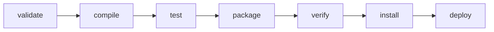

## Maven vs Gradle

| Feature | Maven | Gradle |
|---------|-------|--------|
| Config format | XML (`pom.xml`) | Groovy/Kotlin DSL (`build.gradle.kts`) |
| Build model | Declarative, convention-based | Declarative + imperative |
| Performance | Slower (no incremental builds) | Faster (incremental, build cache, daemon) |
| Dependency resolution | Nearest-wins | Latest-wins (configurable) |
| Learning curve | Lower (rigid conventions) | Higher (flexible, more concepts) |
| Ecosystem | Largest plugin ecosystem | Growing, Kotlin-first |
| Best for | Enterprise, Spring Boot, libraries | Android, multi-module, custom builds |

---

## Maven

### Project Structure (Convention over Configuration)

```text
my-project/
├── pom.xml
├── src/
│   ├── main/
│   │   ├── java/
│   │   │   └── com/example/myapp/
│   │   │       └── Application.java
│   │   └── resources/
│   │       └── application.yml
│   └── test/
│       ├── java/
│       │   └── com/example/myapp/
│       │       └── ApplicationTest.java
│       └── resources/
│           └── test-config.yml
└── target/                  # Build output (generated)
```

### pom.xml Anatomy

```xml
<?xml version="1.0" encoding="UTF-8"?>
<project xmlns="http://maven.apache.org/POM/4.0.0"
         xmlns:xsi="http://www.w3.org/2001/XMLSchema-instance"
         xsi:schemaLocation="http://maven.apache.org/POM/4.0.0 
         http://maven.apache.org/xsd/maven-4.0.0.xsd">
    <modelVersion>4.0.0</modelVersion>
    
    <!-- Project coordinates (GAV) -->
    <groupId>com.example</groupId>
    <artifactId>my-service</artifactId>
    <version>1.2.0</version>
    <packaging>jar</packaging>
    
    <!-- Parent POM (inherit config) -->
    <parent>
        <groupId>org.springframework.boot</groupId>
        <artifactId>spring-boot-starter-parent</artifactId>
        <version>3.3.0</version>
    </parent>
    
    <!-- Properties (version management) -->
    <properties>
        <java.version>21</java.version>
        <mapstruct.version>1.5.5.Final</mapstruct.version>
    </properties>
    
    <!-- Dependencies -->
    <dependencies>
        <dependency>
            <groupId>org.springframework.boot</groupId>
            <artifactId>spring-boot-starter-web</artifactId>
        </dependency>
        
        <dependency>
            <groupId>org.postgresql</groupId>
            <artifactId>postgresql</artifactId>
            <scope>runtime</scope>
        </dependency>
        
        <dependency>
            <groupId>org.springframework.boot</groupId>
            <artifactId>spring-boot-starter-test</artifactId>
            <scope>test</scope>
        </dependency>
    </dependencies>
    
    <!-- Build plugins -->
    <build>
        <plugins>
            <plugin>
                <groupId>org.springframework.boot</groupId>
                <artifactId>spring-boot-maven-plugin</artifactId>
            </plugin>
        </plugins>
    </build>
</project>
```

### Maven Lifecycle



```bash
# Common commands
mvn clean                    # Delete target/
mvn compile                  # Compile main sources
mvn test                     # Run unit tests
mvn package                  # Create JAR/WAR
mvn install                  # Install to local repo (~/.m2)
mvn deploy                   # Upload to remote repo

# Skip tests
mvn package -DskipTests      # Skip test execution
mvn package -Dmaven.test.skip=true  # Skip compilation AND execution

# Run Spring Boot
mvn spring-boot:run

# Dependency tree (debug conflicts)
mvn dependency:tree
mvn dependency:tree -Dincludes=com.fasterxml.jackson
```

### Dependency Scopes

| Scope | Compile | Test | Runtime | Packaged |
|-------|---------|------|---------|----------|
| `compile` (default) | ✓ | ✓ | ✓ | ✓ |
| `provided` | ✓ | ✓ | ✗ | ✗ |
| `runtime` | ✗ | ✓ | ✓ | ✓ |
| `test` | ✗ | ✓ | ✗ | ✗ |

---

## Gradle (Kotlin DSL)

### build.gradle.kts

```kotlin
plugins {
    java
    id("org.springframework.boot") version "3.3.0"
    id("io.spring.dependency-management") version "1.1.5"
}

group = "com.example"
version = "1.2.0"

java {
    toolchain {
        languageVersion = JavaLanguageVersion.of(21)
    }
}

repositories {
    mavenCentral()
}

dependencies {
    implementation("org.springframework.boot:spring-boot-starter-web")
    implementation("org.postgresql:postgresql")
    
    testImplementation("org.springframework.boot:spring-boot-starter-test")
    testRuntimeOnly("org.junit.platform:junit-platform-launcher")
}

tasks.test {
    useJUnitPlatform()
}
```

```bash
# Common commands
./gradlew build              # Full build
./gradlew test               # Run tests
./gradlew bootRun            # Run Spring Boot app
./gradlew dependencies       # Dependency tree
./gradlew clean build -x test  # Build without tests
```

---

## Multi-Module Projects

### Maven Multi-Module

```xml
<!-- parent/pom.xml -->
<project>
    <groupId>com.example</groupId>
    <artifactId>my-platform</artifactId>
    <version>1.0.0</version>
    <packaging>pom</packaging>
    
    <modules>
        <module>common</module>
        <module>api</module>
        <module>service</module>
    </modules>
    
    <dependencyManagement>
        <dependencies>
            <!-- Centralize versions here -->
            <dependency>
                <groupId>com.example</groupId>
                <artifactId>common</artifactId>
                <version>${project.version}</version>
            </dependency>
        </dependencies>
    </dependencyManagement>
</project>
```

```text
my-platform/
├── pom.xml (parent)
├── common/
│   ├── pom.xml
│   └── src/
├── api/
│   ├── pom.xml
│   └── src/
└── service/
    ├── pom.xml
    └── src/
```

---

## Dependency Management Best Practices

```xml
<!-- BOM (Bill of Materials) — centralize versions -->
<dependencyManagement>
    <dependencies>
        <dependency>
            <groupId>org.springframework.cloud</groupId>
            <artifactId>spring-cloud-dependencies</artifactId>
            <version>2023.0.1</version>
            <type>pom</type>
            <scope>import</scope>
        </dependency>
    </dependencies>
</dependencyManagement>

<!-- Now use without specifying version -->
<dependencies>
    <dependency>
        <groupId>org.springframework.cloud</groupId>
        <artifactId>spring-cloud-starter-openfeign</artifactId>
        <!-- Version managed by BOM -->
    </dependency>
</dependencies>
```

### Resolving Conflicts

```bash
# Find conflicting versions
mvn dependency:tree -Dverbose -Dincludes=com.fasterxml.jackson

# Exclude transitive dependency
```

```xml
<dependency>
    <groupId>com.example</groupId>
    <artifactId>library-a</artifactId>
    <exclusions>
        <exclusion>
            <groupId>com.fasterxml.jackson.core</groupId>
            <artifactId>jackson-databind</artifactId>
        </exclusion>
    </exclusions>
</dependency>
```

---

## Key Takeaways

1. **Maven for convention** — rigid structure, less configuration, huge ecosystem
2. **Gradle for flexibility** — faster builds, better for multi-module and custom workflows
3. **Always use dependency management** (BOM or `<dependencyManagement>`) to centralize versions
4. **`mvn dependency:tree`** is your best friend for debugging classpath issues
5. **Use proper scopes** — `test` for test libs, `runtime` for JDBC drivers, `provided` for servlet API
6. **Multi-module** for shared code — parent POM manages versions, children inherit
7. **Never commit build output** (`target/`, `build/`) — only source and config
