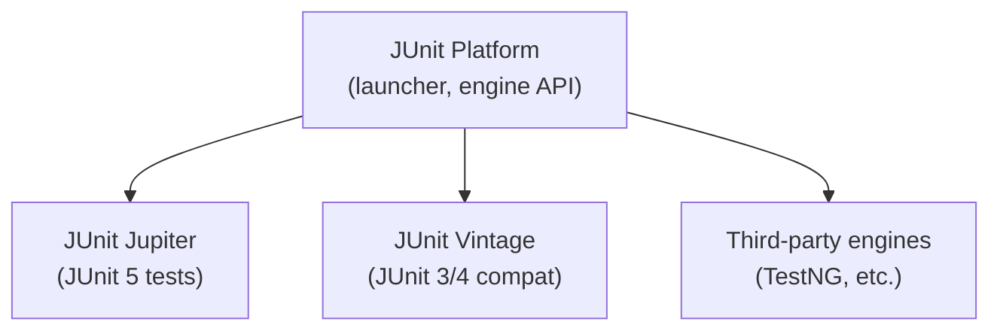

## JUnit 5 Architecture



---

## Writing Tests

### Basic Test Structure

```java
import org.junit.jupiter.api.*;
import static org.junit.jupiter.api.Assertions.*;

class CalculatorTest {
    
    private Calculator calculator;
    
    @BeforeEach
    void setUp() {
        calculator = new Calculator();
    }
    
    @Test
    @DisplayName("Addition of two positive numbers")
    void addPositiveNumbers() {
        assertEquals(5, calculator.add(2, 3));
    }
    
    @Test
    void divideByZeroThrowsException() {
        ArithmeticException ex = assertThrows(
            ArithmeticException.class,
            () -> calculator.divide(10, 0)
        );
        assertEquals("/ by zero", ex.getMessage());
    }
    
    @Test
    void multipleAssertionsGrouped() {
        var result = calculator.compute(10, 5);
        
        assertAll("computation results",
            () -> assertEquals(15, result.sum()),
            () -> assertEquals(5, result.difference()),
            () -> assertEquals(50, result.product()),
            () -> assertEquals(2.0, result.quotient())
        );
    }
    
    @Test
    @Disabled("Bug #123 — fix pending")
    void knownBrokenTest() {
        // Skipped until bug is fixed
    }
}
```

### Parameterized Tests

```java
import org.junit.jupiter.params.ParameterizedTest;
import org.junit.jupiter.params.provider.*;

class ValidationTest {
    
    @ParameterizedTest
    @ValueSource(strings = {"alice@example.com", "bob@test.org", "user+tag@domain.co"})
    void validEmails(String email) {
        assertTrue(EmailValidator.isValid(email));
    }
    
    @ParameterizedTest
    @NullAndEmptySource
    @ValueSource(strings = {"not-an-email", "@missing.local", "spaces in@email.com"})
    void invalidEmails(String email) {
        assertFalse(EmailValidator.isValid(email));
    }
    
    @ParameterizedTest
    @CsvSource({
        "1, 1, 2",
        "0, 0, 0",
        "-1, 1, 0",
        "100, 200, 300"
    })
    void additionCases(int a, int b, int expected) {
        assertEquals(expected, calculator.add(a, b));
    }
    
    @ParameterizedTest
    @MethodSource("orderTestCases")
    void orderTotalCalculation(List<OrderItem> items, double expectedTotal) {
        Order order = new Order(items);
        assertEquals(expectedTotal, order.total(), 0.01);
    }
    
    static Stream<Arguments> orderTestCases() {
        return Stream.of(
            Arguments.of(List.of(new OrderItem("A", 10.0, 2)), 20.0),
            Arguments.of(List.of(new OrderItem("B", 5.0, 3)), 15.0),
            Arguments.of(List.of(), 0.0)
        );
    }
}
```

### Nested Tests

```java
@DisplayName("Order")
class OrderTest {
    
    private Order order;
    
    @BeforeEach
    void setUp() {
        order = new Order("ORD-001", "customer-1");
    }
    
    @Nested
    @DisplayName("when new")
    class WhenNew {
        @Test
        void hasNoItems() {
            assertTrue(order.items().isEmpty());
        }
        
        @Test
        void hasPendingStatus() {
            assertEquals(OrderStatus.PENDING, order.status());
        }
        
        @Test
        void canAddItems() {
            order.addItem(new OrderItem("Widget", 9.99, 1));
            assertEquals(1, order.items().size());
        }
    }
    
    @Nested
    @DisplayName("when confirmed")
    class WhenConfirmed {
        @BeforeEach
        void confirm() {
            order.addItem(new OrderItem("Widget", 9.99, 1));
            order.confirm();
        }
        
        @Test
        void cannotAddMoreItems() {
            assertThrows(IllegalStateException.class,
                () -> order.addItem(new OrderItem("Gadget", 19.99, 1)));
        }
        
        @Test
        void canBeShipped() {
            assertDoesNotThrow(() -> order.ship("TRACK-123"));
        }
    }
}
```

---

## Mockito

```java
import org.mockito.*;
import static org.mockito.Mockito.*;
import static org.mockito.ArgumentMatchers.*;

@ExtendWith(MockitoExtension.class)
class UserServiceTest {
    
    @Mock
    private UserRepository userRepository;
    
    @Mock
    private EmailService emailService;
    
    @InjectMocks
    private UserService userService;
    
    @Test
    void createUser_savesAndSendsWelcomeEmail() {
        // Arrange
        var request = new CreateUserRequest("alice@example.com", "Alice");
        var savedUser = new User("u-123", "alice@example.com", "Alice");
        
        when(userRepository.save(any(User.class))).thenReturn(savedUser);
        
        // Act
        User result = userService.createUser(request);
        
        // Assert
        assertEquals("u-123", result.id());
        
        // Verify interactions
        verify(userRepository).save(argThat(user -> 
            user.email().equals("alice@example.com")
        ));
        verify(emailService).sendWelcome(eq("alice@example.com"), eq("Alice"));
        verifyNoMoreInteractions(emailService);
    }
    
    @Test
    void getUser_notFound_throwsException() {
        when(userRepository.findById("unknown")).thenReturn(Optional.empty());
        
        assertThrows(EntityNotFoundException.class,
            () -> userService.getUser("unknown"));
    }
    
    @Test
    void deleteUser_verifiesOrder() {
        var user = new User("u-1", "alice@example.com", "Alice");
        when(userRepository.findById("u-1")).thenReturn(Optional.of(user));
        
        userService.deleteUser("u-1");
        
        // Verify order of operations
        InOrder inOrder = inOrder(userRepository, emailService);
        inOrder.verify(userRepository).findById("u-1");
        inOrder.verify(emailService).sendAccountDeletion("alice@example.com");
        inOrder.verify(userRepository).delete("u-1");
    }
}
```

### Argument Captors

```java
@Test
void auditLog_capturesCorrectDetails() {
    ArgumentCaptor<AuditEvent> captor = ArgumentCaptor.forClass(AuditEvent.class);
    
    userService.updateEmail("u-1", "new@example.com");
    
    verify(auditService).log(captor.capture());
    
    AuditEvent event = captor.getValue();
    assertEquals("EMAIL_CHANGED", event.action());
    assertEquals("u-1", event.userId());
    assertNotNull(event.timestamp());
}
```

---

## Integration Testing with Spring Boot

```java
@SpringBootTest(webEnvironment = SpringBootTest.WebEnvironment.RANDOM_PORT)
@Testcontainers
class OrderControllerIntegrationTest {
    
    @Container
    static PostgreSQLContainer<?> postgres = new PostgreSQLContainer<>("postgres:16")
        .withDatabaseName("testdb");
    
    @DynamicPropertySource
    static void configureProperties(DynamicPropertyRegistry registry) {
        registry.add("spring.datasource.url", postgres::getJdbcUrl);
        registry.add("spring.datasource.username", postgres::getUsername);
        registry.add("spring.datasource.password", postgres::getPassword);
    }
    
    @Autowired
    private TestRestTemplate restTemplate;
    
    @Autowired
    private OrderRepository orderRepository;
    
    @BeforeEach
    void setUp() {
        orderRepository.deleteAll();
    }
    
    @Test
    void createOrder_returnsCreatedStatus() {
        var request = new CreateOrderRequest("customer-1", List.of(
            new OrderItemRequest("Widget", 9.99, 2)
        ));
        
        ResponseEntity<Order> response = restTemplate.postForEntity(
            "/api/orders", request, Order.class
        );
        
        assertEquals(HttpStatus.CREATED, response.getStatusCode());
        assertNotNull(response.getBody().id());
        assertEquals(19.98, response.getBody().total(), 0.01);
        
        // Verify persisted
        assertTrue(orderRepository.findById(response.getBody().id()).isPresent());
    }
    
    @Test
    void getOrder_notFound_returns404() {
        ResponseEntity<String> response = restTemplate.getForEntity(
            "/api/orders/nonexistent", String.class
        );
        
        assertEquals(HttpStatus.NOT_FOUND, response.getStatusCode());
    }
}
```

---

## Test Patterns

### Builder Pattern for Test Data

```java
public class UserTestBuilder {
    private String id = "u-" + UUID.randomUUID().toString().substring(0, 8);
    private String email = "test@example.com";
    private String name = "Test User";
    private boolean active = true;
    
    public static UserTestBuilder aUser() {
        return new UserTestBuilder();
    }
    
    public UserTestBuilder withEmail(String email) {
        this.email = email;
        return this;
    }
    
    public UserTestBuilder inactive() {
        this.active = false;
        return this;
    }
    
    public User build() {
        return new User(id, email, name, active);
    }
}

// Usage in tests
var activeUser = UserTestBuilder.aUser().withEmail("alice@test.com").build();
var inactiveUser = UserTestBuilder.aUser().inactive().build();
```

---

## Key Takeaways

1. **JUnit 5** — use `@DisplayName` for readable test names, `@Nested` for grouping
2. **Parameterized tests** eliminate duplicate test methods — one test, many inputs
3. **Mockito** for unit tests — mock dependencies, verify interactions
4. **Testcontainers** for integration tests — real databases in Docker
5. **Test builders** create readable test data without constructor noise
6. **`assertAll`** groups related assertions — all run even if one fails
7. **Test behavior, not implementation** — mock at boundaries, not internal methods
8. **`@SpringBootTest`** loads full context — use `@WebMvcTest` or `@DataJpaTest` for slices
