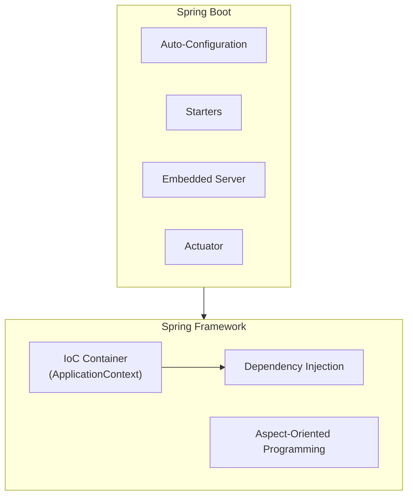
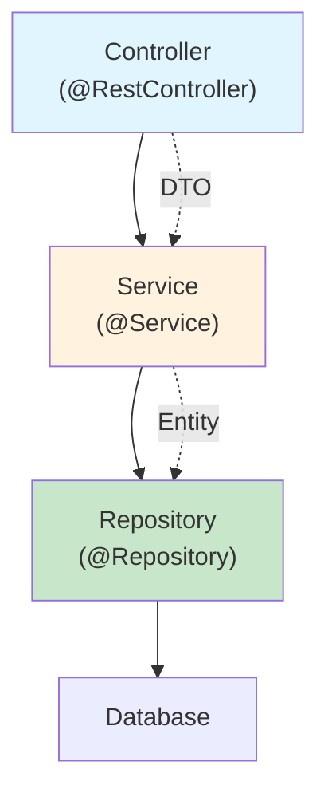

## Spring Framework Core Concepts



### Inversion of Control (IoC)

```java
// WITHOUT IoC — class creates its own dependencies (tight coupling)
public class OrderService {
    private final OrderRepository repo = new JdbcOrderRepository();  // Hardcoded!
    private final EmailService email = new SmtpEmailService();        // Hardcoded!
}

// WITH IoC — Spring creates and injects dependencies
@Service
public class OrderService {
    private final OrderRepository repo;      // Interface
    private final EmailService email;        // Interface
    
    // Spring injects implementations at runtime
    public OrderService(OrderRepository repo, EmailService email) {
        this.repo = repo;
        this.email = email;
    }
}
```

---

## Dependency Injection

### Component Scanning and Stereotypes

```java
@Component          // Generic Spring-managed bean
@Service            // Business logic layer
@Repository         // Data access layer (adds exception translation)
@Controller         // Web MVC controller
@RestController     // @Controller + @ResponseBody
@Configuration      // Declares @Bean methods
```

### Injection Methods

```java
// 1. Constructor injection (PREFERRED — immutable, testable)
@Service
public class UserService {
    private final UserRepository userRepo;
    private final PasswordEncoder encoder;
    
    // @Autowired is optional on single constructor (Spring 4.3+)
    public UserService(UserRepository userRepo, PasswordEncoder encoder) {
        this.userRepo = userRepo;
        this.encoder = encoder;
    }
}

// 2. @Bean methods in @Configuration (for third-party classes)
@Configuration
public class AppConfig {
    
    @Bean
    public PasswordEncoder passwordEncoder() {
        return new BCryptPasswordEncoder(12);
    }
    
    @Bean
    @Profile("production")
    public DataSource productionDataSource() {
        var ds = new HikariDataSource();
        ds.setJdbcUrl("jdbc:postgresql://prod-db:5432/myapp");
        return ds;
    }
}
```

### Profiles and Conditional Beans

```java
@Configuration
public class CacheConfig {
    
    @Bean
    @Profile("production")
    public CacheManager redisCacheManager(RedisConnectionFactory factory) {
        return RedisCacheManager.builder(factory).build();
    }
    
    @Bean
    @Profile("!production")  // NOT production (test, dev)
    public CacheManager inMemoryCacheManager() {
        return new ConcurrentMapCacheManager("users", "orders");
    }
}

// application.yml
// spring.profiles.active: production
```

---

## Spring Boot REST API

### Controller Layer

```java
@RestController
@RequestMapping("/api/v1/users")
public class UserController {
    
    private final UserService userService;
    
    public UserController(UserService userService) {
        this.userService = userService;
    }
    
    @GetMapping
    public List<UserResponse> listUsers(
            @RequestParam(defaultValue = "0") int page,
            @RequestParam(defaultValue = "20") int size) {
        return userService.findAll(PageRequest.of(page, size))
            .map(UserResponse::from)
            .getContent();
    }
    
    @GetMapping("/{id}")
    public UserResponse getUser(@PathVariable String id) {
        return userService.findById(id)
            .map(UserResponse::from)
            .orElseThrow(() -> new ResponseStatusException(HttpStatus.NOT_FOUND));
    }
    
    @PostMapping
    @ResponseStatus(HttpStatus.CREATED)
    public UserResponse createUser(@Valid @RequestBody CreateUserRequest request) {
        User user = userService.create(request);
        return UserResponse.from(user);
    }
    
    @PutMapping("/{id}")
    public UserResponse updateUser(@PathVariable String id, @Valid @RequestBody UpdateUserRequest request) {
        User user = userService.update(id, request);
        return UserResponse.from(user);
    }
    
    @DeleteMapping("/{id}")
    @ResponseStatus(HttpStatus.NO_CONTENT)
    public void deleteUser(@PathVariable String id) {
        userService.delete(id);
    }
}
```

### Request/Response DTOs

```java
// Request validation with Jakarta Bean Validation
public record CreateUserRequest(
    @NotBlank(message = "Email is required")
    @Email(message = "Must be a valid email")
    String email,
    
    @NotBlank @Size(min = 2, max = 100)
    String name,
    
    @NotNull @Min(0) @Max(150)
    Integer age
) {}

// Response DTO (never expose entities directly)
public record UserResponse(
    String id,
    String email,
    String name,
    int age,
    Instant createdAt
) {
    public static UserResponse from(User user) {
        return new UserResponse(
            user.getId(), user.getEmail(), user.getName(),
            user.getAge(), user.getCreatedAt()
        );
    }
}
```

### Global Exception Handling

```java
@RestControllerAdvice
public class GlobalExceptionHandler {
    
    @ExceptionHandler(EntityNotFoundException.class)
    @ResponseStatus(HttpStatus.NOT_FOUND)
    public ErrorResponse handleNotFound(EntityNotFoundException ex) {
        return new ErrorResponse("NOT_FOUND", ex.getMessage());
    }
    
    @ExceptionHandler(MethodArgumentNotValidException.class)
    @ResponseStatus(HttpStatus.BAD_REQUEST)
    public ErrorResponse handleValidation(MethodArgumentNotValidException ex) {
        List<FieldError> errors = ex.getBindingResult().getFieldErrors().stream()
            .map(fe -> new FieldError(fe.getField(), fe.getDefaultMessage()))
            .toList();
        return new ErrorResponse("VALIDATION_ERROR", "Validation failed", errors);
    }
    
    @ExceptionHandler(Exception.class)
    @ResponseStatus(HttpStatus.INTERNAL_SERVER_ERROR)
    public ErrorResponse handleUnexpected(Exception ex) {
        log.error("Unexpected error", ex);
        return new ErrorResponse("INTERNAL_ERROR", "An unexpected error occurred");
    }
    
    public record ErrorResponse(String code, String message, List<FieldError> errors) {
        public ErrorResponse(String code, String message) {
            this(code, message, List.of());
        }
    }
    
    public record FieldError(String field, String message) {}
}
```

---

## Spring Data JPA

```java
// Entity
@Entity
@Table(name = "users")
public class User {
    @Id
    @GeneratedValue(strategy = GenerationType.UUID)
    private String id;
    
    @Column(nullable = false, unique = true)
    private String email;
    
    @Column(nullable = false)
    private String name;
    
    @Enumerated(EnumType.STRING)
    private UserStatus status = UserStatus.ACTIVE;
    
    @CreatedDate
    private Instant createdAt;
    
    @LastModifiedDate
    private Instant updatedAt;
    
    // JPA requires no-arg constructor
    protected User() {}
    
    public User(String email, String name) {
        this.email = email;
        this.name = name;
    }
}

// Repository — Spring generates implementation automatically
public interface UserRepository extends JpaRepository<User, String> {
    
    Optional<User> findByEmail(String email);
    
    List<User> findByStatusAndCreatedAtAfter(UserStatus status, Instant after);
    
    @Query("SELECT u FROM User u WHERE u.name LIKE %:search% OR u.email LIKE %:search%")
    Page<User> search(@Param("search") String search, Pageable pageable);
    
    boolean existsByEmail(String email);
    
    @Modifying
    @Query("UPDATE User u SET u.status = :status WHERE u.id = :id")
    int updateStatus(@Param("id") String id, @Param("status") UserStatus status);
}
```

---

## Application Configuration

```yaml
# application.yml
spring:
  application:
    name: my-service
  datasource:
    url: jdbc:postgresql://localhost:5432/mydb
    username: ${DB_USERNAME:postgres}
    password: ${DB_PASSWORD:secret}
  jpa:
    hibernate:
      ddl-auto: validate
    open-in-view: false
  
server:
  port: 8080

management:
  endpoints:
    web:
      exposure:
        include: health,info,metrics,prometheus
  endpoint:
    health:
      show-details: when-authorized

# Custom properties
app:
  feature-flags:
    new-checkout: true
  external-api:
    base-url: https://api.example.com
    timeout: 30s
```

```java
// Type-safe configuration binding
@ConfigurationProperties(prefix = "app.external-api")
public record ExternalApiConfig(
    String baseUrl,
    Duration timeout
) {}

// Enable in main class
@SpringBootApplication
@EnableConfigurationProperties(ExternalApiConfig.class)
public class Application { }
```

---

## Layered Architecture



| Layer | Responsibility | Annotations |
|-------|---------------|-------------|
| **Controller** | HTTP handling, validation, response mapping | `@RestController`, `@Valid` |
| **Service** | Business logic, transactions, orchestration | `@Service`, `@Transactional` |
| **Repository** | Data access, queries | `@Repository`, extends `JpaRepository` |

```java
@Service
@Transactional(readOnly = true)
public class UserService {
    
    private final UserRepository userRepo;
    private final PasswordEncoder encoder;
    
    @Transactional
    public User create(CreateUserRequest request) {
        if (userRepo.existsByEmail(request.email())) {
            throw new ConflictException("User with email already exists");
        }
        
        var user = new User(request.email(), request.name());
        return userRepo.save(user);
    }
    
    public Optional<User> findById(String id) {
        return userRepo.findById(id);
    }
}
```

---

## Key Takeaways

1. **Constructor injection** — always; makes dependencies explicit and classes testable
2. **Layered architecture** — Controller → Service → Repository (each has one job)
3. **Never expose entities** in API responses — use DTOs (records)
4. **`@Transactional`** on service methods — `readOnly = true` for queries
5. **Profiles** separate environment config — `@Profile("production")` vs `@Profile("!production")`
6. **Global exception handler** (`@RestControllerAdvice`) centralizes error responses
7. **Spring Data JPA** generates repository implementations from method names
8. **Configuration properties** (`@ConfigurationProperties`) for type-safe config binding
