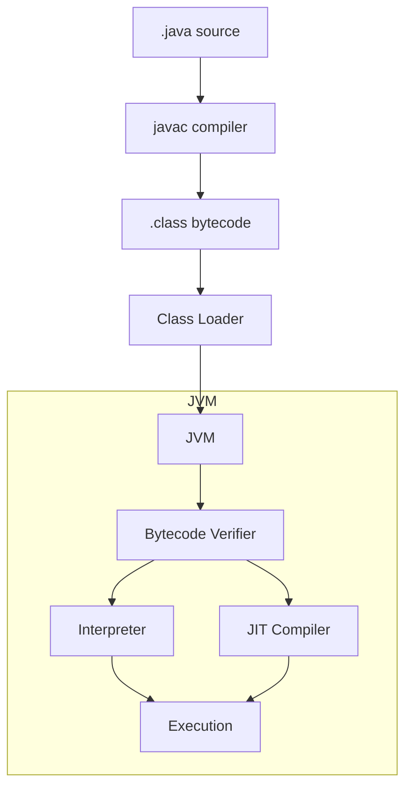
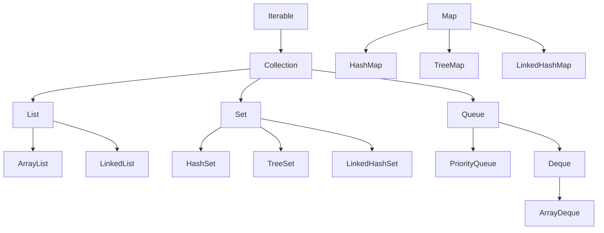
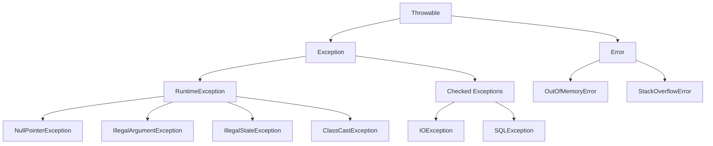
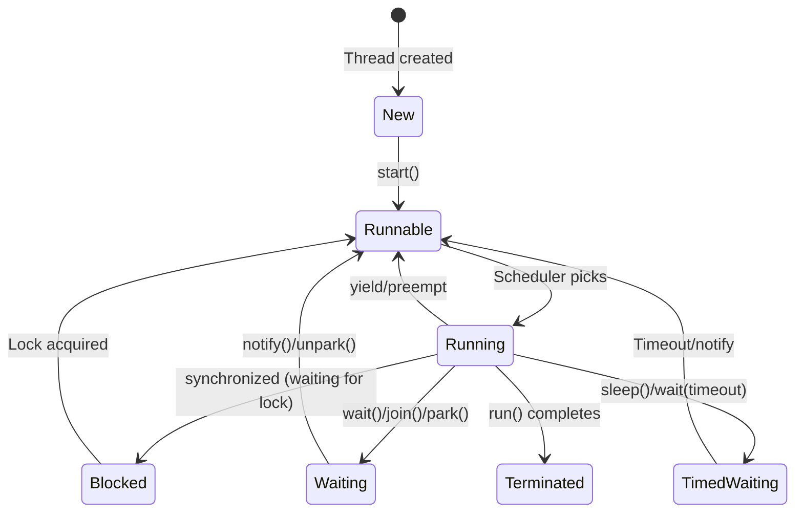
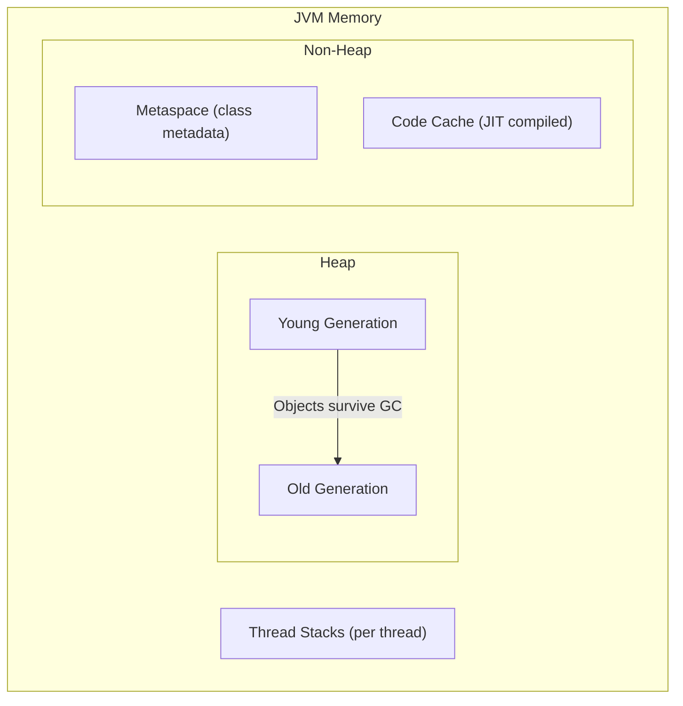

Java is a statically typed, compiled, object-oriented language that runs on the Java Virtual Machine (JVM). It powers enterprise backends, Android apps, and large-scale distributed systems. Its philosophy: **write once, run anywhere**.

## Prerequisites

- Programming Logic (OOP concepts, data structures)
- Basic understanding of compilation vs interpretation

---

## 1. JVM Architecture



### Key Components

| Component | Role |
|-----------|------|
| **javac** | Compiles `.java` → `.class` (bytecode) |
| **Class Loader** | Loads classes into memory on demand |
| **Bytecode Verifier** | Ensures bytecode is safe (no illegal memory access) |
| **Interpreter** | Executes bytecode line by line |
| **JIT Compiler** | Compiles hot paths to native machine code at runtime |

### Why the JVM Matters

- **Platform independence** — bytecode runs on any OS with a JVM
- **Performance** — JIT compilation approaches native speed
- **Memory safety** — no pointer arithmetic, automatic bounds checking
- **Ecosystem** — Kotlin, Scala, Groovy, Clojure all run on the JVM

### Key Takeaway

Java's compilation model (source → bytecode → JIT → native) gives it both portability and performance. The JVM is not just a Java runtime — it's a platform.

---

## 2. Syntax, Types, and Operators

### Primitive Types

| Type | Size | Range | Default |
|------|------|-------|---------|
| `byte` | 8 bits | -128 to 127 | 0 |
| `short` | 16 bits | -32,768 to 32,767 | 0 |
| `int` | 32 bits | -2³¹ to 2³¹-1 | 0 |
| `long` | 64 bits | -2⁶³ to 2⁶³-1 | 0L |
| `float` | 32 bits | IEEE 754 | 0.0f |
| `double` | 64 bits | IEEE 754 | 0.0d |
| `char` | 16 bits | Unicode (UTF-16) | '\u0000' |
| `boolean` | 1 bit* | true/false | false |

*JVM implementation-dependent; often stored as int.

### Reference Types

Everything that isn't a primitive is a **reference type** — objects allocated on the heap, accessed via references (not pointers).

```java
String name = "Alice";     // reference to String object
int[] numbers = {1, 2, 3}; // reference to array object
List<String> items = new ArrayList<>(); // reference to ArrayList
```

### var (Local Variable Type Inference)

```java
// Java 10+
var list = new ArrayList<String>();  // inferred as ArrayList<String>
var count = 0;                       // inferred as int
// Only for local variables — not fields, parameters, or return types
```

### Operators

```java
// Arithmetic: +, -, *, /, %
// Comparison: ==, !=, <, >, <=, >=
// Logical: &&, ||, !
// Bitwise: &, |, ^, ~, <<, >>, >>>
// Assignment: =, +=, -=, *=, /=

// == vs .equals()
String a = new String("hello");
String b = new String("hello");
a == b        // false — different objects
a.equals(b)   // true — same content
```

### Key Takeaway

Java's type system is strict — no implicit narrowing, no unsigned types (until recent additions), and a clear split between primitives (stack) and objects (heap). This rigidity prevents entire classes of bugs.

---

## 3. Object-Oriented Programming

### Classes and Objects

```java
public class Vehicle {
    // Fields
    private String make;
    private int year;
    private double mileage;
    
    // Constructor
    public Vehicle(String make, int year) {
        this.make = make;
        this.year = year;
        this.mileage = 0.0;
    }
    
    // Methods
    public void drive(double km) {
        if (km < 0) throw new IllegalArgumentException("Distance must be positive");
        this.mileage += km;
    }
    
    // Getter
    public double getMileage() {
        return mileage;
    }
    
    @Override
    public String toString() {
        return String.format("%d %s (%.1f km)", year, make, mileage);
    }
}
```

### Interfaces

Define a contract without implementation:

```java
public interface Drawable {
    void draw(Canvas canvas);
    
    // Default method (Java 8+)
    default void drawWithBorder(Canvas canvas) {
        drawBorder(canvas);
        draw(canvas);
    }
    
    // Static method
    static Drawable empty() {
        return canvas -> {}; // lambda
    }
}
```

### Abstract Classes

Partial implementation — can have state and constructors:

```java
public abstract class Shape {
    protected String color;
    
    public Shape(String color) {
        this.color = color;
    }
    
    // Concrete method
    public String getColor() { return color; }
    
    // Abstract — subclasses must implement
    public abstract double area();
    public abstract double perimeter();
}

public class Circle extends Shape {
    private double radius;
    
    public Circle(String color, double radius) {
        super(color);
        this.radius = radius;
    }
    
    @Override
    public double area() { return Math.PI * radius * radius; }
    
    @Override
    public double perimeter() { return 2 * Math.PI * radius; }
}
```

### Interface vs Abstract Class

| Feature | Interface | Abstract Class |
|---------|-----------|----------------|
| Multiple inheritance | Yes | No |
| State (fields) | Constants only | Yes |
| Constructors | No | Yes |
| Access modifiers | Public only (pre-Java 9) | Any |
| Use when | Defining capability | Sharing base implementation |

### Polymorphism

```java
List<Shape> shapes = List.of(
    new Circle("red", 5),
    new Rectangle("blue", 3, 4)
);

for (Shape shape : shapes) {
    // Calls the correct area() based on actual type
    System.out.println(shape.area());
}
```

### Key Takeaway

Java enforces OOP discipline — everything lives in a class, access is controlled via modifiers, and polymorphism is the primary extension mechanism. Prefer composition over inheritance; use interfaces to define contracts.

---

## 4. Generics and Type Erasure

### Why Generics

Without generics, collections store `Object` and require casting:

```java
// Pre-generics (unsafe)
List list = new ArrayList();
list.add("hello");
String s = (String) list.get(0); // cast required, ClassCastException possible

// With generics (type-safe)
List<String> list = new ArrayList<>();
list.add("hello");
String s = list.get(0); // no cast needed
```

### Generic Classes and Methods

```java
public class Pair<A, B> {
    private final A first;
    private final B second;
    
    public Pair(A first, B second) {
        this.first = first;
        this.second = second;
    }
    
    public A getFirst() { return first; }
    public B getSecond() { return second; }
}

// Generic method
public static <T extends Comparable<T>> T max(T a, T b) {
    return a.compareTo(b) >= 0 ? a : b;
}
```

### Bounded Type Parameters

```java
// Upper bound — T must be Number or subclass
public <T extends Number> double sum(List<T> numbers) {
    return numbers.stream().mapToDouble(Number::doubleValue).sum();
}

// Multiple bounds
public <T extends Serializable & Comparable<T>> void process(T item) { ... }
```

### Wildcards

```java
// Upper bounded — read-only (producer)
void printAll(List<? extends Shape> shapes) {
    for (Shape s : shapes) System.out.println(s.area());
}

// Lower bounded — write-only (consumer)
void addCircles(List<? super Circle> list) {
    list.add(new Circle("red", 5));
}

// PECS: Producer Extends, Consumer Super
```

### Type Erasure

At runtime, generic type information is **erased**. `List<String>` and `List<Integer>` are both just `List`. This means:

- No `new T()` or `new T[]`
- No `instanceof` with generic types
- No overloading by generic parameter alone

### Key Takeaway

Generics provide compile-time type safety without runtime overhead (due to erasure). Use PECS to decide between `extends` and `super` wildcards.

---

## 5. Collections Framework



### Choosing the Right Collection

| Need | Use | Why |
|------|-----|-----|
| Indexed access | `ArrayList` | O(1) get by index |
| Frequent insert/remove | `LinkedList` | O(1) at known position |
| Unique elements | `HashSet` | O(1) contains |
| Sorted unique elements | `TreeSet` | O(log n), maintains order |
| Key-value pairs | `HashMap` | O(1) get/put |
| Sorted key-value | `TreeMap` | O(log n), sorted keys |
| Insertion order | `LinkedHashMap` | O(1) + preserves order |
| FIFO queue | `ArrayDeque` | Faster than LinkedList |
| Priority queue | `PriorityQueue` | Min-heap by default |

### Immutable Collections (Java 9+)

```java
List<String> names = List.of("Alice", "Bob", "Charlie");
Set<Integer> primes = Set.of(2, 3, 5, 7, 11);
Map<String, Integer> scores = Map.of("Alice", 95, "Bob", 87);
// All throw UnsupportedOperationException on modification
```

### Key Takeaway

Know the performance characteristics of each collection. Default to `ArrayList` for lists, `HashMap` for maps, `HashSet` for sets. Switch only when you have a specific reason.

---

## 6. Exception Handling

### Exception Hierarchy



### Checked vs Unchecked

| Type | Must Catch/Declare? | Examples | Use For |
|------|---------------------|----------|---------|
| Checked | Yes | IOException, SQLException | Recoverable conditions |
| Unchecked (Runtime) | No | NullPointerException, IllegalArgumentException | Programming errors |
| Error | No (don't catch) | OutOfMemoryError | JVM failures |

### Try-with-Resources

```java
// Automatically closes resources (implements AutoCloseable)
try (var reader = new BufferedReader(new FileReader("data.txt"));
     var writer = new BufferedWriter(new FileWriter("out.txt"))) {
    
    String line;
    while ((line = reader.readLine()) != null) {
        writer.write(line.toUpperCase());
        writer.newLine();
    }
} catch (IOException e) {
    logger.error("File processing failed", e);
}
// reader and writer are closed here, even if exception occurred
```

### Key Takeaway

Use checked exceptions for recoverable conditions the caller should handle. Use unchecked exceptions for programming errors (precondition violations). Always use try-with-resources for `AutoCloseable` objects.

---

## 7. Concurrency

### Thread Lifecycle



### Creating Threads

```java
// Modern approach: ExecutorService
ExecutorService executor = Executors.newFixedThreadPool(4);

Future<String> future = executor.submit(() -> {
    // runs in thread pool
    return fetchData();
});

String result = future.get(); // blocks until complete
executor.shutdown();
```

### Synchronization

```java
public class Counter {
    private int count = 0;
    
    // synchronized method — only one thread at a time
    public synchronized void increment() {
        count++;
    }
    
    // Or use explicit locks for more control
    private final ReentrantLock lock = new ReentrantLock();
    
    public void incrementWithLock() {
        lock.lock();
        try {
            count++;
        } finally {
            lock.unlock();
        }
    }
}
```

### CompletableFuture (Java 8+)

```java
CompletableFuture<String> future = CompletableFuture
    .supplyAsync(() -> fetchUser(userId))          // async
    .thenApply(user -> user.getEmail())            // transform
    .thenCompose(email -> sendEmail(email))        // chain async
    .exceptionally(ex -> {
        logger.error("Failed", ex);
        return "fallback";
    });
```

### Virtual Threads (Java 21+)

```java
// Lightweight threads — millions possible
try (var executor = Executors.newVirtualThreadPerTaskExecutor()) {
    List<Future<String>> futures = urls.stream()
        .map(url -> executor.submit(() -> fetch(url)))
        .toList();
    
    for (var future : futures) {
        System.out.println(future.get());
    }
}
```

Virtual threads are cheap (no OS thread per virtual thread), making the "thread per request" model viable again without the overhead.

### Key Takeaway

Java's concurrency model evolved from raw threads → ExecutorService → CompletableFuture → Virtual Threads. Use virtual threads for I/O-bound work (Java 21+), thread pools for CPU-bound work, and CompletableFuture for async composition.

---

## 8. Streams and Functional Programming

### Lambda Expressions

```java
// Before lambdas
Comparator<String> comp = new Comparator<String>() {
    @Override
    public int compare(String a, String b) {
        return a.length() - b.length();
    }
};

// With lambdas
Comparator<String> comp = (a, b) -> a.length() - b.length();

// Method reference
Comparator<String> comp = Comparator.comparingInt(String::length);
```

### Stream API

```java
List<String> result = employees.stream()
    .filter(e -> e.getSalary() > 50000)       // filter
    .sorted(Comparator.comparing(Employee::getName)) // sort
    .map(Employee::getName)                    // transform
    .distinct()                                // deduplicate
    .limit(10)                                 // take first 10
    .collect(Collectors.toList());             // terminal operation

// Reduction
int totalSalary = employees.stream()
    .mapToInt(Employee::getSalary)
    .sum();

// Grouping
Map<Department, List<Employee>> byDept = employees.stream()
    .collect(Collectors.groupingBy(Employee::getDepartment));
```

### Stream Characteristics

- **Lazy** — intermediate operations don't execute until a terminal operation is called
- **Non-reusable** — a stream can only be consumed once
- **Optionally parallel** — `.parallelStream()` for multi-threaded processing

### Optional

```java
Optional<User> user = findUser(id);

// Safe access
String name = user
    .map(User::getName)
    .orElse("Unknown");

// Throw if absent
User u = user.orElseThrow(() -> new NotFoundException("User " + id));

// Never do: user.get() without checking isPresent()
```

### Key Takeaway

Streams bring functional programming to Java — declarative data transformation pipelines. Use them for collection processing; avoid for simple iterations where a for-loop is clearer.

---

## 9. Memory Management and Garbage Collection

### JVM Memory Model



### Garbage Collection Basics

1. **Mark** — identify all reachable objects from GC roots (stack variables, static fields)
2. **Sweep** — reclaim memory from unreachable objects
3. **Compact** — defragment heap (optional, depends on collector)

### GC Algorithms

| Collector | Use Case | Characteristics |
|-----------|----------|-----------------|
| G1 (default) | General purpose | Low pause, good throughput |
| ZGC | Low latency | Sub-millisecond pauses, large heaps |
| Shenandoah | Low latency | Concurrent compaction |
| Parallel GC | Throughput | Longer pauses, maximum throughput |

### Common Memory Issues

- **Memory leak** — objects referenced but never used (e.g., growing collections, unclosed resources)
- **OutOfMemoryError** — heap exhausted
- **GC thrashing** — too much time in GC, too little in application

### Key Takeaway

You don't manage memory manually in Java, but you must understand GC to diagnose performance issues. Avoid creating unnecessary objects in hot paths, close resources, and profile with tools like VisualVM or JFR.

---

## 10. Build Tools

### Maven

```xml
<!-- pom.xml -->
<project>
    <groupId>com.example</groupId>
    <artifactId>my-app</artifactId>
    <version>1.0.0</version>
    
    <dependencies>
        <dependency>
            <groupId>org.springframework.boot</groupId>
            <artifactId>spring-boot-starter-web</artifactId>
            <version>3.2.0</version>
        </dependency>
    </dependencies>
</project>
```

```bash
mvn clean compile    # compile
mvn test             # run tests
mvn package          # build JAR/WAR
mvn install          # install to local repo
```

### Gradle

```groovy
// build.gradle
plugins {
    id 'java'
    id 'org.springframework.boot' version '3.2.0'
}

dependencies {
    implementation 'org.springframework.boot:spring-boot-starter-web'
    testImplementation 'org.springframework.boot:spring-boot-starter-test'
}
```

```bash
./gradlew build      # compile + test + package
./gradlew test       # run tests
./gradlew bootRun    # run Spring Boot app
```

### Maven vs Gradle

| Aspect | Maven | Gradle |
|--------|-------|--------|
| Config | XML (verbose) | Groovy/Kotlin DSL |
| Speed | Slower | Incremental + cache |
| Flexibility | Convention-heavy | Highly customizable |
| Ecosystem | Larger plugin base | Growing |

### Key Takeaway

Maven is the safe default for enterprise Java. Gradle is faster and more flexible. Both solve the same problem: dependency management, compilation, testing, and packaging.

---

## 11. Testing

### JUnit 5

```java
import org.junit.jupiter.api.*;
import static org.junit.jupiter.api.Assertions.*;

class CalculatorTest {
    
    private Calculator calc;
    
    @BeforeEach
    void setUp() {
        calc = new Calculator();
    }
    
    @Test
    @DisplayName("Addition of two positive numbers")
    void testAdd() {
        assertEquals(5, calc.add(2, 3));
    }
    
    @Test
    void testDivideByZero() {
        assertThrows(ArithmeticException.class, () -> calc.divide(1, 0));
    }
    
    @ParameterizedTest
    @CsvSource({"1,1,2", "0,0,0", "-1,1,0"})
    void testAddParameterized(int a, int b, int expected) {
        assertEquals(expected, calc.add(a, b));
    }
}
```

### Mockito

```java
@ExtendWith(MockitoExtension.class)
class UserServiceTest {
    
    @Mock
    private UserRepository repository;
    
    @InjectMocks
    private UserService service;
    
    @Test
    void findUser_returnsUser_whenExists() {
        var user = new User(1L, "Alice");
        when(repository.findById(1L)).thenReturn(Optional.of(user));
        
        var result = service.findUser(1L);
        
        assertEquals("Alice", result.getName());
        verify(repository).findById(1L);
    }
}
```

### Key Takeaway

JUnit 5 + Mockito is the standard Java testing stack. Test behavior, not implementation. Mock external dependencies (databases, APIs), not internal collaborators.

---

## 12. Enterprise Patterns: Spring Basics

### Dependency Injection

```java
// Interface
public interface NotificationService {
    void send(String message, String recipient);
}

// Implementation
@Service
public class EmailNotificationService implements NotificationService {
    @Override
    public void send(String message, String recipient) {
        // send email
    }
}

// Consumer — Spring injects the implementation
@RestController
public class OrderController {
    private final NotificationService notifications;
    
    // Constructor injection (preferred)
    public OrderController(NotificationService notifications) {
        this.notifications = notifications;
    }
    
    @PostMapping("/orders")
    public ResponseEntity<Order> createOrder(@RequestBody OrderRequest request) {
        Order order = processOrder(request);
        notifications.send("Order confirmed", order.getEmail());
        return ResponseEntity.ok(order);
    }
}
```

### Spring Boot Application

```java
@SpringBootApplication
public class Application {
    public static void main(String[] args) {
        SpringApplication.run(Application.class, args);
    }
}
```

```yaml
# application.yml
server:
  port: 8080
spring:
  datasource:
    url: jdbc:postgresql://localhost:5432/mydb
    username: ${DB_USER}
    password: ${DB_PASSWORD}
```

### Key Takeaway

Spring Boot eliminates boilerplate for enterprise Java. Dependency injection decouples components, making code testable and modular. Convention over configuration — Spring provides sensible defaults.

---

## Summary

| Topic | Core Concept |
|-------|-------------|
| JVM | Bytecode + JIT = portability + performance |
| Types | Static, strong, primitive vs reference |
| OOP | Interfaces for contracts, classes for implementation |
| Generics | Compile-time safety, erased at runtime |
| Collections | Right structure for right access pattern |
| Exceptions | Checked for recovery, unchecked for bugs |
| Concurrency | Virtual threads (modern) or CompletableFuture |
| Streams | Declarative collection processing |
| Memory | GC handles it, but understand the model |
| Build | Maven (safe) or Gradle (fast) |
| Testing | JUnit 5 + Mockito |
| Spring | DI + convention over configuration |

Java is verbose by design — it optimizes for readability and maintainability in large teams over brevity. Modern Java (17+) is significantly less verbose than legacy Java, with records, sealed classes, pattern matching, and virtual threads.
