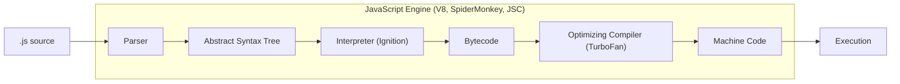
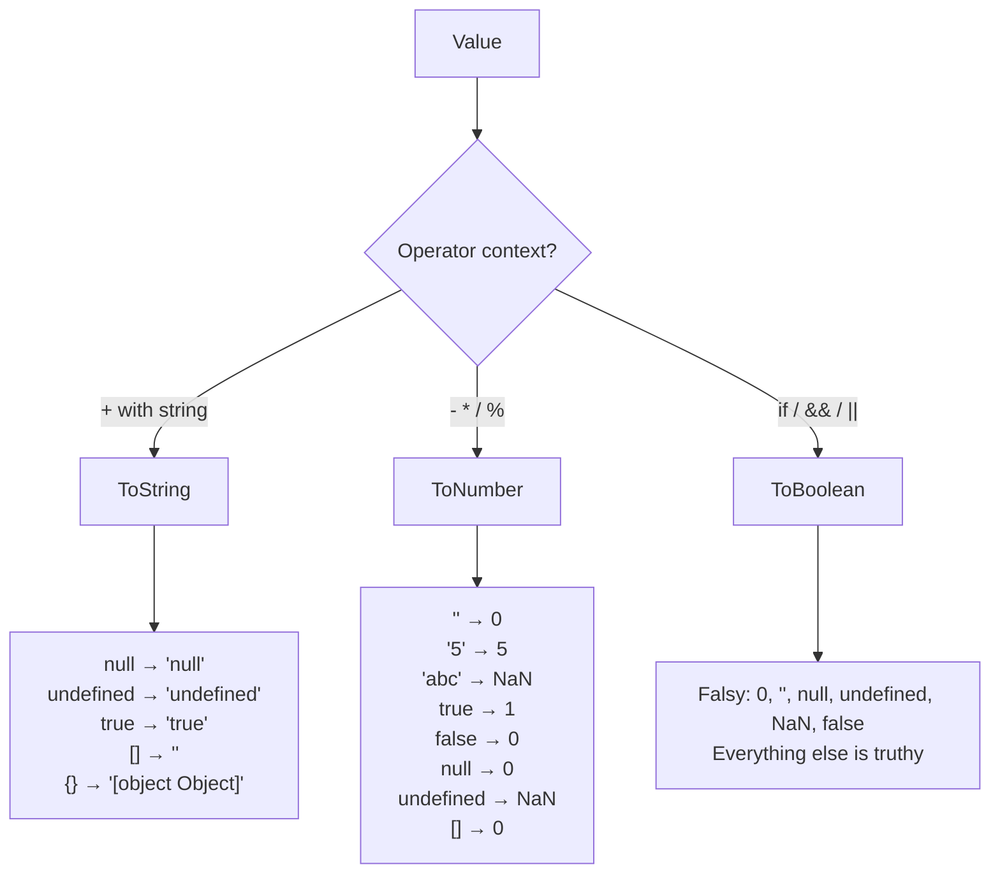

## The Language at a Glance

JavaScript is a dynamically typed, prototype-based, multi-paradigm language. It was created in 10 days in 1995 and has evolved into the most widely deployed programming language in history — running in every browser, on servers (Node.js), mobile apps, desktop apps, and even embedded systems.



---

## Types and the Type System

JavaScript has **7 primitive types** and **1 structural type** (object). Primitives are immutable and compared by value. Objects are mutable and compared by reference.

### Primitives

| Type | Examples | Notes |
|------|----------|-------|
| `undefined` | `undefined` | Variable declared but not assigned |
| `null` | `null` | Intentional absence of value |
| `boolean` | `true`, `false` | |
| `number` | `42`, `3.14`, `NaN`, `Infinity` | IEEE 754 double-precision (64-bit) |
| `bigint` | `9007199254740993n` | Arbitrary precision integers |
| `string` | `"hello"`, `'world'`, `` `template` `` | UTF-16 encoded |
| `symbol` | `Symbol("id")` | Unique, immutable identifiers |

### The `number` Type — Pitfalls

```javascript
// All numbers are 64-bit floating point
0.1 + 0.2 === 0.3           // false! (0.30000000000000004)
0.1 + 0.2 - 0.3 < 1e-10    // true (use epsilon comparison)

// Safe integer range
Number.MAX_SAFE_INTEGER      // 9007199254740991 (2^53 - 1)
9007199254740992 === 9007199254740993  // true! (precision lost)

// Special values
typeof NaN                   // "number" (Not-a-Number IS a number)
NaN === NaN                  // false (NaN is not equal to itself)
Number.isNaN(NaN)            // true (use this, not global isNaN)
1 / 0                        // Infinity
-1 / 0                       // -Infinity
```

### `null` vs `undefined`

```javascript
let x;              // undefined — declared, not assigned
let y = null;       // null — explicitly "no value"

typeof undefined    // "undefined"
typeof null         // "object" (historical bug, never fixed)

undefined == null   // true (loose equality)
undefined === null  // false (strict equality)
```

**Convention:** Use `null` for intentional absence. Let `undefined` mean "not yet assigned."

---

## Type Coercion

JavaScript automatically converts types when operators expect a different type. This is the source of most "WTF JavaScript" moments.

### Coercion Rules



### The `+` Operator Ambiguity

```javascript
// If EITHER operand is a string, + concatenates
"5" + 3          // "53" (3 → "3", then concatenation)
3 + "5"          // "35"
"" + 42          // "42" (common number-to-string trick)

// If BOTH are non-string, + adds numerically
5 + 3            // 8
true + true      // 2 (true → 1)
null + 5         // 5 (null → 0)

// Arrays and objects
[] + []          // "" (both → "", then concatenation)
[] + {}          // "[object Object]"
{} + []          // 0 (parsed as: empty block; +[] → 0)
```

### Equality Comparison

```javascript
// == (loose) — coerces types before comparing
"1" == 1         // true (string → number)
0 == false       // true (false → 0)
"" == false      // true (both → 0)
null == undefined // true (special rule)
null == 0        // false (null only == undefined)

// === (strict) — no coercion, types must match
"1" === 1        // false
0 === false      // false

// Object.is — like === but handles edge cases
Object.is(NaN, NaN)   // true (unlike ===)
Object.is(+0, -0)     // false (unlike ===)
```

**Rule:** Always use `===`. The only acceptable `==` is `value == null` (checks both null and undefined).

---

## Variable Declarations

### `var` — Function-Scoped, Hoisted

```javascript
function example() {
    console.log(x); // undefined (declaration hoisted, not initialization)
    var x = 10;
    console.log(x); // 10
    
    if (true) {
        var y = 20; // NOT block-scoped — belongs to function
    }
    console.log(y); // 20 (accessible outside if-block)
}
```

### `let` — Block-Scoped, Temporal Dead Zone

```javascript
function example() {
    // console.log(x); // ReferenceError: Cannot access 'x' before initialization
    let x = 10;       // TDZ ends here
    
    if (true) {
        let y = 20;   // Block-scoped
    }
    // console.log(y); // ReferenceError: y is not defined
}

// let allows reassignment
let count = 0;
count = 1; // OK
```

### `const` — Block-Scoped, Immutable Binding

```javascript
const PI = 3.14159;
// PI = 3; // TypeError: Assignment to constant variable

// The BINDING is immutable, not the VALUE
const user = { name: "Alice" };
user.name = "Bob";    // OK — mutating the object
// user = {};         // TypeError — reassigning the binding

const arr = [1, 2, 3];
arr.push(4);          // OK — [1, 2, 3, 4]
// arr = [];          // TypeError
```

**Best practice:** Use `const` by default. Use `let` only when you need to reassign. Never use `var`.

---

## Scope and Closures

### Lexical Scope

JavaScript uses **lexical (static) scoping** — a function's scope is determined by where it's written, not where it's called.

```javascript
const x = "global";

function outer() {
    const x = "outer";
    
    function inner() {
        console.log(x); // "outer" — looks up the scope chain
    }
    
    inner();
}

outer();
```

### Closures

A closure is a function bundled with its lexical environment. The inner function "remembers" variables from its enclosing scope even after the outer function has returned.

```javascript
function createMultiplier(factor) {
    // factor is "closed over" — persists after createMultiplier returns
    return function(number) {
        return number * factor;
    };
}

const double = createMultiplier(2);
const triple = createMultiplier(3);

double(5);  // 10
triple(5);  // 15
```

### Practical Closure Patterns

```javascript
// 1. Data privacy (module pattern)
function createBankAccount(initialBalance) {
    let balance = initialBalance; // private — no external access
    
    return {
        deposit(amount) {
            if (amount <= 0) throw new Error("Amount must be positive");
            balance += amount;
            return balance;
        },
        withdraw(amount) {
            if (amount > balance) throw new Error("Insufficient funds");
            balance -= amount;
            return balance;
        },
        getBalance() {
            return balance;
        }
    };
}

const account = createBankAccount(1000);
account.deposit(500);    // 1500
account.withdraw(200);   // 1300
// account.balance       // undefined — truly private

// 2. Memoization
function memoize(fn) {
    const cache = new Map();
    return function(...args) {
        const key = JSON.stringify(args);
        if (cache.has(key)) return cache.get(key);
        const result = fn.apply(this, args);
        cache.set(key, result);
        return result;
    };
}

const expensiveCalc = memoize((n) => {
    console.log("Computing...");
    return n * n;
});

expensiveCalc(5); // "Computing..." → 25
expensiveCalc(5); // 25 (cached, no log)

// 3. Partial application
function partial(fn, ...presetArgs) {
    return function(...laterArgs) {
        return fn(...presetArgs, ...laterArgs);
    };
}

const add = (a, b) => a + b;
const add5 = partial(add, 5);
add5(3); // 8
```

### The Classic Loop Closure Bug

```javascript
// BUG: var is function-scoped, all callbacks share the same i
for (var i = 0; i < 3; i++) {
    setTimeout(() => console.log(i), 100); // 3, 3, 3
}

// FIX 1: Use let (block-scoped — each iteration gets its own i)
for (let i = 0; i < 3; i++) {
    setTimeout(() => console.log(i), 100); // 0, 1, 2
}

// FIX 2: IIFE (pre-ES6 solution)
for (var i = 0; i < 3; i++) {
    ((j) => {
        setTimeout(() => console.log(j), 100);
    })(i); // 0, 1, 2
}
```

---

## Operators and Expressions

### Short-Circuit Evaluation

```javascript
// && returns first falsy value, or last value if all truthy
0 && "hello"        // 0
"hello" && "world"  // "world"
user && user.name   // safe property access (pre-optional-chaining)

// || returns first truthy value, or last value if all falsy
null || "default"   // "default"
0 || 42             // 42 (0 is falsy — may not be desired!)

// ?? (nullish coalescing) — only null/undefined trigger fallback
0 ?? 42             // 0 (0 is NOT null/undefined)
null ?? 42          // 42
undefined ?? 42     // 42
"" ?? "default"     // "" (empty string is NOT null/undefined)
```

### Optional Chaining

```javascript
const user = { address: { city: "Barcelona" } };

// Without optional chaining
const city = user && user.address && user.address.city;

// With optional chaining
const city = user?.address?.city;           // "Barcelona"
const zip = user?.address?.zipCode;         // undefined (no error)
const method = user?.doSomething?.();       // undefined if method doesn't exist
const item = user?.items?.[0];             // undefined if items doesn't exist
```

---

## Key Takeaways

1. **Use `===` always** — loose equality (`==`) has unintuitive coercion rules
2. **`const` by default, `let` when needed, never `var`** — block scoping prevents bugs
3. **Closures are fundamental** — they enable data privacy, memoization, and functional patterns
4. **Understand falsy values** — `0`, `""`, `null`, `undefined`, `NaN`, `false` are all falsy
5. **Use `??` over `||` for defaults** — `||` treats `0` and `""` as falsy, `??` only catches null/undefined
6. **Numbers are floats** — use `BigInt` for large integers, epsilon comparison for decimals
7. **JavaScript coerces aggressively** — the `+` operator is both addition and concatenation depending on operand types
