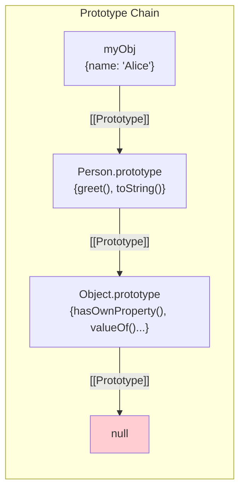
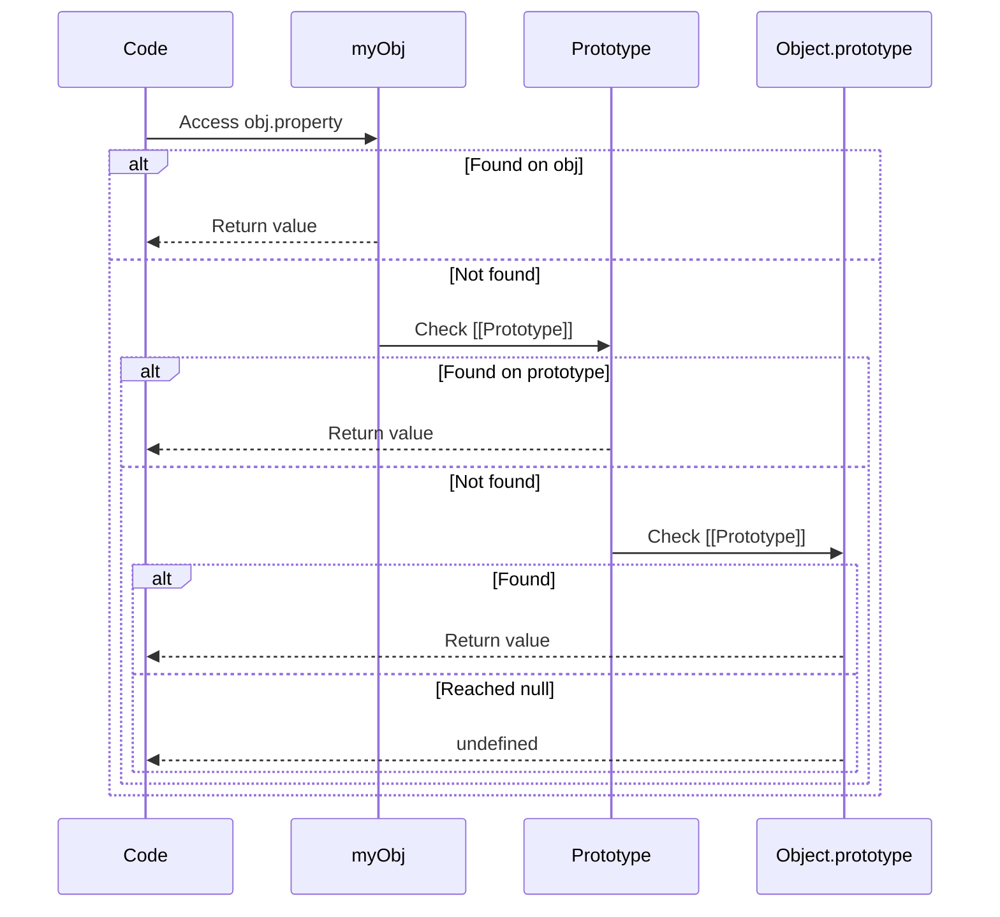

## The Prototype Chain

JavaScript uses **prototypal inheritance** — objects inherit directly from other objects. There are no classes at the engine level (ES6 `class` is syntactic sugar).

Every object has an internal `[[Prototype]]` slot pointing to another object (or `null`). When you access a property, the engine walks up this chain until it finds the property or reaches `null`.



```javascript
const animal = {
    type: "animal",
    speak() {
        return `${this.name} says ${this.sound}`;
    }
};

const dog = Object.create(animal); // dog's [[Prototype]] = animal
dog.name = "Rex";
dog.sound = "woof";

dog.speak();        // "Rex says woof" — found on animal via chain
dog.type;           // "animal" — inherited
dog.hasOwnProperty("name");  // true — own property
dog.hasOwnProperty("type");  // false — inherited
```

---

## Property Lookup Mechanics



### Property Shadowing

```javascript
const parent = { x: 1, y: 2 };
const child = Object.create(parent);

child.x = 10; // Creates OWN property on child (shadows parent.x)

child.x;      // 10 (own property)
child.y;      // 2 (inherited from parent)
parent.x;     // 1 (unchanged)

// Deleting own property reveals inherited one
delete child.x;
child.x;      // 1 (now reads from parent)
```

### Property Descriptors

```javascript
const obj = {};

Object.defineProperty(obj, "id", {
    value: 42,
    writable: false,     // Cannot reassign
    enumerable: true,    // Shows in for...in
    configurable: false  // Cannot delete or reconfigure
});

obj.id = 100;  // Silently fails (or TypeError in strict mode)
obj.id;        // 42

// Getters and setters
const user = {
    _name: "Alice",
    get name() { return this._name; },
    set name(val) {
        if (val.length < 2) throw new Error("Name too short");
        this._name = val;
    }
};

user.name;         // "Alice" (calls getter)
user.name = "Bo";  // Error: Name too short
```

---

## Constructor Functions and `new`

Before ES6 classes, constructor functions were the standard pattern:

```javascript
function Person(name, age) {
    // `new` creates a new object and binds `this` to it
    this.name = name;
    this.age = age;
}

// Methods go on the prototype (shared across all instances)
Person.prototype.greet = function() {
    return `Hi, I'm ${this.name}`;
};

const alice = new Person("Alice", 30);
const bob = new Person("Bob", 25);

alice.greet();  // "Hi, I'm Alice"
bob.greet();    // "Hi, I'm Bob"

// Both share the SAME greet function
alice.greet === bob.greet;  // true (memory efficient)
```

### What `new` Does (4 Steps)

```javascript
// new Person("Alice", 30) is equivalent to:
function simulateNew(Constructor, ...args) {
    // 1. Create new empty object
    const obj = {};
    
    // 2. Set its [[Prototype]] to Constructor.prototype
    Object.setPrototypeOf(obj, Constructor.prototype);
    
    // 3. Call constructor with `this` = new object
    const result = Constructor.apply(obj, args);
    
    // 4. Return the object (unless constructor returns an object)
    return result instanceof Object ? result : obj;
}
```

---

## ES6 Classes (Syntactic Sugar)

```javascript
class Animal {
    // Private field (truly private, not accessible outside)
    #sound;
    
    constructor(name, sound) {
        this.name = name;
        this.#sound = sound;
    }
    
    speak() {
        return `${this.name} says ${this.#sound}`;
    }
    
    // Static method — on the class itself, not instances
    static create(name, sound) {
        return new Animal(name, sound);
    }
    
    // Getter
    get info() {
        return `${this.name} (${this.constructor.name})`;
    }
}

class Dog extends Animal {
    #tricks = [];
    
    constructor(name) {
        super(name, "woof"); // MUST call super before using `this`
    }
    
    learn(trick) {
        this.#tricks.push(trick);
        return this;  // fluent interface
    }
    
    perform() {
        return this.#tricks.length > 0
            ? `${this.name} performs: ${this.#tricks.join(", ")}`
            : `${this.name} doesn't know any tricks`;
    }
}

const rex = new Dog("Rex");
rex.learn("sit").learn("roll over");
rex.speak();    // "Rex says woof"
rex.perform();  // "Rex performs: sit, roll over"
```

### Under the Hood

```javascript
// class Dog extends Animal is equivalent to:
Dog.prototype = Object.create(Animal.prototype);
Dog.prototype.constructor = Dog;

// Verification
rex instanceof Dog;     // true
rex instanceof Animal;  // true
Object.getPrototypeOf(rex) === Dog.prototype;  // true
```

---

## The `this` Keyword

`this` is JavaScript's most confusing feature. Its value depends on **how** a function is called, not where it's defined.

### Binding Rules (in priority order)

```mermaid
flowchart TD
    A["Function called"] --> B{new keyword?}
    B -->|Yes| C["this = new object"]
    B -->|No| D{Explicit bind?<br>call/apply/bind}
    D -->|Yes| E["this = specified object"]
    D -->|No| F{Method call?<br>obj.method()}
    F -->|Yes| G["this = obj"]
    F -->|No| H{Arrow function?}
    H -->|Yes| I["this = enclosing lexical this"]
    H -->|No| J["this = undefined (strict)<br>or globalThis (sloppy)"]
```

### Rule 1: Default Binding

```javascript
function showThis() {
    console.log(this);
}

showThis(); // undefined (strict mode) or window/globalThis (sloppy mode)
```

### Rule 2: Implicit Binding (Method Call)

```javascript
const user = {
    name: "Alice",
    greet() {
        return `Hi, I'm ${this.name}`;
    }
};

user.greet();  // "Hi, I'm Alice" — this = user

// PITFALL: losing implicit binding
const greet = user.greet;
greet();  // "Hi, I'm undefined" — this is no longer user!

// Common scenario: callbacks
setTimeout(user.greet, 100);  // "Hi, I'm undefined"
// The function reference is passed, not the object.method pair
```

### Rule 3: Explicit Binding

```javascript
function greet(greeting) {
    return `${greeting}, I'm ${this.name}`;
}

const alice = { name: "Alice" };
const bob = { name: "Bob" };

// call — invoke immediately with specified this
greet.call(alice, "Hello");    // "Hello, I'm Alice"
greet.call(bob, "Hey");        // "Hey, I'm Bob"

// apply — like call but args as array
greet.apply(alice, ["Hi"]);    // "Hi, I'm Alice"

// bind — returns NEW function with this permanently bound
const aliceGreet = greet.bind(alice);
aliceGreet("Howdy");           // "Howdy, I'm Alice"
aliceGreet.call(bob, "Hey");   // "Hey, I'm Alice" — bind wins over call!
```

### Rule 4: `new` Binding

```javascript
function User(name) {
    // this = newly created object
    this.name = name;
}

const user = new User("Alice");
// this was bound to the new object, which is now `user`
```

### Arrow Functions — Lexical `this`

Arrow functions do NOT have their own `this`. They inherit `this` from the enclosing scope at definition time.

```javascript
class Timer {
    constructor() {
        this.seconds = 0;
    }
    
    start() {
        // Arrow function captures `this` from start() method
        this.interval = setInterval(() => {
            this.seconds++;  // `this` = Timer instance (always)
        }, 1000);
    }
    
    stop() {
        clearInterval(this.interval);
    }
}

// Without arrow function, you'd need:
start() {
    const self = this;  // save reference
    this.interval = setInterval(function() {
        self.seconds++;  // use saved reference
    }, 1000);
}
```

### `this` in Event Handlers

```javascript
class Button {
    constructor(label) {
        this.label = label;
        this.clicks = 0;
    }
    
    // BUG: regular method loses `this` when used as callback
    handleClick() {
        this.clicks++;
        console.log(`${this.label}: ${this.clicks} clicks`);
    }
    
    // FIX 1: Arrow function as class field
    handleClick = () => {
        this.clicks++;
        console.log(`${this.label}: ${this.clicks} clicks`);
    };
    
    // FIX 2: Bind in constructor
    constructor(label) {
        this.label = label;
        this.clicks = 0;
        this.handleClick = this.handleClick.bind(this);
    }
    
    mount(element) {
        element.addEventListener("click", this.handleClick);
    }
}
```

---

## Mixins and Composition

JavaScript supports multiple inheritance through mixins (since there's no multiple `extends`):

```javascript
// Mixin pattern — compose behaviors
const Serializable = (Base) => class extends Base {
    serialize() {
        return JSON.stringify(this);
    }
    
    static deserialize(json) {
        return Object.assign(new this(), JSON.parse(json));
    }
};

const Validatable = (Base) => class extends Base {
    validate() {
        for (const [key, rule] of Object.entries(this.constructor.rules || {})) {
            if (!rule(this[key])) {
                throw new Error(`Validation failed for ${key}`);
            }
        }
        return true;
    }
};

// Compose mixins
class User extends Serializable(Validatable(Object)) {
    static rules = {
        name: (v) => v && v.length >= 2,
        email: (v) => v && v.includes("@"),
    };
    
    constructor(name, email) {
        super();
        this.name = name;
        this.email = email;
    }
}

const user = new User("Alice", "alice@example.com");
user.validate();    // true
user.serialize();   // '{"name":"Alice","email":"alice@example.com"}'
```

---

## Key Takeaways

1. **Prototype chain** — property lookup walks up `[[Prototype]]` links until found or `null`
2. **`this` is dynamic** — determined by call site, not definition site (except arrow functions)
3. **Arrow functions** — lexical `this`, no own `this`/`arguments`/`super`/`new.target`
4. **Classes are sugar** — they compile to constructor functions + prototype methods
5. **Private fields (`#`)** — truly private, enforced by the engine (not convention)
6. **Prefer composition over inheritance** — mixins and delegation over deep class hierarchies
7. **`bind` is permanent** — once bound, `call`/`apply` cannot override the `this` value
