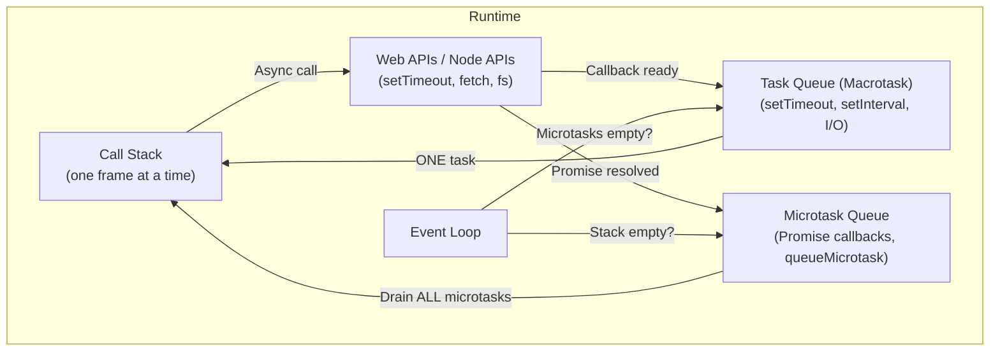
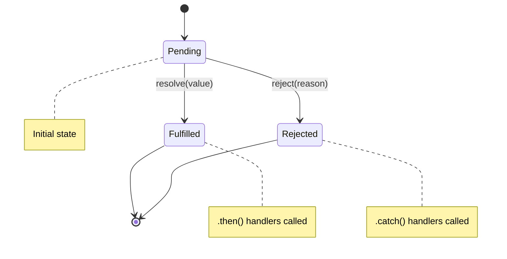

## Why Async Matters

JavaScript is **single-threaded** — it has one call stack and can execute one thing at a time. Without asynchronous mechanisms, any I/O operation (network request, file read, timer) would freeze the entire program. The event loop solves this by enabling non-blocking concurrency on a single thread.

---

## The Event Loop



### Execution Order Rules

1. **Synchronous code** runs first (fills the call stack)
2. When the stack is empty, the event loop checks the **microtask queue** and drains it completely
3. After all microtasks are processed, **one macrotask** is dequeued and executed
4. After that macrotask, microtasks are drained again before the next macrotask

```javascript
console.log("1 - sync");

setTimeout(() => console.log("2 - macrotask"), 0);

Promise.resolve().then(() => console.log("3 - microtask"));

queueMicrotask(() => console.log("4 - microtask"));

Promise.resolve().then(() => {
    console.log("5 - microtask");
    queueMicrotask(() => console.log("6 - nested microtask"));
});

console.log("7 - sync");

// Output: 1, 7, 3, 4, 5, 6, 2
// All sync first, then ALL microtasks (including nested), then macrotask
```

### Microtasks vs Macrotasks

| Microtasks | Macrotasks |
|-----------|-----------|
| `Promise.then/catch/finally` | `setTimeout` / `setInterval` |
| `queueMicrotask()` | `setImmediate` (Node.js) |
| `MutationObserver` | I/O callbacks |
| `process.nextTick` (Node.js, even higher priority) | `requestAnimationFrame` (browser) |

---

## Callbacks

The original async pattern — pass a function to be called when the operation completes.

```javascript
// Node.js error-first callback convention
import { readFile } from 'node:fs';

readFile('/etc/passwd', 'utf8', (err, data) => {
    if (err) {
        console.error("Failed:", err.message);
        return;
    }
    console.log(data);
});

// Callback hell (pyramid of doom)
getUser(userId, (err, user) => {
    if (err) return handleError(err);
    getOrders(user.id, (err, orders) => {
        if (err) return handleError(err);
        getOrderDetails(orders[0].id, (err, details) => {
            if (err) return handleError(err);
            // deeply nested, hard to follow, error handling repeated
        });
    });
});
```

**Problems:** Inversion of control (you trust the callee to call your callback correctly), no composition, no error propagation.

---

## Promises

A Promise represents a value that may not be available yet. It's a state machine with three states:



### Creating Promises

```javascript
// Constructor (wrap callback-based APIs)
function readFileAsync(path) {
    return new Promise((resolve, reject) => {
        readFile(path, 'utf8', (err, data) => {
            if (err) reject(err);
            else resolve(data);
        });
    });
}

// Static methods
Promise.resolve(42);           // Already fulfilled
Promise.reject(new Error("!")); // Already rejected
```

### Chaining

```javascript
fetchUser(userId)
    .then(user => fetchOrders(user.id))       // returns new Promise
    .then(orders => fetchDetails(orders[0]))   // chains
    .then(details => render(details))
    .catch(err => showError(err))              // catches ANY error in chain
    .finally(() => hideSpinner());             // always runs

// Each .then returns a NEW promise
// If .then returns a value → next .then gets that value
// If .then returns a Promise → next .then waits for it
// If .then throws → jumps to nearest .catch
```

### Error Handling

```javascript
// Errors propagate down the chain
fetch("/api/data")
    .then(res => {
        if (!res.ok) throw new Error(`HTTP ${res.status}`);
        return res.json();
    })
    .then(data => process(data))
    .catch(err => {
        // Catches: network errors, HTTP errors, JSON parse errors, process errors
        console.error("Pipeline failed:", err.message);
    });

// PITFALL: unhandled rejections
const p = Promise.reject(new Error("oops"));
// If no .catch() is attached, Node.js emits 'unhandledRejection'
// Always handle rejections!

// Recovery in catch
fetchPrimary()
    .catch(err => {
        console.warn("Primary failed, trying fallback");
        return fetchFallback(); // recovery — chain continues
    })
    .then(data => use(data));
```

---

## Async/Await

Syntactic sugar over Promises that makes async code read like synchronous code.

```javascript
// async function always returns a Promise
async function getUserWithOrders(userId) {
    try {
        const user = await fetchUser(userId);        // pauses here
        const orders = await fetchOrders(user.id);   // pauses here
        const details = await Promise.all(
            orders.map(o => fetchDetails(o.id))       // parallel
        );
        return { user, orders, details };
    } catch (err) {
        // Catches any rejected promise in the try block
        throw new AppError("Failed to load user data", { cause: err });
    }
}
```

### Top-Level Await (ES2022, ESM only)

```javascript
// In ES modules, await works at the top level
const config = await loadConfig();
const db = await connectDatabase(config.dbUrl);

export { db };
```

### Patterns

```javascript
// Sequential (when order matters or results depend on each other)
async function sequential() {
    const a = await fetchA();  // wait
    const b = await fetchB(a); // depends on a
    return [a, b];
}

// Parallel (independent operations)
async function parallel() {
    const [users, posts, comments] = await Promise.all([
        fetchUsers(),
        fetchPosts(),
        fetchComments(),
    ]);
    return { users, posts, comments };
}

// MISTAKE: accidental sequential
async function accidentalSequential() {
    const users = await fetchUsers();     // waits...
    const posts = await fetchPosts();     // waits... (but doesn't need users!)
    // These could run in parallel!
}
```

---

## Promise Combinators

| Method | Behavior | Use Case |
|--------|----------|----------|
| `Promise.all` | Resolves when ALL resolve; rejects on FIRST rejection | Parallel independent tasks |
| `Promise.allSettled` | Waits for ALL to settle (resolve or reject) | Batch operations where partial failure is OK |
| `Promise.race` | Resolves/rejects with FIRST settled promise | Timeouts, fastest response |
| `Promise.any` | Resolves with FIRST fulfilled; rejects if ALL reject | Fallback strategies |

```javascript
// Promise.all — fail-fast
try {
    const [user, prefs, notifications] = await Promise.all([
        fetchUser(id),
        fetchPreferences(id),
        fetchNotifications(id),
    ]);
} catch (err) {
    // If ANY fails, all results are lost
}

// Promise.allSettled — resilient
const results = await Promise.allSettled([
    fetchUser(id),
    fetchPreferences(id),
    fetchNotifications(id),
]);

const succeeded = results.filter(r => r.status === "fulfilled").map(r => r.value);
const failed = results.filter(r => r.status === "rejected").map(r => r.reason);

// Promise.race — timeout pattern
async function fetchWithTimeout(url, ms) {
    const timeout = new Promise((_, reject) =>
        setTimeout(() => reject(new Error("Timeout")), ms)
    );
    return Promise.race([fetch(url), timeout]);
}

// Promise.any — fallback
async function fetchFromMirrors(mirrors) {
    try {
        return await Promise.any(mirrors.map(url => fetch(url)));
    } catch (err) {
        // AggregateError — all mirrors failed
        throw new Error("All mirrors failed", { cause: err });
    }
}
```

---

## Advanced Patterns

### Retry with Exponential Backoff

```javascript
async function retry(fn, { maxAttempts = 3, baseDelay = 1000 } = {}) {
    for (let attempt = 1; attempt <= maxAttempts; attempt++) {
        try {
            return await fn();
        } catch (err) {
            if (attempt === maxAttempts) throw err;
            const delay = baseDelay * 2 ** (attempt - 1); // 1s, 2s, 4s...
            await new Promise(resolve => setTimeout(resolve, delay));
        }
    }
}

const data = await retry(() => fetch("/api/flaky-endpoint"), { maxAttempts: 5 });
```

### Concurrency Limiter

```javascript
async function mapWithConcurrency(items, fn, concurrency = 5) {
    const results = [];
    const executing = new Set();
    
    for (const [index, item] of items.entries()) {
        const promise = fn(item, index).then(result => {
            executing.delete(promise);
            return result;
        });
        
        executing.add(promise);
        results.push(promise);
        
        if (executing.size >= concurrency) {
            await Promise.race(executing);
        }
    }
    
    return Promise.all(results);
}

// Process 100 URLs, max 5 concurrent requests
const responses = await mapWithConcurrency(
    urls,
    url => fetch(url).then(r => r.json()),
    5
);
```

### AbortController (Cancellation)

```javascript
const controller = new AbortController();

// Cancel after 5 seconds
setTimeout(() => controller.abort(), 5000);

try {
    const response = await fetch("/api/slow", {
        signal: controller.signal
    });
    const data = await response.json();
} catch (err) {
    if (err.name === "AbortError") {
        console.log("Request was cancelled");
    } else {
        throw err;
    }
}

// Cancel on user action
button.addEventListener("click", () => controller.abort());
```

---

## Key Takeaways

1. **Event loop priority:** sync → microtasks (all) → one macrotask → repeat
2. **Always handle rejections** — unhandled promise rejections crash Node.js
3. **Use `Promise.all` for parallel work** — don't `await` sequentially when operations are independent
4. **`Promise.allSettled` for resilience** — when partial failure is acceptable
5. **`async/await` is Promises** — every `await` unwraps a Promise, every `async` function returns one
6. **AbortController for cancellation** — the standard way to cancel fetch, streams, and custom async operations
7. **Avoid mixing callbacks and Promises** — wrap callback APIs in Promises at the boundary
