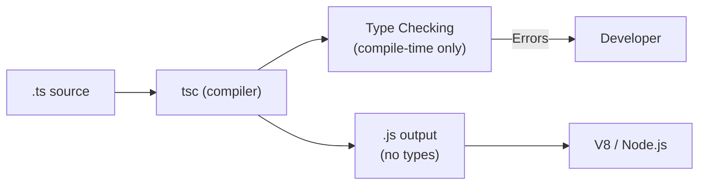

## What TypeScript Is

TypeScript is a **structural type system** layered on top of JavaScript. Types exist only at compile time — they are completely erased before execution. The output is plain JavaScript.



### Structural vs Nominal Typing

```typescript
// TypeScript is STRUCTURAL — shape matters, not name
interface Point { x: number; y: number }
interface Coordinate { x: number; y: number }

const p: Point = { x: 1, y: 2 };
const c: Coordinate = p; // OK! Same shape = compatible

// In Java/C# (nominal), this would fail — different types despite same shape
```

---

## Basic Types

```typescript
// Primitives
const name: string = "Alice";
const age: number = 30;
const active: boolean = true;
const big: bigint = 9007199254740993n;
const id: symbol = Symbol("id");

// Special types
const nothing: null = null;
const missing: undefined = undefined;
const anything: any = "escape hatch";     // disables type checking
const safe: unknown = getUserInput();      // type-safe alternative to any

// void — function returns nothing
function log(msg: string): void { console.log(msg); }

// never — function never returns (throws or infinite loop)
function fail(msg: string): never { throw new Error(msg); }
```

### Arrays and Tuples

```typescript
// Arrays (homogeneous)
const numbers: number[] = [1, 2, 3];
const names: Array<string> = ["a", "b"];  // generic syntax

// Tuples (fixed-length, heterogeneous)
const pair: [string, number] = ["age", 30];
const triple: [number, number, number] = [41.38, 2.17, 12];

// Named tuples (documentation only)
type Coordinate = [lat: number, lng: number, alt?: number];

// Rest elements in tuples
type StringAndNumbers = [string, ...number[]];
const data: StringAndNumbers = ["header", 1, 2, 3, 4];
```

---

## Interfaces and Type Aliases

### Interfaces

```typescript
interface User {
    readonly id: string;       // immutable after creation
    name: string;
    email: string;
    age?: number;              // optional
    role: "admin" | "user";   // literal type
}

// Extension
interface Admin extends User {
    permissions: string[];
    department: string;
}

// Declaration merging (interfaces can be extended across files)
interface Window {
    myApp: { version: string };  // adds to existing Window interface
}

// Index signatures
interface Dictionary {
    [key: string]: string;     // any string key → string value
}

// Call signatures
interface Formatter {
    (value: unknown): string;
    locale: string;
}
```

### Type Aliases

```typescript
// Unions (OR)
type Status = "loading" | "success" | "error";
type ID = string | number;

// Intersections (AND)
type Admin = User & { permissions: string[] };

// Mapped types, conditional types, template literals — only with type
type Readonly<T> = { readonly [K in keyof T]: T[K] };

// Function types
type Handler = (event: Event) => void;
type AsyncFn<T> = () => Promise<T>;
```

### When to Use Which

| Use `interface` when... | Use `type` when... |
|------------------------|-------------------|
| Defining object shapes | Unions or intersections |
| You want declaration merging | Mapped/conditional types |
| Extending other interfaces | Aliasing primitives or tuples |
| Public API contracts | Complex type computations |

---

## Generics

Generics parameterize types, enabling reusable code that works with any type while preserving type safety.

```typescript
// Generic function
function identity<T>(value: T): T {
    return value;
}

identity<string>("hello"); // explicit
identity(42);              // inferred as identity<number>

// Generic interface
interface Repository<T> {
    findById(id: string): Promise<T | null>;
    findAll(): Promise<T[]>;
    save(entity: T): Promise<T>;
    delete(id: string): Promise<void>;
}

class UserRepository implements Repository<User> {
    async findById(id: string): Promise<User | null> { /* ... */ }
    async findAll(): Promise<User[]> { /* ... */ }
    async save(entity: User): Promise<User> { /* ... */ }
    async delete(id: string): Promise<void> { /* ... */ }
}
```

### Constraints

```typescript
// Constrain T to types with a length property
function longest<T extends { length: number }>(a: T, b: T): T {
    return a.length >= b.length ? a : b;
}

longest("hello", "hi");     // OK — strings have length
longest([1, 2], [1, 2, 3]); // OK — arrays have length
// longest(10, 20);          // Error — numbers don't have length

// keyof constraint
function getProperty<T, K extends keyof T>(obj: T, key: K): T[K] {
    return obj[key];
}

const user = { name: "Alice", age: 30 };
getProperty(user, "name"); // string
getProperty(user, "age");  // number
// getProperty(user, "foo"); // Error — "foo" is not a key of user
```

### Multiple Type Parameters

```typescript
function zip<A, B>(as: A[], bs: B[]): [A, B][] {
    const length = Math.min(as.length, bs.length);
    return Array.from({ length }, (_, i) => [as[i], bs[i]]);
}

zip([1, 2, 3], ["a", "b", "c"]); // [[1,"a"], [2,"b"], [3,"c"]]
// Return type inferred as [number, string][]
```

---

## Utility Types

TypeScript provides built-in type transformations:

```typescript
interface User {
    id: string;
    name: string;
    email: string;
    age: number;
    role: "admin" | "user";
}

// Partial — all properties optional
type UserUpdate = Partial<User>;
// { id?: string; name?: string; email?: string; ... }

// Required — all properties required
type CompleteUser = Required<User>;

// Pick — subset of properties
type UserPreview = Pick<User, "id" | "name">;
// { id: string; name: string }

// Omit — exclude properties
type CreateUser = Omit<User, "id">;
// { name: string; email: string; age: number; role: ... }

// Record — key-value map
type UsersByRole = Record<"admin" | "user", User[]>;
// { admin: User[]; user: User[] }

// Exclude / Extract (for unions)
type NonAdmin = Exclude<User["role"], "admin">; // "user"
type AdminOnly = Extract<User["role"], "admin">; // "admin"

// ReturnType / Parameters
type FetchReturn = ReturnType<typeof fetch>; // Promise<Response>
type FetchParams = Parameters<typeof fetch>; // [input: RequestInfo, init?: RequestInit]

// Awaited (unwrap Promise)
type Data = Awaited<Promise<Promise<string>>>; // string
```

---

## Type Narrowing

TypeScript narrows types based on control flow analysis.

```typescript
function process(value: string | number | null | undefined) {
    // Truthiness check
    if (!value) return; // eliminates null, undefined, 0, ""
    
    // typeof guard
    if (typeof value === "string") {
        value.toUpperCase(); // TypeScript knows it's string here
    } else {
        value.toFixed(2);    // TypeScript knows it's number here
    }
}

// instanceof
function formatError(err: unknown) {
    if (err instanceof Error) {
        return err.message;  // narrowed to Error
    }
    return String(err);
}

// in operator
interface Fish { swim(): void }
interface Bird { fly(): void }

function move(animal: Fish | Bird) {
    if ("swim" in animal) {
        animal.swim(); // narrowed to Fish
    } else {
        animal.fly();  // narrowed to Bird
    }
}
```

### Discriminated Unions

The most powerful narrowing pattern — use a literal type as a discriminant:

```typescript
type Shape =
    | { kind: "circle"; radius: number }
    | { kind: "rectangle"; width: number; height: number }
    | { kind: "triangle"; base: number; height: number };

function area(shape: Shape): number {
    switch (shape.kind) {
        case "circle":
            return Math.PI * shape.radius ** 2;
        case "rectangle":
            return shape.width * shape.height;
        case "triangle":
            return 0.5 * shape.base * shape.height;
    }
}

// Exhaustiveness checking with never
function assertNever(x: never): never {
    throw new Error(`Unexpected: ${x}`);
}

function area(shape: Shape): number {
    switch (shape.kind) {
        case "circle": return Math.PI * shape.radius ** 2;
        case "rectangle": return shape.width * shape.height;
        case "triangle": return 0.5 * shape.base * shape.height;
        default: return assertNever(shape); // compile error if a case is missing
    }
}
```

### Custom Type Guards

```typescript
// Type predicate
function isString(value: unknown): value is string {
    return typeof value === "string";
}

// Assertion function
function assertDefined<T>(value: T | null | undefined, msg?: string): asserts value is T {
    if (value == null) throw new Error(msg ?? "Value is null/undefined");
}

const user = getUser(); // User | null
assertDefined(user, "User not found");
user.name; // TypeScript knows user is User after assertion
```

---

## Conditional Types

```typescript
// Basic conditional
type IsString<T> = T extends string ? true : false;
type A = IsString<"hello">; // true
type B = IsString<42>;      // false

// Infer keyword — extract types
type UnwrapPromise<T> = T extends Promise<infer U> ? U : T;
type X = UnwrapPromise<Promise<string>>; // string
type Y = UnwrapPromise<number>;          // number

// Extract array element type
type ElementOf<T> = T extends (infer E)[] ? E : never;
type Z = ElementOf<string[]>; // string

// Distributive conditional types (distributes over unions)
type ToArray<T> = T extends unknown ? T[] : never;
type Result = ToArray<string | number>; // string[] | number[]
```

---

## Template Literal Types

```typescript
type EventName = `on${Capitalize<"click" | "focus" | "blur">}`;
// "onClick" | "onFocus" | "onBlur"

type HTTPMethod = "GET" | "POST" | "PUT" | "DELETE";
type Endpoint = `/api/${"users" | "posts"}`;
type Route = `${HTTPMethod} ${Endpoint}`;
// "GET /api/users" | "GET /api/posts" | "POST /api/users" | ...

// Practical: type-safe event emitter
type EventMap = {
    click: { x: number; y: number };
    focus: { target: Element };
    resize: { width: number; height: number };
};

function on<K extends keyof EventMap>(event: K, handler: (data: EventMap[K]) => void): void {
    // ...
}

on("click", (data) => {
    data.x; // number — fully typed!
});
```

---

## Key Takeaways

1. **Structural typing** — if the shape matches, it's compatible (duck typing with compile-time checks)
2. **`unknown` over `any`** — `unknown` forces you to narrow before use; `any` disables all checking
3. **Discriminated unions** — the go-to pattern for state machines, API responses, and variant types
4. **Generics + constraints** — write reusable code without losing type information
5. **Utility types** — `Partial`, `Pick`, `Omit`, `Record` eliminate repetitive type definitions
6. **Type narrowing is automatic** — TypeScript tracks control flow; use `typeof`, `instanceof`, `in`, and discriminants
7. **Types are erased** — zero runtime cost; they exist only for developer tooling and compile-time safety
