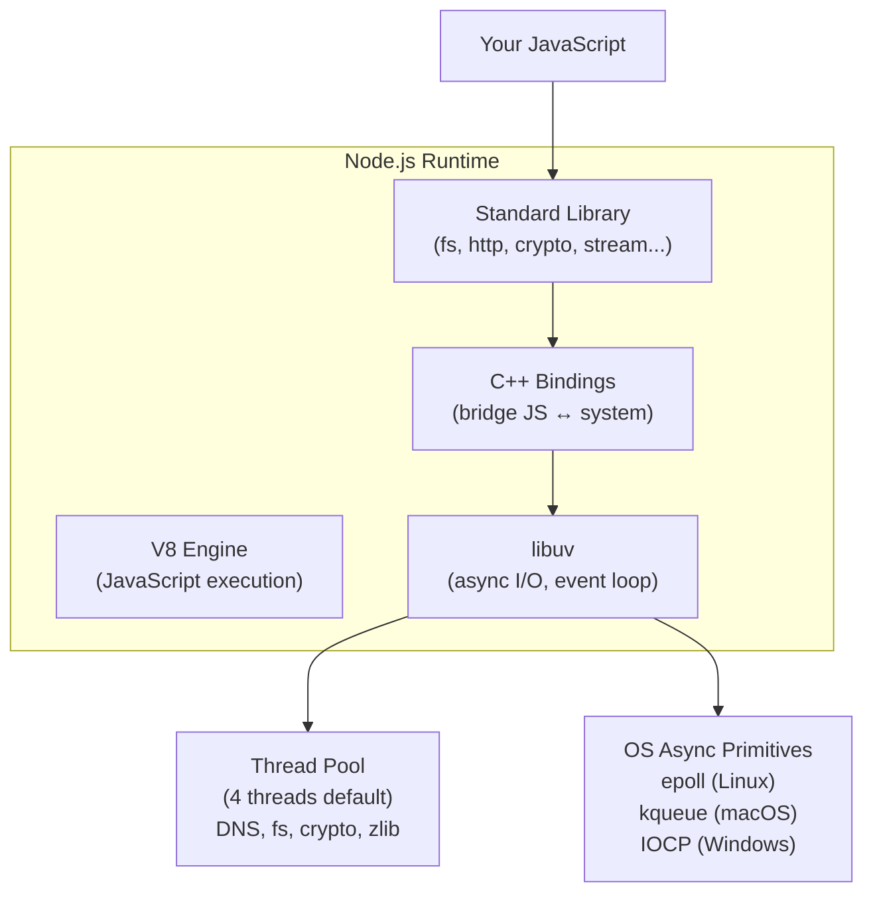

## What Node.js Is

Node.js is a JavaScript runtime built on Chrome's V8 engine. It takes JavaScript out of the browser and into servers, CLIs, and system tools. Its key innovation: **non-blocking I/O on a single thread** using an event-driven architecture.



---

## The Node.js Event Loop (Detailed)

Unlike the simplified browser event loop, Node.js has **phases**:

```text
   ┌───────────────────────────┐
┌─>│      timers               │  setTimeout, setInterval callbacks
│  └──────────┬────────────────┘
│  ┌──────────┴────────────────┐
│  │   pending callbacks       │  I/O callbacks deferred from previous cycle
│  └──────────┬────────────────┘
│  ┌──────────┴────────────────┐
│  │      idle, prepare        │  internal use only
│  └──────────┬────────────────┘
│  ┌──────────┴────────────────┐
│  │         poll              │  retrieve new I/O events; execute I/O callbacks
│  └──────────┬────────────────┘
│  ┌──────────┴────────────────┐
│  │         check             │  setImmediate callbacks
│  └──────────┬────────────────┘
│  ┌──────────┴────────────────┐
│  │    close callbacks        │  socket.on('close'), etc.
└──┴───────────────────────────┘
```

### `process.nextTick` vs `setImmediate`

```javascript
// process.nextTick — fires BEFORE the event loop continues (between phases)
// setImmediate — fires in the "check" phase (after poll)

setImmediate(() => console.log("1 - setImmediate"));
process.nextTick(() => console.log("2 - nextTick"));
Promise.resolve().then(() => console.log("3 - promise"));

// Output: 2, 3, 1
// nextTick > microtasks (promises) > setImmediate
```

**Rule:** Prefer `setImmediate` over `process.nextTick` — nextTick can starve the event loop if called recursively.

---

## Modules: CommonJS vs ES Modules

### CommonJS (CJS) — Node.js Original

```javascript
// math.js
function add(a, b) { return a + b; }
function multiply(a, b) { return a * b; }

module.exports = { add, multiply };
// or: exports.add = add;

// main.js
const { add, multiply } = require('./math');
const fs = require('fs');
```

### ES Modules (ESM) — The Standard

```javascript
// math.mjs (or .js with "type": "module" in package.json)
export function add(a, b) { return a + b; }
export function multiply(a, b) { return a * b; }
export default class Calculator { /* ... */ }

// main.mjs
import Calculator, { add, multiply } from './math.mjs';
import { readFile } from 'node:fs/promises';
```

### Key Differences

| Feature | CJS | ESM |
|---------|-----|-----|
| Loading | Synchronous | Asynchronous |
| Evaluation | Eager (entire file) | Lazy (on import) |
| `this` at top level | `module.exports` | `undefined` |
| Top-level `await` | No | Yes |
| Tree-shaking | No (dynamic) | Yes (static analysis) |
| `__dirname` / `__filename` | Available | Use `import.meta.url` |
| Dynamic import | `require()` | `import()` (returns Promise) |
| Circular deps | Partial exports | Live bindings |

```javascript
// ESM equivalent of __dirname
import { fileURLToPath } from 'node:url';
import { dirname } from 'node:path';

const __filename = fileURLToPath(import.meta.url);
const __dirname = dirname(__filename);
```

---

## Streams

Streams process data in chunks without loading everything into memory. Essential for large files, network data, and real-time processing.


### Stream Types

| Type | Description | Example |
|------|-------------|---------|
| Readable | Source of data | `fs.createReadStream`, `http.IncomingMessage` |
| Writable | Destination for data | `fs.createWriteStream`, `http.ServerResponse` |
| Transform | Reads and writes (modifies data) | `zlib.createGzip`, `crypto.createCipher` |
| Duplex | Independent read and write | `net.Socket`, `WebSocket` |

### Using Streams

```javascript
import { createReadStream, createWriteStream } from 'node:fs';
import { pipeline } from 'node:stream/promises';
import { createGzip } from 'node:zlib';
import { Transform } from 'node:stream';

// Simple pipe — compress a file
await pipeline(
    createReadStream('access.log'),
    createGzip(),
    createWriteStream('access.log.gz')
);

// Custom transform stream
const upperCase = new Transform({
    transform(chunk, encoding, callback) {
        callback(null, chunk.toString().toUpperCase());
    }
});

await pipeline(
    createReadStream('input.txt'),
    upperCase,
    createWriteStream('output.txt')
);

// Line-by-line processing (large files)
import { createInterface } from 'node:readline';

const rl = createInterface({
    input: createReadStream('huge-file.csv'),
    crlfDelay: Infinity
});

for await (const line of rl) {
    const [name, email] = line.split(',');
    // Process each line without loading entire file
}
```

### Backpressure

When a writable stream can't keep up with a readable stream, backpressure signals the reader to slow down:

```javascript
const readable = createReadStream('huge-file.bin');
const writable = createWriteStream('output.bin');

readable.on('data', (chunk) => {
    const canContinue = writable.write(chunk);
    if (!canContinue) {
        readable.pause();  // backpressure — stop reading
        writable.once('drain', () => readable.resume()); // resume when ready
    }
});

// pipeline() handles backpressure automatically — prefer it
```

---

## Worker Threads

For CPU-intensive work, Node.js provides worker threads (true parallelism):

```javascript
// main.js
import { Worker } from 'node:worker_threads';

function runWorker(data) {
    return new Promise((resolve, reject) => {
        const worker = new Worker('./worker.js', { workerData: data });
        worker.on('message', resolve);
        worker.on('error', reject);
    });
}

const result = await runWorker({ numbers: [1, 2, 3, 4, 5] });

// worker.js
import { parentPort, workerData } from 'node:worker_threads';

// CPU-intensive computation
const sum = workerData.numbers.reduce((a, b) => a + b, 0);
parentPort.postMessage({ sum });
```

### When to Use Workers

| Use Event Loop (default) | Use Worker Threads |
|--------------------------|-------------------|
| I/O operations (network, disk) | CPU-heavy computation |
| Database queries | Image/video processing |
| HTTP requests | Cryptographic operations |
| File streaming | Data parsing (large JSON) |
| WebSocket connections | Machine learning inference |

---

## Built-in Modules (Key Ones)

```javascript
import { readFile, writeFile, mkdir } from 'node:fs/promises';
import { join, resolve, basename, extname } from 'node:path';
import { createServer } from 'node:http';
import { EventEmitter } from 'node:events';
import { createHash, randomUUID } from 'node:crypto';
import { setTimeout as sleep } from 'node:timers/promises';

// fs/promises — async file operations
const data = await readFile('config.json', 'utf8');
await writeFile('output.txt', 'content');
await mkdir('logs', { recursive: true });

// crypto
const hash = createHash('sha256').update('password').digest('hex');
const uuid = randomUUID(); // "550e8400-e29b-41d4-a716-446655440000"

// timers/promises — await-friendly timers
await sleep(1000); // sleep for 1 second

// events
class MyService extends EventEmitter {
    process(data) {
        this.emit('start', { timestamp: Date.now() });
        // ... work ...
        this.emit('complete', { result: data });
    }
}
```

---

## HTTP Server (No Framework)

```javascript
import { createServer } from 'node:http';

const server = createServer(async (req, res) => {
    const { method, url } = req;
    
    if (method === 'GET' && url === '/health') {
        res.writeHead(200, { 'Content-Type': 'application/json' });
        res.end(JSON.stringify({ status: 'ok' }));
        return;
    }
    
    if (method === 'POST' && url === '/api/data') {
        // Read request body
        const chunks = [];
        for await (const chunk of req) {
            chunks.push(chunk);
        }
        const body = JSON.parse(Buffer.concat(chunks).toString());
        
        res.writeHead(201, { 'Content-Type': 'application/json' });
        res.end(JSON.stringify({ received: body }));
        return;
    }
    
    res.writeHead(404);
    res.end('Not Found');
});

server.listen(3000, () => console.log('Listening on :3000'));
```

---

## Key Takeaways

1. **Single-threaded for JS, multi-threaded for I/O** — libuv handles async I/O with a thread pool and OS primitives
2. **Event loop has phases** — timers → pending → poll → check → close; `nextTick` fires between phases
3. **Use ESM** — it's the standard; CJS is legacy. Use `"type": "module"` in package.json
4. **Streams for large data** — never load entire files into memory; use `pipeline()` for automatic backpressure
5. **Worker threads for CPU work** — don't block the event loop with computation
6. **Prefix built-ins with `node:`** — `import { readFile } from 'node:fs/promises'` (explicit, avoids npm package collisions)
7. **Node.js is not for CPU-bound work** — it excels at I/O-heavy, concurrent workloads (APIs, real-time, streaming)
