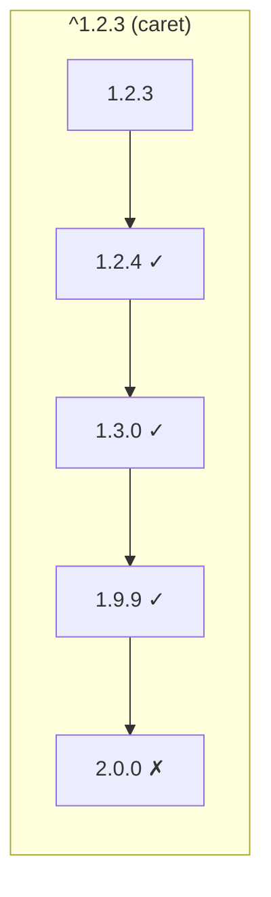

## The JavaScript Package Ecosystem

npm (Node Package Manager) is the world's largest software registry with over 2 million packages. Understanding how it works — dependency resolution, versioning, security — is essential for any JavaScript project.

---

## package.json

The manifest file that defines your project:

```json
{
    "name": "@myorg/api-server",
    "version": "2.1.0",
    "description": "REST API server",
    "type": "module",
    "main": "./dist/index.js",
    "types": "./dist/index.d.ts",
    "exports": {
        ".": {
            "import": "./dist/index.js",
            "require": "./dist/index.cjs",
            "types": "./dist/index.d.ts"
        },
        "./utils": {
            "import": "./dist/utils.js",
            "types": "./dist/utils.d.ts"
        }
    },
    "scripts": {
        "dev": "node --watch src/index.js",
        "build": "tsc",
        "test": "vitest",
        "test:coverage": "vitest --coverage",
        "lint": "eslint src/",
        "format": "prettier --write src/",
        "prepare": "husky"
    },
    "dependencies": {
        "express": "^4.18.2",
        "zod": "^3.22.0"
    },
    "devDependencies": {
        "typescript": "^5.3.0",
        "vitest": "^1.0.0",
        "@types/express": "^4.17.21"
    },
    "peerDependencies": {
        "react": "^18.0.0"
    },
    "engines": {
        "node": ">=20.0.0"
    },
    "files": ["dist/"],
    "license": "MIT"
}
```

### Dependency Types

| Field | Installed in | Purpose |
|-------|-------------|---------|
| `dependencies` | Production + dev | Runtime requirements |
| `devDependencies` | Dev only | Build tools, test frameworks, linters |
| `peerDependencies` | NOT auto-installed | "I work with this, but you provide it" |
| `optionalDependencies` | If available | Non-critical enhancements |

---

## Semantic Versioning (SemVer)

```text
MAJOR.MINOR.PATCH
  │      │     └── Bug fixes (backward-compatible)
  │      └──────── New features (backward-compatible)
  └─────────────── Breaking changes
```

### Version Ranges

| Syntax | Meaning | Example: `^1.2.3` |
|--------|---------|-------------------|
| `1.2.3` | Exact | Only 1.2.3 |
| `^1.2.3` | Compatible | ≥1.2.3, <2.0.0 |
| `~1.2.3` | Patch-level | ≥1.2.3, <1.3.0 |
| `>=1.0.0` | Minimum | 1.0.0 or higher |
| `1.x` | Any minor/patch | ≥1.0.0, <2.0.0 |
| `*` | Any | Latest |



**Best practice:** Use `^` (caret) for most dependencies. Use exact versions for critical production dependencies where even patch updates could cause issues.

---

## Lock Files

`package-lock.json` records the **exact** resolved version of every dependency (including transitive ones). This ensures reproducible installs across machines and CI.

```text
package.json        → "what I want" (ranges)
package-lock.json   → "what I got" (exact versions, integrity hashes)
```

### Commands

| Command | Effect |
|---------|--------|
| `npm install` | Install from lock file (or resolve + create lock) |
| `npm ci` | Clean install from lock file only (CI/CD — faster, stricter) |
| `npm update` | Update within range, update lock file |
| `npm outdated` | Show packages with newer versions available |

**Rule:** Always commit `package-lock.json`. Use `npm ci` in CI pipelines.

---

## Workspaces (Monorepos)

npm workspaces manage multiple packages in a single repository:

```json
// Root package.json
{
    "name": "my-monorepo",
    "private": true,
    "workspaces": [
        "packages/*",
        "apps/*"
    ]
}
```

```text
my-monorepo/
├── package.json
├── package-lock.json          ← single lock file for all
├── node_modules/              ← hoisted dependencies
├── packages/
│   ├── shared-utils/
│   │   └── package.json       ← "name": "@myorg/shared-utils"
│   └── ui-components/
│       └── package.json       ← "name": "@myorg/ui-components"
└── apps/
    ├── web/
    │   └── package.json       ← depends on @myorg/shared-utils
    └── api/
        └── package.json
```

```bash
# Run script in specific workspace
npm run build -w packages/shared-utils

# Run script in all workspaces
npm run test --workspaces

# Add dependency to specific workspace
npm install zod -w apps/api

# Cross-workspace dependency (symlinked)
# In apps/web/package.json:
# "dependencies": { "@myorg/shared-utils": "*" }
```

---

## Scripts and Lifecycle

```json
{
    "scripts": {
        "preinstall": "node check-node-version.js",
        "prepare": "husky",
        "prebuild": "rm -rf dist",
        "build": "tsc",
        "postbuild": "cp package.json dist/",
        "pretest": "npm run lint",
        "test": "vitest"
    }
}
```

### Lifecycle Order

```text
npm install → preinstall → install → postinstall → prepare
npm run build → prebuild → build → postbuild
npm publish → prepublishOnly → prepare → publish → postpublish
```

### Script Patterns

```json
{
    "scripts": {
        "dev": "node --watch --env-file=.env src/index.js",
        "build": "tsc && tsc-alias",
        "start": "node dist/index.js",
        "test": "vitest",
        "test:ci": "vitest --run --coverage --reporter=junit",
        "lint": "eslint . && prettier --check .",
        "lint:fix": "eslint --fix . && prettier --write .",
        "typecheck": "tsc --noEmit",
        "validate": "npm run typecheck && npm run lint && npm run test:ci"
    }
}
```

---

## Security

### Auditing

```bash
# Check for known vulnerabilities
npm audit

# Fix automatically (within semver range)
npm audit fix

# Force fix (may include breaking changes)
npm audit fix --force

# JSON output for CI
npm audit --json
```

### Supply Chain Risks

| Risk | Mitigation |
|------|-----------|
| Typosquatting (`expres` vs `express`) | Verify package name carefully |
| Malicious packages | Check download counts, maintainers, repo |
| Dependency confusion | Use scoped packages (`@myorg/pkg`) |
| Compromised maintainer | Pin exact versions, use lock files |
| Abandoned packages | Check last publish date, open issues |

### Best Practices

```json
// .npmrc — project-level config
// Enforce exact versions on install
save-exact=true

// Use specific registry
registry=https://registry.npmjs.org/

// Scoped packages from private registry
@myorg:registry=https://npm.myorg.com/
```

---

## Publishing Packages

```json
{
    "name": "@myorg/utils",
    "version": "1.0.0",
    "type": "module",
    "exports": {
        ".": {
            "types": "./dist/index.d.ts",
            "import": "./dist/index.js"
        }
    },
    "files": ["dist/"],
    "publishConfig": {
        "access": "public"
    }
}
```

```bash
# Build and publish
npm run build
npm publish

# Publish scoped package publicly
npm publish --access public

# Dry run (see what would be published)
npm publish --dry-run
npm pack  # creates .tgz to inspect
```

### `exports` Field (Package Entry Points)

```json
{
    "exports": {
        ".": "./dist/index.js",
        "./utils": "./dist/utils.js",
        "./types": "./dist/types.js",
        "./package.json": "./package.json"
    }
}
```

This restricts what consumers can import — `import x from '@myorg/utils/internal'` would fail if not listed in exports.

---

## Alternative Package Managers

| Manager | Key Feature | Lock File |
|---------|-------------|-----------|
| **npm** | Default, universal | `package-lock.json` |
| **pnpm** | Content-addressable store, strict | `pnpm-lock.yaml` |
| **yarn** | Plug'n'Play, zero-installs | `yarn.lock` |
| **bun** | Fast (Zig-based runtime) | `bun.lockb` |

pnpm's approach:

```text
node_modules/
├── .pnpm/                    ← content-addressable store
│   ├── express@4.18.2/
│   │   └── node_modules/
│   │       └── express/      ← actual files
│   └── ...
└── express → .pnpm/express@4.18.2/node_modules/express  ← symlink
```

Benefits: saves disk space (shared across projects), strict (can't access undeclared deps), faster installs.

---

## Key Takeaways

1. **Lock files are mandatory** — commit them, use `npm ci` in CI
2. **`^` (caret) is the default range** — allows minor and patch updates
3. **`devDependencies` vs `dependencies`** — matters for published packages (devDeps aren't installed by consumers)
4. **Workspaces for monorepos** — single lock file, hoisted deps, cross-package symlinks
5. **Audit regularly** — `npm audit` catches known vulnerabilities in your dependency tree
6. **Use `exports` field** — controls what consumers can import from your package
7. **`npm ci` over `npm install` in CI** — faster, deterministic, fails if lock file is out of sync
